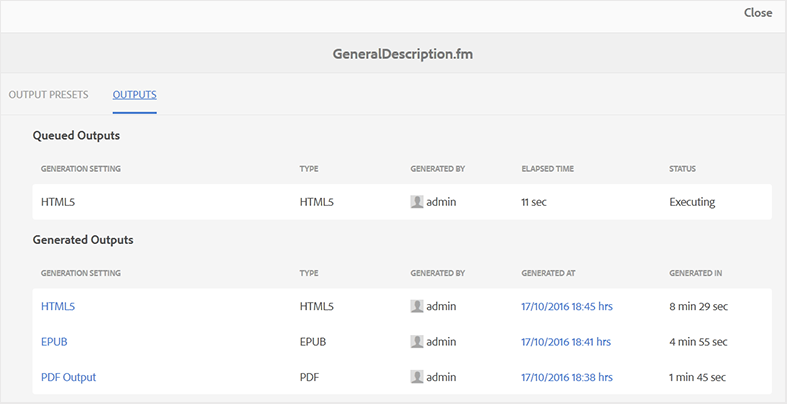

# Anzeigen des Status der Ausgabegenerierungsaufgabe {#viewing_output_history}

Nachdem Sie die Ausgabegenerierungsaufgabe für ein FrameMaker-Dokument initiiert haben, sendet Adobe Experience Manager Guides diese Aufgabe an die Ausgabegenerierungswarteschlange. Diese Warteschlange wird in Echtzeit aktualisiert und zeigt den Status jeder Ausgabegenerierungsaufgabe in der Warteschlange an.

Führen Sie die folgenden Schritte aus, um die Ausgabegenerierungswarteschlange anzuzeigen:

1. Navigieren Sie in der Assets-Benutzeroberfläche zu dem FrameMaker-Dokument, für das Sie den Status der Ausgabegenerierung überprüfen möchten, und wählen Sie es aus.

1. Wählen Sie Ausgaben.

   {align="left"}

1. Die Seite „Ausgaben“ ist in zwei Teile unterteilt:

   - **Ausgänge in der Warteschlange:**

     Listet die Ausgaben auf, die entweder auf die Generierung warten oder sich im Generierungsprozess befinden. Sie finden auch die Einstellung für die Ausgabegenerierung oder die Voreinstellung für die Aufgabe in der Warteschlange, den Typ, den Benutzer, der die Aufgabe initiiert hat, den Zeitpunkt, seit dem die Aufgabe in die Warteschlange gestellt wird, und den aktuellen Status.

   - **Erzeugte Ausgaben**

     Listet die abgeschlossenen Ausgabeaufgaben auf. Auch hier ähneln die Informationen in diesem Abschnitt den Ausgaben in der Warteschlange, mit dem einzigen Unterschied der Erzeugungszeit für die Ausgabe.

     In dieser Liste sind möglicherweise Aufgaben enthalten, die erfolgreich ausgeführt wurden, oder Aufgaben, bei denen ein Fehler aufgetreten ist. Für die erfolgreich abgeschlossenen Aufgaben erstellt der Veröffentlichungsprozess eine Protokolldatei \(logs.txt\), auf die Sie zugreifen können, indem Sie den Link in der Spalte Generiert unter auswählen.

**Übergeordnetes Thema:**&#x200B;[&#x200B; Ausgabe von FrameMaker-Dokumenten generieren](fm-output-generatation.md)
