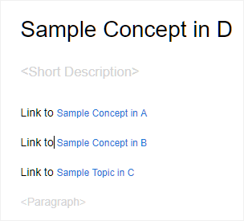

# AEM Sites-Vorgaben im Landkarten-Dashboard {#id205BE3008SW}

Sie können AEM Sites-Vorgaben aus dem Mapping-Dashboard erstellen und so konfigurieren, dass die AEM Sites-Ausgabe generiert wird.

Die folgenden Optionen sind für die AEM Sites-Ausgabe verfügbar:

| AEM Sites-Optionen | Beschreibung |
| --- | --- |
| Ausgabetyp | Der Typ der Ausgabe, die Sie generieren möchten. Wählen Sie die Option AEM Sites , um eine responsive AEM Sites-Ausgabe zu generieren. |
| Einstellungsname | Geben Sie einen beschreibenden Namen für die AEM Sites-Einstellungen ein, die Sie erstellen. Sie können beispielsweise die Ausgabe *Interne Kunden* oder die Ausgabe *der Endbenutzer* angeben. |
| Site-Name | Ein Site-Name, in dem die Ausgabe in Ihrem AEM-Repository gespeichert wird.  Ein Knoten im AEM Repository wird mit dem hier angegebenen Namen erstellt. Wenn Sie den Site-Namen nicht angeben, wird der Site-Knoten mit dem DITA-Map-Dateinamen erstellt.  Der hier angegebene Site-Name wird auch als Titel auf der Registerkarte &quot;Browser&quot;verwendet.  Sie können auch Variablen beim Festlegen des Site-Namens verwenden. Weitere Informationen zur Verwendung von Variablen finden Sie unter [Verwenden von Variablen zum Festlegen der Optionen &quot;Zielpfad&quot;, &quot;Site-Name&quot;oder &quot;Dateiname&quot;](generate-output-use-variables.md#id18BUG70K05Z). |
| Design | Wählen Sie die Designvorlage aus, die Sie zum Generieren der Ausgabe verwenden möchten.  Wenden Sie sich an Ihren Publishing-Administrator, um weitere Informationen zur Verwendung benutzerdefinierter Designvorlagen zum Generieren der Ausgabe zu erhalten. |
| Zielpfad | Der Pfad in Ihrem AEM-Repository, in dem die Ausgabe gespeichert wird. Beim Generieren der endgültigen Ausgabe werden der Site-Name und der Zielpfad kombiniert. Wenn Sie beispielsweise den Site-Namen als `user-guide` und den Ziel-Pfad als `/content/output/aem-guides` angeben, wird die endgültige Ausgabe unter dem Knoten `/content/output/aem-guides/user-guide` generiert.  Sie können auch Variablen beim Festlegen des Zielpfads verwenden. Weitere Informationen zur Verwendung von Variablen finden Sie unter [Verwenden von Variablen zum Festlegen der Optionen &quot;Zielpfad&quot;, &quot;Site-Name&quot;oder &quot;Dateiname&quot;](generate-output-use-variables.md#id18BUG70K05Z). |
| Bedingungen anwenden mithilfe von | Wählen Sie eine der folgenden Optionen aus:  **Keine angewendet**: Wählen Sie diese Option aus, wenn Sie keine Bedingung auf die veröffentlichte Ausgabe anwenden möchten. **DITAVal-Datei**: Wählen Sie DITAVal-Dateien aus, um konditionalisierten Inhalt zu generieren. Sie können mehrere DITAVal-Dateien über das Dialogfeld &quot;Durchsuchen&quot;oder durch Eingabe des Dateipfads auswählen. Verwenden Sie das Kreuzsymbol neben dem Dateinamen, um ihn zu entfernen. DITAVal-Dateien werden in der angegebenen Reihenfolge ausgewertet, sodass die in der ersten Datei angegebenen Bedingungen Vorrang vor den in späteren Dateien angegebenen Bedingungen haben. Sie können die Dateireihenfolge beibehalten, indem Sie Dateien hinzufügen oder löschen. Wenn die DITAVal-Datei an einen anderen Speicherort verschoben oder gelöscht wird, wird sie nicht automatisch aus dem Mapping-Dashboard gelöscht. Sie müssen den Speicherort aktualisieren, falls Dateien verschoben oder gelöscht werden. Sie können den Mauszeiger über den Dateinamen bewegen, um den Pfad im AEM Repository anzuzeigen, in dem die Datei gespeichert ist. Sie können nur DITAVal-Dateien auswählen. Ein Fehler wird angezeigt, wenn Sie einen anderen Dateityp auswählen. **Bedingungsvorgabe**: Wählen Sie aus der Dropdown-Liste eine Bedingungsvorgabe aus, um beim Veröffentlichen der Ausgabe eine Bedingung anzuwenden. Diese Option ist sichtbar, wenn Sie eine Bedingung für die DITA-Map-Datei hinzugefügt haben. Die bedingten Einstellungen sind auf der Registerkarte Bedingungsvorgaben der DITA-Zuordnungskonsole verfügbar. Weitere Informationen zur Bedingungsvorgabe finden Sie unter [Bedingungsvorgaben verwenden](generate-output-use-condition-presets.md#id1825FL004PN). |
| Vorhandene Ausgabeseiten | Wählen Sie die Option **Inhalt überschreiben** aus, um Inhalte auf den vorhandenen Seiten zu überschreiben. Diese Option überschreibt nur Inhalte, die unter den Inhalts- und Kopfknoten der Seite vorhanden sind. Diese Option ermöglicht die gemischte Veröffentlichung von Inhalten. Wenn Sie diese Option auswählen, können Sie das Löschen verwaister Seiten aus der veröffentlichten Ausgabe auswählen. Dies ist auch die Option *default* zum Erstellen der AEM Sites-Ausgabe.  Wählen Sie die Option **Löschen und Erstellen** aus, um das Löschen vorhandener Seiten während der Veröffentlichung zu erzwingen. Mit dieser Option wird der Seitenknoten zusammen mit seinem Inhalt und allen untergeordneten Seiten darunter gelöscht. Verwenden Sie diese Option, wenn Sie die Designvorlage Ihrer Ausgabevorgabe geändert haben oder möchten, dass alle zusätzlichen Seiten, die bereits im Ziel vorhanden sind, entfernt werden. |
| Löschen von verwaisten Site-Seiten | Wenn Sie die Einstellung **Inhalt überschreiben** in der Einstellung **Vorhandene Ausgabeseiten** auswählen, wird diese Option angezeigt. Wenn Sie diese Option auswählen, werden alle verwaisten Seiten von der veröffentlichten AEM Site gelöscht. Damit diese Funktion erfolgreich ausgeführt werden kann, müssen Sie die gesamte DITA-Zuordnung veröffentlichen und nicht die inkrementelle Veröffentlichung verwenden.  Angenommen, Sie haben eine DITA-Zuordnung veröffentlicht, die die Themen a.dita, b.dita und c.dita enthält. Bevor Sie die Zuordnung erneut veröffentlichen, haben Sie das Thema b.dita aus der Zuordnung entfernt. Wenn Sie jetzt diese Option ausgewählt haben, werden alle Inhalte, die sich auf b.dita beziehen, aus der AEM Sites-Ausgabe entfernt und nur a.dita und c.dita werden veröffentlicht.  Mit dieser Funktion werden keine veröffentlichten untergeordneten Maps entfernt. Wenn Ihre übergeordnete Zuordnung beispielsweise eine untergeordnete Zuordnung enthält und Sie die gesamte untergeordnete Zuordnung entfernen, wird der Inhalt der untergeordneten Zuordnung nicht aus der veröffentlichten Ausgabe gelöscht. Wenn Sie jedoch ein Thema aus einer untergeordneten Zuordnung entfernen und erneut veröffentlichen, wird der Inhalt des entfernten Themas aus der Site-Ausgabe gelöscht.  Wenn referenzierter Inhalt vorhanden ist und dieser Inhalt vor der erneuten Veröffentlichung entfernt wird, werden die Daten des referenzierten Inhalts nicht entfernt.  **Hinweis**: Informationen zu gelöschten verwaisten Seiten werden auch in den Ausgabegenerierungslogs erfasst. Weitere Informationen zum Zugriff auf die Protokolldateien finden Sie unter [Protokolldatei anzeigen und überprüfen](generate-output-basic-troubleshooting.md#id1821I0Y0G0A__id1822G0P0CHS). |
| Beibehalten temporärer Dateien | Wählen Sie diese Option, um die von DITA-OT generierten temporären Dateien beizubehalten. Wenn beim Generieren der Ausgabe über DITA-OT Fehler auftreten, wählen Sie diese Option, um die temporären Dateien beizubehalten. Sie können diese Dateien dann verwenden, um Fehler bei der Ausgabenerstellung zu beheben.    Nachdem Sie die Ausgabe generiert haben, wählen Sie das Symbol **Temporäre Dateien herunterladen**  aus, um den ZIP-Ordner mit den temporären Dateien herunterzuladen.    **Hinweis**: Wenn Dateieigenschaften während der Generierung hinzugefügt werden, enthalten die temporären Ausgabedateien auch eine *metadata.xml* -Datei, die diese Eigenschaften enthält. |
| Separate PDF für jedes Thema generieren | Wenn diese Option aktiviert ist, wird auch für jedes Thema in der DITA-Map eine PDF erstellt. Wenn Sie diese Option wählen, wird eine neue Option PDF-Pfad teilen angezeigt.  Geben Sie im Feld PDF-Pfad teilen den Pfad an, unter dem die für jedes Thema generierten PDF gespeichert werden sollen.  **Hinweis**: AEM Guides verwendet das DITA-OT-Plug-in namens pdfx, um PDF für jedes Thema zu generieren. Dieses Plug-in ist mit dem standardmäßig bereitgestellten DITA-OT-Paket integriert. Sie können dieses Plug-in anpassen, um PDF gemäß Ihren Anforderungen zu generieren. Wenn Sie ein benutzerdefiniertes DITA-OT-Plug-in verwenden, stellen Sie sicher, dass Sie das pdfx-Plug-in integrieren, um die PDF-Generierungsfunktion auf Themenebene zu nutzen. |
| Workflow &quot;Nach der Erstellung ausführen&quot; | Wenn Sie diese Option wählen, wird eine neue Dropdownliste mit dem Workflow nach der Generierung angezeigt, die alle in AEM konfigurierten Workflows enthält. Sie müssen einen Workflow auswählen, der nach Abschluss des Workflows zur Generierung der Ausgabe ausgeführt werden soll. |
| Grundlinie verwenden | Wenn Sie eine Grundlinie für die ausgewählte DITA-Zuordnung erstellt haben, wählen Sie diese Option, um die Version anzugeben, die Sie veröffentlichen möchten.  **Wichtig**: Wenn Sie eine inkrementelle Ausgabe für die AEM Site generieren, wird die Ausgabe mit der aktuellen Version der Dateien und nicht mit der angehängten Grundlinie erstellt.  Weitere Informationen finden Sie unter [Arbeiten mit Grundlinie](generate-output-use-baseline-for-publishing.md#id1825FI0J0PF) . |
| Eigenschaften | Wählen Sie die Eigenschaften aus, die Sie als Metadaten verarbeiten möchten. Diese Eigenschaften werden auf der Seite &quot;Eigenschaften&quot;der DITA-Map- oder Bookmap-Datei festgelegt. Die Eigenschaften, die Sie aus der Dropdown-Liste auswählen, werden unter dem Feld **Dateieigenschaften** angezeigt. Wählen Sie das Kreuzsymbol neben der Eigenschaft aus, um sie zu entfernen.   **Hinweis**: Bei den Metadateneigenschaften wird zwischen Groß- und Kleinschreibung unterschieden.  *Wenn Sie eine Grundlinie ausgewählt haben, basieren die Werte für die Eigenschaften auf der Version der ausgewählten Grundlinie. * Wenn Sie keine Grundlinie ausgewählt haben, basieren die Werte für die Eigenschaften auf der neuesten Version.  Sie können die Metadaten auch mithilfe der DITA-OT-Veröffentlichung an die Ausgabe übergeben. Weitere Informationen finden Sie unter [Übergeben der Metadaten an die Ausgabe mithilfe von DITA-OT](pass-metadata-dita-ot.md#id21BJ00QD0XA).  **Hinweis**: Wenn Sie die `cq:tags` in der Option &quot;Eigenschaften&quot;nicht definiert haben, werden die Werte für `cq:tags` aus der aktuellen Arbeitskopie ausgewählt, selbst wenn Sie eine Grundlinie für die Veröffentlichung ausgewählt haben. |
| Verwenden von Zuordnungseigenschaften als Standard | Wenn diese Option aktiviert ist, werden die für die Zuordnungsdatei definierten Eigenschaften auch in die Themen kopiert, in denen solche Eigenschaften nicht definiert sind. Beachten Sie bei Verwendung dieser Option die folgenden Punkte:   *Nur String-, Datum- oder Long-Eigenschaften (einzelne und mehrere Werte) können an die AEM Sites-Seiten übergeben werden. * Die Metadatenwerte für eine Eigenschaft vom Typ String unterstützen keine Sonderzeichen (z. B. `@, #, " "`). * Diese Option sollte zusammen mit der `Properties` -Option verwendet werden. |

## Zusätzlicher Hinweis zu AEM Sites

### Artikelbasierte Ausgabe aus dem Web-Editor generieren

Sie können die AEM Sites-Ausgabe für ein oder mehrere Themen oder die gesamte DITA-Zuordnung aus dem Web Editor generieren. Sie müssen Ausgabevorgaben für Ihre DITA-Zuordnung erstellen und können dann die AEM Sites-Ausgabe für Ihre Zuordnung einfach generieren. Wenn Sie einige Themen in Ihrer Zuordnung aktualisiert haben, können Sie auch die AEM Sites-Ausgabe nur für diese Themen aus dem Web Editor generieren. Weitere Informationen finden Sie unter [Artikelbasierte Veröffentlichung im Web-Editor](web-editor-article-publishing.md#id218CK0U019I).

### Generieren der Ausgabe von Verknüpfungsthemen aus anderen Maps

Es ist ein sehr häufiges Szenario, dass eine große Menge von Dokumentation über mehrere Ordner und DITA-Maps verteilt ist. Es wird äußerst komplex, Inhalte zu veröffentlichen, die von verschiedenen Orten aus verknüpft sind. Standardmäßig werden alle Links `<xref>` mit dem Wert `local` `@scope` erstellt. Das Veröffentlichen solcher Themen stellt keine Herausforderung dar, da es einen direkten Link zum Thema verwendet. Wenn das Thema außerhalb der aktuellen DITA-Zuordnung liegt, zeigt der Link den verknüpften Inhalt nicht an.

Eine andere Möglichkeit, Inhalte zu verknüpfen, besteht darin, einen Link mit dem `peer` `@scope` zu erstellen. Für solche Inhalte wird der Link zur Laufzeit aufgelöst, indem der Dateiname und der konfigurierte Kontext für das verknüpfte Thema aus dem Veröffentlichungskontext der DITA-Map ausgewählt werden. Der folgende Screenshot zeigt den Bereich Eigenschaften für einen Link mit dem Wert `peer` `@scope`:

{width="800" align="left"}

Um die Veröffentlichung komplexer Karten und Themen zu vereinfachen, die mit anderen Themen in anderen Maps verknüpft sind, können Sie mit AEM Guides den Veröffentlichungskontext für jede Ausgabevorgabe festlegen.

Im Veröffentlichungskontext können Sie festlegen, welches Thema für die Veröffentlichung einer bestimmten Ausgabe verwendet werden soll. Nehmen wir an, Sie haben vier Ordner: Beispiel a, Beispiel b, Beispiel c und Beispiel d. Jeder Ordner enthält eine DITA-Zuordnung - DITA-Zuordnung A, DITA-Zuordnung B, DITA-Zuordnung C und DITA-Zuordnung D. Die Querzuordnungsverknüpfung erfolgt, wenn ein Thema in DITA Map A auf ein Thema in DITA Map B, C oder D verlinkt. Im folgenden Screenshot enthält ein Beispielkonzept-Thema Verknüpfungen \(oder Verweise\) zu Dateien, die Teil anderer DITA-Maps sind.

{width="350" align="left"}

Wenn Sie jetzt die AEM Sites-Veröffentlichungseinstellungen für die Zuordnungsdatei konfigurieren, die dieses Thema enthält, können Sie auswählen, welcher Veröffentlichungskontext für den verknüpften Inhalt beim Veröffentlichen verwendet wird. Ein Veröffentlichungskontext ist eine Kombination aus DITA Map und der zugehörigen Ausgabevorgabe. Die Ausgabevorgabe wiederum enthält eine bestimmte Version des Inhalts und bedingte Vorgaben. Diese gesamte Kombination aus DITA-Zuordnung, Ausgabevorgabe, \(Dateien\) Version und Bedingungen definiert den Veröffentlichungskontext für eine verknüpfte Zuordnung.

Führen Sie die folgenden Schritte aus, um den Veröffentlichungskontext für verknüpfte Dateien anzugeben:

1. Öffnen Sie die Registerkarte **Ausgabevorgaben** der DITA-Map, die Sie veröffentlichen möchten.

1. Wählen Sie die Ausgabevorgabe **AEM Site** aus.

   Sie erhalten die Registerkarten Einstellungen für AEM Vorgaben und Publish-Kontext .

   {width="800" align="left"}

1. Öffnen Sie die Registerkarte **Publish-Kontext** .

   Ihnen wird eine Liste der abhängigen Themen angezeigt. Dies sind die Themen, die von einem Thema in der aktuellen Karte verknüpft sind, aber in einigen anderen DITA-Maps verfügbar sind.

   >[!NOTE]
   >
   > Auf der Registerkarte Publish-Kontext werden Themen angezeigt, die ausschließlich mit dem Wert `peer` `@scope` verknüpft sind. Für Links mit `local` `@scope` müssen Sie den Veröffentlichungskontext nicht angeben.

   Standardmäßig sind bei allen verknüpften Themen die aktuellen Ausgabevorgaben und Zuordnungen ausgewählt.

   {width="800" align="left"}

1. Um die Standardauswahl der DITA-Zuordnung und -Vorgabe zu ändern, klicken Sie auf **Bearbeiten** \(in der Hauptsymbolleiste\).

1. Wenn Sie die zuletzt veröffentlichte Ausgabe jeder abhängigen Datei in der Zuordnung verwenden möchten, wählen Sie **Letzten generierten Veröffentlichungskontext für alle abhängigen Themen verwenden**.

1. Wählen Sie in der Dropdownliste **Übergeordnete Zuordnung** die Zuordnungsdatei aus, mit deren Ausgabe Sie die Ausgabe der aktuellen Zuordnung verknüpfen möchten.

   Bei der Auswahl einer Zuordnungsdatei wird die UUID der Zuordnung in der Spalte &quot;Übergeordnete Map-UUID&quot;angezeigt. Die mit der ausgewählten Zuordnung verknüpften Ausgabevorgaben werden in der Liste &quot;Voreinstellungen&quot;der übergeordneten Zuordnung aufgeführt.

1. Wählen Sie in der Dropdownliste **Vorgabe der übergeordneten Zuordnung** die Ausgabevorgabe aus, mit der Sie die Ausgabe der aktuellen Zuordnung verknüpfen möchten.

1. Wählen Sie die erforderliche Zuordnung und deren Ausgabevorgabe für alle abhängigen Themen aus und klicken Sie auf **Fertig**.

   Der Kontext für die abhängigen Themen ist jetzt festgelegt. Sie können die Ausgabe für die aktuelle Zuordnung generieren. Weitere Informationen zum Generieren der Ausgabe finden Sie unter [Generate output for a DITA map from the map console](generate-output-for-a-dita-map.md#).

### Überblendung Veröffentlichung

AEM Guides unterstützt die Veröffentlichung von DITA-Inhalten auf Ihrer bestehenden AEM-Site. Wenn Sie beispielsweise über eine vorhandene Site verfügen, können Sie die AEM Sites-Ausgabe verwenden, um nur den DITA-Inhalt auf dieser Site zu veröffentlichen. In diesem Prozess wird der vorhandene Nicht-DITA-Inhalt durch den Veröffentlichungsprozess nicht geändert. Weitere Informationen zum Einrichten Ihrer Site für die Veröffentlichung von DITA-Inhalten finden Sie bei Ihrem Publishing-Administrator.

### Veröffentlichung `conref`

Wenn Sie `conref` in Ihrem Inhalt verwenden, wird dieser als normaler oder eingebetteter Inhalt zusammen mit dem Inhalt im Thema Quelle \(oder Referrer\) veröffentlicht. Der Inhalt von `conref` wird zusammen mit dem Hauptinhalt gerendert und es wird keine separate Site-Seite für denselben erstellt. Wenn Sie nach dem Inhalt suchen, auf den in `conref` verwiesen wird, wird in den Suchergebnissen nur das Hauptthema oder die Seite mit dem Inhalt `conref` angezeigt.

>[!NOTE]
>
>Wenn Sie mithilfe von AEM Guides Version 3.5 oder früher separate Seiten für den `conref` -Inhalt erstellt haben, wird empfohlen, diese Seiten mit der Option [Verwaiste Seiten der Site löschen](#delete-orphan-page-aem-site) zu bereinigen/zu löschen.

### Suchen einer Zeichenfolge im Inhalt

Sie können in der AEM Sites-Ausgabe nach einer Zeichenfolge suchen. Standardmäßig können Sie nur in den Titeln nach der Zeichenfolge suchen. Wenden Sie sich an Ihren Systemadministrator, um die Eigenschaft flattening.enabled zu aktivieren, um im Inhalt oder im Hauptteil der AEM Sites-Ausgabe nach der Zeichenfolge zu suchen.

{width="650" align="left"}

Weitere Informationen finden Sie im Abschnitt *Reduzieren AEM Site-Knotenstruktur konfigurieren* im Handbuch &quot;Installieren und Konfigurieren von Adobe Experience Manager Guides&quot;.

**Übergeordnetes Thema:**[ Grundlegendes zu den Ausgabevorgaben](generate-output-understand-presets.md)