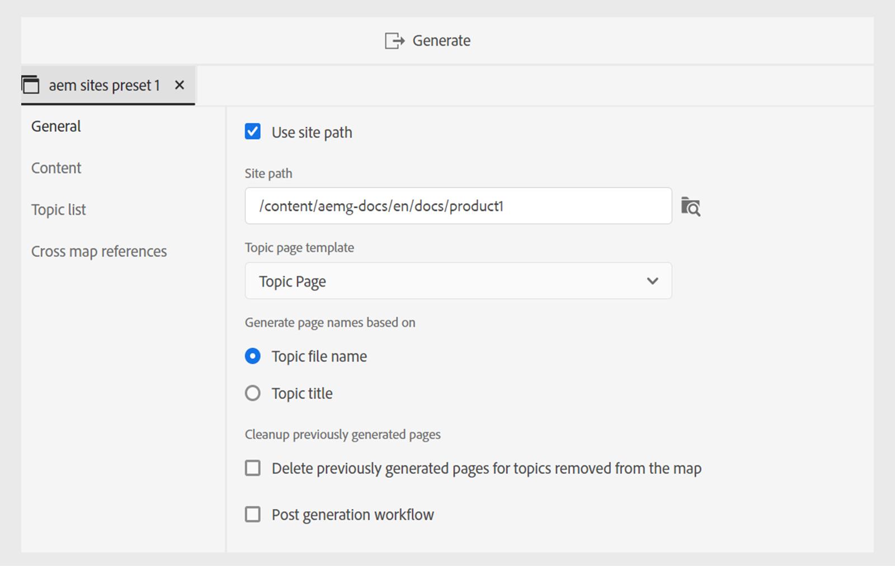

# AEM Sites-Vorgaben im Web-Editor

Sie können AEM Sites-Vorgaben über den Web-Editor erstellen und sie so konfigurieren, dass sie die AEM Sites-Ausgabe generieren. Die AEM Sites-Ausgabe basiert auf der Zuordnung zusammengesetzter Komponenten zusammen mit dem `guides-components`, was eine effiziente Inhaltserstellung und -verwaltung ermöglicht.

Experience Manager Guides bietet vordefinierte Vorlagen zum Erstellen von AEM Sites. Mit diesen Vorgaben können Sie Konsistenz im Inhaltslayout und in der Inhaltsstruktur sicherstellen.
- [Erstellen Sie Startseiten](../cs-install-guide/download-install-aem-sites-templates-cs.md#create-a-home-page-using-the-template) basierend auf diesen vordefinierten Vorlagen.
- Sie können [Themenvorlagen bearbeiten](../cs-install-guide/download-install-aem-sites-templates-cs.md#package-installation) und Stile Ihren Anforderungen entsprechend anwenden.
- Sie können auch [vorhandene AEM Sites-Vorlagen anpassen](../cs-install-guide/download-install-aem-sites-templates-cs.md#customize-existing-aem-sites-templates).

## Erstellen von AEM Sites-Vorgaben

Führen Sie die folgenden Schritte aus, um die AEM Sites-Vorgaben aus dem Web-Editor zu erstellen:

1. Öffnen Sie im Repository-Bereich die DITA-Zuordnungsdatei in der Zuordnungsansicht.
1. Wählen **auf der Registerkarte** Ausgabe“ das Symbol + aus, um eine Ausgabevorgabe zu erstellen.
1. Wählen Sie **AEM Sites** aus der Dropdown **Liste „Typ** im Dialogfeld **Neue**) aus.
1. Deaktivieren Sie die Option **Frühere Komponentenzuordnung verwenden** im Dialogfeld **Neue**&quot;.

>[!NOTE]
>
>Bevor Sie die AEM Sites-Vorgaben für Experience Manager Guides konfigurieren können, muss Ihr Administrator eine AEM Sites-Struktur mithilfe der Vorlagen erstellen.
- **On-Premise-Software**: Erfahren Sie mehr über das [Herunterladen und Installieren von AEM Sites-Vorlagen](../install-guide/download-install-aem-sites-templates.md) für On-Premise-Software.
- **Cloud Service**: Erfahren Sie mehr darüber, wie Sie [AEM Sites-Vorlagen herunterladen und installieren](../cs-install-guide/download-install-aem-sites-templates-cs.md) für den Cloud Service.

### Voreinstellungen zum aktuellen Ordnerprofil hinzufügen

Als Administrator können Sie mit Experience Manager Guides Ausgabevorgaben für die globalen Profile und Ordnerprofile erstellen und verwalten. Wählen Sie **Dialogfeld** Neue Ausgabevorgabe“ die Option **Zu aktuellem Ordnerprofil hinzufügen** aus, um eine Ausgabevorgabe für das aktuelle Ordnerprofil zu erstellen.  zeigt eine Vorgabe auf Ordnerprofilebene an.  Weitere Informationen zu [Verwalten von globalen und Ordnerprofilausgabevorgaben](./web-editor-manage-output-presets.md).

### AEM Sites-Vorgaben basierend auf der Zuordnung veralteter Komponenten

Sie können die AEM Sites-Voreinstellungen auch mit der Legacy-Komponentenzuordnung erstellen. Um die AEM Sites-Vorgaben auf der Grundlage der Zuordnung veralteter Komponenten zu erstellen, wählen Sie **Veraltete Komponentenzuordnung verwenden** im Dialogfeld **Neue**&quot; aus.

Einige Optionen können für die Voreinstellungen, die die Zuordnung veralteter Komponenten verwenden, unterschiedlich sein.

## Konfigurieren der AEM Sites-Voreinstellungen

Die Konfigurationen sind auf den Registerkarten **Allgemein**, **Inhalt**, **Themenliste** und **Cross Map Referenzen** organisiert.

**Allgemein**

Die Registerkarte **Allgemein** enthält die folgenden Konfigurationen im Zusammenhang mit der Generierung von Ausgaben:

- Site-Pfad verwenden
- Site-Pfad
- Site
- Publish-Pfad
- Themenseitenvorlage
- Seitennamen generieren basierend auf
   - Name der Themendatei
   - Thementitel
- Bereinigen von zuvor generierten Seiten
   - Löschen von zuvor generierten Seiten für Themen, die aus der Zuordnung entfernt wurden
   - Löschen Sie alle Seiten, die von anderen Quellen unter diesem Pfad erstellt wurden:
- Nachgenerierungs-Workflow

**Inhalt**

Die **Inhalt**-Registerkarte enthält die folgenden Konfigurationen:

- Baseline verwenden
- Bedingungsfilterung
- Zusätzliche DITA-OT-Befehlszeilenargumente
- Metadaten
   - Dateieigenschaften (Assets)
   - Verwenden von Zuordnungseigenschaften als Fallback

Weitere Informationen finden Sie unter [AEM Sites-Konfiguration](#aem_sites_config).

**Themenliste**

Die **Themenliste** zeigt die Liste der Themen an, die in der aktuellen Arbeitskopie der DITA-Karte vorhanden sind. Standardmäßig sind alle Themen enthalten. Sie können bestimmte Themen auswählen und die AEM Sites-Ausgabe nur für sie generieren. Sie haben beispielsweise einige Themen aktualisiert, sodass Sie nur diese Themen veröffentlichen können, anstatt die gesamte DITA-Karte zu veröffentlichen.

**Themenliste** ist in den AEM-Voreinstellungen vorhanden, die nicht auf der Grundlage der Legacy-Zuordnung erstellt wurden.

**Querverweise auf Zuordnungen**
Diese Liste enthält Themen mit Querverweisen auf `scope =”peer”`. Sie können den Veröffentlichungskontext für eine Liste von Querverweiskarten mit `scope=”peer”` zu Themen angeben, die in anderen DITA-Zuordnungen verfügbar sind. Diese Registerkarte wird angezeigt, wenn Sie die Experience Manager Guides-Version (UUID) verwenden.

Erfahren Sie mehr über das [Veröffentlichen verknüpfter Themen](#publish-linked-topics).

## AEM Sites-Konfiguration {#aem_sites_config}

Für die AEM Sites-Ausgabe stehen die folgenden Optionen zur Verfügung:

| AEM Sites-Optionen | Beschreibung |
| --- | --- |
| Site-Pfad verwenden | Verwenden Sie diese Option, um Ihre Inhalte auf einer Experience Manager-Site zu veröffentlichen. Wählen Sie diese Option aus, wenn Sie den genauen Site-Pfad kennen, unter dem die Ausgabe veröffentlicht werden soll. Geben Sie außerdem den vollständigen Pfad im Feld Site-Pfad an. |
| Site-Pfad | Diese Option wird angezeigt, wenn Sie die Option **Site-Pfad verwenden** auswählen. Durchsuchen Sie den genauen Experience Manager-Site-Pfad, an dem die Ausgabe veröffentlicht werden soll. |
| Site | Name der Experience Manager Sites, in der Sie Ihre Inhalte veröffentlichen möchten. Die Optionen in der Dropdown-Liste werden basierend auf der Liste der in AEM Sites verfügbaren Sites ausgefüllt.  Wählen Sie **Aktualisieren** , um eine neue Liste von Optionen abzurufen und die aktualisierten Daten widerzuspiegeln. |
| Publish-Pfad | Der Pfad innerhalb Ihres AEM-Repositorys, in dem die Ausgabe gespeichert wird. Der Publish-Pfad wird mit allen Pfaden gefüllt, die Seiten enthalten, die basierend auf der Startseitenvorlage erstellt wurden. Unter diesem Pfad wird die AEM Sites-Ausgabe der DITA-Zuordnung generiert.  Wenn Sie beispielsweise die Site als `AEMG-Docs` und den Publish-Pfad als `aemg-docs-en/docs/product-abc.` angeben, wird die AEM Sites-Ausgabe unter dem `aemg-docs-en/docs/product-abc/` in `crx/de` generiert. |
| Themenseitenvorlage | Strukturkomponenten, mit denen Sie Inhalte konsistent über mehrere Dokumente hinweg organisieren können. Diese Vorlagen sind in der Adobe Experience Manager-Site-Vorlage vordefiniert. Die Optionen werden mit allen Themenseitenvorlagen ausgefüllt, die für die ausgewählte Site verfügbar sind. Wählen Sie die Vorlage aus, die Sie auf alle Ausgabethemen anwenden möchten. |
| Seitennamen generieren basierend auf | **Themendateiname**: Verwendet den Dateinamen des DITA-Themas, um die Website-URL zu erstellen.   **Thementitel**: Verwendet den Titel des DITA-Themas zum Erstellen der Experience Manager-Site-Namen. |
| Bereinigen von zuvor generierten Seiten | - **Löschen Sie zuvor generierte Seiten für ein Thema, das aus der Zuordnung entfernt wurde**: Wenn sich die Struktur der DTIA-Zuordnung ändert, können Sie diese Option verwenden, um die zuvor generierten Seiten für die entfernten Themen zu entfernen. Diese Funktion ist nur für die vollständige Veröffentlichung von Karten verfügbar.  Angenommen, Sie haben eine DITA-Karte veröffentlicht, die die Themen a.dita, b.dita und c.dita enthält. Bevor Sie die Karte erneut veröffentlichen, haben Sie das Thema b.dita aus der Karte entfernt. Wenn Sie diese Option jetzt ausgewählt haben, wird der gesamte Inhalt, der mit b.dita zusammenhängt, aus der AEM Sites-Ausgabe entfernt und nur a.dita und c.dita werden veröffentlicht.  **Hinweis**: Informationen zu gelöschten Seiten werden ebenfalls in den Ausgabegenerierungsprotokollen erfasst. Weitere Informationen zum Zugriff auf die Protokolldateien finden Sie [Anzeigen und Überprüfen der Protokolldatei](generate-output-basic-troubleshooting.md#id1821I0Y0G0A__id1822G0P0CHS).   **Achtung**: Beim Löschen der Themen sind die Seiten dann nicht mehr auf der veröffentlichten Site verfügbar. Bevor die Themen gelöscht werden, wird eine Warnung angezeigt. Sie müssen das Löschen bestätigen.  - **Löschen Sie alle Seiten, die von anderen Quellen unter diesem Pfad erstellt wurden**: Wenn Sie diese Option auswählen, werden alle Seiten, die unter diesem Pfad aus anderen Karten, einzelnen Themen oder einer anderen Quelle veröffentlicht wurden, gelöscht. Die Seiten werden auch auf der veröffentlichten Site nicht mehr verfügbar sein. Bevor die Themen gelöscht werden, wird eine Warnung angezeigt. Sie müssen das Löschen bestätigen. |
| Nachgenerierungs-Workflow | Wenn Sie diese Option wählen, wird eine neue Dropdown-Liste für den Post-Generation-Workflow angezeigt, die alle in AEM konfigurierten Workflows enthält. Sie müssen einen Workflow auswählen, den Sie nach Abschluss des Workflows zur Ausgabegenerierung ausführen möchten. |
| Baseline verwenden | Wenn Sie eine Baseline für die ausgewählte DITA-Map erstellt haben, wählen Sie diese Option, um die Version anzugeben, die Sie veröffentlichen möchten.  **Wichtig**: Wenn Sie eine inkrementelle Ausgabe für die AEM-Site generieren, wird die Ausgabe anhand der aktuellen Dateiversion und nicht anhand der angehängten Baseline erstellt.  Weitere Informationen finden Sie [ „Arbeiten mit ](generate-output-use-baseline-for-publishing.md#id1825FI0J0PF)&quot;. |
| Bedingte Filterung | Eine der folgenden Optionen auswählen:  **None**: Wählen Sie diese Option aus, wenn Sie keine Bedingung auf die veröffentlichte Ausgabe anwenden möchten. **Verwenden von DITAVAL**: Wählen Sie DITAVal-Datei(en) aus, um bedingte Inhalte zu generieren. Sie können mehrere DITAVal-Dateien über das Dialogfeld „Durchsuchen“ oder durch Eingabe des Dateipfads auswählen. Verwenden Sie das Kreuz-Symbol neben dem Dateinamen, um ihn zu entfernen. DITAVal-Dateien werden in der angegebenen Reihenfolge ausgewertet, sodass die in der ersten Datei angegebenen Bedingungen Vorrang vor den in späteren Dateien angegebenen übereinstimmenden Bedingungen haben. Sie können die Dateireihenfolge durch Hinzufügen oder Löschen von Dateien beibehalten. Wenn die DITAVal-Datei an einen anderen Speicherort verschoben oder gelöscht wird, wird sie nicht automatisch aus dem Zuordnungs-Dashboard gelöscht. Sie müssen den Speicherort aktualisieren, falls Dateien verschoben oder gelöscht werden. Sie können den Mauszeiger über den Dateinamen bewegen, um den Pfad im AEM-Repository anzuzeigen, in dem die Datei gespeichert ist. Sie können nur DITAVal-Dateien auswählen. Wenn Sie einen anderen Dateityp auswählen, wird ein Fehler angezeigt. **Bedingungsvorgabe**: Wählen Sie in der Dropdown-Liste eine Bedingungsvorgabe aus, um eine Bedingung beim Veröffentlichen der Ausgabe anzuwenden. Diese Option ist sichtbar, wenn Sie eine Bedingung für die DITA-Zuordnungsdatei hinzugefügt haben. Die bedingten Einstellungen sind auf der Registerkarte „Bedingungsvorgaben“ der DITA-Zuordnungskonsole verfügbar. Weitere Informationen zu Bedingungsvorgaben finden Sie unter [Verwenden von Bedingungsvorgaben](generate-output-use-condition-presets.md#id1825FL004PN). |
| Zusätzliche DITA-OT-Befehlszeilenargumente | Geben Sie die zusätzlichen Argumente an, die DITA-OT beim Generieren der Ausgabe verarbeiten soll. Weitere Informationen zu den in DITA-OT unterstützten Befehlszeilenargumenten finden Sie unter [DITA-OT-Dokumentation](https://www.dita-ot.org/). |
| Metadaten    Dateieigenschaften (Assets) | Wählen Sie die Eigenschaften aus, die Sie als Metadaten verarbeiten möchten. Diese Eigenschaften werden auf der Seite Eigenschaften der DITA-Map- oder Bookmap-Datei festgelegt. Die aus der Dropdown-Liste ausgewählten Eigenschaften werden unter dem Feld **Dateieigenschaften** angezeigt. Klicken Sie auf das Kreuzsymbol neben der Eigenschaft, um sie zu entfernen.   **Hinweis**: Bei den Metadateneigenschaften wird zwischen Groß- und Kleinschreibung unterschieden.  *Wenn Sie eine Baseline ausgewählt haben, basieren die Werte für die Eigenschaften auf der Version der ausgewählten Baseline. * Wenn Sie keine Baseline ausgewählt haben, basieren die Werte für die Eigenschaften auf der neuesten Version.  Sie können die Metadaten auch mithilfe von DITA-OT-Publishing an die Ausgabe übergeben. Für eine weitere Detailansicht ([ Sie die Metadaten mithilfe von DITA-OT an die Ausgabe ](pass-metadata-dita-ot.md#id21BJ00QD0XA).  **Hinweis**: Wenn Sie die `cq:tags` nicht in der Option Eigenschaften definiert haben, werden die Werte für `cq:tags` aus der aktuellen Arbeitskopie ausgewählt, selbst wenn Sie eine Baseline für die Veröffentlichung ausgewählt haben. |
| Metadaten    Verwenden von Zuordnungseigenschaften als Fallback | Wenn diese Option aktiviert ist, werden die für die Zuordnungsdatei definierten Eigenschaften auch in die Themen kopiert, in denen diese Eigenschaften nicht definiert sind. Beachten Sie bei Verwendung dieser Option die folgenden Punkte   *Nur Zeichenfolgen-, Datums- oder Lange-Eigenschaften (einzelne und mehrwertige Eigenschaften) können an die Seiten der AEM-Site übergeben werden. * Die Metadatenwerte für eine Eigenschaft vom Typ Zeichenfolge unterstützen keine Sonderzeichen (z. B. `@, #, " "`). * Diese Option sollte zusammen mit der Option `Properties` verwendet werden. |
| Temporäre Dateien aufbewahren | Wählen Sie diese Option, um die von DITA-OT generierten temporären Dateien beizubehalten. Wenn beim Generieren der Ausgabe über DITA-OT Fehler auftreten, wählen Sie diese Option aus, um die temporären Dateien beizubehalten. Anschließend können Sie diese Dateien verwenden, um Fehler bei der Ausgabegenerierung zu beheben.    Klicken Sie nach dem Generieren der Ausgabe auf das Symbol **Temporäre Dateien herunterladen** , um den ZIP-Ordner mit den temporären Dateien herunterzuladen.    **Hinweis**: Wenn Dateieigenschaften während der Generierung hinzugefügt werden, enthalten die temporären Ausgabedateien auch eine *metadata.xml*-Datei, die diese Eigenschaften enthält. |

### Generieren der AEM Sites-Ausgabe mithilfe der Vorlagen

Mit Experience Manager Guides können Sie die vordefinierten Vorlagen verwenden oder Ihre eigenen AEM Sites-Vorlagen hinzufügen.

Stellen Sie vor dem Konfigurieren der AEM Sites-Vorgaben sicher, dass Sie eine AEM Sites-Struktur mit den Vorlagen erstellen.\
Weitere Informationen finden Sie unter [Herunterladen und Installieren von AEM Sites-](../install-guide/download-install-aem-sites-templates.md).

Führen Sie die folgenden Schritte aus, um eine AEM Sites-Vorgabe zu erstellen und zu konfigurieren:
1. Öffnen Sie die **Ausgabevorgaben** der DITA-Zuordnung, die Sie veröffentlichen möchten.
1. Wählen Sie die Ausgabevorgabe {0 **AEM Sites} aus.**
1. (Optional) Deaktivieren Sie **Option „Frühere Komponentenzuordnung verwenden** um eine ältere AEM Sites-Vorgabe zu erstellen .
1. Klicken Sie auf **Hinzufügen**. Die Voreinstellung für AEM Sites wird erstellt.
1. Sie haben zwei Möglichkeiten, um die vordefinierte Sites-Vorlage zu konfigurieren:
   1. Wählen Sie **Site** und dann den Veröffentlichungspfad und die Themenseitenvorlagen aus den ausgefüllten Optionen aus:
      1. Wählen Sie die Site aus.
      1. Wählen Sie **Site** aus. Zum Beispiel: `AEMG Docs`.
      1. Die Optionen **Publish** Pfad und **Themenseitenvorlage** werden automatisch in der Dropdown-Liste festgelegt. Sie können auch die Optionen auswählen. Beispielsweise werden `AEMG-Docs-Site/en/docs/product1` bzw. `Topic page` festgelegt.
   1. Wählen Sie den vollständigen Site-Pfad aus:
      1. Wählen Sie **Option „Site-Pfad**.
      1. Wählen Sie den vollständigen Site-Pfad aus. Zum Beispiel: `/content/AEMG-Docs-Site/en/docs/product1`.
      1. Die „Themenseitenvorlage“ wird automatisch als `Topic Page` festgelegt.

1. Speichert die vorgenommenen Änderungen an der Voreinstellung.
1. Wählen Sie die Option **Generieren** aus.
1. Generieren Sie AEM Sites für die entsprechende Zuordnung. Zum Beispiel: `/content/AEMG-Docs-Site/en/docs/product`.

   >[!NOTE]
   >
   > Wenn Sie Inhalte zum ersten Mal auf einer AEM-Site veröffentlichen, wird empfohlen, die Seiten auf Site-Ebene zu veröffentlichen. Dadurch wird sichergestellt, dass die Ausgabe auf der **Publish**-Instanz ohne CSS-Unterbrechung korrekt angezeigt wird.

### Verknüpfte Themen zu Publish

Experience Manager Guides vereinfacht das Veröffentlichen komplexer Dokumente, indem es das Erstellen von Themenreferenzen mithilfe der `peer @scope` ermöglicht. Anschließend können Sie den Veröffentlichungskontext dieser Verweise über die AEM Sites-Vorgaben definieren und schließlich die Ausgabe der verknüpften Themen generieren.
Weitere Informationen finden Sie unter [Generieren einer Ausgabe von verknüpfenden Themen aus anderen Karten](../user-guide/generate-output-aem-site.md#generate-output-linking-topics-from-other-maps).

Führen Sie die folgenden Schritte aus, um den Veröffentlichungskontext für vernetzte Dateien anzugeben:
1. Öffnen Sie die **Ausgabevorgaben** der DITA-Zuordnung, die Sie veröffentlichen möchten.
1. Wählen Sie die Ausgabevorgabe {0 **AEM Sites} aus.**

   Sie können die Registerkarten **Allgemein**, **Inhalt**, **Themenliste** und **Querverweise auf Zuordnungen** anzeigen. **Cross-Map** Verweise) wird angezeigt, wenn Sie die Experience Manager Guides-Version (UUID) verwenden.

   In den folgenden Fällen können Sie die Kreuzkartenverknüpfung nicht anzeigen:
   - Für die Voreinstellungen, die vor Version 4.6 erstellt wurden. Die Registerkarte Querverweise ist deaktiviert und es wird eine QuickInfo unter Zuordnungs-Dashboard angezeigt.
   - Für Vorgaben, die über das Zuordnungs-Dashboard erstellt wurden. Siehe den Tooltip des Zuordnungs-Dashboards .
   - Informationen zu vordefinierten Vorgaben finden Sie unter Dashboard zuordnen QuickInfo wird angezeigt.
   - Erstellen Sie für globale Vorgaben eine lokale Kopie dieser globalen Vorgabe, um Querverweise auf Zuordnungen festzulegen.
Wenn Sie AEM Sites-Vorgaben aus dem Web-Editor verwenden möchten, erstellen Sie entweder eine neue Vorgabe oder duplizieren Sie die vorhandene.

1. Öffnen Sie **Registerkarte** Querverweise“.

   Ihnen wird eine Liste der Themen und ihrer Referenzen angezeigt. Mit können Sie den Veröffentlichungskontext für eine Liste von Querverweisen auf Themen angeben, die in anderen DITA-Zuordnungen mit `scope=”peer”` verfügbar sind.

   Um das Querverweisbedienfeld aus dem Web-Editor verwenden zu können, müssen `<xrefs>` über eindeutige IDs verfügen. Beim Bearbeiten/Speichern des älteren Inhalts werden automatisch eindeutige IDs für `<xrefs>` generiert, wenn die ID nicht vorhanden ist.

   >[!NOTE]
   >
   >Die Registerkarte **Querverweise** zeigt Themen an, die nur über die `scope=”peer”` verknüpft sind. Für Links mit `scope=”local”` müssen Sie den Veröffentlichungskontext nicht angeben.

   Für alle verknüpften Themen ist die neueste Ausgabevorgabe und Zuordnung standardmäßig ausgewählt. Der Veröffentlichungskontext für alle verknüpften Themen ist standardmäßig auf `<Most recently generated>` Zuordnung festgelegt.

   

1. Wenn Sie die zuletzt veröffentlichte Ausgabe jeder abhängigen Datei in der Zuordnung verwenden möchten, wählen Sie **Zuletzt generierte verwenden** Veröffentlichungskontext für alle abhängigen Themen verwenden.
Sie sollten die als übergeordnete Zuordnung ausgewählte Zuordnung veröffentlichen, bevor Sie die Zuordnung mit verknüpften Themen veröffentlichen. Wenn die Zuordnung mit verknüpften Themen nicht veröffentlicht wird, werden die Links in der AEM Sites-Ausgabe als normaler Text anstelle von Hyperlinks angezeigt.
Sie sollten denselben Typ von AEM Sites-Vorgabe für das verknüpfte Thema auswählen. Wenn die aktuelle AEM Sites-Vorgabe beispielsweise die Zuordnung veralteter Komponenten verwendet, wählen Sie eine ähnliche AEM Sites-Vorgabe des verknüpften Themas aus.
1. Wählen Sie in der Dropdown-Liste Übergeordnete Zuordnung die Zuordnungsdatei aus, mit deren Ausgabe Sie die Ausgabe der aktuellen Zuordnung verknüpfen möchten.
Wenn Sie eine Zuordnungsdatei auswählen, wird die UUID der Zuordnung in der Spalte Übergeordnete UUID der Zuordnung angezeigt. Die mit der ausgewählten Zuordnung verknüpften Ausgabevorgaben werden in der Liste der Voreinstellungen der übergeordneten Zuordnung aufgeführt. Beispielsweise enthält Thema 1 in Karte A einen Verweis auf Thema 2. Thema 2 kann in einzelnen oder mehreren Karten vorhanden sein. Sie können für jeden Link die übergeordnete Zuordnung und eine bestimmte Vorgabe oder die zuletzt veröffentlichte Ausgabe auswählen.

1. Wenn dasselbe Thema mehrmals in einer Datei referenziert wird, können Sie für jede Instanz einen anderen Veröffentlichungskontext hinzufügen. Dies bietet mehr Flexibilität und Kontrolle über ihre Inhalte. Beispielsweise ist Thema 3 sowohl in Karte B als auch in Karte C vorhanden. Thema 1 enthält zwei Verweise auf Thema 3. Sie können Zuordnung B als übergeordnete Zuordnung für den ersten Link und Zuordnung C als übergeordnete Zuordnung für den zweiten Link auswählen.

1. Wählen Sie in der Dropdown-Liste Vorgabe der übergeordneten Zuordnung die Ausgabevorgabe aus, mit der Sie die Ausgabe der aktuellen Zuordnung verknüpfen möchten.
   >[!NOTE]
   >
   > Die verschiedenen AEM Sites-Vorgaben der aktuellen Zuordnung werden in der Dropdown-Liste angezeigt. Wenn Sie keine Vorgabe auswählen, wird ein Warnsymbol angezeigt, und die Ausgabegenerierung schlägt fehl.
1. Wählen Sie die erforderliche Zuordnung und die Ausgabevorgabe für alle Quellthemen aus und klicken Sie auf **Generieren**.

**Übergeordnetes Thema:** [Verstehen der Ausgabevorgaben](generate-output-understand-presets.md)
