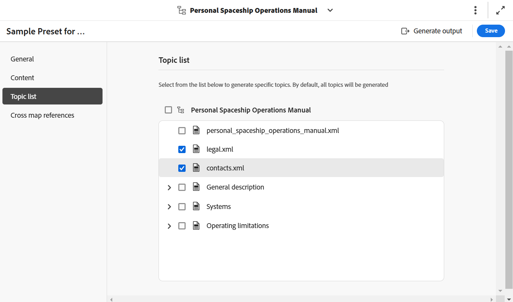
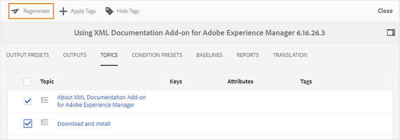

# Inkrementelle Ausgabegenerierung

>[!NOTE]
>
> Die inkrementelle Ausgabegenerierung ist nur für die AEM Sites-Ausgabe geeignet. Außerdem können Sie nur DITA \(.dita/.xml\)-Themen aus einer DITA-Zuordnung oder aus Unterzuordnungen neu generieren. Wenn Sie eine DITA-Zuordnung, eine Unterzuordnung, eine Themengruppe oder ein Thema mit `@processing-role="resource-only"` auswählen, ist die Option zum erneuten Generieren nicht verfügbar.

Es kann eine Reihe von Fällen geben, in denen Sie nur einige Themen in Ihrer DITA-Karte aktualisieren und nur diese aktualisierten Themen live übertragen. Um solche Szenarien zu handhaben, können Sie mit Experience Manager Guides inkrementelle Ausgaben erstellen. Wenn Sie einige Themen aktualisiert haben, müssen Sie nicht die gesamte DITA-Karte neu generieren. Sie können nur die aktualisierten Themen auswählen und neu generieren.

Wenn Ihre Zuordnung aufgeteilt ist und Sie ein einzelnes Thema in dieser Zuordnung aktualisiert haben, müssen Sie die gesamte Zuordnung neu generieren, damit das aktualisierte Thema oder der aktualisierte Inhalt in der Ausgabe widergespiegelt wird. Die Option zur Ausgaberegenerierung wird nicht auf Themenebene angezeigt, sondern nur auf der \(aufgeteilt\) Zuordnungsebene. Dies gilt für die übergeordnete Zuordnung und alle Unterzuordnungen.

Führen Sie die folgenden Schritte aus, um die Ausgabe für ein bestimmtes Thema oder eine Gruppe von Themen neu zu generieren:

## Inkrementelle Ausgabe über die Zuordnungskonsole generieren (für AEM-Sites mithilfe der Zuordnung zusammengesetzter Komponenten)

Führen Sie die folgenden Schritte aus, um mithilfe der Zuordnungskonsole eine inkrementelle Ausgabe für AEM Sites zu generieren:

1. [Öffnen Sie die DITA-Zuordnungsdatei in der Zuordnungskonsole](./open-files-map-console.md).
1. Wählen Sie die AEM Sites-Vorgabe aus, für die Sie eine inkrementelle Ausgabe generieren möchten.
1. Wählen **auf** Registerkarte Themen die Themen aus, die Sie veröffentlichen möchten.

   - Ohne Grundlinie

      {align="left"}

   - Mit Grundlinie

      {align="left"}

   >[!NOTE]
   >
   > Wenn auf der Registerkarte **Inhalt“ eine Baseline ausgewählt**, zeigt die Themenliste Themen und deren Versionen aus der angehängten Baseline an.  
   > Die inkrementelle Veröffentlichung über die Themenliste sollte nur verwendet werden, wenn sich die Struktur der Zuordnung nicht ändert. Wenn sich die Zuordnungsstruktur/das Inhaltsverzeichnis ändert, sollte die gesamte Zuordnung einmal veröffentlicht werden, um das Inhaltsverzeichnis zu aktualisieren.

1. Wählen Sie **Speichern** aus, um die Änderungen zu speichern.
1. Wählen Sie **Ausgabe generieren**, um die Ausgabe zu generieren.

## Inkrementelle Ausgabe im Zuordnungs-Dashboard generieren (für AEM-Sites mit Legacy-Komponentenzuordnung)

Führen Sie die folgenden Schritte aus, um mithilfe des Zuordnungs-Dashboards eine inkrementelle Ausgabe für AEM Sites zu generieren:

1. Navigieren Sie in der Assets-Benutzeroberfläche zu und wählen Sie die DITA-Zuordnungsdatei aus.

   Die DITA-Zuordnungskonsole wird mit der Liste der verfügbaren Ausgabevorgaben angezeigt, um eine Ausgabe zu generieren.

1. Wählen Sie die **Themen** aus.

   Eine Liste der in der DITA-Karte verfügbaren Themen wird angezeigt.

1. Wählen Sie die Themen aus, die Sie neu generieren möchten.

   >[!NOTE]
   >
   > Wenn Sie neue Themen zur DITA-Karte hinzugefügt haben, können Sie diese neuen Themen von hier aus nicht erstellen. Sie müssen die neu hinzugefügten Themen zuerst veröffentlichen, indem Sie die Veröffentlichungsfunktion DITA-Zuordnung verwenden.

   {align="left"}

1. Wählen Sie **Regenerieren** aus.

   Die **„Ausgewählte Themen neu**&quot; wird angezeigt.

1. Wählen Sie die Ausgabevorgabe aus, die Sie zum Neugenerieren der ausgewählten Themen verwenden möchten.

   Bei der AEM Sites-Ausgabevorgabe mit der Zuordnung veralteter Komponenten werden, wenn eine Baseline ausgewählt ist, die in der ausgewählten Baseline enthaltenen Themenversionen für die Ausgabegenerierung verwendet. Darüber hinaus sollte eine inkrementelle Veröffentlichung über die Themenliste nur verwendet werden, wenn keine Änderungen an der Zuordnungsstruktur vorhanden sind. Wenn sich die Zuordnungsstruktur/das Inhaltsverzeichnis ändert, sollte die gesamte Zuordnung einmal veröffentlicht werden, um das Inhaltsverzeichnis zu aktualisieren. Weitere Informationen zur Verwendung der AEM-Site-Vorgabe finden Sie unter [AEM Sites-Vorgaben im Zuordnungs-Dashboard](./generate-output-aem-site-map-dashboard.md).

1. Wählen Sie **Regenerieren**, um den Ausgabegenerierungsprozess zu starten.

>[!IMPORTANT]
>
> Wenn Sie einen Thementitel umbenennen und das Thema neu generieren, wird der aktualisierte Thementitel nicht im Inhaltsverzeichnis der DITA-Karte angezeigt. Um den Thementitel im Inhaltsverzeichnis zu aktualisieren, müssen Sie die gesamte DITA-Zuordnung generieren.

Sie können den aktuellen Status der Ausgabegenerierungsanfrage auf der Registerkarte **Ausgaben** einsehen. Weitere Informationen finden Sie unter [Anzeigen des Status der Aufgabe zur Ausgabenerstellung](#view-the-status-of-the-output-generation-task).

**Übergeordnetes Thema:** [Verstehen der Ausgabevorgaben](generate-output-understand-presets.md)
