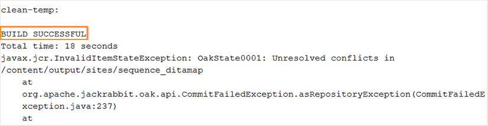

# Allgemeine Fehlerbehebung {#id1821I0Y0G0A}

Beim Arbeiten mit Adobe Experience Manager Guides können Fehler auftreten, während Sie Ihr Dokument veröffentlichen oder öffnen. Solche Fehler können in der DITA-Zuordnung, im Thema oder im Experience Manager Guides-Prozess selbst auftreten. Dieser Abschnitt enthält Informationen zum Zugriff auf und zum Analysieren von Informationen in der Protokolldatei für die Ausgabegenerierung. Wenn Ihr DITA-Thema zu groß ist, wird möglicherweise der JSP-Kompilierungsfehler angezeigt. Dieser Abschnitt enthält auch Informationen zum Beheben des JSP-Kompilierungsfehlers.

## Protokolldatei anzeigen und überprüfen {#id1822G0P0CHS}

Führen Sie die folgenden Schritte aus, um die Protokolldatei für die Ausgabegenerierung anzuzeigen und zu überprüfen:

1. Nachdem Sie den Prozess zur Ausgabe-Generierung initiiert haben, wählen Sie **Ausgaben** in der DITA-Zuordnungskonsole aus.

   Die Spalte **Erzeugungseinstellung** der Spalte **Erzeugte Ausgaben** zeigt die Farbe an, die einen visuellen Hinweis auf den Erfolg oder Misserfolg der Ausgabegenerierung für verschiedene Ausgabevorgaben gibt.

   {width="300"}

   Im obigen Screenshot:

   - Rot bedeutet fehlgeschlagene Ausgabegenerierung.
   - Grün zeigt eine erfolgreiche Ausgabegenerierung an.
   - Gelb zeigt eine erfolgreiche Ausgabegenerierung mit Fehlern an.

   >[!NOTE]
   >
   > Die Farben auf der Registerkarte **Ausgabe**, die den Status verschiedener Ausgabeergebnisse angeben, unterscheiden sich von den Farben, die zur Kategorisierung der verschiedenen Fehlertypen in den Protokolldateien verwendet werden.

1. Wählen Sie nach Abschluss des Vorgangs den Link in **Spalte** Erstellt am“ aus.

   Die Protokolldatei wird auf einer neuen Registerkarte geöffnet.

   

1. Verwenden Sie die folgenden Filter, um den Text in der Protokolldatei hervorzuheben:
   - **Fatal**: Markiert die schwerwiegenden Fehler in der Protokolldatei in dunkelroter Farbe.
   - **Error**: Markiert die Fehler in der Protokolldatei rot. Ausnahmen werden als Fehler gewertet und entsprechend rot hervorgehoben.
   - **Warnung**: Hebt die Warnungen in der Protokolldatei mit gelber Farbe hervor.
   - **Info**: Hebt die Informationsmeldungen in der Protokolldatei grün hervor.

1. Verwenden Sie die Navigationsschaltflächen nach oben und unten, um zum hervorgehobenen Text in der Protokolldatei zu springen. Alternativ können Sie durch die Protokolldatei scrollen und die Meldungen überprüfen.

1. Sie können die folgenden Aktionen für die Protokolldatei ausführen:

   - **Protokoll herunterladen**: Wenn die Liste der Protokolle umfangreich ist, wählen Sie **Protokoll herunterladen** aus, um die Protokolldatei für einfacheren Zugriff und Überprüfung auf Ihr Gerät herunterzuladen.
   - **Protokoll kopieren**: Kopiert die Liste der Protokolle in die Zwischenablage, sodass Sie sie schnell in einen Texteditor einfügen können.

## Kopieren und überprüfen Sie die Protokolldatei in einem Texteditor

Führen Sie die folgenden Schritte aus, um die Protokolldatei für die Ausgabegenerierung in einen Texteditor zu kopieren und zu überprüfen:

1. Nachdem Sie den Prozess zur Ausgabe-Generierung initiiert haben, wählen Sie **Ausgaben** in der DITA-Zuordnungskonsole aus.

1. Wählen Sie nach Abschluss des Vorgangs den Link in **Spalte** Erstellt am“ aus.

   Die Protokolldatei wird auf einer neuen Registerkarte geöffnet.

1. Klicken Sie **Schaltfläche „Protokoll**&quot;. Die Protokolldatei wird in die Zwischenablage kopiert.
1. Öffnen Sie einen Texteditor und fügen Sie die Protokolldatei in den Editor ein.

1. Scrollen Sie durch die Protokolldatei und suchen Sie nach Meldungen.

   Anhand der folgenden Informationen können Sie feststellen, ob im DITA-Datei- oder Experience Manager Guides-Prozess ein Fehler vorliegt:

   - *DITA-Zuordnungsdatei-bezogener Fehler*: Falls in der DITA-Zuordnungsdatei oder einer anderen in der DITA-Zuordnung enthaltenen Datei ein Fehler gefunden wird, enthält die Protokolldatei die Zeichenfolge „BUILD FAILED“ (BUILD FEHLGESCHLAGEN). Sie können die in der Protokolldatei angegebenen Informationen überprüfen, um die fehlerhafte Datei zu finden und das Problem zu beheben.

   Im folgenden Beispiel-Protokolldatei-Snippet können Sie die `BUILD FAILED`-Meldung zusammen mit dem Grund für den Fehler anzeigen.

   {width="650"}

   - *Experience Manager Guides-bezogener Fehler*: Die andere Fehlerart, die Sie in der Protokolldatei identifizieren können, ist mit dem Experience Manager Guides-Prozess selbst verbunden. In diesem Fall wird die DITA-Zuordnungsdatei erfolgreich geparst, aber der Ausgabegenerierungsprozess schlägt aufgrund eines internen Fehlers in Experience Manager Guides fehl. Bei Fehlern dieser Art müssen Sie Hilfe vom technischen Support-Team anfordern.

   Im folgenden Beispiel-Protokolldatei-Snippet können Sie die `BUILD SUCCESSFUL` und anschließend weitere technische Fehler anzeigen.

   {width="650"}

## JSP-Kompilierungsfehler beheben

Wenn Ihr DITA-Thema zu groß ist, wird möglicherweise der JSP-Kompilierungsfehler \(`org.apache.sling.api.request.TooManyCallsException`\) in Ihrem Browser angezeigt. Dieser Fehler kann auftreten, wenn Sie ein Thema zum Bearbeiten, Überprüfen oder Veröffentlichen öffnen.

Führen Sie zur Behebung dieses Problems folgende Schritte durch:

1. Wählen Sie in der globalen Navigation die Option Tools und dann Vorgänge \> Web-Konsole aus.

   Die Seite Konfiguration der Adobe Experience Manager-Web-Konsole wird angezeigt.

1. Suchen Sie nach der Komponente *Apache Sling Main Servlet* und wählen Sie sie aus.

   Die konfigurierbaren Optionen für das Apache Sling Main Servlet werden angezeigt.

1. Erhöhen Sie den Wert für den Parameter *Anzahl der Aufrufe pro Anfrage* gemäß Ihren Anforderungen.

**Übergeordnetes Thema:**&#x200B;[&#x200B; Ausgabegenerierung](generate-output.md)
