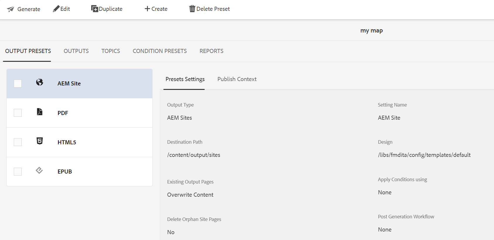

# Bearbeiten, Duplizieren oder Löschen einer Ausgabevorgabe {#id205BEH0K09Z}

Sie können Ausgabevorgaben über die Zuordnungskonsole und das Zuordnungs -Dashboard verwalten. In beiden Fällen stehen Optionen zum Bearbeiten, Duplizieren und Löschen einer Ausgabevorgabe zur Verfügung, wie im folgenden Abschnitt beschrieben.

## Verwenden der Map-Konsole

Sie können die ausgewählte Ausgabevorgabe bearbeiten, indem Sie die erforderlichen Felder direkt in die erforderlichen Vorgabeneinstellungen ändern.

Darüber hinaus können Sie eine Ausgabevorgabe mithilfe des Dropdown-Menüs **Optionen** wie unten dargestellt duplizieren oder löschen.

{width="800" align="left"}

## Verwenden des Karten-Dashboards

Sie können eine Ausgabevorgabe über das Zuordnungs -Dashboard bearbeiten, duplizieren und löschen, indem Sie die gewünschte Registerkarte wie unten dargestellt in der oberen Leiste auswählen.

{width="800" align="left"}

**Übergeordnetes Thema:**[ Ausgabegenerierung](generate-output.md)
