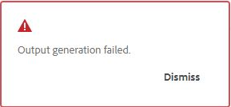

# Ausgabe generieren

Es gibt zwei Möglichkeiten, eine Ausgabe für eine DITA-Zuordnung zu generieren:

- [Generieren einer Ausgabe für eine DITA-Zuordnung über die Zuordnungskonsole](#generate-output-for-a-dita-map-from-the-map-console)
- [Generieren einer Ausgabe für eine DITA-Zuordnung über das Zuordnungs-Dashboard](#generate-output-for-a-dita-map-from-the-map-dashboard)

## Generieren einer Ausgabe für eine DITA-Zuordnung über die Zuordnungskonsole

Führen Sie die folgenden Schritte aus, um mithilfe der Zuordnungskonsole eine Ausgabe für eine DITA-Zuordnung zu generieren:

1. [Öffnen Sie eine Zuordnungsdatei in der Zuordnungskonsole](./open-files-map-console.md).
2. Die DITA-Zuordnungskonsole wird mit der Liste der **Ausgabevorgaben“ angezeigt** die für die Generierung der Ausgabe verfügbar sind.

3. Öffnen Sie die Vorgabe, die Sie für die Generierung der Ausgabe verwenden möchten, und wählen Sie **Ausgabe generieren** aus, um den Generierungsprozess zu starten.

   

   Bewegen Sie alternativ den Mauszeiger über die Vorgabe und wählen **Generieren** aus dem Kontextmenü der Vorgabe aus.

   

Nachdem die Ausgabegenerierung abgeschlossen ist, wählen Sie **Ausgabe anzeigen** aus, um die Ausgabe anzuzeigen.

Ein **Erfolgreich**-Dialogfeld wird unten rechts im Bildschirm angezeigt.

Wenn eine Ausgabe nicht erfolgreich ist, wird die folgende Fehlermeldung angezeigt.

Um das Fehlerprotokoll anzuzeigen, wählen Sie **Verwerfen**, bewegen Sie den Mauszeiger über die ausgewählte Vorgabenregisterkarte und wählen Sie **Protokoll anzeigen** aus dem vordefinierten Kontextmenü aus.

## Generieren einer Ausgabe für eine DITA-Zuordnung über das Zuordnungs-Dashboard

Führen Sie die folgenden Schritte aus, um mithilfe des Zuordnungs-Dashboards eine Ausgabe für eine DITA-Zuordnung zu generieren:

1. Navigieren Sie in der Assets-Benutzeroberfläche zu der DITA-Zuordnungsdatei, die Sie veröffentlichen möchten, und wählen Sie sie aus.

   Die DITA-Zuordnungskonsole wird mit der Liste der verfügbaren Ausgabevorgaben angezeigt, um eine Ausgabe zu generieren.

1. Wählen Sie eine oder mehrere Ausgabevorgaben aus, die Sie zum Generieren der Ausgabe verwenden möchten.

   {align="left"}

1. Wählen Sie das **Generieren**, um den Ausgabegenerierungsprozess zu starten.

Sie können den aktuellen Status der Ausgabegenerierungsanfrage auf der Registerkarte **Ausgaben** einsehen. Weitere Informationen finden Sie unter [Anzeigen des Status der Aufgabe zur Ausgabenerstellung](./generate-output-manage-process.md#view-the-status-of-the-output-generation-task).

>[!IMPORTANT]
>
> Wenn sich ein Ausgabegenerierungsprozess für eine Voreinstellung entweder in der Warteschlange befindet oder in Bearbeitung ist, können Sie für dieselbe Voreinstellung keine andere Ausgabegenerierungsaufgabe starten.

Sie können auch die AEM Sites-Ausgabe für ein oder mehrere Themen oder die gesamte DITA-Zuordnung über die Zuordnungskonsole generieren. Weitere Informationen finden Sie unter [Generieren von Wissensdatenbankausgaben](web-editor-article-publishing.md#id218CK0U019I).

**Übergeordnetes Thema:**&#x200B;[ Ausgabegenerierung](generate-output.md)
