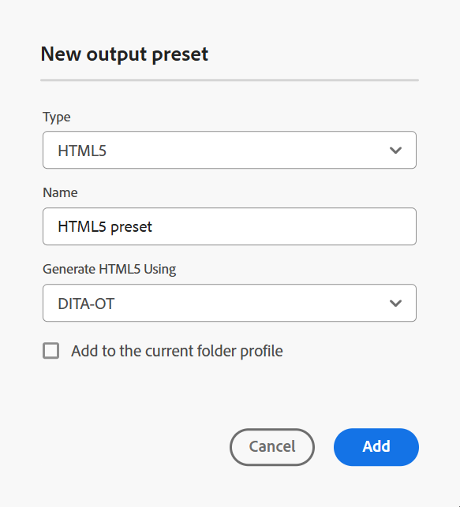

# HTML5 {#id205BE700XO1}

Sie können die HTML5-Ausgabevorgabe erstellen, um Ausgaben mithilfe von DITA-OT und FMPS zu veröffentlichen (falls von Ihrem Administrator konfiguriert).

Sie können die HTML5-Voreinstellung auf zwei Arten erstellen:

- [Erstellen einer HTML5-Ausgabevorgabe über die Zuordnungskonsole](#create-html5-output-preset-from-the-map-console)
- [Erstellen der HTML5-Ausgabevorgabe über das Zuordnungs-Dashboard](#create-html5-output-preset-from-the-map-dashboard)

## Erstellen einer HTML5-Ausgabevorgabe über die Zuordnungskonsole

Führen Sie die folgenden Schritte aus, um die HTML5-Voreinstellung über die Zuordnungskonsole zu erstellen:

1. [Öffnen Sie eine DITA-Zuordnungsdatei in der Zuordnungskonsole](./open-files-map-console.md).

   Sie können auf die Zuordnungsdatei auch über das Widget **Letzte Dateien** im Abschnitt [Übersicht](./intro-home-page.md#overview) zugreifen. Die ausgewählte Zuordnungsdatei wird dann in der Zuordnungskonsole geöffnet.
1. Klicken **auf der Registerkarte** Ausgabevorgaben“ auf das Symbol + , um eine Ausgabevorgabe zu erstellen.
1. Wählen Sie **HTML** aus der Dropdown-Liste Typ im Dialogfeld **Neue**) aus.
1. Geben Sie **Feld** einen Namen für diese Voreinstellung ein.
1. Wählen **im Feld &quot;HTML generieren mit** die Option DITA-OT aus.
1. Wählen Sie die **Zum aktuellen Ordnerprofil hinzufügen**, um eine Ausgabevorgabe innerhalb des aktuellen Ordnerprofils zu erstellen. Das  gibt eine Vorgabe auf Ordnerprofilebene an.

   Weitere Informationen zu [Verwalten globaler und Ordnerprofil-Ausgabevorgaben](./web-editor-manage-output-presets.md).

1. Wählen Sie **Hinzufügen** aus.

   Die Voreinstellung für HTML5 wird erstellt.

   {width="300" align="left"}

In der Zuordnungskonsole sind die Voreinstellungskonfigurationsoptionen auf den Registerkarten **Allgemein** und **Erweitert** organisiert.

Die **Allgemein** enthält die folgenden Konfigurationsoptionen:

- Ausgabepfad
- DITA-OT-Befehlszeilenargumente
- Dateiname
- Bedingte Filterung \(Wenn die Bedingungen für eine Zuordnung definiert sind\)
- Baseline verwenden \(Wenn eine Baseline für eine Zuordnung erstellt wird\)
- Nachgenerierungs-Workflow

**Erweitert**

Die Registerkarte Erweitert enthält die folgenden Konfigurationsoptionen:

- Name der Umwandlung
- Temporäre Dateien aufbewahren
- Dateihierarchie reduzieren
- Dateieigenschaften

Weitere Informationen zu den Voreinstellungskonfigurationsoptionen finden Sie im Abschnitt [HTML5-Voreinstellungskonfiguration](#html5-preset-configuration).

## Erstellen der HTML5-Ausgabevorgabe über das Zuordnungs-Dashboard

Führen Sie die folgenden Schritte aus, um die HTML5-Voreinstellung über das Zuordnungs-Dashboard zu erstellen:

1. Navigieren Sie in der Assets-Benutzeroberfläche zu und wählen Sie die DITA-Karte aus, um sie im Karten -Dashboard zu öffnen.
1. Stellen Sie sicher **dass die Registerkarte** Ausgabevorgaben“ ausgewählt ist.
1. Wählen **Erstellen** in der Symbolleiste aus.

   Ein neues Formular zur Erstellung von Ausgabevorgaben wird angezeigt.

1. Geben Sie die erforderlichen Konfigurationsdetails für die HTML5-Voreinstellung ein.
1. Klicken Sie **Fertig**, um die Voreinstellungen zu speichern.

Weitere Informationen zu den Voreinstellungskonfigurationsoptionen finden Sie im Abschnitt [HTML5-Voreinstellungskonfiguration](#html5-preset-configuration).

## HTML5-Voreinstellungskonfiguration

Die Konfigurationsoptionen variieren geringfügig, je nachdem, ob Sie die Vorgabe über die Zuordnungskonsole oder das Zuordnungs -Dashboard konfigurieren. Einige Optionen gelten nur für das Zuordnungs -Dashboard, während andere für beide gelten.

Wenn dieselbe Konfiguration zwei verschiedene Feldbezeichnungen hat, werden diese in der folgenden Tabelle durch ein **/** getrennt. Das erste steht für die Beschriftung in der Zuordnungskonsole und das zweite steht für die Beschriftung im Zuordnungs -Dashboard.

Beispiel: **Ausgabepfad/Zielpfad** - Hier ist **Ausgabepfad** die in der Zuordnungskonsole verwendete Beschriftung, während **Zielpfad** die Beschriftung ist, die im Zuordnungs-Dashboard für dieselbe Konfiguration verwendet wird.

| HTML5-Optionen | Beschreibung |
| --- | --- |
| Ausgabetyp (*nur für Zuordnungs-Dashboard*) | Der Typ der Ausgabe, die Sie generieren möchten. Um die HTML5-Ausgabe zu generieren, wählen Sie die Option HTML5 aus. |
| Name der Einstellung (*nur für das Zuordnungs-Dashboard*) | Geben Sie einen beschreibenden Namen für die HTML5-Ausgabeeinstellungen an, die Sie erstellen. Sie können beispielsweise &quot;_Kundenausgabe“_ „Endbenutzerausgabe _angeben_. |
| Responsive generieren mit (*nur für Zuordnungs-Dashboard*) | Wählen Sie **DITA-OT** aus, um die HTML5-Ausgabe zu generieren. Wählen Sie **FrameMaker Publishing Server** aus, wenn Ihr Administrator diese Option konfiguriert hat. Einige der Konfigurationsoptionen variieren, wenn FMPS ausgewählt wird. |
| Ausgabepfad/Zielpfad | Der Pfad innerhalb Ihres AEM-Repositorys, in dem die HTML5-Ausgabe gespeichert wird. |
| DITA-OT-Befehlszeilenargumente | Geben Sie die zusätzlichen Argumente an, die DITA-OT beim Generieren der Ausgabe verarbeiten soll.    HINWEIS: Ab Experience Manager Guides-Version 2502 wird der `generate.copy.outer` nicht mehr intern verwaltet. Wenn sich Ihr HTML5-Inhalt außerhalb des Zuordnungsverzeichnisses befindet, müssen Sie die `-Dgenerate.copy.outer=3` im Feld **DITA-OT Befehlszeilenargumente“ explizit**. Dadurch wird sichergestellt, dass der Inhalt korrekt verarbeitet und in die Ausgabe aufgenommen wird. Weitere Informationen zum Umgang mit Inhalten außerhalb des Zuordnungsverzeichnisses finden Sie unter [-OT-Dokumentation](https://www.dita-ot.org/dev/parameters/generate-copy-outer#:~:text=The%20generate.,located%20outside%20the%20map%20directory/). |
| Dateiname | Geben Sie den Dateinamen an, mit dem Sie die HTML5-Ausgabe speichern möchten.  **Hinweis**: Wenn Sie keinen Dateinamen angeben, wird der Titel der DITA-Zuordnung verwendet, um den endgültigen HTML5-Ausgabedateinamen zu generieren. Wenn die Zuordnung keinen Titel hat, wird der Dateiname der DITA-Zuordnung verwendet, um die endgültige HTML5-Ausgabe zu benennen. Der Dateiname wird mithilfe der im System konfigurierten Regeln bereinigt, um ungültige Zeichen zu verarbeiten. |
| Konditionieren/Filtern/Bedingungen anwenden mit | Wählen Sie eine der folgenden Optionen aus:  * **Keine angewendet**: Wählen Sie diese Option aus, wenn Sie keine Bedingung auf die veröffentlichte Ausgabe anwenden möchten. * **DITAVal-Datei**: Wählen Sie DITAVal-Dateien aus, um personalisierte Inhalte zu generieren. Sie können mehrere DITAVal-Dateien über das Dialogfeld „Durchsuchen“ oder durch Eingabe des Dateipfads auswählen. Verwenden Sie das Kreuz-Symbol neben dem Dateinamen, um ihn zu entfernen. DITAVal-Dateien werden in der angegebenen Reihenfolge ausgewertet, sodass die in der ersten Datei angegebenen Bedingungen Vorrang vor den in späteren Dateien angegebenen übereinstimmenden Bedingungen haben. Sie können die Dateireihenfolge durch Hinzufügen oder Löschen von Dateien beibehalten. Wenn die DITAVal-Datei an einen anderen Speicherort verschoben oder gelöscht wird, wird sie nicht automatisch aus dem Zuordnungs-Dashboard gelöscht. Sie müssen den Speicherort aktualisieren, falls Dateien verschoben oder gelöscht werden. Sie können den Mauszeiger über den Dateinamen bewegen, um den Pfad im AEM-Repository anzuzeigen, in dem die Datei gespeichert ist. Sie können nur DITAVal-Dateien auswählen. Wenn Sie einen anderen Dateityp ausgewählt haben, wird ein Fehler angezeigt. FrameMaker Publishing Server unterstützt nicht mehrere DITAVAL-Dateien. * **Bedingungsvorgabe**: Wählen Sie in der Dropdown-Liste eine Bedingungsvorgabe aus, um eine Bedingung beim Veröffentlichen der Ausgabe anzuwenden. Die Option ist sichtbar, wenn Sie eine Bedingung auf der Registerkarte „Bedingungsvorgaben“ der DITA-Zuordnungskonsole hinzugefügt haben. Weitere Informationen zu Bedingungsvorgaben finden Sie unter [Verwenden von Bedingungsvorgaben](generate-output-use-condition-presets.md#id1825FL004PN).  Sie können mehrere DITAVAL-Dateien über das Dialogfeld „Durchsuchen“ oder durch Eingabe des Dateipfads auswählen. Verwenden Sie das Kreuz-Symbol neben dem Dateinamen, um ihn zu entfernen. DITAVAL-Dateien werden in der angegebenen Reihenfolge ausgewertet, sodass die in der ersten Datei angegebenen Bedingungen Vorrang vor den in späteren Dateien angegebenen übereinstimmenden Bedingungen haben. Sie können die Dateireihenfolge durch Hinzufügen oder Löschen von Dateien beibehalten. Sie müssen den Speicherort aktualisieren, falls Dateien verschoben oder gelöscht werden. Sie können den Mauszeiger über den Dateinamen bewegen, um den Pfad im AEM-Repository anzuzeigen, in dem die Datei gespeichert ist. Sie können nur DITAVAL-Dateien speichern. Wenn Sie eine andere Datei ausgewählt haben, wird ein Fehler angezeigt.  **Hinweis**: FrameMaker Publishing Server unterstützt nicht mehrere DITAVAL-Dateien. |
| Nachgenerierungs-Workflow | Wenn Sie diese Option wählen, wird eine neue Dropdown-Liste für den Post-Generation-Workflow angezeigt, die alle in AEM konfigurierten Workflows enthält. Sie müssen einen Workflow auswählen, den Sie nach Abschluss des Workflows zur Ausgabegenerierung ausführen möchten.  **Hinweis**:Weitere Informationen zum Erstellen eines benutzerdefinierten Workflows für die Post-Output-Generierung finden Sie _Workflow für die Post-Output-Generierung anpassen_ unter Installieren und Konfigurieren von Adobe Experience Manager Guides as a Cloud Service . |
| Name der Umwandlung | Geben Sie den Typ der Ausgabe an, die Sie generieren möchten. Dies ist erforderlich, wenn Sie eine Ausgabe mit Ihrem eigenen benutzerdefinierten Plug-in generieren möchten, das im DITA-OT-Plug-in integriert ist. Wenn Sie beispielsweise eine XHTML-Ausgabe generieren möchten, geben Sie `xhtml` an. Eine Liste der in DITA-OT verfügbaren Transformationen finden Sie [DITA-OT-Transformationen (Ausgabeformate)](http://www.dita-ot.org/2.3/user-guide/AvailableTransforms.html) im OASIS DITA-OT-Benutzerhandbuch. |
| Temporäre Dateien aufbewahren | Wählen Sie diese Option, um die von DITA-OT generierten temporären Dateien beizubehalten. Wenn beim Generieren der Ausgabe über DITA-OT Fehler auftreten, wählen Sie diese Option aus, um die temporären Dateien beizubehalten. Anschließend können Sie diese Dateien verwenden, um Fehler bei der Ausgabegenerierung zu beheben.    Klicken Sie nach dem Generieren der Ausgabe auf das Symbol **Temporäre Dateien herunterladen** , um den ZIP-Ordner mit den temporären Dateien herunterzuladen.    **Hinweis**: Wenn Dateieigenschaften während der Generierung hinzugefügt werden, enthalten die temporären Ausgabedateien auch eine *metadata.xml*-Datei, die diese Eigenschaften enthält. |
| Baseline verwenden | Wenn Sie eine Baseline für die ausgewählte DITA-Map erstellt haben, wählen Sie diese Option, um die Version anzugeben, die Sie veröffentlichen möchten.  Weitere Informationen finden Sie [ „Arbeiten mit ](generate-output-use-baseline-for-publishing.md#id1825FI0J0PF)&quot;. |
| Dateihierarchie reduzieren | Wählen Sie die Option aus, um die HTML5-Ausgabe in einer flachen Ordnerhierarchie zu generieren. Der gesamte Inhalt wird im HTML5-Ausgabeformat in einer flachen Dateihierarchie veröffentlicht und in einem einzigen Ordner gespeichert.   Wenn Sie diese Option deaktivieren, wird die Ausgabe in einer verschachtelten Ordnerhierarchie generiert und die gesamte Ordnerstruktur repliziert. |
| Dateieigenschaften | Wählen Sie die Eigenschaften aus, die Sie als Metadaten verarbeiten möchten. Diese Eigenschaften werden auf der Seite Eigenschaften der DITA-Map- oder Bookmap-Datei festgelegt. Die aus der Dropdown-Liste ausgewählten Eigenschaften werden unter dem Feld **Dateieigenschaften** angezeigt. Klicken Sie auf das Kreuzsymbol neben der Eigenschaft, um sie zu entfernen.   **Hinweis**: Sie können die Metadaten auch mithilfe von DITA-OT-Publishing an die Ausgabe übergeben. Für eine weitere Detailansicht ([ Sie die Metadaten mithilfe von DITA-OT an die Ausgabe ](pass-metadata-dita-ot.md#id21BJ00QD0XA). |

**Übergeordnetes Thema:**&#x200B;[ Verstehen der Ausgabevorgaben](generate-output-understand-presets.md)
