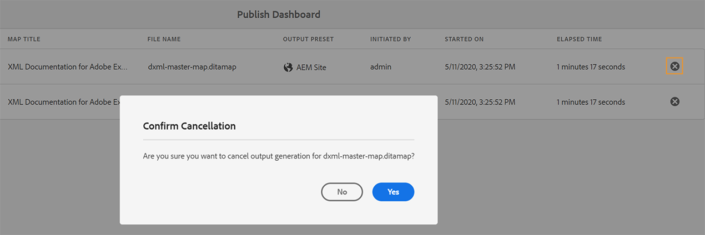

# Verwalten von Veröffentlichungsaufgaben mit dem Dashboard „Veröffentlichen“ {#id205CC08305Z}

Wenn auf Ihrem System eine große Anzahl von Veröffentlichungsaufgaben ausgeführt wird, ist es praktisch unmöglich, jede DITA-Map einzeln zu überprüfen, um die Veröffentlichungsaufgabe zu überwachen. Adobe Experience Manager Guides bietet Admins und Herausgebern eine einheitliche Ansicht aller im System ausgeführten Veröffentlichungsaufgaben. Eine Liste aller aktiven Veröffentlichungsaufgaben ist im Veröffentlichungs-Dashboard verfügbar.

Das Veröffentlichungs-Dashboard bietet einen vollständigen Überblick über alle Veröffentlichungsaufgaben, die derzeit im System ausgeführt werden.

{align="left"}

Das Veröffentlichungs-Dashboard enthält die folgenden Details:

- **Zuordnungstitel** - Der Titel einer Zuordnungsdatei, die derzeit veröffentlicht wird oder sich in der Veröffentlichungswarteschlange befindet.

- **Dateiname** - Der Dateiname der DITA-Zuordnung.

- **Ausgabevorgabe** - Name der Ausgabevorgabe, die zum Generieren der Ausgabe verwendet wird.

- **Initiiert von** - Benutzername der Person, die die Veröffentlichungsaufgabe initiiert hat.

- **Gestartet am** - Datum und Uhrzeit des Starts der Veröffentlichungsaufgabe.

- **Verstrichene Zeit** Zeit seit der Ausführung der Veröffentlichungsaufgabe im System.

- **Löschsymbol** - Abbrechen oder Beenden einer Veröffentlichungsaufgabe.

Das linke Bedienfeld im Veröffentlichungs-Dashboard bietet die folgenden Filteroptionen:

- **Ausgabevorgabe**: Wählen Sie eine oder mehrere Ausgabevorgaben aus, für die Sie die derzeit aktiven Veröffentlichungsaufgaben anzeigen möchten. Im folgenden Screenshot werden die Veröffentlichungsaufgaben gefiltert, um nur die Aufgaben anzuzeigen, die die Ausgabevorgabe der AEM-Site verwenden:

  {align="left"}

- **Initiiert von** - Wählen Sie einen Benutzernamen aus der Liste aus, um die Veröffentlichungsaufgaben anzuzeigen, die vom ausgewählten Benutzer initiiert wurden.

- **Map** - Wählen Sie in der Liste eine Zuordnungsdatei aus, um die Veröffentlichungsaufgaben anzuzeigen, die für die ausgewählte Zuordnung ausgeführt werden.

## Zugriff auf das Veröffentlichungs-Dashboard

Sie können auf **Dashboard veröffentlichen** direkt über die [Experience Manager Guides-Startseite ](./intro-home-page.md). Öffnen Sie die Startseite und wählen Sie **linken Bedienfeld die Option** Veröffentlichungswarteschlange“ aus.

>[!NOTE]
>
> Nur ein Administrator oder Herausgeber kann auf das Dashboard „Veröffentlichen“ zugreifen.

Sie können auf **Dashboard veröffentlichen** auch über die Adobe Experience Manager-Seite **Tools** zugreifen. Um diese Methode zu verwenden, führen Sie die folgenden Schritte aus:

1. Klicken Sie oben auf das Adobe Experience Manager-Logo und anschließend auf **Tools**.

1. Wählen Sie **Guides** aus der Liste der Tools aus.

1. Wählen Sie die Kachel **Dashboard veröffentlichen** aus.

   Das Veröffentlichungs-Dashboard wird mit einer Liste aller aktiven Veröffentlichungsaufgaben im System geöffnet.

   Wenn Sie auf den Link Dateiname klicken, wird das DITA-Zuordnungs-Dashboard der ausgewählten Zuordnung angezeigt.

   {align="left"}

>[!NOTE]
>
> Sie können auf das Dashboard Veröffentlichen auch über die Registerkarte **Ausgaben** zugreifen, während Sie die Ausgabe über das Zuordnungs-Dashboard generieren. Weitere Informationen finden Sie unter [Anzeigen des Status der Aufgabe zur Ausgabenerstellung](generate-output-for-a-dita-map.md#viewing_output_history).

## Abbrechen einer Veröffentlichungsaufgabe

Führen Sie die folgenden Schritte aus, um eine Aufgabe zur Ausgabegenerierung über das Veröffentlichungs-Dashboard abzubrechen:

1. [Zugriff auf das Veröffentlichungs-Dashboard](#access-the-publish-dashboard).

1. Wählen Sie aus der Liste der aktiven Veröffentlichungsaufgaben das Löschsymbol einer Aufgabe aus, die Sie abbrechen möchten.

   {align="left"}

1. Wählen **auf** Eingabeaufforderung **Abbruch bestätigen** die Option „Ja“.

   Der Abbruchsbefehl wird akzeptiert, und der Abbruch wird versucht, solange die Aufgabe aktiv bleibt. Nachdem die Aufgabe erfolgreich beendet wurde, wird sie aus der aktuell aktiven Aufgabenliste entfernt. Der Status der Aufgabe wird auch im DITA Map-Dashboard als Abgebrochen aktualisiert. Im folgenden Screenshot wird die Aufgabe *HTML5* über das Dashboard „Veröffentlichen“ abgebrochen und ihr Status wird auch im DITA-Zuordnungs-Dashboard geändert.

   {align="left"}

**Übergeordnetes Thema:**&#x200B;[ Ausgabegenerierung](generate-output.md)
