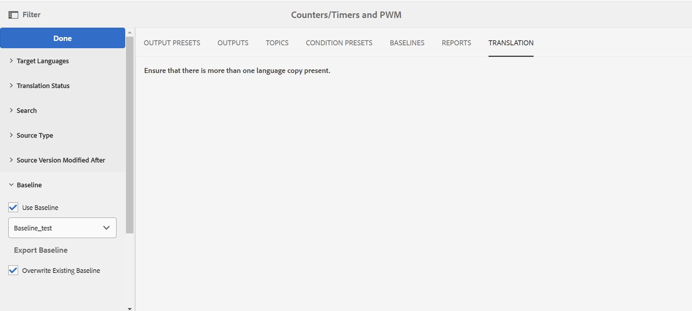

# Arbeiten mit Baseline über das Zuordnungs-Dashboard {#id1825FI0J0PF}

Experience Manager Guides bietet die Funktion „Grundlinien“, mit der Benutzende Grundlinien erstellen und zur Veröffentlichung oder Übersetzung von Themen verschiedener Versionen verwenden können. Sie können auch mehrere Ausgabevorgaben derselben DITA-Zuordnung parallel veröffentlichen.

>[!TIP]
>
> Im Abschnitt *Baseline* des Best Practices-Handbuchs finden Sie Best Practices für die Arbeit mit Baselines.

Ihre bzw. Ihr Admin kann die Registerkarte Baseline im Zuordnungs-Dashboard konfigurieren. Weitere Informationen finden Sie *Abschnitt „Baseline konfigurieren“ im DITA-Map* Dashboard im Installations- und Konfigurationshandbuch.

Auf der **Registerkarte Baselines** können Sie die folgenden Aktionen ausführen:

- [Erstellen einer Baseline](#create-a-baseline)
- [Anzeigen des Inhalts einer Baseline](#view-contents-of-a-baseline)
- [Baselines bearbeiten, duplizieren oder entfernen](#edit-duplicate-or-remove-baselines)
- [Hinzufügen von Kennzeichnungen zu einer Baseline](#add-labels-to-a-baseline)

## Erstellen einer Baseline

Sie können eine Baseline mit einer bestimmten Version der Themen und referenzierten Inhalten erstellen, die an einem bestimmten Datum und zu einer bestimmten Uhrzeit verfügbar sind, oder mit einer für eine Version der Themen definierten Beschriftung. Sie können die Versionen ausgewählter Themen in einer Grundlinie einzeln angeben, sodass jedes Mal, wenn Sie die Grundlinie im Veröffentlichungs- oder Übersetzungs-Workflow anwenden, die ausgewählten Themen und die entsprechenden Versionen für die Ausgabegenerierung oder Übersetzung einbezogen werden.

Führen Sie die folgenden Schritte aus, um eine Baseline zu erstellen:

1. Öffnen Sie eine DITA-Zuordnungsdatei in der Assets-Benutzeroberfläche und navigieren Sie zur Seite **Baselines** .
2. Wählen **oben** auf „Erstellen“ aus.
3. Geben Sie auf der Seite „Baseline“ einen Namen für die Baseline in das Feld **Baseline-Name** ein.

   {width="300" align="left"}

4. Wählen **unter „Version festlegen auf** eine der folgenden Optionen aus:

   - **Beschriftung**: Wählen Sie diese Option aus, um die Themen entsprechend der ihnen zugewiesenen Beschriftung auszuwählen. Geben Sie einen Titel ein, um die Liste anhand der eingegebenen Zeichenfolge zu filtern. Aus der Liste Ausgefilterter Assets können Sie einen Titel auswählen, um Themen und andere Assets mit dem angegebenen Titel auszuwählen.

     Wenn Sie Beschriftung auswählen, erhalten Sie auch eine zusätzliche Option, um die neueste Version von Themen zu verwenden, auf die die angegebene Beschriftung nicht angewendet wurde. Wenn Sie diese Option nicht auswählen und es ein Thema oder eine Mediendatei gibt, das/die nicht die angegebene Bezeichnung enthält, schlägt der grundlegende Erstellungsprozess fehl. Weitere Informationen zum Hinzufügen von Beschriftungen finden Sie unter Verwenden von Beschriftungen anzeigen.

   - **Version am**: Wählt die Themenversion zum angegebenen Zeitpunkt aus. Beachten Sie, dass die hier angegebene Zeit der Zeitzone Ihres Adobe Experience Manager-Servers entspricht. Wenn sich Ihr Server in einer anderen Zeitzone befindet, werden die Themen gemäß der Zeitzone Ihres Servers und nicht gemäß Ihrer lokalen Zeitzone aufgenommen.

     Nachdem Sie eine Bezeichnung oder Version als Datum ausgewählt haben, werden alle referenzierten Themen und Mediendateien in der Zuordnung entsprechend ausgewählt. Diese Themenauswahl wird nicht auf der Benutzeroberfläche angezeigt, sondern im Backend gespeichert.
5. Wählen Sie **Speichern** aus.

## Anzeigen des Inhalts einer Baseline

Sie können den Inhalt einer vorhandenen Baseline anzeigen, indem Sie auf die Registerkarte Baseline klicken und die gewünschte Baseline-Version aus der Liste auswählen. Die Seite Baselines ist in drei Teile unterteilt: DITA-Kartendatei, Karteninhalt oder -themen und den referenzierten Inhalt. Wenn Ihre Zuordnung Unterzuordnungen enthält, werden die von der Unterzuordnung referenzierten Themen auch im Abschnitt Inhalt angezeigt. Die verschiedenen Spalten auf der Seite „Baseline“ werden nachfolgend beschrieben:

- **Name**: Listet die DITA-Zuordnung oder den Titel des Themas oder den Namen des Assets auf, wie z. B. den Dateinamen eines Bildes.

- **Kind**: Listet die Art oder den Typ des Assets in der Zuordnung wie DITA-Karte, DITA-Thema oder Bildformat auf.

- **Version**: Listet die Version des Assets auf, das in der Baseline verfügbar ist.

- **Versionsdatum und -uhrzeit**: Listet Erstellungsdatum und -uhrzeit des Assets für die ausgewählte Version auf.

- **Neueste**: Listet auf, ob die neueste Version des Assets in der Baseline verwendet wird.

- **Übergeordnete Zuordnung**: Wenn Ihre Zuordnungsdatei Unterzuordnungen enthält, enthält diese Spalte den Namen der Zuordnung, in der ein Thema referenziert wird.

- **label**: Listet die Bezeichnung auf, die auf die Version des Themas angewendet wurde(n).

- **Referenziert von**: Diese Spalte ist nur für den referenzierten Inhalt verfügbar. Es zeigt das übergeordnete Thema des referenzierten Assets an. Wird ein Asset durch mehrere Themen referenziert, werden die Themen durch Kommas getrennt.

## Baselines bearbeiten, duplizieren oder entfernen

**Baselines bearbeiten**

Führen Sie die folgenden Schritte aus, um eine vorhandene Baseline zu bearbeiten:

1. Wählen Sie die Baseline aus und klicken Sie auf **Bearbeiten**.
1. Nehmen Sie die erforderlichen Änderungen an der Baseline vor. Sie können den Namen und die Version des Themas oder des referenzierten Inhalts ändern.
1. Wenn Sie für ein oder mehrere Themen eine andere Version verwenden möchten, können Sie dies tun, indem Sie diese Themen manuell auswählen. Wählen Sie **Thema durchsuchen**, um das Thema auszuwählen, für das Sie eine andere Version verwenden möchten. Wählen Sie aus der Dropdown-Liste Version für das ausgewählte Thema auswählen eine Version des Themas aus, das Sie in der Grundlinie verwenden möchten, und klicken Sie auf **OK**.

   {align="left"}

   Die Informationen über das Thema und seine ausgewählte Version werden im Backend gespeichert. Sie können diesen Schritt wiederholen, um die ausgewählte Version für mehrere Themen zu ändern.

1. Um alle Themen und Mediendateien zu laden, auf die in der DITA-Karte verwiesen wird, klicken Sie auf den Link **Alle Themen durchsuchen**. Die UUID von Themen und Mediendateien wird auch unter dem Thementitel oder dem Dateinamen \(media\) angezeigt.

   >[!NOTE]
   >
   > Wenn Ihre DITA-Karte sehr viele Dateien mit verschachtelten Karten und Themen enthält, kann es einige Zeit dauern, bis alle Dateien geladen sind, indem Sie Alle Themen durchsuchen auswählen.

   Der Inhalt Ihrer Zuordnung wird in den drei Abschnitten dargestellt: Zuordnungsdatei, Inhalt \(Themenreferenzen\) und referenzierter Inhalt \(verschachtelte Themen, Zuordnungen und andere Assets\). Sobald alle referenzierten Inhalte verfügbar sind, können Sie die Version des Themas, die Sie in Ihrer Baseline verwenden möchten, einzeln auswählen.

   Die **Version**-Dropdown-Liste zeigt die verfügbaren Versionen der Themen oder den referenzierten Inhalt. Für den referenzierten Inhalt haben Sie die Möglichkeit, automatisch eine Version auszuwählen.

   Wenn Sie für **referenzierten Inhalt die** „Automatisch auswählen“ wählen, wählt das System automatisch die Version des referenzierten Inhalts aus, die der Version des Inhalts entspricht, auf den verwiesen wird. Nehmen wir beispielsweise an, ein Thema A verweist auf ein Bild B. Bei der Erstellung von Version 1.5 von Thema A war die Version von Bild B 1.2 im Repository. Wenn jetzt eine Baseline mit Version 1.5 von Thema A erstellt wird und Bild B auf &quot;**auswählen** festgelegt ist, wählt das System automatisch Version 1.2 von Bild B aus.

   Wenn Sie eine Baseline mit den Kennzeichnungen erstellen **wird** Automatisch auswählen“ auf die Version aller referenzierten Inhalte angewendet.

   Wenn der referenzierte Inhalt oder die referenzierten Assets \(Thema, Unterzuordnungen, Bilder oder Videos\) nicht versioniert werden \(z. B. neu hochgeladene Inhalte\), wird beim Erstellen einer Grundlinie eine Version für diese Dateien erstellt. Wenn Ihre Dateien jedoch versioniert sind, wird keine inkrementelle Version für diese Dateien erstellt. Dieses Verhalten wird durch die Einstellung Version automatisch erstellen gesteuert, die standardmäßig aktiviert ist. Dies ist auch für die Übersetzung von Inhalten erforderlich, bei denen der Übersetzungsprozess erwartet, dass alle Dateien eine Version haben.

   >[!NOTE]
   >
   > Wenn Sie für eine bestimmte Ressource eine andere Version angeben möchten, können Sie dies tun, indem Sie die gewünschte Version aus der Dropdown-Liste **Version** auswählen.
1. Wählen Sie **Speichern** aus.

**Baselines duplizieren**

Wählen Sie die Baseline aus und klicken Sie **Duplizieren**, um eine Kopie einer vorhandenen Baseline zu erstellen. Geben Sie einen anderen Namen für die Baseline an, wählen Sie die Versionsnummer für die Themen und referenzierten Inhalte aus und klicken Sie auf **Speichern**.

**Baselines entfernen**

Wählen Sie die Baseline-Version aus und wählen Sie **Entfernen**, um eine Baseline zu entfernen.

## Hinzufügen von Kennzeichnungen zu einer Baseline

Das Hinzufügen von Beschriftungen zu jedem einzelnen Thema kann zeitaufwendig sein. Experience Manager Guides bietet einen Single-Click-Mechanismus zum Hinzufügen von Kennzeichnungen zu mehreren Themen und referenzierten Inhalten in einer DITA-Zuordnung.

Führen Sie die folgenden Schritte aus, um mehreren Themen und referenzierten Inhalten in einer DITA-Zuordnung einen Titel hinzuzufügen:

1. Wählen Sie auf der Seite Baselines eine Baseline aus, die die Themen und referenzierten Inhalte enthält, denen Sie eine Bezeichnung hinzufügen möchten.

   >[!NOTE]
   >
   > Vergewissern Sie sich, dass Ihre Baseline nicht über die neueste Version eines Themas oder Assets verfügt. Eine Beschriftung kann nur zu einem versionierten Thema oder Asset hinzugefügt werden.

1. Wählen Sie **Kennzeichnungen hinzufügen** aus.

   {align="left"}

1. Geben **im Dialogfeld „Bezeichnung hinzufügen** eine eindeutige Bezeichnung an, die mit dieser Grundlinie verknüpft werden soll.

   Wenn Ihr Administrator vordefinierte Kennzeichnungen konfiguriert hat, werden Sie diese Kennzeichnungen in einer Dropdown-Liste angezeigt. Sie müssen einen Titel aus der Liste auswählen.

1. Wenn Sie die Bezeichnung auf Themen anwenden möchten, auf die in den Unterzuordnungen verwiesen wird, wählen Sie die Option **Bezeichnung auf untergeordnete Zuordnungen und ihre abhängigen Elemente anwenden** aus.

   - Wählen Sie **Hinzufügen** aus.
Die angegebene Beschriftung wird der DITA-Zuordnung und den referenzierten Themen und Inhalten hinzugefügt.

     {width="650" align="left"}

## Exportieren übersetzter Baseline

Sie können die Grundlinie für die Übersetzung von Inhalten verwenden. Sie können beispielsweise eine Grundlinie für Version 1.1 erstellen, die auf Französisch übersetzt werden kann. Auf der Registerkarte Übersetzung müssen Sie Baseline verwenden, um Ihre Inhalte zu filtern, und dann die Baseline für Version 1.1 Ihrer Inhalte auswählen. Die Verwendung von Grundlinien für die Übersetzung von Inhalten erleichtert Ihnen die Verwaltung Ihrer Inhalte.

Sobald die Inhalte übersetzt wurden, können Sie die übersetzten Grundlinien zur Archivierung exportieren oder für verschiedene Teams in Ihrer Organisation freigeben. Beachten Sie die folgenden Punkte, bevor Sie eine übersetzte Baseline exportieren:

- Der Export einer Baseline ist erst möglich, nachdem der Inhalt der Baseline übersetzt wurde. Wenn Sie versuchen, eine Baseline zu exportieren, für die die Übersetzung nicht gestartet wurde oder nicht abgeschlossen ist, erhalten Sie einen Fehler.
- Sie können die Grundlinie nur für eine Version übertragen, die bereits übersetzt ist. Wenn Sie beispielsweise eine Baseline für Version 1.1 Ihres Inhalts erstellt haben und der gleiche Inhalt übersetzt wird, können Sie diese Baseline exportieren. Wenn Sie jedoch eine Baseline für Version 1.2 erstellt haben, die nicht übersetzt ist, können Sie diese Baseline nicht exportieren.
- Wenn eine Baseline bereits exportiert wurde, können Sie die vorhandene Baseline überschreiben, indem Sie die Option *Vorhandene Baseline überschreiben* beim Exportieren auswählen.

Führen Sie die folgenden Schritte aus, um eine übersetzte Baseline zu exportieren:

1. Öffnen Sie die DITA-Karte, die die übersetzte Grundlinie enthält.

1. Erweitern Sie auf **Registerkarte** die Option **Grundlinie**, die in der linken Leiste verfügbar ist.

   {align="left"}

1. Wählen Sie die **Baseline verwenden** und wählen Sie die Baseline aus, die Sie exportieren möchten.

1. Wählen Sie **Baseline exportieren** aus.

   Der Exportstatus wird angezeigt. Wenn der Vorgang erfolgreich ist, wird eine Meldung angezeigt, in der die Sprache angegeben wird, für die die Baseline exportiert wird. Im Falle eines Fehlers wird die Fehlerursache angezeigt.

   Wenn Sie versuchen, die bereits exportierte Baseline zu exportieren, wird auch die Meldung Baseline-Erstellungsfehler angezeigt.

1. \(Optional\) Um eine bereits exportierte Baseline zu exportieren, wählen Sie **Vorhandene Baseline überschreiben** und wählen Sie dann **Baseline exportieren**.

**Übergeordnetes Thema:**&#x200B;[ Ausgabegenerierung](generate-output.md)
