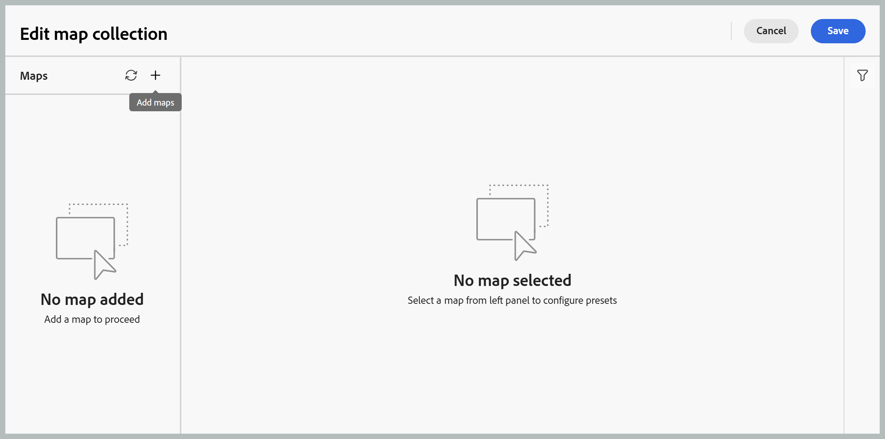

# Neue Zuordnungssammlung für die Ausgabegenerierung verwenden (Beta)

>[!IMPORTANT]
>
> In Experience Manager Guides as a Cloud Service ist ab Version 2026.06.0 eine neue Zuordnungssammlung verfügbar. Wenden Sie sich an Ihr Customer Success-Team , um diese Funktion zu aktivieren.

Mit der Zuordnungssammlung in Adobe Experience Manager Guides können Veröffentlichungsspezialisten mehrere Dokumente in einer Sammlung organisieren, die für jedes Dokument generierte Ausgabe steuern und über ein zentralisiertes Dashboard effizient Ausgaben in Stapeln generieren und veröffentlichen. Darüber hinaus bietet es Einblicke in den Fortschritt der Ausgabenerstellung, hebt Änderungen hervor, die seit der letzten Veröffentlichung der Zuordnungen vorgenommen wurden, und ermöglicht bei Bedarf das erneute Veröffentlichen von Inhalten.

Die neue Zuordnungssammlung konsolidiert die Funktionalität, die zuvor über die alte Zuordnungssammlung verteilt war, und die Massenveröffentlichung in einer einzigen einheitlichen Oberfläche. Nach der Aktivierung können Sie Zuordnungen, Vorgaben, Generierungsverlauf, Veröffentlichungsverlauf, Metadaten und Sammlungszugehörigkeit von einem Ort aus verwalten.

## Erstellen einer Kartensammlung und Hinzufügen von DITA-Karten

Um eine Zuordnungssammlung zu erstellen und ihr Zuordnungen hinzuzufügen, führen Sie die folgenden Schritte aus:

1. Öffnen Sie die Experience Manager Guides-Startseite und wählen Sie **Neue Zuordnungssammlungen** aus.

   Die **Sammlungen zuordnen** wird geöffnet.

   {width="650"}

1. Wählen Sie auf der **Zuordnungssammlungen** oben rechts **Erstellen** aus und geben Sie einen **Namen** für Ihre neue Zuordnungssammlung ein.

   {width="350"}

1. Wählen Sie **Erstellen** aus.

   Bei der Erstellung der Zuordnungssammlung wird eine Erfolgsmeldung angezeigt.

1. Öffnen Sie die gewünschte Zuordnungssammlung, der Sie die Zuordnungen hinzufügen möchten.

   

   Wenn Sie den Mauszeiger über den Titel der Zuordnungssammlung bewegen, können Sie die folgenden Aktionen ausführen:

   - **Verlauf generieren**: Navigiert direkt zur Registerkarte Erzeugter Verlauf , auf der alle Zuordnungen mit generierten Ausgaben für die definierten Vorgaben aufgelistet sind.
   - **Veröffentlichungsverlauf**: Navigiert direkt zur Registerkarte Veröffentlichungsverlauf , auf der alle Zuordnungen mit veröffentlichter Ausgabe für die definierten Vorgaben aufgelistet sind.
   - **Umbenennen**: Benennt die Zuordnungssammlung um.

1. Wählen Sie **Sammlung bearbeiten** und dann **Karten hinzufügen** aus.

   

1. Wählen Sie die gewünschten Karten aus und aktivieren Sie den Umschalter **Verfügbare Übersetzungen auswählen**, um alle verfügbaren Übersetzungskopien dieser Karte automatisch zur Zuordnungssammlung hinzuzufügen. Wenn die Zuordnung über keine Übersetzungskopien verfügt, wird die Standardsprache zur Zuordnung hinzugefügt.

   

1. Wählen Sie **Hinzufügen** aus.

   Die Zuordnungsdateien werden zusammen mit allen verfügbaren übersetzten Kopien aufgelistet. Bei Karten ohne übersetzte Kopien wird die Standardsprache angezeigt.

   

1. Wählen Sie die erforderlichen Zuordnungen oder alle aufgelisteten Zuordnungen aus und klicken Sie dann auf die Schaltfläche **Vorgaben abrufen**, um die verfügbaren Vorgaben für die ausgewählten Zuordnungen abzurufen.

   Es wird eine Liste aller verfügbaren Vorgaben für die ausgewählten Zuordnungen angezeigt, die in zwei Kategorien gruppiert sind: **Ordnerprofilvorgaben** und **Sonstige Vorgaben**. **Ordnerprofilvorgaben** sind allen ausgewählten Zuordnungen gemeinsam, während **Andere Vorgaben** für einzelne Zuordnungen spezifisch sind. Für Vorgaben unter **Andere Vorgaben** wird die zugehörige Zuordnung neben dem entsprechenden Umschalter angezeigt.

   

1. Wählen Sie **Alle Vorgaben aktivieren** oder **Alle Ordnerprofilvorgaben aktivieren** aus, je nach Ihren Anforderungen. Sie können auch das Symbol Filter auf der rechten Seite verwenden, um die Liste einzugrenzen. Der Filter bietet zwei Filterebenen: **Vorgabentypen** zur Eingrenzung der aufgelisteten Vorgaben und **Zuordnungsstatus** zur Auswahl bestimmter Zuordnungen im Bereich Zuordnungen .

   

1. Wählen Sie **Speichern** aus.

Sie erhalten eine Liste aller gewünschten Zuordnungen mit dem Zuordnungstitel, dem entsprechenden Dateinamen, der Sprache, in der sie verfügbar sind, und den konfigurierten Voreinstellungen.

Die **Karten und Vorgaben** enthält Informationen auf der Grundlage der ausgewählten Karten für eine bestimmte Sprache in den folgenden Spalten:

- **Voreinstellung**: Zeigt den für die Zuordnungsdatei konfigurierten Vorgabetyp der Ausgabe an.
- **Baseline**: Zeigt die Baseline an, die von der Ausgabevorgabe verwendet wird.  Wenn keine Grundlinie verwendet wird, wird ein `-` angezeigt.
- **Geändert seit Generierung**: Gibt an, ob die DITA-Zuordnung nach der Generierung aktualisiert wird. Basierend auf diesen Informationen können Sie entscheiden, ob Sie die Ausgabe für diese DITA-Zuordnung veröffentlichen möchten oder nicht.
- **Geändert seit veröffentlicht**: Gibt an, ob die DITA-Zuordnung nach der letzten Veröffentlichung aktualisiert wird. Basierend auf diesen Informationen können Sie entscheiden, ob Sie die Ausgabe für diese DITA-Zuordnung erneut veröffentlichen möchten oder nicht.
- **Zuletzt generiert**: Zeigt Datum und Uhrzeit der letzten generierten Ausgabe an.
- **Zuletzt veröffentlicht**: Zeigt Datum und Uhrzeit der letzten veröffentlichten Ausgabe an.

**Filteroptionen**

Die folgenden Filteroptionen sind im rechten Bedienfeld auf der Seite „Zuordnungen“ und „Vorgaben“ verfügbar:

- **Geändert seit Generierung**: Sie können „Ja“, „Nein“ oder „Noch nicht generiert“ auswählen. Wenn Sie Ja auswählen, werden nur die Zuordnungen, die seit der Erstellung geändert wurden, auf der Registerkarte Zuordnungen und Vorgaben angezeigt.
- **Geändert seit der Veröffentlichung**: Sie können „Ja“, „Nein“ oder „Noch nicht generiert“ auswählen. Wenn Sie Ja auswählen, werden nur die Karten, die seit der Veröffentlichung geändert wurden, auf der Registerkarte Karten und Vorgaben angezeigt.
- **Vorgaben**: Wählen Sie eine Vorgabe aus, für die Sie die Zuordnungsdateien herausfiltern möchten. Wenn Sie beispielsweise die Vorgabe *AEM-Site* auswählen, werden nur die Zuordnungen angezeigt, für die die Ausgabevorgabe *AEM-Site* konfiguriert ist.
- **Sprache**: Sie können einen beliebigen der verfügbaren Sprach-Codes auswählen und nur die ausgewählte Sprache auf der Registerkarte Zuordnungen und Vorgaben anzeigen.

  

## Ausgabe mithilfe einer Zuordnungssammlung generieren

Um die Ausgabe mithilfe einer Zuordnungssammlung zu generieren, führen Sie die folgenden Schritte aus:

1. Öffnen Sie die Zuordnungssammlung. Sie können die verschiedenen Ausgabevorgaben wie AEM Sites, PDF (einschließlich nativer PDF), HTML5, EPUB und benutzerdefinierte Vorgaben gemäß Ihrer Konfiguration anzeigen.

1. Um eine Ausgabe für die ausgewählten Zuordnungen zu generieren, wählen Sie die erforderlichen Zuordnungsdateien und die spezifischen Vorgaben aus und klicken Sie dann auf **Generieren**.

   >[!IMPORTANT]
   >
   > Wenn sich ein Prozess zur Ausgabegenerierung für eine Voreinstellung oder DITA-Zuordnung entweder in der Warteschlange befindet oder in Bearbeitung ist, können Sie für dieselbe Voreinstellung oder Zuordnung keine andere Ausgabegenerierungsaufgabe initiieren.

1. Nachdem die Ausgabe generiert wurde, navigieren Sie zur Registerkarte **Erzeugter Verlauf** , um die Liste aller generierten Zuordnungen anzuzeigen. Sie können den Generierungsfortschritt in der Spalte **Status** verfolgen, die angibt, ob eine Generierung ausgeführt wird oder abgeschlossen ist.

   

1. Wählen Sie **Aktualisieren** aus, um den neuesten Status des Generierungsprozesses anzuzeigen. Die Spalte Status wird aktualisiert und zeigt den aktuellen Status jeder Zuordnung und der zugehörigen Voreinstellungen an:

   - **Beendet (Grün)**: Generierung erfolgreich abgeschlossen.
   - **Beendet (Rot)**: Generierung mit Fehlern abgeschlossen. Fehlerdetails können in den Protokollen eingesehen werden.
   - **Wird ausgeführt (blau)**: Die Generierung ist derzeit in Bearbeitung.

   

1. Sie können die Aufgabe zur Ausgabegenerierung auch abbrechen, bis der Status der Aufgabe ausgeführt wird, indem Sie das Symbol **Generierung abbrechen** auswählen.

   

1. Darüber hinaus können Sie die generierte Ausgabe für Zuordnungen anzeigen, deren Ausgabegenerierung abgeschlossen wurde, indem Sie auf das Symbol **Ausgabe öffnen** klicken, das angezeigt wird, wenn Sie den Mauszeiger über den Zuordnungsnamen bewegen, oder die Generierungsprotokolle anzeigen, indem Sie das angrenzende Symbol **Protokolle** auswählen.

   

## Veröffentlichen der Ausgabe mithilfe einer Zuordnungssammlung

Um die Ausgabe mithilfe einer Zuordnungssammlung zu veröffentlichen (falls konfiguriert), führen Sie die folgenden Schritte aus:

1. Wählen Sie die gewünschten Zuordnungen entweder auf der Registerkarte **Zuordnungen und Vorgaben** oder auf der Registerkarte **Generierter Verlauf** aus und klicken Sie auf **Veröffentlichen in**.
1. Wählen Sie die Zielumgebung aus, in der Sie die Ausgabe veröffentlichen möchten: **Vorschau** oder **Veröffentlichen** Instanz.

   

1. Wechseln Sie zur Registerkarte **Veröffentlichungsverlauf**, um den Status der Veröffentlichungsaufgabe zu überwachen.

   

1. Wählen Sie **Aktualisieren** aus, um den aktuellen Status der Aufgabe anzuzeigen.
1. Sobald der Status auf **Erfolgreich** wechselt, überprüfen Sie den veröffentlichten Inhalt in der ausgewählten Zielinstanz.

## Konfigurieren der Metadateneigenschaften

In der Zuordnungssammlung können Sie die Metadateneigenschaften für die DITA-Zuordnungen stapelweise konfigurieren. Wählen Sie **Symbol &quot;** konfigurieren“ auf der Registerkarte **Zuordnungen und Vorgaben** aus, um die Seite **Asset-Metadaten** zu öffnen. Auf der Seite **Asset-**&quot; werden alle in der Sammlung vorhandenen Zuordnungen auf der linken Seite aufgeführt.

Führen Sie die folgenden Schritte aus, um die Metadateneigenschaften zu konfigurieren:

1. Sie können die Zuordnungen auswählen, für die Sie die Metadaten aktualisieren möchten. Standardmäßig sind alle vorhandenen DITA-Zuordnungen ausgewählt.

1. Sobald Sie die DITA-Zuordnungen ausgewählt haben, können Sie Eigenschaften wie Metadaten, Zeitplan (Deaktivierung), Verweise, den Dokumentstatus und mehr anzeigen.

1. Aktualisieren Sie die Metadateneigenschaften.

1. Klicken Sie **oben auf „Speichern** schließen“, um die Aktualisierungen zu speichern.
1. (Optional) Wenn Sie die Tags aktualisieren, können Sie auch in der Dropdown-Liste **Speichern und schließen** die Option Anhängen auswählen, um die neuen Tags an die vorhandene Liste anzuhängen.
1. Wählen Sie **Senden** aus dem Dropdown **Speichern und schließen** aus.
Die Metadateneigenschaften werden für die DITA-Zuordnungen, die Sie aus der Zuordnungssammlung auswählen, stapelweise aktualisiert.

>[!NOTE]
> 
>Für das **Dokumentstatus**-Dropdown können Sie nur die Dokumentstatus auswählen, die für alle ausgewählten DITA-Zuordnungen gemeinsam zulässig sind. Weitere Informationen finden Sie unter [**Dokumentstatus**](./web-editor-document-states.md).

Die Metadateneigenschaften sind mit den Dateieigenschaften synchronisiert. Nachdem Sie sie aktualisiert haben, können Sie sie über das Bedienfeld **Dateieigenschaften** im Editor anzeigen.

**Übergeordnetes Thema:**[ Ausgabegenerierung](generate-output.md)
