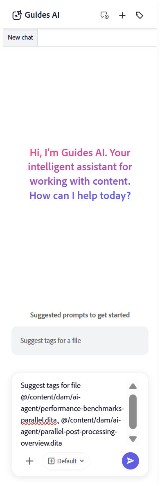

# Erste Schritte mit KI-Handbüchern

>[!NOTE]
>
> Guides AI ist in Experience Manager Guides as a Cloud Service ab Version 2026.08.0 verfügbar. Wenden Sie sich an Ihr Customer Success-Team , um diese Funktion zu aktivieren.

KI-Handbücher machen das Tagging Ihrer Inhalte schneller, einfacher und konsistenter. Mithilfe der Fähigkeit zum agentischen Smart-Tagging von Adobe CX Enterprise Coworker analysiert Guides AI Ihren Inhalt und empfiehlt relevante Tags basierend auf der Taxonomie Ihres Unternehmens, anstatt Inhalte manuell zu lesen, um zu entscheiden, welche Tags angewendet werden sollen. Sie behalten die Kontrolle über die vorgeschlagenen Tags und entscheiden sich dafür, sie anzuwenden oder abzulehnen, bevor Sie Ihre Auswahl bestätigen. Dies reduziert den manuellen Aufwand erheblich, verbessert die Tagging-Genauigkeit und stellt konsistente Metadaten in Ihrer gesamten Dokumentation sicher.

## Handbuch-KI-Bedienfeld

Das Bedienfeld KI-Handbücher bietet alle Tools, die Sie zum Generieren, Überprüfen und Anwenden von KI-vorgeschlagenen Tags benötigen.

{width="650"}

Die folgenden Komponenten der Handbücher-KI helfen Ihnen beim Hinzufügen von Dateien, Konfigurieren von Tag-Empfehlungen und Verwalten Ihres Smart-Tagging-Workflows:

- **(A)** Konversationsverlauf: Zeigen Sie frühere Konversationen an und öffnen Sie sie erneut, um frühere Tag-Empfehlungen und -Aktionen zu überprüfen.

  {width="350"}

- **(B)** Neuer Chat: Beginnen Sie eine neue Tagging-Sitzung für ein anderes Thema, eine andere Karte oder einen anderen Dateisatz.
- **(C)** Tag-Namespace: Wählen Sie die Namespaces der Taxonomie aus, aus denen Guides AI Tag-Empfehlungen generieren soll. Nur Tags aus den ausgewählten Namespaces werden berücksichtigt.

  {width="350"}

- **(D)** Antwortraum: Überprüfen Sie die KI-generierten Tag-Empfehlungen und wählen Sie sie an, abzulehnen oder zu ändern, bevor Sie die Tags anwenden.
- **(E)** Platzierung auffordern: Geben Sie eine Eingabeaufforderung ein, um Tag-Empfehlungen für den ausgewählten Inhalt zu generieren.
- **(F)** Dateien anhängen oder Kontext hinzufügen: Fügt Themen, Karten oder externe Dateien aus Ihrem lokalen System hinzu, um den Inhalt bereitzustellen, der von KI für Tag-Empfehlungen analysiert werden soll.
- **(G)**-Modell: Zeigt das KI-Modell an, das zur Analyse von Inhalten und Generierung von Tag-Empfehlungen verwendet wird. Mehrere OpenAI- und Anthropic-Claude-Modelle stehen zur Auswahl. Standardmäßig ist die Option **Standardmanifest verwenden** ausgewählt, die das für den ausgewählten Assistenten konfigurierte Modell verwendet.
- **(H)** Senden: Senden Sie Ihre Eingabeaufforderung und den angehängten Inhalt, um KI-gestützte Tag-Empfehlungen zu generieren.

## Anwenden von Tags auf einzelne oder mehrere Themen mit der Fähigkeit zum Smart-Tagging

Führen Sie die folgenden Schritte aus, um KI-Handbücher zum Anwenden von Tags auf einzelne oder mehrere Themen mit der Fähigkeit zum Smart-Tagging zu verwenden:

1. Melden Sie sich bei Experience Manager Guides an.
1. Wählen Sie auf der Startseite in **Navigationsleiste die Option** Guides AI) aus. Stellen Sie sicher, dass die Funktion „Guides AI“ von Ihrem Administrator aktiviert wurde.
1. Fügen Sie das Thema hinzu, für das Sie Tag-Empfehlungen generieren möchten, indem Sie eine der folgenden Methoden verwenden:

   - **Verwenden von empfohlenen Eingabeaufforderungen**: Wählen Sie für den ersten Chat im Bereich Antwort die Option **Tags für eine Datei vorschlagen** aus. Die Eingabeaufforderung wird automatisch zur Eingabeaufforderung hinzugefügt. Wählen Sie `[file]` und dann das Thema aus dem Repository oder einer Sammlung im Dialogfeld **Datei**. Sie können ein Thema im Dialogfeld **Datei auswählen** auswählen.

     {width="650"}

   - **Verknüpfung verwenden**: Geben Sie `/` in das Feld Eingabeaufforderung ein, wählen Sie dann **Repository-Verweis hinzufügen**, um ein Thema aus dem Repository auszuwählen (oder **Dateien vom Gerät hinzufügen**, um ein Thema von Ihrem Computer hochzuladen), und geben Sie die vorgeschlagene Eingabeaufforderung ein *Tags für eine Datei vorschlagen*.

   - **Drag-and-**: Ziehen Sie ein einzelnes Thema oder mehrere Themen per Drag-and-Drop in die Eingabeaufforderung und geben Sie die Eingabeaufforderung *Tags für eine Datei vorschlagen* ein.

     {width="650"}

   - **Themenpfade angeben**: Geben Sie `@` ein, gefolgt von durch Kommas getrennten Pfaden für mehrere Themen aus denselben oder verschiedenen Zuordnungen. Geben Sie dann die Eingabeaufforderung ein: *Tags für eine Datei vorschlagen*.

     {width="650"}

1. Wählen Sie **Senden** aus.

1. Guides AI analysiert den Inhalt des Themas und generiert Tag-Empfehlungen.

   {width="650"}

1. Überprüfen Sie die vorgeschlagenen Tags wie folgt:

   >[!NOTE]
   >
   > Bei Themen, die bereits Tags enthalten, zeigt Guides AI die vorhandenen Tags an. Diese Tags sind schreibgeschützt und können nicht geändert oder entfernt werden.

   - Für ein einzelnes Thema können Sie die Empfehlungen einfach **akzeptieren** oder sie **ablehnen** wenn sie nicht erforderlich sind.

     {width="650"}

   - Für mehrere Themen:
     1. Wählen Sie **Vorschau** aus, um die KI-generierten Tag-Empfehlungen zu überprüfen.

        {width="650"}

     1. Überprüfen Sie die vorgeschlagenen Tags für jedes Thema und wählen Sie dann eine der folgenden Aktionen:
        - **Alle akzeptieren** um alle vorgeschlagenen Tags für alle Themen anzuwenden.
        - **Alle ablehnen**, um alle vorgeschlagenen Tags für alle Themen zu verwerfen.
        - **Alle Vorschläge löschen** um alle vorgeschlagenen Tags für ein bestimmtes Thema zu entfernen.
        - Wählen Sie das Symbol **X** neben einem Tag aus, um einen einzelnen Tag-Vorschlag zu entfernen.

          {width="650"}

1. Wenn Sie die vorgeschlagenen Tags akzeptieren, fügt die Smart-Tagging-Fähigkeit die KI-generierten Tags zu den bereits auf den Inhalt angewendeten Tags hinzu.

Nach Abschluss der Überprüfung zeigt die KI-Handbücher eine Zusammenfassung der auf das Thema angewendeten Tags und aller abgelehnten Tag-Empfehlungen an.

{width="650"}

## Anwenden von Tags auf mehrere Themen einer Zuordnung mithilfe der Smart-Tagging-Fähigkeit

Führen Sie die folgenden Schritte aus, um KI-Handbücher zum Anwenden von Tags auf mehrere Themen einer Zuordnung mit der Fähigkeit zum Smart-Tagging zu verwenden:

1. Melden Sie sich bei Experience Manager Guides an.
1. Wählen Sie auf der Startseite in **Navigationsleiste die Option** Guides AI) aus. Stellen Sie sicher, dass die Funktion „Guides AI“ von Ihrem Administrator aktiviert wurde.
1. Fügen Sie die Zuordnung hinzu, für die Sie Tag-Empfehlungen generieren möchten, indem Sie eine der folgenden Methoden verwenden, wie unter Themen beschrieben:

   - **Verwenden von empfohlenen Eingabeaufforderungen**: Wählen Sie für den ersten Chat im Bereich Antwort die Option **Tags für eine Datei vorschlagen** aus. Die Eingabeaufforderung wird automatisch zur Eingabeaufforderung hinzugefügt. Wählen Sie `[file]` und dann die Zuordnung aus dem Repository oder einer Sammlung im Dialogfeld **Datei**.

   - **Drag-and-Drop**: Ziehen Sie eine Karte per Drag-and-Drop in die Eingabeaufforderung und geben Sie die Eingabeaufforderung *Tags für eine Datei vorschlagen* ein.

   - **Verknüpfung verwenden**: Geben Sie `/` in das Feld Eingabeaufforderung ein, wählen Sie dann **Repository-Verweis hinzufügen**, um eine Zuordnung aus dem Repository auszuwählen (oder **Dateien vom Gerät hinzufügen**, um eine Zuordnung von Ihrem Computer hochzuladen), und geben Sie die vorgeschlagene Eingabeaufforderung ein *Tags für eine Datei vorschlagen*.

     {width="650"}

1. Wählen Sie **Senden** aus.
Eine Meldung weist darauf hin, dass die ausgewählte Zuordnung mehrere Themen enthält. Wählen Sie **Themen auswählen** aus, um die Themen auszuwählen, für die Sie Tag-Empfehlungen erstellen möchten.

   {width="650"}

1. Wählen **im Dialogfeld „Themen**&quot; die Themen aus, für die Sie Tag-Empfehlungen erstellen möchten.\
   Das **Themen auswählen** Dialogfeld bietet Folgendes:

   - **Themenliste:** Zeigt alle Themen in der ausgewählten Zuordnung an. Wählen Sie die Themen aus, für die Sie Tag-Empfehlungen generieren möchten.
   - **Vorschaufenster:** zeigt eine Vorschau des ausgewählten Themas zusammen mit den vorhandenen Tags an.
   - **Filtern** Filtern Sie die Themen so, dass nur die mit **Tags hinzugefügt** oder **Keine Tags hinzugefügt** angezeigt werden.

     {width="650"}

1. Wählen Sie **Bestätigen** aus. Guides AI analysiert die ausgewählten Themen und zeigt die Anzahl der für jedes Thema generierten Tag-Empfehlungen an.
1. Wählen Sie **Vorschau** aus, um die KI-generierten Tag-Empfehlungen zu überprüfen.
1. Überprüfen Sie die vorgeschlagenen Tags für jedes Thema und wählen Sie dann eine der folgenden Aktionen:
   - **Alle akzeptieren** um alle vorgeschlagenen Tags für alle Themen anzuwenden.
   - **Alle ablehnen**, um alle vorgeschlagenen Tags für alle Themen zu verwerfen.
   - **Alle Vorschläge löschen** um alle vorgeschlagenen Tags für ein bestimmtes Thema zu entfernen.
   - Wählen Sie das Symbol **X** neben einem Tag aus, um einen einzelnen Tag-Vorschlag zu entfernen.

     >[!NOTE]
     >
     > Bei Themen, die bereits Tags enthalten, zeigt Guides AI die vorhandenen Tags an. Diese Tags sind schreibgeschützt und können nicht geändert oder entfernt werden.

   {width="650"}

1. Wenn Sie die vorgeschlagenen Tags akzeptieren, fügt die Smart-Tagging-Fähigkeit die KI-generierten Tags zu den bereits auf den Inhalt angewendeten Tags hinzu.

Nach Abschluss der Überprüfung zeigt die KI-Handbücher eine Zusammenfassung der auf die einzelnen Themen angewendeten Tags und aller abgelehnten Tag-Empfehlungen an.

