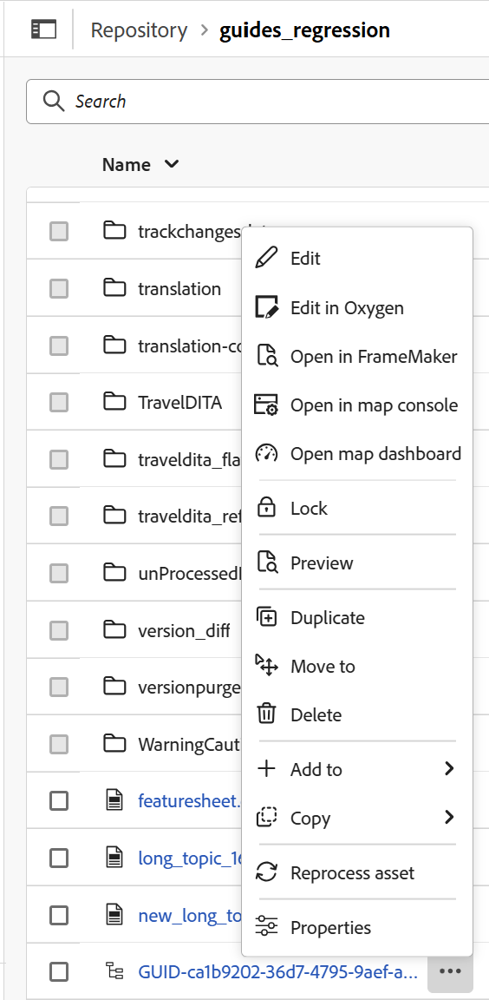
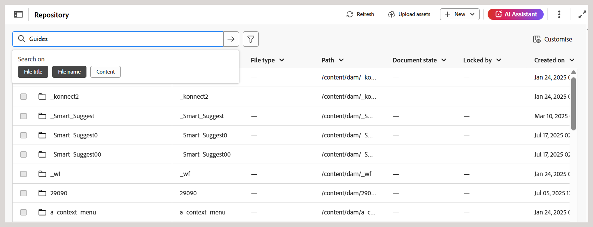
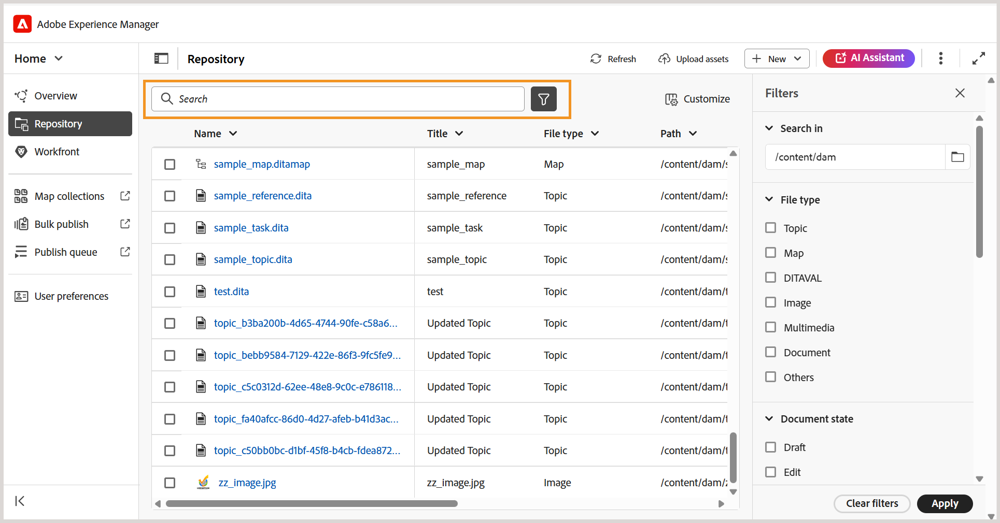
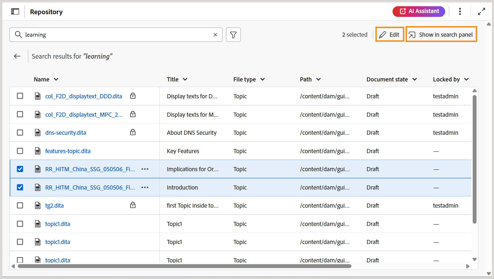

# Erfahren Sie mehr über die Repository-Oberfläche

Das Repository dient als zentralisierter Raum für eine verbesserte Auffindbarkeit von Ordnern und Dateien. Es bietet eine umfassende tabellarische Listenansicht von Ordnern und Dateien mit mehreren Spalten, die kontextuelle Details für alle Dateien und Assets bietet.

Diese einheitliche Benutzeroberfläche optimiert mehrere Funktionen, einschließlich der Erstellung neuer Dateien oder Ordner, der Bearbeitung von Dateien, dem Hochladen von Assets und der Suche nach Dateien mit robusten Filteroptionen, wodurch Effizienz und Benutzerfreundlichkeit gewährleistet sind.

Die Repository-Oberfläche ist in die folgenden Abschnitte unterteilt:

- Repository-Navigationsleiste
- Tabellenansicht des Repositorys

## Repository-Navigationsleiste

Die Repository-Navigationsleiste oben in der Repository-Oberfläche bietet schnellen Zugriff auf die aufgelisteten grundlegenden Aktionen.

- **Navigationsbereich für Ordner**: Zeigt eine hierarchische Baumansicht von Ordnern im Repository an, was eine nahtlose Navigation ermöglicht. In diesem Bedienfeld werden nur Informationen auf Ordnerebene angezeigt. Wenn ein Ordner von hier aus ausgewählt wird, werden sein Inhalt, seine Dateien und Unterordner in der Repository-Ansicht angezeigt. Sie können dieses Bedienfeld über das unten hervorgehobene Symbol ein- oder ausblenden.

  

- **Breadcrumbs**: Gibt den aktuellen Pfad innerhalb des Repositorys an und zeigt die Hierarchie der Ordner an, die zu Ihrem aktuellen Ordner führen. Sie können ihn auswählen, um zu einem bestimmten Ordner in der Hierarchie zurückzukehren.

  {width="650"}

- **Aktualisieren**: Aktualisiert das Repository, um die neuesten Änderungen zu berücksichtigen.
- **Assets hochladen**: Ermöglicht das direkte Hochladen von Assets in den aktuellen Ordner, wie in den Breadcrumbs hervorgehoben.
- **Neu**: Ermöglicht die Erstellung neuer Themen, Karten und Ordner innerhalb des aktuellen Ordners, wie in den Breadcrumbs hervorgehoben.
- **KI-Assistent**: Ein leistungsstarkes, von KI gesteuertes Tool, das Ihre Produktivität durch intelligente Hilfefunktionen steigert. Die Funktion [KI-](./ai-assistant.md)) ist derzeit nur für Adobe Experience Manager as a Cloud Service verfügbar.
- **Weitere Aktionen**: Bietet Zugriff auf zusätzliche Optionen. Durch Klicken auf diese Schaltfläche wird ein Menü mit den folgenden Optionen geöffnet:
   - **Assets**: Leitet Sie je nach Einrichtung zu einem Ziel.
      - **Cloud Services**: Wenn Sie Cloud Services verwenden, gelangen Sie durch Auswahl der Option **Assets** zur Seite &quot;AEM-Navigation“.
      - **On-Premise-Software**: Wenn Sie Adobe Experience Manager Guides (4.2.1 und höher) verwenden, gelangen Sie durch Auswahl der Option **Assets** zu Ihrem aktuellen Dateipfad in der Assets-Benutzeroberfläche.
   - **Workspace-Einstellungen**: Leitet Sie zum Dialogfeld **Workspace-Einstellungen**. Weitere Informationen finden Sie unter [Konfigurieren von Workspace-](../cs-install-guide/workspace-settings.md).
- **Ansicht erweitern**: Ermöglicht das Erweitern der Seitenansicht mithilfe des Symbols **Erweitern**. In dieser Ansicht ist die Kopfzeilenleiste ausgeblendet, wodurch der Inhaltsbereich maximiert wird. Um zur Standardansicht zurückzukehren, verwenden Sie das Symbol Erweiterte Ansicht beenden .

## Tabellenansicht des Repositorys

Das Repository dient als zentraler Bereich mit einer tabellarischen Liste aller Ordner und Dateien. Es bietet folgende Funktionen:

- **Anpassen**: Sie können die angezeigten Spalten mithilfe der Option **Anpassen** ändern, die sich oben rechts in der Repository-Ansicht befindet. Mit dieser Option können Sie eine beliebige Spalte ein- oder ausblenden und die Spalten bei Bedarf neu anordnen. Die **Name** oder **Title** sind obligatorisch und können nicht zusammen deaktiviert werden. Andere Felder wie **Dateityp**, **UUID**, **Dokumentstatus**, **Gesperrt von**, **Erstellt am** und **Geändert am** können bei Bedarf aktiviert oder deaktiviert werden. Sie können sie einfach per Drag-and-Drop neu anordnen.

  {width="350"}

- **Spaltengröße ändern**: Die Größe von Spalten kann durch Auswahl von Optionen aus dem Dropdown-Menü der Spalte geändert werden.

- **Sortierung**: Die Spalten Name, Titel, Erstellt am und Letzte Änderung unterstützen die Sortierung in auf- oder absteigender Reihenfolge, auf die über das Dropdown-Menü der Spalten zugegriffen werden kann.

- **Bearbeiten der Datei**:

   - Sie können eine oder mehrere Dateien zur Bearbeitung aus der Liste auswählen.
   - Nachdem Sie die gewünschten Dateien mithilfe des Kontrollkästchens ausgewählt haben **wird die Option** Bearbeiten“ in der oberen rechten Ecke der Repository-Ansicht verfügbar.
   - Wenn Sie **Bearbeiten** auswählen, wird die ausgewählte(n) Datei(en) in der Editor-Benutzeroberfläche geöffnet, wo Sie mit der Bearbeitung der Datei beginnen können.

     

- **Optionsmenü für Ordner**: Sie können die folgenden Aktionen mit dem **Optionen** für einen Ordner ausführen:

  {width="350"}

   - **Neu**: Erstellen Sie ein neues DITA-Thema, eine neue DITA-Karte oder einen neuen Ordner.
   - **Assets hochladen**: Laden Sie eine Datei aus Ihrem lokalen System in den ausgewählten Ordner im Repository hoch.
   - **Zu Sammlungen hinzufügen**: Fügt den ausgewählten Ordner zu den Favoriten hinzu. Sie können sie zu einer vorhandenen oder neuen Sammlung hinzufügen.
   - **Assets erneut verarbeiten**: Trigger verarbeiten die Verarbeitung für alle Assets im Ordner.

- **Optionsmenü für Dateien**: Sie können die folgenden Aktionen mithilfe des **Optionen**-Menüs für eine Datei ausführen:

  {width="350"}

   - **Bearbeiten**: Öffnen Sie die Datei zur Bearbeitung.
   - **In Sauerstoff bearbeiten**: Wählen Sie diese Option, um die ausgewählte Datei im Oxygen Connector-Plug-in zu bearbeiten.

     >[!NOTE]
     >
     >Wenden Sie sich an Ihr Customer Success-Team , um diese Funktion in der Umgebung aktivieren zu lassen. Dies ist nicht als Teil der vordefinierten Unterstützung aktiviert. Weitere Informationen finden Sie im Abschnitt [Konfigurieren der Option zur Bearbeitung in Oxygen](../cs-install-guide/conf-edit-in-oxygen.md) im Installations- und Konfigurationshandbuch.

   - **In Map-Konsole öffnen**: Falls die ausgewählte Datei eine DITA-Map ist, wird mit dieser Option die Map-Konsole geöffnet.
   - **Im Zuordnungs-Dashboard öffnen**: Wenn die ausgewählte Datei eine DITA-Zuordnung ist, wird durch diese Option das Zuordnungs-Dashboard geöffnet.
   - **Sperren**: Sperrt die ausgewählte Datei, damit sie bearbeitet werden kann.
   - **Vorschau**: Erhalten Sie eine schnelle Vorschau der Datei (.dita, .xml, Audio, Video oder Bild), ohne sie zu öffnen.
   - **Duplizieren**: Mit dieser Option erstellen Sie ein Duplikat oder eine Kopie der ausgewählten Datei.
   - **Verschieben nach**: Verwenden Sie diese Option, um die ausgewählte Datei in einen anderen Ordner zu verschieben.
   - **Umbenennen**: Verwenden Sie diese Option, um die ausgewählte Datei umzubenennen.
   - **Löschen**: Mit dieser Option können Sie die ausgewählte Datei löschen.
   - **Hinzufügen zu**: Wählen Sie diese Option, um zu Sammlungen oder wiederverwendbaren Inhalten hinzuzufügen.
   - **Kopieren**: Kopiert die UUID oder den vollständigen Pfad der Datei.
   - **Asset erneut verarbeiten**: Führt Trigger bei der Verarbeitung des ausgewählten Assets aus.
   - **Eigenschaften**: Hiermit öffnen Sie die Seite „Eigenschaften“ der ausgewählten Datei.
   - **Als PDF herunterladen**: Verwenden Sie die Option, um die PDF-Ausgabe zu generieren und herunterzuladen.

### Erlebnis suchen und filtern

Die **Suche** hilft bei der Suche nach den erforderlichen Dateien aus dem Repository hauptsächlich auf der Grundlage **Dateinamens**, **Dateinamens** und **Inhalts**. Sie können ein beliebiges, zwei oder alle drei Kriterien für Ihre Suche verwenden. Wenn keines der Kriterien ausgewählt ist, umfassen die Ergebnisse alle drei Kriterien.

Wählen Sie das Symbol **Filtersuche** \(\) aus, um den Filterbereich auf der rechten Seite zu öffnen.

Sie haben die folgenden Optionen, um die Dateien zu filtern und Ihre Suche einzugrenzen:

- **Suchen in**: Wählen Sie den Pfad aus, unter dem Sie die Dateien im Repository suchen möchten.

- **Dateityp**: Filtern Sie Ihre Suche nach einem bestimmten Dateityp. Die verfügbaren Optionen sind: **Topic**, **Map**, **DITAVAL**, **Image**, **Multimedia**, **Document** und **andere**.

- **Dokumentstatus**: Sie können Ihre Suche nach dem aktuellen Dokumentstatus der Dateien filtern. Die verfügbaren Filterwerte werden im Feld `repositoryFilters` des `ui_config.json file` definiert und sind mit dem aktuell verwendeten Ordnerprofil verknüpft.

  Das bedeutet:

   - Wenn Sie das globale Profil verwenden, werden die im globalen Profil konfigurierten Filterwerte angewendet.
   - Wenn Sie ein bestimmtes Ordnerprofil auswählen, werden die in diesem Profil definierten Filterwerte abgerufen.

  Die für den Dokumentstatus verfügbaren Standardfilterwerte sind: „Entwurf“, „Bearbeiten“, „In Überprüfung“, „Genehmigt“, „Überprüfen“ und „Fertig“. Details zum Anpassen von Filterwerten für Dokumentstatus finden Sie unter [Konfigurieren von Dokumentstatusfiltern](../cs-install-guide/config-doc-state-filters.md).

- **Gesperrt von**: Zeigt eine Liste von Benutzern an. Die Liste wird paginiert und asynchron geladen, sodass nur eine begrenzte Anzahl von Benutzern gleichzeitig angezeigt wird und beim Scrollen oder Navigieren mehr abgerufen wird. Dies verbessert die Ladegeschwindigkeit und die Gesamtleistung, insbesondere bei der Arbeit mit einer großen Anzahl von Benutzern.

- **Zuletzt geändert**: Filtern Sie den Inhalt nach dem Änderungsdatum. Wählen Sie einen Datumsbereich aus dem Kalender aus oder wählen Sie eine der folgenden Zeitrahmen-Optionen:
   - In letzter Woche
   - Im letzten Monat
   - Im letzten Jahr

- **Tags**: Filtern von Inhalten basierend auf Tags.

- **DITA-Elemente**: Filtern von Inhalten basierend auf verschiedenen DITA-Elementen.

Nachdem Sie alle erforderlichen Filter angewendet haben, wählen **Anwenden** in der rechten unteren Ecke des Bedienfelds „Filter“ aus.

Die Suchergebnisse, die entsprechend dem ausgewählten Filter angepasst wurden, werden nur als **tabellarische Liste von Dateien“ angezeigt** Ordner werden nicht angezeigt). Sie können jeden Filter einzeln oder mehrere Filter gleichzeitig entfernen. Die Ergebnisse werden aktualisiert, um die aktualisierte Auswahl anzuzeigen.

Nachdem die Suchergebnisse angezeigt wurden, können Sie entweder mehrere Dateien auswählen und diese im Editor über das Symbol **Bearbeiten** öffnen oder mit allen Ergebnissen arbeiten, indem Sie Ihre Suchergebnisse über die Option **Im Suchbereich anzeigen** an den Editor senden.

**Im Suchbereich anzeigen**

Die Option **Im Suchbereich anzeigen** wird verfügbar, nachdem eine Suche im Repository durchgeführt wurde. Mit dieser Funktion können Sie alle Suchergebnisse im **Suchbereich** im Editor anzeigen. Weitere Informationen finden Sie unter [Suchbereich](./search-panel-explorer.md).

