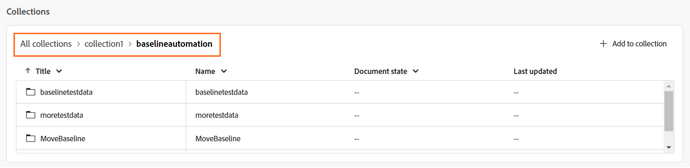
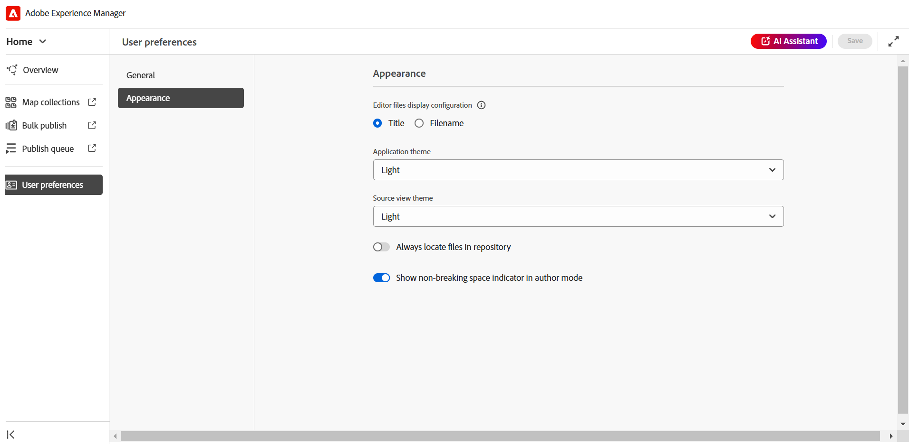

# Experience Manager Guides-Startseitenerlebnis

Die Startseite ist der erste Bildschirm, der beim Anmelden bei Experience Manager Guides angezeigt wird. Es bietet Ihnen ein einheitliches und intuitives Willkommenserlebnis, einschließlich einer schnellen Ansicht der Dateien, auf die Sie zuletzt zugegriffen haben, Sammlungen und mehr.

{width="800" align="left"}

Die Experience Manager Guides-Startseite ist in die folgenden Abschnitte unterteilt:

- Kopfzeilenleiste
- Navigationsleiste
- Linkes Bedienfeld

## Kopfzeilenleiste

Die Kopfzeilenleiste ist die obere Leiste der Startseite, auf der das Adobe Experience Manager-Logo angezeigt wird (oder eine Unified Shell, wenn Sie Unified Shell als Experience Manager Guides-Benutzeroberfläche verwenden). Wenn Sie das Logo auswählen, werden Sie zur Experience Manager-Navigationsseite weitergeleitet.

{width="800" align="left"}

## Navigationsleiste

Die Navigationsleiste enthält Tools zum Umschalten der Navigation, zum Anpassen des Übersichts-Layouts und zum Anpassen der Seitenansicht. Außerdem wird das aktuell verwendete Ordnerprofil angezeigt.

>[!NOTE]
>
> Bei Verwendung der Adobe Experience Manager Guides as a Cloud Service wird eine zusätzliche Funktion mit der Bezeichnung **KI** Assistent) in der Navigationsleiste angezeigt.

{width="800" align="left"}

In der Navigationsleiste verfügbare Funktionen werden wie folgt erläutert:

- **Navigationsumschalter**: Ermöglicht die nahtlose Navigation zu anderen Seiten:
   - **Startseite**: Die Standardseite, die Sie beim Anmelden bei Experience Manager Guides anzeigen.
   - **Editor**: Ein benutzerfreundlicher Web-basierter Editor, mit dem Sie strukturierte Dokumente in Experience Manager Guides erstellen und verwalten können. [Erfahren Sie mehr über die Benutzeroberfläche des Editors](./web-editor.md).
   - **Map-Konsole**: Bietet einen dedizierten Arbeitsbereich für alle Aspekte der Kartenverwaltung und -veröffentlichung. [Kennenlernen der Benutzeroberfläche der Map-Konsole](./map-console-overview.md).
- **KI-Assistent**: Ein leistungsstarkes, von KI gesteuertes Tool, das Ihre Produktivität durch intelligente Hilfefunktionen steigert. Darüber hinaus können Sie beim Arbeiten in der Editor-Benutzeroberfläche die intelligenten Authoring-Funktionen des KI-Assistenten nutzen, die Ihren Authoring-Prozess durch intelligente Vorschläge für die Wiederverwendung und Optimierung von Inhalten intelligenter und schneller machen.

  Die Funktion [KI-](./ai-assistant.md)) ist derzeit nur für Adobe Experience Manager as a Cloud Service verfügbar.
- **Übersichtsabschnitt anpassen**: Ermöglicht das Ausblenden oder Anzeigen der Widgets im Abschnitt Widgets .
- **Ordnerprofil in Verwendung**: Zeigt das Ordnerprofil an, das derzeit verwendet wird.
- **Ansicht erweitern**: Ermöglicht das Erweitern der Seitenansicht mithilfe des Symbols **Erweitern**. In dieser Ansicht ist die Kopfzeilenleiste ausgeblendet, was den Inhaltsbereich maximiert. Um zur Standardansicht zurückzukehren, verwenden Sie das Symbol **Erweiterte Ansicht beenden**.

## Linkes Bedienfeld

Das linke Bedienfeld bietet schnellen Zugriff auf die Funktionen „Übersicht“, „Sammlungen zuordnen“, „Massenveröffentlichung“, „Veröffentlichungswarteschlange“ und „Benutzereinstellungen“. Sie können das Bedienfeld erweitern, indem Sie **Symbol &quot;**&quot; in der linken unteren Ecke der Benutzeroberfläche auswählen. Verwenden Sie nach dem Erweitern das Symbol **Reduzieren**, um das Bedienfeld zu reduzieren.

{width="300" align="left"}

Was Sie in diesem Bedienfeld anzeigen, hängt von Ihrer Benutzerrolle ab. In der folgenden Tabelle sind die Rollen und die entsprechenden Abschnitte aufgeführt, die im linken Bereich angezeigt werden.

- **Admin und Publisher**: Die Möglichkeit, alle Abschnitte im Bedienfeld anzuzeigen.
- **Autor**: Die Möglichkeit, alle Abschnitte mit Ausnahme der Veröffentlichung anzuzeigen. Autoren haben keinen Zugriff auf die Abschnitte „Zuordnungssammlungen“, „Veröffentlichungswarteschlange“ und „Massenveröffentlichung“.
- **Reviewer**: Die Möglichkeit, nur den Abschnitt „Übersicht“ anzuzeigen. Wenn Sie den Abschnitt Übersicht auswählen, wird entweder eine standardmäßige leere Statusmeldung oder das Workfront-Aufgaben-Widget angezeigt, je nachdem, ob Adobe Workfront konfiguriert ist.

Die im linken Bedienfeld verfügbaren Funktionen werden wie folgt erläutert:

- [Überblick](#overview)
- [Sammlungen zuordnen](#map-collections)
- [Massenveröffentlichung](#bulk-publish)
- [Veröffentlichungswarteschlange](#publish-queue)
- [Benutzervoreinstellungen](#user-preferences)

>[!NOTE]
>
> Wenn Ihr Administrator die Adobe Workfront-Integration im System konfiguriert hat, wird außerdem eine Option **Workfront** im linken Bereich angezeigt. Erfahren Sie mehr über die Integration von [Adobe Workfront](./workfront-integration.md) in Experience Manager Guides.

### Überblick

**Übersicht** Funktioniert wie ein personalisiertes Dashboard, das zur Steigerung der Produktivität entwickelt wurde. Es bietet verschiedene Widgets, die Ihnen helfen, organisiert und fokussiert zu bleiben.

Die Widgets bieten auch Optionen zum Sortieren und Ändern der Spaltengröße. Um diese Optionen anzuzeigen, wählen Sie die Spaltenüberschrift aus und die Optionen werden in einer Liste angezeigt.

Die folgenden Widgets sind im Abschnitt Widgets vorhanden:

- **Letzte Dateien**: Das Widget bietet Ihnen einen Schnappschuss der zuletzt geöffneten Dateien (eine Liste der Dateien, auf die Sie im Editor zugegriffen haben) zusammen mit den wichtigsten Dateidetails, einschließlich Titel, Dateiname, Dateityp, Dateipfad und Datum, auf das zugegriffen wurde.

  {width="800" align="left"}

  Sie können die Spalten sortieren und in der Größe ändern, indem Sie Optionen aus dem Dropdown-Menü Spalte auswählen. Standardmäßig werden die Daten nach Datum und Uhrzeit des letzten Zugriffs sortiert.

  {width="800" align="left"}

  Unter [Benutzereinstellungen](#user-preferences) können Sie die maximale Anzahl von Dateien festlegen, die in diesem Widget angezeigt werden können. Standardmäßig ist dieser Grenzwert auf **20** festgelegt.

  Die folgenden Optionen sind verfügbar, wenn Sie den Mauszeiger über eine Datei bewegen:

   - **Im Editor öffnen**: Ermöglicht das Öffnen der Datei im Editor. Sie können eine Datei auch öffnen, indem Sie sie einfach auswählen.
   - **Anheften/Entfernen**: Ermöglicht das Anheften einer oder mehrerer Dateien an das Widget Letzte Dateien. Angeheftete Dateien werden oben in der Widget-Liste angezeigt. Um eine Datei zu lösen, verwenden Sie die Option **Loslösen**.
   - **Entfernen**: Ermöglicht das Entfernen der Datei aus dem Widget Letzte Dateien.

  **Erstellen einer neuen Datei aus dem Dropdown-Menü „Neue Datei“**

  Das **Neue Datei** Dropdown-Menü ermöglicht es Ihnen, direkt über das Widget **Letzte Dateien** ein Thema oder eine DITA-Zuordnung zu erstellen. Nach erfolgreicher Dateierstellung werden Sie zur Editor-Oberfläche weitergeleitet, in der Sie die Datei bearbeiten können.

- **Sammlungen**: Wenn Sie an einem Satz von Dateien oder Ordnern arbeiten, können Sie diese zu diesem Widget hinzufügen, um schnell darauf zuzugreifen. Nach dem Hinzufügen können Sie die Dateien nach Titel zusammen mit anderen wichtigen Details wie Inhaber und Erstellt am anzeigen. Wenn Sie das Dropdown-Menü für die Spalte auswählen, können Sie die Optionen zum Sortieren und Ändern der Größe der Spalte anzeigen.

  {width="800" align="left"}

  Die Breadcrumbs der ausgewählten Sammlung werden oben im Sammlung -Widget angezeigt. Sie können ihn auswählen, um zu einem bestimmten Ordner in der Hierarchie zurückzukehren.

  {width="800" align="left"}

  Die folgenden Optionen sind verfügbar, wenn Sie den Mauszeiger über eine Sammlung bewegen und auf das Symbol Mehr :

   - **Umbenennen**: Ermöglicht das Umbenennen der Sammlung.
   - **Löschen**: Hiermit können Sie die Sammlung löschen.
   - **In Assets-Benutzeroberfläche anzeigen**: Ermöglicht das Öffnen der Sammlung in der Assets-Benutzeroberfläche.

  Sie können eine Sammlung öffnen, indem Sie auf den Sammlungstitel klicken. Die folgenden Optionen sind verfügbar, wenn Sie den Mauszeiger über eine Sammlungsdatei bewegen und auf das Symbol Mehr :

   - **Im Editor öffnen**: Ermöglicht das Öffnen der Datei im Editor. Alternativ können Sie den Dateititel auswählen, um die Datei zu öffnen.
   - **In Map-Konsole öffnen**: Ermöglicht das Öffnen der Map-Datei in der Map-Konsole. (Nur für DITA-Zuordnungsdateien verfügbar).
   - **Zu Sammlungen hinzufügen**: Ermöglicht das Hinzufügen der Datei zu einer neuen oder vorhandenen Sammlung.
   - **Aus Sammlungen entfernen**: Ermöglicht das Entfernen der Datei aus der Sammlungsliste.
   - **In Assets-Benutzeroberfläche anzeigen**: Ermöglicht es Ihnen, die Datei in der Assets-Benutzeroberfläche zu finden.

  **Erstellen einer neuen Sammlung über das Dropdown-Menü „Neue Sammlung“**

  Das **Neue Sammlung** Dropdown-Menü ermöglicht es Ihnen, eine neue Sammlung zu erstellen und sie zum Widget **Sammlungen** hinzuzufügen.

>[!NOTE]
>
> Wenn Ihr Administrator die Adobe Workfront-Integration im System konfiguriert hat, wird **Widget „Ihre**&quot; auch im Abschnitt „Widgets“ angezeigt. Weitere Informationen zur Integration von [Adobe Workfront](./workfront-integration.md#working-with-the-your-tasks-widget) in Experience Manager Guides.

### Zuordnen von Sammlungen

Experience Manager Guides bietet Ihnen die Möglichkeit, Ihre Inhalte für die Veröffentlichung mithilfe eines Dashboards namens &quot;**&quot;** organisieren. Um diese Funktion zu verwenden, wählen **Sammlungen zuordnen** im linken Bereich aus. Dadurch gelangen Sie zur Seite „Zuordnungssammlungen“ in der **Assets-Benutzeroberfläche** wo Sie [Zuordnungssammlung für die Ausgabegenerierung verwenden können.](./generate-output-use-map-collection-output-generation.md)

### Massenveröffentlichung

Mit der Massenaktivierungsfunktion können Sie Ihre Inhalte schnell und einfach von der Authoring- zur Publishing-Instanz aktivieren. Um diese Funktion zu verwenden, wählen **im linken** die Option „Massenveröffentlichung“ aus. Sie gelangen zur Seite für Massenaktivierungssammlungen in der Assets-Benutzeroberfläche, auf der Sie „Massenaktivierung [ veröffentlichten Inhalte“ erstellen und verwalten ](./conf-bulk-activation.md).

### Veröffentlichungswarteschlange

Wenn auf Ihrem System eine große Anzahl von Veröffentlichungsaufgaben ausgeführt wird, ist es praktisch unmöglich, jede DITA-Map einzeln zu überprüfen, um die Veröffentlichungsaufgabe zu überwachen. Experience Manager Guides bietet Admins und Publishern eine einheitliche Ansicht aller im System ausgeführten Veröffentlichungsaufgaben.

Um diese Funktion zu verwenden, wählen **im linken Bereich** Veröffentlichungswarteschlange“ aus. Dadurch gelangen Sie zur Seite „Dashboard veröffentlichen“ in der Assets-Benutzeroberfläche, auf der Sie [Veröffentlichungsaufgaben mithilfe des Veröffentlichungs-Dashboards verwalten](./generate-output-publish-dashboard.md).

### Benutzervoreinstellungen

Die Benutzereinstellungen stehen allen Autoren zur Verfügung. Über die Voreinstellungen können Sie die folgenden Einstellungen konfigurieren:

- **Allgemein** Auf der Registerkarte Allgemein können Sie die folgenden Einstellungen konfigurieren:

  {width="800" align="left"}

   - **Ordnerprofil**: Das Ordnerprofil steuert verschiedene Konfigurationen im Zusammenhang mit bedingten Attributen, Autorenvorlagen, Ausgabevorgaben und Editor-Konfigurationen. Das globale Profil wird standardmäßig angezeigt. Wenn Ihr Administrator Ordnerprofile im System konfiguriert hat, werden diese Ordnerprofile außerdem in der Liste Ordnerprofile angezeigt.
   - **Basispfad**: Wenn Sie über den Editor auf das Experience Manager Guides-Repository zugreifen, werden Ihnen standardmäßig Assets über den Speicherort /content/dam angezeigt. Ihr Arbeitsordner würde höchstwahrscheinlich aus einigen Ordnern im Ordner /content/dam/ bestehen. Sie können den Basispfad zu Ihrem Arbeitsordner festlegen und die Repository-Ansicht zeigt Ihnen dann den Inhalt von diesem Speicherort im Voraus an. Dadurch wird die Zeit für den Zugriff auf den Arbeitsordner verkürzt. Wenn Sie einen Verweis oder eine Mediendatei in Ihr Thema einfügen, beginnt der Dateispeicherort außerdem mit dem Ordner, der im Basispfad festgelegt ist.
      - **Stammzuordnung auswählen**: Wählen Sie eine DITA-Zuordnungsdatei aus, um Schlüsselverweise oder Glossareinträge aufzulösen. Die ausgewählte Stammzuordnung hat die höchste Priorität, um Schlüsselverweise aufzulösen. Weitere Informationen finden Sie unter [Schlüsselverweise auflösen](./map-editor-other-features.md).
      - **Maximale Anzahl aktueller Dateien**: Verwenden Sie dieses Feld, um eine maximale Anzahl von Dateien festzulegen, die im Widget „Letzte Dateien“ angezeigt werden.
      - **Standardverhalten beim Öffnen von Karten festlegen**: Hier können Sie das Standardverhalten auswählen, dem das System beim Öffnen einer DITA-Zuordnungsdatei folgen soll.

- **Erscheinungsbild**: Die Registerkarte Erscheinungsbild bietet Ihnen die Optionen zum Auswählen der Designs für die Anwendung und der Quellansicht des Inhaltsbearbeitungsbereichs. Verwenden Sie diese Registerkarte, um die folgenden Einstellungen zu konfigurieren:

  {width="800" align="left"}

   - **Anzeigekonfiguration für Editor-Dateien**: Wählen Sie die Standardmethode zum Anzeigen der Dateien im Editor aus. Sie können die Liste der Dateien anhand der Titel oder Dateinamen aus den verschiedenen Bedienfeldern in der Autorenansicht anzeigen. Standardmäßig werden die Dateien nach Titel im Editor angezeigt.
   - **Anwendungsdesign und Source-Ansicht**: Sie können aus den Hell- oder Dunkeldesigns für die Anwendungs- und Quellansicht wählen. Beim Design „Licht“ verwenden die Symbolleisten und Bereiche einen hellgrauen Hintergrund. Beim dunklen Design verwenden die Symbolleisten und Bereiche einen schwarzen Hintergrund. Wählen Sie **Gerät verwenden** aus, damit Experience Manager Guides helle und dunkle Designs basierend auf dem Design Ihres Geräts auswählen kann.

     Bei allen Designs wird der Inhaltsbearbeitungsbereich in der Autorenansicht mit weißem Hintergrund angezeigt.

   - **Dateien immer im Repository suchen**: Wählen Sie diese Option, um den Speicherort einer Datei im Repository anzuzeigen, während sie im Editor bearbeitet wird.
   - **Anzeige einer Leertaste ohne Unterbrechung im Autorenmodus anzeigen**: Wählen Sie diese Option, um einen Indikator für die Leerzeichen ohne Unterbrechung beim Bearbeiten im Editor anzuzeigen. Sie ist standardmäßig aktiviert.
