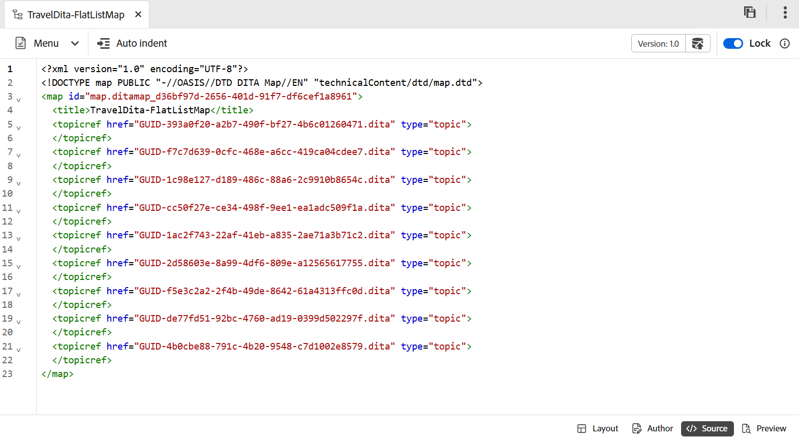

# Funktionen des Zuordnungs-Editors {#id1942D0S0IHS}

Die Symbolleiste im Zuordnungs-Editor ähnelt dem Themen-Editor. Grundlegende Vorgänge wie das Umschalten des linken Bedienfelds, das Speichern der Zuordnung, das Erstellen einer neuen Version der Zuordnung, das Rückgängigmachen/Wiederholen des letzten Vorgangs und das Löschen der ausgewählten Elemente sind in beiden Editoren häufig. Weitere Informationen zur Funktionsweise dieser Vorgänge finden Sie im Abschnitt [Kennen Sie die Editor](web-editor-features.md#)-Funktionen.

Die Optionen, die Sie in der Editor-Symbolleiste anzeigen, basieren auf der Ansicht des Zuordnungs-Editors. Im Karten-Editor stehen vier Ansichten zur Verfügung:

- [Layout](#layout-view)
- [Author](#author-view)
- [Quelle](#source-view)
- [Vorschau](#preview)

In den folgenden Abschnitten werden die Symbolleistenoptionen beschrieben, die in den verschiedenen Ansichten des Zuordnungs-Editors verfügbar sind:

## Layout-Ansicht

Wenn Sie eine Karte zur Bearbeitung öffnen, wird die Layout-Ansicht des Karten-Editors geöffnet. Die Layout-Ansicht zeigt die Zuordnungshierarchie in einer Baumansicht an und ermöglicht es Ihnen, die Themen in einer Zuordnung zu organisieren.

>[!NOTE]
>
> In der Layout-Ansicht werden nur die Verweise angezeigt, die in einer Zuordnung vorhanden sind. Wenn Referenzen beschädigt sind, wird links neben der Referenz ein kleines Kreuz-Symbol angezeigt

Die folgenden Optionen sind in der Symbolleiste der Layout-Ansicht verfügbar:

**Themenreferenz** - 

Zeigt den Dialog für die Themensuche an. Navigieren Sie zu der Themen-/Zuordnungsdatei, die Sie einfügen möchten, und wählen Sie **Auswählen** aus, um sie der Zuordnung hinzuzufügen.

{width="800" align="left"}

**Themengruppe** - 

Fügen Sie das `topicgroup` ein. Weitere Informationen zur Gruppierung von Themen finden Sie in der Dokumentation [Themengruppe](https://docs.oasis-open.org/dita/v1.0/langspec/topicgroup.html) in der OASIS DITA Language Specification.

**Schlüsseldefinition** - 

Zeigt das Dialogfeld Keydef einfügen an. Verwenden Sie dieses Dialogfeld, um eine beliebige Schlüsseldefinition zu definieren, die Sie in der Zuordnung verwenden möchten.

{width="300" align="left"}

**Einfügen vor/Einfügen nach** - /

Zeigt das Dialogfeld Element einfügen an. Wählen Sie das Element aus, das Sie in die Zuordnung einfügen möchten. Je nach Vorgang wird das neue Element vor oder nach dem aktuellen Element in der Zuordnung eingefügt.

**Vordere Materie einfügen** - 

Dieses Symbol wird angezeigt, wenn Sie eine Bookmap zur Bearbeitung öffnen. Sie können Komponenten wie ein Inhaltsverzeichnis, einen Index und eine Liste von Tabellen am Anfang des Buches einfügen.

**Einfügen der Hintergrundmaterie** - 

Dieses Symbol wird angezeigt, wenn Sie eine Bookmap zur Bearbeitung öffnen. Sie können Komponenten für am Ende des Buches wie einen Index, ein Glossar und eine Liste von Figuren einfügen.

**Verschiebt das ausgewählte Element nach links/rechts** - /

Wählen Sie den Pfeil nach links aus, um das Thema in der Hierarchie nach links zu verschieben. Dadurch wird das jeweilige Thema in der Hierarchie wesentlich um eine Ebene nach oben gefördert. Wenn Sie beispielsweise bei Auswahl eines untergeordneten Themas den Pfeil nach links auswählen, wird das Thema zum gleichrangigen Thema über dem Thema. Wenn Sie den Pfeil nach rechts auswählen, wird das Thema ebenfalls nach rechts verschoben, wodurch es zum untergeordneten Thema des darüber liegenden Themas wird.

**Verschiebt das ausgewählte Element nach oben/unten**  - / 

Wählen Sie die Pfeile nach oben oder unten aus, um das Thema in der Hierarchie nach oben oder unten zu verschieben.

>[!NOTE]
>
> Sie können die Verweise auch per Drag-and-Drop in eine Karte verschieben.

**Sperren/Entsperren**

Ruft eine Sperre für die Zuordnungsdatei ab und löst die Sperre. Wenn Sie ungespeicherte Änderungen in Ihrer Zuordnungsdatei haben, werden Sie zum Zeitpunkt der Aufhebung der Sperre aufgefordert, die Zuordnungsdatei zu speichern. Die Änderungen werden in der aktuellen Version der Zuordnungsdatei gespeichert.

**Zusammenführen** - 

Weitere Informationen zum Zusammenführen von Inhalten aus einer anderen Version derselben oder einer anderen Datei finden Sie unter [Zusammenführen](web-editor-features.md#menu-dropdown) im Editor.

**Versionsverlauf** - 

Überprüfen Sie die verfügbaren Versionen und Beschriftungen für Ihr aktives Thema und stellen Sie eine Version aus dem Editor selbst wieder her.

**Versionsbezeichnung** - 

Zeigt das Dialogfeld Versionsbezeichnung-Verwaltung an. Wählen Sie eine Version aus der Dropdown-Liste aus. Wählen Sie die Bezeichnung aus, die Sie auf die ausgewählte Version anwenden möchten, und wählen Sie **Bezeichnung hinzufügen** aus, um sie hinzuzufügen.

**Dateiname anzeigen**

Zeigt den Dateinamen der Titel der Themen an.

>[!NOTE]
>
> Wenn Sie den Mauszeiger über den Titel eines Themas bewegen, wird der Dateipfad angezeigt.

**Zeilennummern anzeigen**

Blendet die Zeilennummer für jedes Thema ein oder aus. Die Zeilennummern werden je nach Ebene in der Hierarchie angezeigt.

**Kontrollkästchen anzeigen**

Blendet für jedes Thema ein Kontrollkästchen ein oder aus. Sie können das Kontrollkästchen verwenden, um das/die Thema(e) auszuwählen und mithilfe des Menüs Optionen verschiedene Aufgaben auszuführen.

**Optionsmenü in der Layout-Ansicht**

Neben der Organisation von Themen in der Zuordnungsdatei können Sie auch die folgenden Aktionen über das Optionsmenü ausführen, das beim Bewegen des Mauszeigers über eine Datei oder beim Rechtsklicken im Editor in der Layout-Ansicht angezeigt wird:

{width="650" align="left"}

- **Hinzufügen**: Im Zuordnungs-Editor können Sie ein neues Thema oder eine leere Referenz hinzufügen:
   - **Leere Referenz**: Mit dieser Option können Sie eine leere Referenz in Ihre DITA-Zuordnung einfügen. Sie können später auf den eingefügten leeren Verweis doppelklicken und die Themendetails hinzufügen.
   - **Neues Thema**: Wenn Sie im Menü ein neues Thema erstellen, wird das Dialogfeld **Neues Thema** angezeigt. Geben Sie im Dialogfeld **Neues Thema** die erforderlichen Details ein und wählen Sie **Erstellen**.
- **Verschieben**: Sie können ein Thema in der Hierarchie nach oben/unten/rechts/links verschieben. Sie können auch ein Thema oder eine Karte aus dem Repository-Bereich auf die im Karten-Editor geöffnete Karte ziehen und dort ablegen.
- **Rückgängig**: Macht den letzten Vorgang in der Layout-Ansicht rückgängig.
- **Wiederholen**: Wiederholt den letzten Vorgang in der Layout-Ansicht.
- **Kopieren**: Kopiert den ausgewählten Verweis aus der Zuordnungsdatei.

  >[!NOTE]
  >
  > Sie können die Kontrollkästchen anzeigen und aktivieren, um mehrere Verweise zu kopieren.

- **Einfügen**: Einfügen der kopierten Verweise an der aktuellen Position in der Hierarchie.
- **Löschen**: Löscht die ausgewählten Verweise aus der Zuordnungsdatei.

  >[!NOTE]
  >
  > Sie können mehrere Verweise anzeigen und dann die Kontrollkästchen aktivieren, um sie zu löschen.

**Anzeigen von Themen basierend auf bedingten Filtern**

Wenn Sie Bedingungen auf ein Thema angewendet haben, wird rechts neben dem Thema ein Filtersymbol angezeigt. Wenn Sie den Mauszeiger über ein Filtersymbol bewegen, werden die angewendete Bedingung und ihr Attributwert angezeigt.

## Autorenansicht

Die **Autor**-Ansicht ermöglicht es Ihnen, Ihre DITA-Karte im Editor zu bearbeiten. Hier wird die WYSIWYG-Ansicht des Karten-Editors angezeigt. Einige der in der Autorenansicht angezeigten Symbole sind mit der Layout-Ansicht identisch.

{width="800" align="left"}

Darüber hinaus können Sie die folgenden Symbole anzeigen und die zugehörigen Aufgaben von der Autorenansicht aus ausführen:

**Einfügen vor/Einfügen nach** - /

Zeigt das Dialogfeld **Element vor oder **Element nach einfügen“ an. Wählen Sie das Element aus, das Sie in die Zuordnung einfügen möchten. Je nach Vorgang wird das neue Element vor oder nach dem aktuellen Element in der Zuordnung eingefügt.

**Element** - 

Zeigt das Dialogfeld **Element einfügen** an. Wählen Sie das Element aus, das Sie einfügen möchten. Sie können die Tastatur verwenden, um durch die Liste der Elemente zu scrollen, und die Eingabetaste drücken, um das gewünschte Element einzufügen. Alternativ können Sie das Element auswählen, um es in die Karte einzufügen.

<!-----------------------------------------------------------

**Relationship table** - 

Inserts a relationship table in the map.

Perform the following steps to work with relationship tables in the Basic Map Editor:

1.  In the Assets UI, navigate to the DITA map in which you want to create the relationship table.

1.  Select the DITA map to open it in DITA map console.

1.  Select the **Topics** tab to view a list of topics available in the DITA map.

    >[!TIP]
    >
    > The Topics tab gives you an option to download the map file with its dependents. For more details, view [Export a DITA map file](authoring-download-assets.md#id218UBA00IXA).

1.  In the main toolbar, select **Edit**.

    The map file is opened in the Advanced Map Editor.

1.  Select **Reltable** from the toolbar.

    {width="650" align="left"}

1.  Drag-and-drop topics from the topic list to the Reltable editor.

    >[!NOTE]
    >
    > You can add topics from any folder in the References rail.

    {width="550" align="left"}

1.  To add a header to your relationship table, click **Add Relheader**.

1.  To add a column to your relationship table, click **Add a Column**.

    {width="550" align="left"}

1.  Click **Save**.

You can also perform the following actions from the relationship table editor:

**Delete rows or columns**

If you want to delete a column from your table, select the checkbox in the column header and click Delete. If you want to remove a row from table, select the checkbox in the first column of the respective row and click Delete.

**Delete a topic**

If you want to delete a topic from your table, click the cross icon next to the topic.

**Delete the relationship table**

If you want to delete the relationship table, click anywhere outside the relationship table and click Delete. For details, view [Work with relationship tables in the Map Editor](map-editor-basic-map-editor.md).
----->

**Wiederverwendbarer Inhalt** - 

Zeigt das Dialogfeld **Inhalt wiederverwenden** an. Verwenden Sie dieses Dialogfeld, um den Inhalt, den Sie wiederverwenden möchten, in Ihre Karte einzufügen.

**Navigationstitelattribut aktualisieren** - 

Synchronisiert das `title` einer referenzierten Datei in einer Zuordnung mit dem in ihrem `@navtitle` angegebenen Wert. Sie können einer Zuordnung verschiedene Arten von Referenzdateien hinzufügen, z. B. Themen-, Referenz-, Aufgaben-, \(Unter\)-Zuordnungen usw. Die meisten dieser Dateien unterstützen das `@navtitle`. Wenn eine Datei das Attribut `@navtitle` enthält, wird das Attribut `@navtitle` für dieselbe Datei in der Zuordnung aktualisiert. Falls das `@navtitle` nicht vorhanden ist, wird das `@navtitle`-Attribut zu dieser Referenzdatei hinzugefügt und seine `title` wird ebenfalls aktualisiert, um die `@navtitle` anzuzeigen.

>[!NOTE]
>
> Ihr Administrator kann das automatische Hinzufügen `@navtitle` Attributs zu jeder Referenzdatei konfigurieren, die Sie einer Zuordnung hinzufügen. Weitere Informationen zum Konfigurieren des automatischen Hinzufügens `@navtitle` Attributs finden Sie unter *und Konfigurieren von Adobe Experience Manager Guides* as a Cloud Service unter (Attribut standardmäßig @navtitle einschließen).

Wählen Sie das Symbol Navigationstitelattribut aktualisieren aus, um die Werte des `title`- und `@navtitle`-Attributs zu synchronisieren.

**Tags**

Blendet die XML-Tags ein oder aus. Die Tags dienen als visuelle Hinweise auf die Begrenzung eines Elements. Wenn Sie in diesem Modus einen Topic/Map-Verweis einfügen möchten, ziehen Sie die gewünschte Datei per Drag-and-Drop vor oder nach dem Tag. Die horizontale Leiste wird im Tag-Ansichtsmodus nicht angezeigt.

**Änderungen verfolgen** - 

Sie können alle Aktualisierungen in der Zuordnungsdatei verfolgen, indem Sie den Modus Änderungen verfolgen aktivieren. Nach der Aktivierung der Tracking-Änderungen werden alle Einfügungen und Löschungen im Dokument erfasst. Weitere Informationen finden Sie unter [Änderungen verfolgen](web-editor-features.md#track-changes) im Editor.

**Prüfungsaufgabe erstellen** - 

Sie können eine Prüfungsaufgabe des aktuellen Themas oder der Zuordnungsdatei direkt im Editor erstellen. Öffnen Sie die Datei, für die Sie die Prüfungsaufgabe erstellen möchten, und wählen Sie **Prüfungsaufgabe erstellen** aus, um den Erstellungsprozess der Überprüfung zu starten. Befolgen Sie die Anweisungen unter [Einführung zur Überprüfung](review.md#) für weitere Details.

## Source-Ansicht

Diese Ansicht ermöglicht die Bearbeitung von Inhalten im Rohformat und bietet vollständige Kontrolle über die Struktur und Formatierung.

{width="800" align="left"}

In dieser Ansicht bietet die Symbolleiste grundlegende Optionen zum Bearbeiten und Einfügen von Inhalten, die im Dropdown-Menü **Menü** verfügbar sind, einschließlich Ausschneiden, Kopieren, Rückgängig, Wiederholen, Löschen, Suchen und Ersetzen, Versionsbezeichnung, Zusammenführen, Als neue Version speichern, Sperren und Entsperren.

## Vorschau

Der Vorschaumodus rendert den Inhalt so, wie er in der endgültigen Ausgabe angezeigt wird, sodass Sie das Layout und die Formatierung vor der Veröffentlichung überprüfen können.

Um die Position jeder Themendatei innerhalb einer Karte anzeigen zu können, ist es wünschenswert, den Karteninhalt in einem aufeinander folgenden Fluss anzuzeigen. Mit der Kartenvorschau-Funktion können Sie den gesamten Inhalt der Kartendatei mit einem Klick anzeigen. Sie müssen keine Ausgabe der Zuordnungsdatei generieren, um zu sehen, wie die gesamte Zuordnung nach der Veröffentlichung aussieht. Sie können einfach auf die Vorschau der Karte zugreifen und alle Themen und Unterkarten werden in Form eines Buches gerendert.

{width="800" align="left"}

>[!NOTE]
>
> In der Symbolleiste sind im Vorschaumodus keine Optionen zum Bearbeiten oder Einfügen von Inhalten verfügbar. Inhalte können in dieser Ansicht nicht bearbeitet werden. Sie können jedoch die Funktionen **Als neue Version speichern** und **Sperren** oder **Entsperren** verwenden.

Im Vorschaumodus können Sie die folgenden zusätzlichen Aufgaben ausführen:

- Klicken Sie mit der rechten Maustaste auf ein Thema und wählen Sie **Bearbeiten**, um das Thema zur Bearbeitung in einer neuen Registerkarte zu öffnen.

  >[!NOTE]
  >
  > Wenn Sie keine Bearbeitungsrechte haben, wird das Thema im schreibgeschützten Modus geöffnet.

- Wechseln Sie zum gewünschten Thema, indem Sie den Thementitel in der Zuordnungsstruktur \(im linken Bereich\) auswählen.

- Das aktuelle Thema in der Kartenvorschau ist auch in der Kartenstruktur hervorgehoben.

**Andere Möglichkeiten, eine Zuordnungsdatei in der Vorschau anzuzeigen**

Sie können auf die Vorschau einer Karte zugreifen über:

- **Benutzeroberfläche von Assets**: Navigieren Sie in der Benutzeroberfläche von Assets zum Speicherort der Zuordnung, wählen Sie die Zuordnungsdatei aus und wählen Sie **Vorschau der Zuordnung** in der Symbolleiste aus. Die Vorschau der Karte wird auf einer neuen Registerkarte angezeigt. Sie können den Inhalt aller Themen im Vorschaumodus anzeigen. In dieser Ansicht können Sie kein Thema bearbeiten.

  >[!NOTE]
  >
  > Wenn die *Vorschau der Karte* Option in der Hauptsymbolleiste nicht sichtbar ist, wurde sie möglicherweise unter das Symbolleistenmenü **Mehr** verschoben.

- **Karten-Editor**: Wählen Sie im Karten-Editor **Vorschau** aus dem Menü „Optionen“ aus, um die Vorschau der aktuellen Karte anzuzeigen.

  {width="650" align="left"}

  Die Vorschau der Karte wird in einem Popup-Fenster angezeigt.

  {width="500" align="left"}

**Eigenschaften zuordnen**

Zeigt das Dialogfeld Zuordnungseigenschaften an, in dem Sie die Attribute und Metadateninformationen für die Zuordnung festlegen können.

## Themen über DITA-Map bearbeiten {#id17ACJ0F0FHS}

Das Bearbeiten eines einzelnen Themas gibt dem Autor nicht den vollständigen Kontext. Ein Autor hätte keine Informationen darüber, wo ein Thema in einer DITA-Karte platziert ist. Ohne diese kontextuellen Informationen wird es für Autoren ein wenig schwierig, Inhalte zu erstellen.

Mit Experience Manager Guides können Autorinnen und Autoren eine DITA-Karte im Editor öffnen und die Platzierung von Themen innerhalb der Karte anzeigen. Dies hilft Autoren dabei, genau zu wissen, wo das Thema in der Karte platziert ist, und relevantere Inhalte zu erstellen. Wenn mehrere Autoren an einem Projekt arbeiten, können sie außerdem wissen, welche Themen in der Karte verfügbar sind, und Inhalte bei Bedarf wiederverwenden.

Um Themen über eine DITA-Zuordnung zu bearbeiten, führen Sie die folgenden Schritte aus:

1. Navigieren Sie im Repository-Bedienfeld zu der DITA-Zuordnungsdatei, die Sie bearbeiten möchten, und öffnen Sie sie.

   Die Zuordnungsdatei wird in der Zuordnungsansicht geöffnet.

>[!NOTE]
>
> Sie können auch die Assets-Benutzeroberfläche verwenden, um eine DITA-Zuordnungsdatei zu öffnen. Navigieren Sie zu der DITA-Zuordnungsdatei, die die Themen enthält, die Sie bearbeiten möchten, und wählen Sie **Themen bearbeiten** in der Hauptsymbolleiste aus, um den Editor zu starten.

1. Wählen Sie einen Link zum Thema aus, um es im Editor zur Bearbeitung zu öffnen.

   Sie können mehrere Themen im Editor öffnen, wobei jedes Thema auf einer neuen Registerkarte im Editor geöffnet wird. Selbst wenn Ihre DITA-Karte Unter-Maps enthält, werden Themen aus den Unter-Maps ebenfalls auf einer neuen Registerkarte zur Bearbeitung geöffnet. Wenn Sie die Themen unter einer Unterzuordnung anzeigen möchten, können Sie die Unterzuordnung auswählen und erweitern.

   {width="800" align="left"}

   Wenn Sie eine Zuordnungsdatei auswählen, wird die Zuordnung in einer neuen Registerkarte des Editors geöffnet.

1. Nachdem Sie die Bearbeitung der Themen abgeschlossen haben, können Sie Folgendes tun:

   - Sie können sie einzeln speichern. Wenn Sie schließen, ohne Ihre Themen zu speichern, wird ein Dialogfeld angezeigt, in dem Sie aufgefordert werden, die nicht gespeicherten Themen zu speichern:

     {width="300" align="left"}

     Sie können alle ausgewählten Themen speichern oder die Auswahl der Themen aufheben, die Sie nicht speichern möchten.

   - Sie können das Thema mit der Option **Als neue Version speichern** entsperren. Wenn Sie eine Version des Themas speichern, wird eine neue Version erstellt und die Sperre wird ebenfalls aufgehoben.

     Es wird empfohlen, Ihre Änderungen zu speichern, bevor Sie die Dateien entsperren.  Beim Speichern der Änderungen wird die XML-Datei validiert.

   - Sie können den Fortschritt der Themen auch über das Dialogfeld **Als neue Version speichern** anzeigen. Eine Erfolgsmeldung wird angezeigt, wenn die Dateien entsperrt werden.

   - Wenn Ihr Administrator die Option zum Entsperren von Dateien beim Schließen aktiviert hat, wird eine Aufforderung zum Speichern von Dateien angezeigt, sobald die gesperrten Dateien geschlossen werden. Wenn diese Option aktiviert ist, wird beim Schließen des Editors mit geänderten Dateien die Liste der gesperrten Dateien angezeigt, die gespeichert werden müssen. Die gesperrten Dateien werden mit einem Sperrsymbol angezeigt:

     {width="350" align="left"}

## Rechtes Bedienfeld im Karten-Editor

Im rechten Bedienfeld werden die Inhaltseigenschaften und die Zuordnungseigenschaften in der Layout-Ansicht des Zuordnungs-Editors angezeigt.

**Inhaltseigenschaften**

Das Bedienfeld Inhaltseigenschaften enthält Informationen zum Typ des aktuell in der Zuordnung ausgewählten Themas, zur zugehörigen Link-URL und zu den zugehörigen Attributen. Weitere Informationen finden Sie unter [Inhaltseigenschaften](web-editor-features.md#right-panel) im Editor.

- **Andere Attribute** Wenn Ihr Administrator ein Profil für Attribute erstellt hat, erhalten Sie diese Attribute zusammen mit den konfigurierten Werten. Im Bedienfeld Inhaltseigenschaften können Sie diese Attribute auswählen und sie relevanten Inhalten in Ihrem Thema zuweisen. Sie können auch Attribute zuweisen, die von Ihrem Administrator unter der Registerkarte **Attribute anzeigen** in den Editor-Einstellungen konfiguriert wurden. Die für ein Element definierten Attribute werden im Layout- und Gliederungsansicht angezeigt. Dies hilft Ihnen, einen kurzen Blick auf alle Themen in einer Zuordnung zu werfen, für die ein bestimmtes Attribut definiert ist. Beispielsweise werden alle Themen mit dem Attribut `audience` als `US` definiert.

  {width="650" align="left"}

  Weitere Informationen finden Sie unter *Attribute anzeigen* in der Funktionsbeschreibung *Einstellungen* im [-](web-editor-features.md#main-toolbar).

- **Metadaten** Mithilfe der Metadaten können Sie die Metadateninformationen festlegen. Sie können den Navigationstitel, den Link-Text, die Kurzbeschreibung und die Keywords definieren.

Weitere Informationen zu den Standardattributen und Metadaten für Themen finden Sie in der Dokumentation [topicref](https://docs.oasis-open.org/dita/v1.2/os/spec/langref/topicref.html) in der OASIS DITA Language Specification.

**Übergeordnetes Thema:** [Einführung in den Zuordnungs-Editor](map-editor.md)
