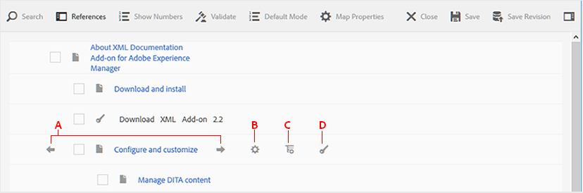

# Arbeiten mit dem grundlegenden Zuordnungs-Editor {#id1942CM005Y4}

>[!NOTE]
>
> Der grundlegende Zuordnungs-Editor, der zuvor in Experience Manager Guides verfügbar war, wird seit Version 4.3 und 2307 nicht mehr unterstützt. Sie können nicht auf den grundlegenden Karten-Editor zugreifen, um DITA-Karten zu erstellen und zu verwalten.
>Es wird empfohlen, den erweiterten Zuordnungs-Editor zu verwenden. Der erweiterte Zuordnungs-Editor bietet erweiterte Funktionen und bessere Anpassungsoptionen. Weitere Informationen zum Arbeiten mit dem [erweiterten Karten-Editor](../user-guide/map-editor-advanced-map-editor.md).

Der einfache Karten-Editor bietet eine einfache Drag-and-Drop-Funktion zum Hinzufügen von Themen aus Ihrem AEM-Repository, um die DITA-Karte oder -Lesekarte zu erstellen. Sie können verschachtelte Themen, Beziehungstabellen \(reltable\), Attribute und Metadateninformationen hinzufügen und die Zuordnung auch auf Korrektheit überprüfen.

>[!NOTE]
>
> Wenn Ihr Admin die Option Erweiterter Zuordnungs-Editor aktiviert hat, haben Sie keinen Zugriff auf den einfachen Zuordnungs-Editor. Alle Zuordnungsdateien werden standardmäßig im erweiterten Zuordnungs-Editor geöffnet.

In den folgenden Abschnitten werden die verschiedenen Funktionen beschrieben, die im grundlegenden Zuordnungs-Editor verfügbar sind.

## Themen zu einer Zuordnungsdatei hinzufügen {#id193CBL0505Z}

Nachdem Sie eine Zuordnungsdatei erstellt haben, müssen Sie der Zuordnungsdatei Themen hinzufügen. Mit dem einfachen Zuordnungs-Editor können Sie Themen, Beziehungstabellen oder andere Zuordnungsdateien hinzufügen.

Führen Sie die folgenden Schritte aus, um Ihre Zuordnungsdatei zu erstellen:

1. Navigieren Sie in der Assets-Benutzeroberfläche zu der Zuordnungsdatei, die Sie bearbeiten möchten.

1. Um eine exklusive Sperre für die Zuordnungsdatei zu erhalten, wählen Sie die Zuordnungsdatei aus und klicken Sie auf **Auschecken**.

   >[!NOTE]
   >
   > Sobald Sie eine exklusive Sperre für eine Zuordnungsdatei haben, können andere Benutzer die Zuordnung nicht mehr bearbeiten. Sie wären jedoch in der Lage, an den Themen innerhalb der Zuordnungsdatei zu arbeiten.

1. Klicken Sie bei ausgewählter Zuordnungsdatei auf **Bearbeiten**.

   Die Zuordnungsdatei wird zur Bearbeitung im Zuordnungs-Editor geöffnet. Mit dem Zuordnungs-Editor erstellen Sie eine Zuordnung anhand der derzeit verfügbaren Themen, die in der Leiste Verweise angezeigt werden.

   {width="800" align="left"}

1. Navigieren Sie mithilfe **Leiste** Verweise“ zu dem Ordner, der die Themen oder Unterzuordnungen enthält, die Sie hinzufügen möchten.

   >[!NOTE]
   >
   > Sie können Themen oder Unterzuordnungen aus beliebigen Ordnern in der Leiste „Verweise“ hinzufügen.

1. Um der Karte das erste Thema hinzuzufügen, ziehen Sie das Thema per Drag-and-Drop auf den grundlegenden Karten-Editor.

   >[!NOTE]
   >
   > Nach dem Hinzufügen des ersten Links ist der Link Neuen Verweis hinzufügen verfügbar, wenn Sie den Mauszeiger über ein vorhandenes Thema in der Karte bewegen.

1. Um weitere Themen oder eine Unterkarte hinzuzufügen, ziehen Sie das Thema oder die Unterkarte per Drag-and-Drop an die gewünschte Position in der Karte.

   Wenn Sie eine Unter-Map zu Ihrer DITA-Map hinzufügen, wird die Unter-Map als Link in der DITA-Map angezeigt. Um alle Themen der Unter-Map anzuzeigen, klicken Sie auf den Link Unter-Map . Der Inhalt der Unter-Zuordnung wird auf einer neuen Registerkarte angezeigt.

   >[!NOTE]
   >
   > Wenn Sie ein neues Thema auf einem vorhandenen Thema in der Karte ablegen, erhalten Sie eine Meldung zum Ersetzen des Themas. Klicken Sie auf Ja, wenn Sie das Thema ersetzen möchten, und auf Nein, wenn Sie das Thema nicht ersetzen möchten. Sie können Strg+Z und Strg+Y verwenden, um Änderungen in der Zuordnung rückgängig zu machen oder wiederherzustellen.

1. Klicken Sie auf **Speichern**.

## In der Symbolleiste des allgemeinen Zuordnungs-Editors verfügbare Funktionen

Die Hauptsymbolleiste im grundlegenden Zuordnungs-Editor ermöglicht die Durchführung der folgenden Aufgaben:

{width="800" align="left"}

**A: Suche**

Sie können die erforderlichen Themen aus DAM suchen und einbeziehen. Durch Klicken auf dieses Symbol wird der Suchdialog angezeigt:

{width="800" align="left"}

Geben Sie die Keywords ein, nach denen Sie suchen möchten. Diese Keywords werden im Dateinamen, im Inhalt und sogar in den Attributwerten des Themas abgeglichen. Sobald die Suchergebnisse verfügbar sind, wählen Sie die gewünschten Themen aus und klicken Sie auf die Schaltfläche Überprüfen , um die ausgewählten Dateien am Ende Ihrer Zuordnungsstruktur hinzuzufügen. Sie können Ihre Suchergebnisse filtern, indem Sie die Parameter Datum ändern angeben.

**B: Gruppe**

Aktivieren Sie das Kontrollkästchen links neben den Themen und klicken Sie in der Symbolleiste auf Gruppieren , um die ausgewählten Themen zu gruppieren. Weitere Informationen zur Gruppierung von Themen finden Sie in der [Themengruppe](https://docs.oasis-open.org/dita/v1.0/langspec/topicgroup.html) Dokumentation in OASIS DITA Language Specification.

**C: Löschen**

Aktivieren Sie das Kontrollkästchen links neben einem Thema und klicken Sie in der Symbolleiste auf Löschen , um die ausgewählten Themen aus der Karte zu entfernen.

**D: Zahlen anzeigen/ausblenden**

Die Nummerierung der Themen in der Zuordnung anzeigen \(oder ausblenden\).

**E: Validieren**

Überprüfen, ob die Zuordnung gültig ist oder Fehler aufweist.

**F: Standardmodus/XML-Modus**

Im **Standardmodus** wird durch Klicken auf einen Themen-Link die Vorschau des Themas in einer neuen Registerkarte angezeigt. Durch Klicken auf das Symbol **Standardmodus** wird der Modus in &quot;**-Modus“**. Wenn **XML-Modus** auf eine beliebige Stelle in einer Themenzeile geklickt wird, wird die zugrunde liegende XML der Themenreferenzen innerhalb des Themas angezeigt. In der Quell-XML-Ansicht gibt es eine Option **Automatischer Einzug**, die den XML-Code in einem darstellbaren und leicht lesbaren Format neu organisiert. Wenn Sie eine Zuordnung manuell bearbeiten, führt die Quellansicht auch Validierungsprüfungen durch. Wenn Ihre XML Fehler enthält, wird diese im **XML-Modus** hervorgehoben und Sie dürfen die DITA-Zuordnungsdatei nicht speichern. Wenn Sie die XML für die gesamte Zuordnung anzeigen möchten, klicken Sie auf eine beliebige Stelle außerhalb der Themengrenze.

**Hinweis:** Im Standardmodus können Sie die Tastaturbefehle verwenden, um \(`Ctrl+z`\) oder \(`Ctrl+y`\) die letzte Aktion rückgängig zu machen.

{width="650" align="left"}

**G: Eigenschaften zuordnen**

Zeigt das Dialogfeld Zuordnungseigenschaften an, in dem Sie die Attribute und Metadateninformationen für die Zuordnung festlegen können. Um ein Attribut hinzuzufügen, klicken Sie auf **Hinzufügen** Schaltfläche unten links im Dialogfeld, um die **Attribut** Dropdown-Liste aufzurufen. Wählen Sie aus der Liste das Attribut aus, das Sie hinzufügen möchten. Wenn für das ausgewählte Attribut in der DTD vordefinierte Werte angegeben sind, werden diese Werte in einer neuen Dropdown-Liste angezeigt. Sie können den gewünschten Wert aus der Dropdown-Liste auswählen. Wenn kein vordefinierter Wert vorhanden ist, wird ein Textfeld zur Eingabe eines Werts für das ausgewählte Attribut angezeigt.

{width="300" align="left"}

## Auf Themenebene verfügbare Funktionen im grundlegenden Zuordnungs-Editor

Wenn Sie den Mauszeiger über ein Thema oder eine Unterzuordnungsdatei im Grundzuordnungs-Editor bewegen, können Sie die folgenden Aufgaben ausführen:

{width="650" align="left"}

**A: Nach links oder Nach rechts**

Klicken Sie auf die Pfeile nach links oder rechts, um das Thema nach links oder rechts zu verschieben. Wenn Sie ein Thema so verschieben, wird es in Bezug auf das obige Thema zu einem untergeordneten \(neest\) oder gleichrangigen \(remove nesting\).

**B: Eigenschaften**

Klicken Sie auf das Symbol Eigenschaften , um das Dialogfeld TopicRef-Eigenschaften zu öffnen. In diesem Dialogfeld können Sie die Themenattribute und Metadateninformationen festlegen. Weitere Informationen zu den Standardattributen und Metadaten für Themen finden Sie in der Dokumentation [topicref](https://docs.oasis-open.org/dita/v1.2/os/spec/langref/topicref.html) in der OASIS DITA Language Specification.

{width="350" align="left"}

**c: Neue Referenz hinzufügen**

Klicken Sie auf das Symbol Neuen Verweis hinzufügen , um einen neuen Verweis als gleichrangiges Element des aktuellen Themas hinzuzufügen.

**D: Neue Schlüsseldefinition hinzufügen**

Klicken Sie auf das Symbol Schlüssel , um eine neue Schlüsseldefinition hinzuzufügen. Jeder überschriebene Schlüssel oder ein Schlüssel, der bereits in der Zuordnung definiert wurde, wird rot angezeigt. Wenn Sie auf das Symbol Eigenschaften einer Schlüsseldefinition klicken, wird das Dialogfeld Keydef-Eigenschaften angezeigt.

## Arbeiten mit Beziehungstabellen im grundlegenden Zuordnungs-Editor {#id1944B0I0COB}

Die Zuordnungs-Editoren von AEM Guides verfügen über eine leistungsstarke Funktion, mit der Sie Beziehungstabellen in Ihrer DITA-Zuordnung erstellen und bearbeiten können.

Führen Sie die folgenden Schritte aus, um mit Beziehungstabellen im grundlegenden Zuordnungs-Editor zu arbeiten:

1. Navigieren Sie in der Assets-Benutzeroberfläche zu der DITA-Zuordnung, in der Sie die Beziehungstabelle erstellen möchten.

1. Klicken Sie auf die DITA-Map, um sie in der DITA-Map-Konsole zu öffnen.

1. Wählen Sie die **Themen** aus, um eine Liste der in der DITA-Karte verfügbaren Themen anzuzeigen.

   >[!TIP]
   >
   > Auf der Registerkarte Themen haben Sie die Möglichkeit, die Zuordnungsdatei mit den abhängigen Elementen herunterzuladen. Weitere Informationen finden Sie unter [Exportieren einer DITA-Zuordnungsdatei](authoring-download-assets.md#id218UBA00IXA).

1. Klicken Sie in der Hauptsymbolleiste auf **Bearbeiten**.

   Die Zuordnungsdatei wird im grundlegenden Zuordnungs-Editor geöffnet.

1. Wählen Sie **Reltable** in der Symbolleiste aus.

   {width="650" align="left"}

1. Themen per Drag-and-Drop aus der Themenliste in den zuverlässigen Editor ziehen.

   >[!NOTE]
   >
   > Sie können Themen aus jedem Ordner in der Leiste „Verweise“ hinzufügen.

   {width="550" align="left"}

1. Um Ihrer Beziehungstabelle eine Kopfzeile hinzuzufügen, klicken Sie auf **Relheader hinzufügen**.

1. Um eine Spalte zu Ihrer Beziehungstabelle hinzuzufügen, klicken Sie auf **Spalte hinzufügen**.

   {width="550" align="left"}

1. Klicken Sie auf **Speichern**.

Sie können im Beziehungstabellen-Editor auch die folgenden Aktionen ausführen:

**Löschen von Zeilen oder Spalten**

Wenn Sie eine Spalte aus Ihrer Tabelle löschen möchten, aktivieren Sie das Kontrollkästchen in der Spaltenüberschrift und klicken Sie auf Löschen. Wenn Sie eine Zeile aus der Tabelle entfernen möchten, aktivieren Sie das Kontrollkästchen in der ersten Spalte der entsprechenden Zeile und klicken Sie auf Löschen .

**Thema löschen**

Wenn Sie ein Thema aus Ihrer Tabelle löschen möchten, klicken Sie auf das Kreuzsymbol neben dem Thema.

**Löschen der Beziehungstabelle**

Wenn Sie die Beziehungstabelle löschen möchten, klicken Sie auf eine beliebige Stelle außerhalb der Beziehungstabelle und klicken Sie auf Löschen.

**Übergeordnetes Thema:**[ Arbeiten mit dem Zuordnungs-Editor](map-editor.md)
