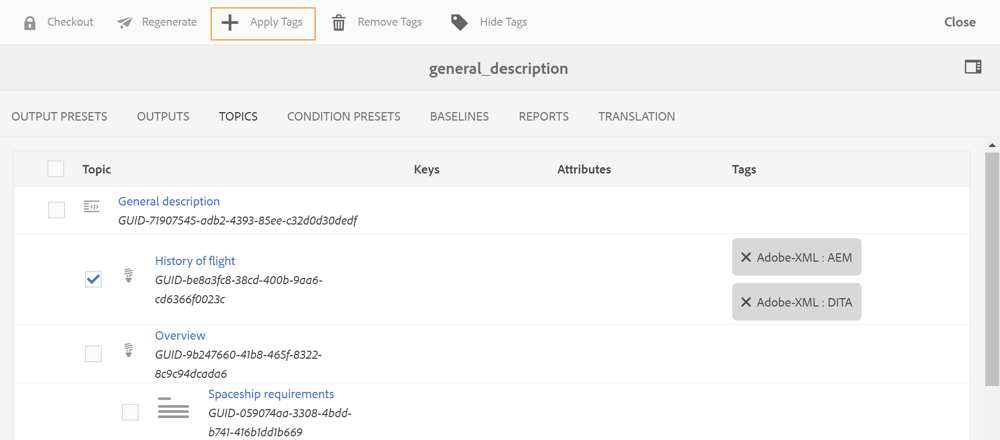

# Massen-Tagging von DITA-Inhalten {#id179SG0TN05Z}

{width="650"}

Mit Tags können Sie Inhalte innerhalb Ihres Inhalts-Repositorys und auch in der veröffentlichten Ausgabe gruppieren oder klassifizieren. Wenn Sie Tags auf Ihren Inhalt angewendet haben, können Sie mühelos verwandte Themen in einer DITA-Karte finden, die Ihnen beim Verfassen von Inhalten helfen können. Mit der veröffentlichten Ausgabe können Endbenutzende den richtigen Inhalt schneller finden, wenn korrekte Tags vorhanden sind.

Mit Adobe Experience Manager Guides können Sie DITA-Inhalte in wenigen Schritten taggen. Sie können die Bulk-Tagging-Funktion verwenden, um mehrere Tags auf mehrere Themen, eine DITA-Zuordnung oder eine Unterzuordnung anzuwenden. Sie können Tags auch auf ein einzelnes Thema anwenden. Tagging ist die native Funktion in Adobe Experience Manager. Weitere Informationen zum Erstellen und Verwalten von Tags finden Sie im Abschnitt [Verwalten von Tags](https://experienceleague.adobe.com/docs/experience-manager-cloud-service/sites/authoring/features/tags.html?lang=en) in der Dokumentation zu Adobe Experience Manager.

Standardmäßig gewährt Experience Manager Guides keinem Benutzer Lesezugriff auf den Ordner, in dem alle Tags im Adobe Experience Manager-Repository gespeichert sind. Um im Adobe Experience Manager-Repository definierte Tags zu verwenden, müssen Sie Ihren Systemadministrator bitten, Zugriff auf den Ordner zu gewähren, in dem die Tags gespeichert sind.

## Anwenden von Bulk-Tags

Verwenden Sie die Bulk-Tagging-Funktion, um mehrere Tags gleichzeitig anzuwenden. Führen Sie die folgenden Schritte aus, um Tags auf Ihre Themen in einer DITA-Karte anzuwenden:

1. Navigieren Sie in der Assets-Benutzeroberfläche zur DITA-Zuordnungsdatei und wählen Sie sie aus.

   Die DITA-Zuordnungskonsole wird mit der Liste der für die Generierung der Ausgabe verfügbaren Ausgabevorgaben angezeigt.

1. Wählen Sie **Themen** aus.

   Eine Liste der in der DITA-Karte verfügbaren Themen wird angezeigt. Die UUIDs der Themen von werden unter dem Thementitel angezeigt.

1. Wählen Sie die Themen oder Unterkarten aus, auf die Sie Tags anwenden möchten.

   {width="650"}

   >[!NOTE]
   >
   > Der obige Screenshot zeigt eine ausgewählte und erweiterte Unterkarte. Bei Auswahl der Unter-Map werden auch alle Themen unter der Unter-Map ausgewählt.

1. Wählen Sie **Tags anwenden** aus.

   Das Dialogfeld Tags auswählen wird angezeigt.

1. Wählen Sie ein oder mehrere Tags aus, die Sie auf die ausgewählten Themen anwenden möchten.

1. Bestätigen Sie Ihre Auswahl.

   Die ausgewählten Tags werden auf die Themen angewendet und neben dem Thementitel angezeigt.

   >[!NOTE]
   >
   > Wenn Sie nach dem Hinzufügen von Tags zu Ihren Themen ein Thema verschieben oder löschen, werden die Tags für diese Themen ebenfalls entfernt. Dieses Thema bleibt jedoch auf der Karte, bis Sie es entfernen.

## Anwenden von Tags auf ein einzelnes Thema

Führen Sie die folgenden Schritte aus, um Tags auf ein einzelnes Thema anzuwenden:

1. Navigieren Sie in der Assets-Benutzeroberfläche zu und wählen Sie die Themendatei aus, auf die Sie Tags anwenden möchten.

1. Klicken Sie in der Symbolleiste auf **Eigenschaften**.

   Die Seite mit den Eigenschaften des Themas wird angezeigt.

1. Wählen Sie auf der Registerkarte Allgemein das Symbol Durchsuchen neben dem Feld **Tags** aus.

1. Wählen Sie ein oder mehrere Tags aus, die Sie auf das ausgewählte Thema anwenden möchten.

1. Bestätigen Sie Ihre Auswahl.

1. Wählen Sie **Tags anwenden** aus.

   Die ausgewählten Tags werden auf das Thema angewendet und im Feld Tags angezeigt.

1. Klicken Sie auf **Speichern und schließen**.

## Tags entfernen

Je nach Ihren Geschäftsanforderungen können Sie die Tagging-Informationen für jedes DITA-Thema ändern. Sie können auf einfache Weise alle Tags gleichzeitig entfernen oder nur die Tags entfernen, die für das Thema nicht gültig sind.

Führen Sie die folgenden Schritte aus, um alle Tags aus einem oder mehreren Themen zu entfernen:

1. Navigieren Sie in der Assets-Benutzeroberfläche zu und wählen Sie die DITA-Zuordnungsdatei aus.

   Die DITA-Zuordnungskonsole wird mit der Liste der für die Generierung der Ausgabe verfügbaren Ausgabevorgaben angezeigt.

1. Wählen Sie **Themen** aus.

   Eine Liste der in der DITA-Karte verfügbaren Themen wird angezeigt.

1. Wählen Sie die Themen aus, aus denen Sie Tags entfernen möchten.

1. Wählen Sie **Tags entfernen** aus.

   >[!NOTE]
   >
   > Wenn das Symbol zum Löschen von Tags nicht angezeigt wird, stellen Sie sicher, dass Sie die Funktion „Tags ausblenden“ nicht aktiviert haben.

1. Klicken Sie im Dialogfeld Löschen bestätigen auf **OK**, um Tags aus den ausgewählten Themen zu entfernen.

## Tags ein- oder ausblenden

Wenn Sie eine lange Liste von Tags auf Ihre Themen angewendet haben, kann die Navigation etwas mühsam sein. Sie können Tags in in der DITA-Zuordnungskonsolenansicht einfach ausblenden, indem Sie das Symbol Tags ausblenden auswählen. Wenn die Tags nicht sichtbar sind, werden bei Auswahl der Option Tags anzeigen alle Tags angezeigt.

**Übergeordnetes Thema:**&#x200B;[&#x200B; Verwalten von Metadaten](manage-metadata.md)
