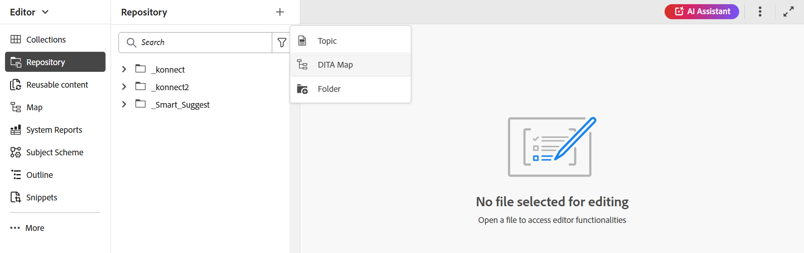

# Erstellen einer Zuordnung {#id176FEN0D05Z}

Adobe Experience Manager Guides bietet zwei vordefinierte Kartenvorlagen - DITA-Karte und Bookmap. Sie können auch eigene Zuordnungsvorlagen erstellen und diese für Ihre Autoren freigeben, um Zuordnungsdateien zu erstellen.

Führen Sie die folgenden Schritte aus, um eine Zuordnung zu erstellen:

1. Wählen Sie im Repository-Bedienfeld das Symbol **Neue Datei** und wählen Sie dann **DITA Map** aus dem Dropdown-Menü aus.

   {align="left"}

   Sie können auf diese Option auch über die Startseite von [Experience Manager Guides &#x200B;](./intro-home-page.md) über das Optionsmenü eines Ordners in der Repository-Ansicht zugreifen.

2. Das **Neue Zuordnung** wird angezeigt.

3. Geben **im Dialogfeld** Neue Zuordnung“ die folgenden Details an:
   - Ein Titel für die Karte.
   - \(Optional\)* Der Dateiname für die Zuordnung. Der Dateiname wird basierend auf dem Thementitel automatisch vorgeschlagen. Wenn Ihr Administrator automatische Dateinamen basierend auf der UUID-Einstellung aktiviert hat, wird das Feld Name nicht angezeigt.
   - Eine Vorlage, auf der das Thema basieren soll. Für eine Zuordnungsdatei sind die verfügbaren Optionen **Bookmap**, **Map** und **Subject Scheme**.
   - Pfad, in dem die Zuordnungsdatei gespeichert werden soll. Standardmäßig wird der Pfad des aktuell ausgewählten Ordners im Repository im Feld Pfad angezeigt.

   {width="300" align="left"}

4. Wählen Sie **Erstellen** aus.

Die Zuordnung wird unter dem angegebenen Pfad erstellt. Außerdem wird die Karte im Karten-Editor zur Bearbeitung geöffnet.

{align="left"}

## Themen zu einer Zuordnungsdatei hinzufügen

Zusätzlich zur Bearbeitung von Zuordnungsdateien direkt im Editor können Sie auch Themendateien in einer Karte öffnen, um den Editor zu bearbeiten. Sie können einer Zuordnungsdatei Themen hinzufügen.

Führen Sie die folgenden Schritte aus, um einer Zuordnungsdatei über die Zuordnungskonsole Themen hinzuzufügen:

1. Navigieren Sie in der Repository-Ansicht zu der Zuordnungsdatei, die Sie bearbeiten möchten, und öffnen Sie sie.
1. Wählen Sie das Symbol **Bearbeiten** aus.

   {width="450" align="left"}

1. Die Zuordnungsdatei wird im Zuordnungs-Editor geöffnet. Wenn Sie eine neue Kartendatei geöffnet haben, wird nur der Titel der Karte im Editor angezeigt.

   {align="left"}

   - **A** - \(*Registerkartenleiste*\): Dies ähnelt der Registerkartenleiste des Editors. Weitere [&#x200B; finden Sie &#x200B;](./web-editor-features.md#tab-bar) der Registerkarte „Leiste“ im Editor.

   - **B** - \(*Symbolleiste*\) Dies ist die Symbolleiste, die Ihnen das Arbeiten mit Zuordnungsdateien ermöglicht. Weitere Informationen zu den in der Symbolleiste verfügbaren Funktionen finden Sie unter [In der Symbolleiste des Zuordnungs-Editors verfügbare Funktionen](#features-available-in-the-map-editors-toolbar).

   - **C** - \(*Kartenansichten*\): Ermöglicht es Ihnen, im Zuordnungs-Editor zwischen Layout, Autor, Source und Vorschau zu wechseln. In **Layout**-Ansicht können Sie die Themen in einer DITA-Karte organisieren. Dadurch wird die Baumstruktur oder hierarchische Ansicht der Karte angezeigt. Die **Autor**-Ansicht ermöglicht die Bearbeitung der Themen im Zuordnungs-Editor. Dadurch erhält auch die WYSIWYG-Ansicht der Zuordnungsdatei. Die Ansicht **Source** ermöglicht es Ihnen, mit der zugrunde liegenden XML der Zuordnungsdatei zu arbeiten. Die Vorschau bietet Ihnen eine konsolidierte Ansicht aller Themen und Unterzuordnungen innerhalb der Zuordnungsdatei.

   - **D** - \(*Linker Bereich*\): Ermöglicht den Zugriff auf den linken Bereich, in dem Sie Zugriff auf die Sammlungen, das Repository, die Zuordnung, die Gliederung und andere Funktionen haben. Sie können sie erweitern oder reduzieren, indem Sie auf das Symbol „Erweitern/Reduzieren“ klicken. Weitere Informationen zu den im linken Bereich verfügbaren Funktionen finden Sie unter [Linker Bereich](./web-editor-features.md#left-panel) im Editor.

   - **E** - \(*Middle Area*\): Inhaltsbearbeitungsbereich zuordnen.

   - **F** - \(*Bereich rechts*\): Ermöglicht den Zugriff auf den Bereich „Eigenschaften“. Sie können die Inhaltseigenschaften und die Zuordnungseigenschaften des ausgewählten Themas oder der ausgewählten Zuordnung anzeigen. Weitere Informationen zu den in diesem Bedienfeld verfügbaren Funktionen finden Sie unter &quot;[&#x200B; Bedienfeld](web-editor-features.md#right-panel) im Editor.

1. Wechseln Sie im linken Bedienfeld zur Ansicht **Repository** .

1. Navigieren Sie im Adobe Experience Manager-Repository zum Ordner, der die Themen oder Unterzuordnungen enthält, die Sie hinzufügen möchten.

1. Wählen Sie das Thema oder die Zuordnungsdatei in der Ansicht **Repository** aus und ziehen Sie sie per Drag-and-Drop in den Bearbeitungsbereich für die \(mittlere\)-Zuordnungsinhalte.

   Das Thema wird der Karte hinzugefügt.

   {align="left"}

1. Um weitere Themen oder eine Unterkarte hinzuzufügen, ziehen Sie das Thema oder die Unterkarte per Drag-and-Drop an die gewünschte Position in der Karte.

   Beachten Sie beim Erstellen Ihrer Zuordnungsdatei die folgenden Punkte:

   - Die Datei wird an der Stelle hinzugefügt, an der die gestrichelte Rechteckleiste im Bereich für die Kartenbearbeitung angezeigt wird. Im folgenden Screenshot wird das Thema *Beispielthema* zwischen den Themen *Smart Suggest 1* und *Smart Suggest 2* hinzugefügt.

     {align="left"}

   - Um ein Thema zu ersetzen, ziehen Sie das neue Thema per Drag-and-Drop auf das Thema, das Sie ersetzen möchten. und sie ablegen bedeutet, dass sie durch das Thema ersetzt wird, das darauf abgelegt wird.

   - Wenn Sie eine Unter-Map zu Ihrer DITA-Map hinzufügen, wird die Unter-Map als Link in der DITA-Map angezeigt. Um alle Themen der Unterzuordnung anzuzeigen, klicken Sie bei gedrückter Strg-Taste auf den Link der Unterzuordnung. Der Inhalt der Unter-Zuordnung wird auf einer neuen Registerkarte angezeigt. Um ein Thema über die DITA-Karte zu öffnen, klicken Sie bei gedrückter Strg-Taste auf den Themen-Link, um es in der neuen Registerkarte zu öffnen.

   - Sie können die Tastaturbefehle Strg+Z und Strg+Y oder die entsprechenden Symbole in der Symbolleiste verwenden, um Änderungen in der Karte rückgängig zu machen oder wiederherzustellen.

   - Um die Position eines Themas zu ändern, wählen Sie das Thema \(durch Auswahl des Themensymbols\) aus und ziehen Sie es dann per Drag-and-Drop an die gewünschte Position in der Zuordnungsdatei. Im folgenden Screenshot wird das Thema *Smart Suggest 1* nach dem Thema *Beispiel* verschoben.

     {align="left"}

   - Um die Eigenschaften Ihrer Zuordnungsdatei zu überprüfen, klicken Sie mit der rechten Maustaste auf eine beliebige Stelle im Bereich der Zuordnungsbearbeitung und wählen Sie **Eigenschaften** aus dem Kontextmenü aus. Abhängig von Ihrer Adobe Experience Manager-Version können Sie Eigenschaften wie Metadaten, Zeitplan \(de\)aktivierung, Verweise, Dokumentstatus und mehr anzeigen.

1. Wählen Sie **Speichern** aus.

## Erstellen einer Zuordnung über die Assets-Benutzeroberfläche

Sie können eine Zuordnungsdatei auch über die Assets-Benutzeroberfläche erstellen und zur Bearbeitung im Zuordnungs-Editor öffnen.

Führen Sie die folgenden Schritte aus, um eine Zuordnung über die Assets-Benutzeroberfläche zu erstellen:

1. Navigieren Sie in der Assets-Benutzeroberfläche zu dem Speicherort, an dem Sie die Zuordnungsdatei erstellen möchten.

1. Wählen Sie **Erstellen** \> **DITA Map**.

1. Wählen Sie auf der Blueprint-Seite den Typ der zu verwendenden Zuordnungsvorlagen aus und klicken Sie auf **Weiter**.

   >[!NOTE]
   >
   > Die Art und Weise, wie die Themen in einer Zuordnungsdatei referenziert werden, hängt von der Zuordnungsvorlage ab. Wenn Sie beispielsweise die Zuordnungsvorlage auswählen, werden die Themenreferenzen \(`topicref`\) verwendet, um auf Themen zu verweisen. Im Falle einer Bookmap werden Themenreferenzen mit dem `chapter` Element in DITA erstellt.

   {align="left"}

1. Geben Sie auf der Seite Eigenschaften die Zuordnung (**)**.

1. \(Optional\) Geben Sie die Datei **Name** an.

   Wenn Ihr Admin einen automatischen Dateinamen basierend auf einer UUID-Einstellung konfiguriert hat, wird die Option zum Angeben des Dateinamens nicht angezeigt. Ein UUID-basierter Dateiname wird der Datei automatisch zugewiesen.

   Wenn die Option zur Dateibenennung verfügbar ist, wird auch der Name basierend auf dem Titel Ihrer Zuordnung automatisch vorgeschlagen. Wenn Sie den Namen der Zuordnungsdatei manuell angeben möchten, stellen Sie sicher, dass der Dateiname keine Leerzeichen, Apostrophe oder geschweifte Klammern enthält und mit `.ditamap` endet.

1. Wählen Sie **Erstellen** aus.

   Die Meldung Map Created wird angezeigt.

   Jeder neuen Zuordnungsdatei, die Sie über die Assets-Benutzeroberfläche oder den Editor erstellen, wird eine eindeutige Zuordnungs-ID zugewiesen. Außerdem wird die neue Zuordnung als neueste Arbeitskopie in DAM gespeichert. Bis zum Speichern einer Revision einer neu erstellten Zuordnung wird im Versionsverlauf keine Versionsnummer angezeigt. Wenn Sie die Zuordnung zur Bearbeitung öffnen, werden die Versionsinformationen in der rechten oberen Ecke der Registerkarte der Zuordnungsdatei angezeigt:

   {align="left"}

   Die Versionsinformationen für eine neu erstellte Zuordnung werden als *Keine* angezeigt. Wenn Sie eine neue Version speichern, wird ihr eine Versionsnummer als 1.0 zugewiesen. Weitere Informationen zum Speichern einer neuen Version finden Sie unter [Als neue Version &#x200B;](web-editor-features.md#save-as-new-version).

   Sie können die Zuordnung zur Bearbeitung im konfigurierten Zuordnungs-Editor öffnen oder im Adobe Experience Manager-Repository speichern.

   >[!NOTE]
   >
   > Um den erweiterten Zuordnungs-Editor zu verwenden, greifen Sie auf die Zuordnungsdatei im Editor zu. Falls Ihr Administrator den erweiterten Zuordnungs-Editor als Standard-Editor in den Zuordnungsdateien konfiguriert hat, wird die Zuordnungsdatei direkt im erweiterten Zuordnungs-Editor zur Bearbeitung geöffnet. Gehen Sie *Abschnitt Erweiterten Zuordnungs-Editor als Standard festlegen* der Seite Installieren und Konfigurieren von Adobe Experience Manager Guides as a Cloud Service vor.

### Hinzufügen von Themen zu einer Zuordnungsdatei über die Assets-Benutzeroberfläche

Führen Sie die folgenden Schritte aus, um über die Assets-Benutzeroberfläche Themen zu einer Zuordnungsdatei hinzuzufügen:

1. Navigieren Sie in der Assets-Benutzeroberfläche zu der Zuordnungsdatei, die Sie bearbeiten möchten.

   >[!NOTE]
   >
   > Stellen Sie sicher, dass Sie den Asset-Auswahlmodus nicht aktiviert haben.

1. Um eine exklusive Sperre für die Zuordnungsdatei zu erhalten, wählen Sie die Zuordnungsdatei aus und wählen Sie dann oben die **Checkout**-Option aus.

   >[!NOTE]
   >
   > Sobald Sie eine exklusive Sperre für eine Zuordnungsdatei haben, können andere Benutzer die Zuordnung nicht mehr bearbeiten. Sie wären jedoch in der Lage, an den Themen innerhalb der Zuordnungsdatei zu arbeiten. Wenn Ihr Administrator Ihren Editor so konfiguriert hat, dass Dateien vor der Bearbeitung gesperrt werden, können Sie eine Datei erst bearbeiten, nachdem Sie sie gesperrt haben.

1. Wählen Sie bei ausgewählter Zuordnungsdatei **Themen bearbeiten**.

   {align="left"}

   Sie können auch die Option **Themen bearbeiten** aus dem Aktionsmenü in der Zuordnungsdatei auswählen:

   {align="left"}

   Die Zuordnungsdatei wird im Editor zur Bearbeitung geöffnet. Um der Zuordnungsdatei Themen hinzuzufügen, führen Sie die Schritte (4-8) in [Themen zu einer Zuordnungsdatei hinzufügen“ &#x200B;](#add-topics-to-a-map-file).

**Übergeordnetes Thema: [Einführung in den Zuordnungs-Editor](map-editor.md)
