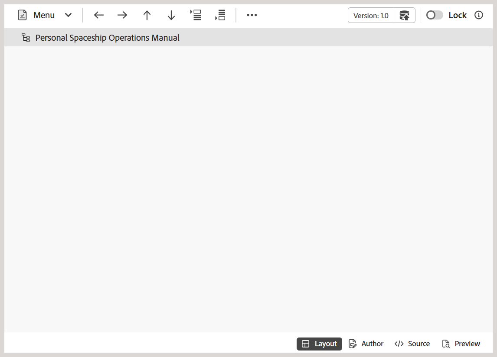

# Zusätzliche Funktionen im Karten-Editor {#id1942D0T0HUI}

Zu den gebräuchlichen Funktionen im Zuordnungs-Editor gehören:

## Auflösen von Schlüsselverweisen {#id176GD01H05Z}

Ein DITA-Inhaltsschlüssel-Verweis (oder `conkeyref`) ist ein Mechanismus zum Einfügen eines Teils des Inhalts von einem Thema in ein anderes. Dieser Mechanismus verwendet den Schlüssel zum Auffinden des wiederzuverwendenden Inhalts und nicht den direkten Inhaltsverweismechanismus. Weitere Informationen zu direkten und indirekten Verweisen in DITA finden Sie unter *DITA-Adressierung* in der DITA-Sprachspezifikation von OASIS.

Wenn mit dem DITA-Thema Schlüsselverweise verknüpft sind, müssen diese aufgelöst werden, bevor ein Thema in der Vorschau angezeigt, bearbeitet oder überprüft werden kann.

Die Schlüsselverweise werden auf der Grundlage der Stammzuordnung aufgelöst, die in der folgenden Prioritätsreihenfolge festgelegt ist:

1. Benutzereinstellungen
1. Kartenansichtsbereich
1. Ordnerprofil

Die in den Benutzereinstellungen ausgewählte Stammzuordnung hat die höchste Priorität, um wichtige Verweise aufzulösen, gefolgt vom Bereich für die Zuordnungsansicht und der Stammzuordnung des Ordnerprofils. Wenn in den Benutzereinstellungen also keine Zuordnung festgelegt ist, wird die im Bereich „Kartenansicht“ geöffnete Zuordnung verwendet. Wenn im Bereich der Zuordnungsansicht keine Zuordnung geöffnet ist, wird der Zuordnungssatz im Ordner Profile verwendet, um die Schlüsselverweise aufzulösen.

Die Schlüsselverweise können in einer DITA-Map-Datei oder einer separaten DITA-Datei gespeichert werden. In Experience Manager Guides können Sie wichtige Verweise entweder auf Projekt- oder Sitzungsebene angeben. Wenn für die Benutzersitzung bereits eine Stammzuordnung definiert ist, wird diese zur Auflösung der Schlüssel verwendet. Andernfalls wird die Standard-Stammzuordnung für diesen Ordner verwendet. Wenn keine standardmäßige Stammzuordnung konfiguriert ist, werden die fehlenden Schlüsselverweise für den Benutzer hervorgehoben.

Es gibt mehrere Möglichkeiten, wichtige Verweise in einem DITA-Thema aufzulösen, indem Sie die DITA-Zuordnung definieren, die an den folgenden Stellen verwendet werden soll:

**Projekteigenschaften** - Sie können im Abschnitt Projekteigenschaften eine Stammzuordnung definieren, in der die wichtigsten Verweise beim Erstellen eines Projekts aufgelöst werden.

Diese Stammzuordnung gilt für alle mit diesem Projekt verknüpften Assets \(Ordner und Unterordner\). Für Inhalte, auf die in mehreren Projekten verwiesen wird, wird eine alphabetische Liste der Projekte beibehalten und die standardmäßige Stammzuordnung, die mit dem ersten Projekt verknüpft ist, wird verwendet. Sie können auch die DITA-Map auswählen, die für die Auflösung von Schlüsselverweisen in der Liste verwendet werden soll.

**Themenvorschau** - Wählen Sie im Themenvorschaumodus in der Symbolleiste das Symbol für die Tastenauflösung und dann die DITA-Datei aus, die für die Schlüsselverweise verwendet werden soll.

**Themenbearbeitungsansicht** - Wählen Sie beim Bearbeiten eines DITA-Themas das Symbol für die Tastenauflösung und dann die DITA-Datei aus, die für die Auflösung der Schlüsselverweise verwendet werden soll.

## Hinzufügen von Navigationsverweisen

Das `navref`-Element wird in einer DITA-Zuordnung verwendet, um Navigationsverweise aus einer anderen DITA-Zuordnung einzuschließen. Dadurch können Autoren Navigationsstrukturen wie freigegebene Menüs oder Links wiederverwenden, ohne den tatsächlichen Inhalt der referenzierten Zuordnung mit der Ausgabe zusammenzuführen.

>[!NOTE]
>
> Das `navref`-Element ist ausschließlich für Navigationszwecke innerhalb der Kartenstruktur vorgesehen. Es trägt nicht zur generierten DITA-Zuordnungsausgabe bei und wird von der Verarbeitung ausgeschlossen und in der Zuordnungsansicht, in Berichten, in der Grundlinie, in der Übersetzung und in der Vorschau angezeigt.

Führen Sie die folgenden Schritte aus, um einer Zuordnung Navigationsverweise hinzuzufügen:

1. Öffnen Sie die DITA-Zuordnungsdatei, der Sie einen Navigationsverweis hinzufügen möchten.

   Die Zuordnungsdatei wird im Zuordnungs-Editor geöffnet.
1. Wechseln Sie zur Autorenansicht und platzieren Sie den Cursor an einer gültigen Position für eine Navigationsreferenz.
1. Wählen Sie die Option **Element** in der Symbolleiste aus.
1. Wählen Sie im **Element einfügen** die Option **navref**.

   
1. Das **Pfad auswählen** wird angezeigt. Wählen Sie eine Zuordnungsdatei aus, die Sie als Navigationsreferenz in Ihre Zuordnung aufnehmen möchten, und wählen Sie **Auswählen**.

Ein Navigationsverweis der ausgewählten Zuordnungsdatei wird am angegebenen Speicherort hinzugefügt. Außerdem wird der Titel der referenzierten Zuordnung sowohl in der Autoren- als auch in der Layout-Ansicht angezeigt.

*Autorenansicht*

*Layout-Ansicht*

**Übergeordnetes Thema:**&#x200B;[&#x200B; Einführung in den Zuordnungs-Editor](map-editor.md)
