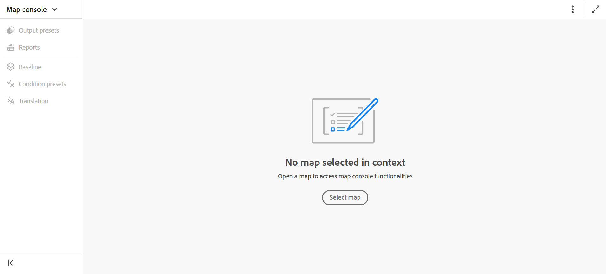

# Dateien in der Zuordnungskonsole öffnen

Führen Sie die folgenden Schritte aus, um eine DITA-Zuordnungsdatei in der Zuordnungskonsole zu öffnen:

1. Öffnen Sie **Map-**&quot; auf der Startseite.

   {width="800"align="left"}

2. Da keine Zuordnungsdatei ausgewählt ist, werden Sie aufgefordert, eine Zuordnungsdatei auszuwählen, um die Funktionen zur Zuordnungsverwaltung und -veröffentlichung zu verwenden.

   

3. Wählen Sie **Karte auswählen** und wählen Sie einen Pfad aus, in dem sich Ihre DITA-Zuordnungsdatei befindet.

   Die Zuordnungsdatei wird in der Zuordnungskonsole geöffnet. Standardmäßig ist die Registerkarte **Ausgabevorgaben** ausgewählt.

   {width="800"align="left"}

   >[!NOTE]
   >
   >  Die in der Kartenkonsole geöffnete Karte wird mit der im Editor verfügbaren Kartenansicht synchronisiert.

## Kartendateien über den Editor öffnen

Sie können auch eine vorhandene Zuordnungsdatei über den Editor in der Zuordnungskonsole öffnen.

1. Navigieren Sie zur DITA-Zuordnungsdatei und wählen Sie sie in der Repository-Ansicht aus.

   Die Zuordnungsdatei wird in der Zuordnungsansicht geöffnet.

2. Wählen Sie das Symbol **In Map-Konsole öffnen** aus.

   Die Zuordnungsdatei wird in der Zuordnungskonsole geöffnet.

   {align="left"}
