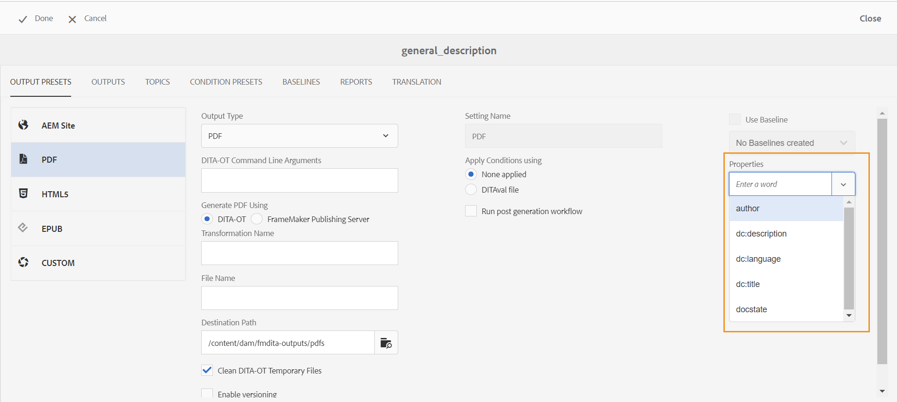

# Übergeben der Metadaten an die Ausgabe mithilfe von DITA-OT {#id21BJ00QD0XA}

Metadaten sind zusätzliche Informationen zur Ausgabe. In Adobe Experience Manager Guides können Sie die vorhandenen Metadaten übergeben oder benutzerdefinierte Metadaten-Tags erstellen. Mit der DITA-OT-Veröffentlichung können Sie Metadaten an AEM, PDF, HTML5, EPUB und benutzerdefinierte Formatausgaben übergeben.

Es gibt zwei Möglichkeiten, die Metadaten mithilfe von DITA-OT an die Ausgabe zu übergeben:

- [Verwenden der Map-Konsole](#using-map-console)
- [Verwenden des Karten-Dashboards](#using-map-dashboard)

## Verwenden der Map-Konsole

Führen Sie die folgenden Schritte aus, um die Metadaten mithilfe von DITA-OT-Publishing an die Ausgabe zu übergeben:

1. [Öffnen Sie die DITA-Zuordnungsdatei in der Zuordnungskonsole](./open-files-map-console.md) für die Sie die Metadaten an das DITA-OT übergeben möchten.
1. Wählen Sie eine Ausgabevorgabe aus, an die Sie die Metadatenfelder übergeben möchten, und öffnen Sie sie. Wählen Sie beispielsweise die PDF-Ausgabevorgabe aus. Stellen Sie sicher, dass sie mit der Option **DITA-OT** erstellt wird.
1. Wählen Sie **Dropdown-** „Dateieigenschaften“ die Metadaten aus, die Sie an die DITA-OT-Veröffentlichung übergeben möchten.

   {align="left"}

   Das Dropdown-Menü „Eigenschaften“ listet sowohl die benutzerdefinierten als auch die Standardeigenschaften auf. Im obigen `dc:description` sind beispielsweise `dc:language`, `dc:title` und `docstate` die Standardeigenschaften.

   >[!NOTE]
   >
   > Diese Eigenschaften werden aus der Datei „metadataList“ ausgewählt, die unter dem folgenden Speicherort verfügbar ist:`/libs/fmdita/config/metadataList`. Standardmäßig werden in dieser Datei vier Eigenschaften aufgelistet: `dc:description`, `dc:language`, `dc:title` und `docstate`.

   Diese Datei kann überlagert werden unter: `/apps/fmdita/config/metadataList`.

   Um eine benutzerdefinierte Eigenschaft zu übergeben, für die Sie bereits die Werte definiert haben, rufen Sie [Verwenden von AEM-Metadaten in der DITA-OT-PDF-Ausgabe](https://experienceleaguecommunities.adobe.com/t5/xml-documentation-discussions/use-aem-metadata-in-dita-ot-pdf-output/td-p/411880?profile.language=de) auf.

1. Die ausgewählten Eigenschaften werden unter dem Dropdown-Menü aufgelistet.

   {width="300" align="left"}

1. Wählen **oben rechts** Speichern“ aus, um die Änderungen zu speichern.
1. Wählen Sie **Ausgabe generieren** aus.

Die ausgewählten Metadateneigenschaften werden an die mit DITA-OT generierte Ausgabe übergeben.

>[!NOTE]
>
> Ab Version 2502 von Experience Manager Guides wird die Funktion zum Übergeben von Metadatenargumenten für Stammzuordnungen über die DITA-OT-Befehlszeile nicht mehr unterstützt. Um Unterbrechungen zu vermeiden, wurde jedoch eine neue Eigenschaft in der `Config.Manager` hinzugefügt, um die Funktion zu aktivieren oder zu deaktivieren.  Weitere Informationen finden Sie unter [Einstellungen für die Ausgabenerstellung konfigurieren](../cs-install-guide/conf-output-generation.md#configure-the-dita-ot-command-line-arguement-field-on-the-dita-map-dashboard).

## Verwenden des Karten-Dashboards

Wenn Sie an der **Assets-Benutzeroberfläche arbeiten** führen Sie die folgenden Schritte aus, um die Metadaten mithilfe der DITA-OT-Veröffentlichung an die Ausgabe zu übergeben:

1. Navigieren Sie in der **Assets**-Benutzeroberfläche zu und wählen Sie die DITA-Zuordnungsdatei aus, für die Sie die Metadaten an das DITA-OT übergeben möchten.
1. Wählen Sie eine Ausgabevorgabe aus, an die Sie die Metadatenfelder übergeben möchten, und bearbeiten Sie sie. Wählen Sie beispielsweise die PDF-Ausgabevorgabe aus.
1. Wählen Sie **Option „DITA-OT** in der ausgewählten Ausgabevorgabe aus.

   {align="left"}

1. Wählen Sie aus der Dropdown-Liste Eigenschaften die Metadaten aus, die Sie an die DITA-OUT-Veröffentlichung übergeben möchten.

   Das Dropdown-Menü „Eigenschaften“ listet sowohl die benutzerdefinierten als auch die Standardeigenschaften auf. Im obigen Screenshot ist Autor beispielsweise die benutzerdefinierte Eigenschaft, während `dc:description`, `dc:language`, `dc:title` und `docstate` die Standardeigenschaften sind.

   >[!NOTE]
   >
   > Diese Eigenschaften werden aus der Datei „metadataList“ ausgewählt, die unter dem folgenden Speicherort verfügbar ist:`/libs/fmdita/config/metadataList`. Standardmäßig werden in dieser Datei vier Eigenschaften aufgelistet: `dc:description`, `dc:language`, `dc:title` und `docstate`.

   Diese Datei kann überlagert werden unter: `/apps/fmdita/config/metadataList`.

   Um eine benutzerdefinierte Eigenschaft zu übergeben, für die Sie bereits die Werte definiert haben, rufen Sie [Verwenden von AEM-Metadaten in der DITA-OT-PDF-Ausgabe](https://experienceleaguecommunities.adobe.com/t5/xml-documentation-discussions/use-aem-metadata-in-dita-ot-pdf-output/td-p/411880?profile.language=de) auf.

1. Wählen Sie **Dropdown-** „Eigenschaften“ die erforderlichen benutzerdefinierten und Standardeigenschaften aus. Wählen Sie beispielsweise `author`, `dc:title` und `dc:description`. Dies sind die `metadata/properties`, die erstellt werden, sobald wir eine Datei erstellen. Die ausgewählten Eigenschaften werden unter der Dropbox aufgelistet.

   {width="300" align="left"}

1. Wählen **oben links** Fertig“ aus, um die Änderungen zu speichern.
1. Ausgabe generieren.

Die ausgewählten Metadateneigenschaften werden an die mit DITA-OT generierte Ausgabe übergeben.

**Übergeordnetes Thema:**&#x200B;[ Ausgabegenerierung](generate-output.md)
