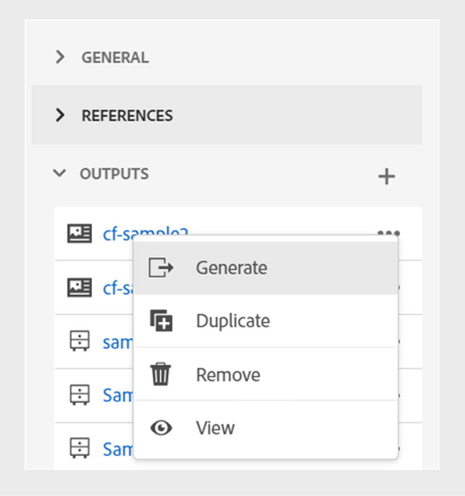

# Veröffentlichen von Inhaltsfragmenten

Inhaltsfragmente sind separate Inhaltsfragmente in Adobe Experience Manager. Sie sind strukturierte Inhalte, die auf einem Inhaltsmodell basieren. Inhaltsfragmente sind reine Inhalte ohne Design- oder Layoutinformationen. Sie können unabhängig von den von Adobe Experience Manager unterstützten Kanälen erstellt und verwaltet werden. Inhaltsfragmente sind modular, wobei Inhalte in kleinere Komponenten unterteilt werden.

Mit Adobe Experience Manager Guides können Sie ein Thema oder die Elemente innerhalb eines Themas in einem Inhaltsfragment veröffentlichen. Sie können eine JSON-basierte Zuordnung zwischen einem Thema und einem Inhaltsfragmentmodell erstellen. Verwenden Sie diese Zuordnung, um ein Thema oder die Elemente innerhalb eines Themas in einem Inhaltsfragment zu veröffentlichen. Anschließend können Sie Inhaltsfragmente auf jeder beliebigen Adobe Experience Manager-Site verwenden oder die Details über APIs extrahieren, die von Inhaltsfragmenten unterstützt werden.

Gehen Sie wie folgt vor, um ein Inhaltsfragment zu erstellen:

1. Erstellen Sie ein [Inhaltsfragmentmodell](https://experienceleague.adobe.com/docs/experience-manager-65/assets/content-fragments/content-fragments-models.html?lang=de) in Adobe Experience Manager Assets.
1. Erstellen Sie einen Ordner, in dem Sie die Inhaltsfragmente speichern möchten, die Sie basierend auf dem Inhaltsfragmentmodell erstellen. Beispiel: &quot;stock-content-fragments&quot;.
1. Bearbeiten Sie die Eigenschaften des Ordners (z. B. &quot;stock-content-fragments&quot;) und fügen Sie den Pfad des Ordners hinzu, der das Inhaltsfragmentmodell in der Cloud-Konfiguration enthält.
Fügen Sie beispielsweise `/conf/we-retail` in der Cloud-Konfiguration hinzu. Diese Konfiguration verbindet alle Inhaltsfragmentmodelle mit dem Ordner .\
   {width="650" align="left"}
   *Fügen Sie die Cloud-Konfiguration in den Ordnereigenschaften hinzu, um sie mit den Fragmentmodellen zu verbinden.*

1. Um ein Inhaltsfragment zu generieren, wählen Sie **Neue Ausgabe**  aus dem Abschnitt **Ausgaben** in den **Dateieigenschaften** eines Themas.
1. Wählen Sie **Inhaltsfragment** aus.\
   Registerkarte {width="300" align="left"}

   *Fügen Sie ein neues Inhaltsfragment aus den Dateieigenschaften eines Themas hinzu*.

1. Füllen Sie im Dialogfeld **Inhaltsfragment erzeugen** die folgenden Details aus:
   {width="500" align="left"}
   *Fügen Sie die Pfad-, Modell- und Zuordnungsdetails hinzu, um ein Thema oder seine Elemente als Inhaltsfragment zu veröffentlichen. Sie können ein vorhandenes Inhaltsfragment überschreiben.*

   >[!NOTE]
   >
   >Sie können ein Inhaltsfragment auch über die **Repository-Ansicht** veröffentlichen. Wählen Sie das Thema aus, das Sie als Inhaltsfragment veröffentlichen möchten. Wählen Sie dann im Menü **Optionen** die Option **Publish As** > **Inhaltsfragment** aus.

   * **Pfad**: Durchsuchen Sie den Pfad des Ordners, in dem Sie das Inhaltsfragment veröffentlichen möchten, und wählen Sie ihn aus. Wenn Sie ein vorhandenes Inhaltsfragment auswählen, wird der Inhalt der zugeordneten Felder überschrieben.
   * **Titel**: Geben Sie den Titel des Inhaltsfragments ein. Standardmäßig wird der Titel mit dem Titel des Themas gefüllt. Sie können sie bearbeiten. Mit diesem Titel wird der Name des Inhaltsfragments generiert.
   * **Name**: Geben Sie den Namen des Inhaltsfragments ein. Standardmäßig wird der Name mit dem Titel des Themas ausgefüllt und die Leerzeichen werden durch &quot;_&quot;ersetzt. Beispiel: *sample_content_fragment*. Sie können sie bearbeiten.  Mit diesem Namen wird die URL für das Inhaltsfragment generiert.
   * **Modell**: Wählen Sie das Inhaltsfragmentmodell aus, das Sie zum Erstellen Ihres Inhaltsfragments verwenden möchten. Die Modelle werden aus dem Ordner ausgewählt, den Sie in den Cloud-Services konfiguriert haben.
   * **Zuordnung**: Wählen Sie eine Zuordnung aus der Dropdown-Liste aus. Die Zuordnungen werden aus der Datei *contentFragmentMapping.json* ausgewählt.

     Ihr Administrator kann die Zuordnungen zur Datei *contentFragmentMapping.json* hinzufügen. Weitere Informationen zum Erstellen einer Zuordnung zwischen einem Thema und einem Inhaltsfragment](../cs-install-guide/conf-content-fragment-mapping-cs.md) finden Sie im Installations- und Konfigurationshandbuch.[

   * Sie können auch verschiedene Bedingungen auswählen, um den Inhalt zu veröffentlichen.  Wählen Sie eine der folgenden Optionen aus:

      * **None**: Wählen Sie diese Option, wenn Sie keine Bedingung auf die veröffentlichte Ausgabe anwenden möchten.
      * **DITAVAL verwenden**: Wählen Sie die DITAVAL-Datei aus, um die Ausgabe zu generieren, die bestimmte Inhalte enthält. Sie können die DITAVAL-Datei über das Dialogfeld &quot;Durchsuchen&quot;oder durch Eingabe des Dateipfads auswählen.
      * **Verwenden von Attributen**: Sie können Bedingungsattribute in Ihren DITA-Themen definieren. Wählen Sie dann das Bedingungsattribut aus, um den relevanten Inhalt zu veröffentlichen.
     >[!NOTE]
     > 
     >Bedingungen werden nur aktiviert, wenn im Thema Bedingungsattribute definiert sind.

   * Wählen Sie &quot;**Vorhandenen Inhalt überschreiben**&quot;, wenn das Inhaltsfragment bereits vorhanden ist und Sie es überschreiben möchten. Experience Manager Guides zeigt einen Fehler an, wenn Sie das Kontrollkästchen nicht aktivieren und Ihr Inhaltsfragment bereits existiert.
1. Klicken Sie auf **Erzeugen** , um das Inhaltsfragment zu veröffentlichen.

1. Sie können die Inhaltsfragmente für ein Thema im Abschnitt **Ausgaben** in den **Dateieigenschaften** anzeigen.

   {width="300" align="left"}

   *Zeigen Sie die für ein Thema vorhandenen Inhaltsfragmente an und veröffentlichen Sie sie erneut.*

Nachdem Sie die Inhaltsfragmente veröffentlicht haben, können Sie sie auch auf jeder beliebigen Adobe Experience Manager-Site verwenden.

## Menü &quot;Optionen&quot;für ein Inhaltsfragment

Sie können auch die folgenden Aktionen für ein Inhaltsfragment über das Menü **Optionen** durchführen:

* **Generieren**: Veröffentlichen Sie das Inhaltsfragment erneut, um es mit dem neuesten Inhalt aus dem DITA-Thema zu aktualisieren. Wenn Sie die Ausgabe neu generieren, können Sie Pfad, Name, Titel, Modell und Zuordnung des Inhaltsfragments nicht ändern. Sie können jedoch beim erneuten Generieren der Ausgabe unterschiedliche Bedingungen auswählen.

* **Duplizieren**: Duplizieren Sie ein Inhaltsfragment. Sie können den Pfad, Namen, Titel, Modell und die Zuordnung ändern. Sie können beim Duplizieren eines Inhaltsfragments auch andere Bedingungen auswählen.

* **Entfernen**: Entfernt ein Inhaltsfragment aus der Ausgabeliste. Eine Bestätigungsaufforderung wird angezeigt. Nach der Bestätigung wird das Inhaltsfragment aus der Liste **Ausgaben** entfernt.

  >[!NOTE]
  >
  > Durch diese Aktion wird kein Inhalt aus dem Inhaltsfragment gelöscht.

* **Ansicht**: Zeigen Sie den Inhaltsfragment-Editor an. Sie können auch Änderungen vornehmen und speichern.

