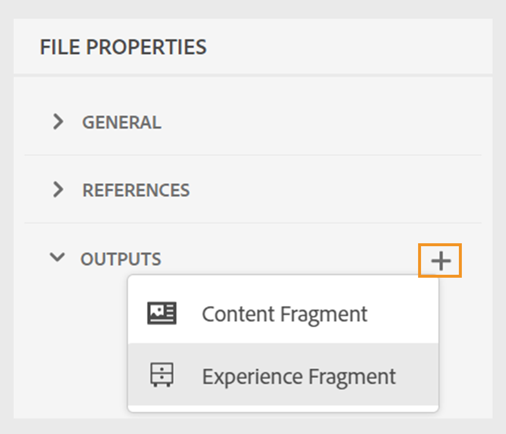

# Publish Experience Fragments

Experience Fragments sind Bestandteile modularer Inhalte in Adobe Experience Manager. Diese Inhaltsbausteine basieren auf Vorlagen und enthalten sowohl Inhalt als auch Layout. Diese wiederverwendbaren Inhaltselemente ermöglichen es Erstellern von Inhalten, konsistente, skalierbare Erlebnisse über mehrere von Experience Manager unterstützte Kanäle hinweg zusammenzustellen und bereitzustellen. Mit dieser Funktion können Sie auf einfache Weise konsistente Marketing-Erlebnisse effizient erstellen, z. B. Newsletter, Werbebanner und Kundenaussagen.

Mit Experience Manager Guides können Sie ein Thema oder dessen Elemente in einem Experience Fragment veröffentlichen. Sie können eine JSON-basierte Zuordnung zwischen einem Thema und seinen Elementen in einem Experience Fragment erstellen. Verwenden Sie dann die Zuordnung, um ein Thema oder seine Elemente in einem Experience Fragment zu veröffentlichen. Anschließend können Sie Experience Fragments in jeder Experience Manager-Site verwenden oder die Details über APIs extrahieren, die von Experience Fragments unterstützt werden.

Um ein Experience Fragment zu generieren, führen Sie die folgenden Schritte aus:

1. Erstellen Sie einen Ordner in den Experience Fragments. Verwenden Sie diesen Ordner, um die Experience Fragments zu speichern, die Sie basierend auf den Experience Fragment-Vorlagen erstellen. Beispiel: *sales-experience-fragments*.
1. Wählen Sie den Ordner aus und klicken Sie oben auf das Symbol **Eigenschaften** .
1. Bearbeiten Sie die Eigenschaften des Ordners (z. B. *sales-experience-fragments*).

   * **Titel**: Zeigen Sie den Titel des Ordners an oder bearbeiten Sie ihn.

   * **Zulässige Vorlagen**: Enthält die Liste der Vorlagen, die als untergeordnete Seiten des Experience Fragment hinzugefügt werden können. Um die zulässige Vorlage hinzuzufügen, geben Sie den regulären Ausdruck zum Abrufen der erforderlichen Vorlagen im Feld **Zulässige Vorlagen** an.
Zum Beispiel:
     `/libs/cq/experience-fragments/components/experiencefragment/template`

     Wenn Sie keine zulässige Vorlage für einen Ordner definieren, werden die Vorlagen standardmäßig aus dem übergeordneten Ordner oder dem Vorlagenordner ausgewählt.
   * **Orderable**: Ermöglicht Ihnen, die Reihenfolge der Assets in einem Ordner zu ändern.
     {width="650" align="left"}
     *Fügen Sie die Cloud-Konfiguration in den Ordnereigenschaften hinzu, um sie mit den Fragmentvorlagen zu verbinden.*
1. Um ein Experience Fragment zu generieren, wählen Sie **Neue Ausgabe**  aus dem Abschnitt **Ausgaben** in den **Dateieigenschaften** eines Themas.
1. Wählen Sie **Experience Fragment** aus.\
   Registerkarte {width="300" align="left"}

   *Fügen Sie ein neues Experience Fragment aus den Dateieigenschaften eines Themas hinzu*.

   >[!NOTE]
   >
   > Sie können ein Experience Fragment auch über die **Repository-Ansicht** veröffentlichen. Wählen Sie das Thema aus, das Sie als Experience Fragment veröffentlichen möchten. Wählen Sie dann im Menü **Optionen** die Option **Publish As** > **Experience Fragment** aus.

1. Füllen Sie im Dialogfeld **Erlebnisfragment erzeugen** die folgenden Details aus:
   {width="500" align="left"}

   *Fügen Sie den Pfad, die Vorlage und die Zuordnungsdetails hinzu, um ein Thema oder seine Elemente als Experience Fragment zu veröffentlichen. Sie können ein vorhandenes Experience Fragment überschreiben.*

   * **Pfad**: Durchsuchen Sie den Pfad des Ordners, in dem Sie das Experience Fragment veröffentlichen möchten, und wählen Sie ihn aus. Sie können auch ein vorhandenes Experience Fragment auswählen und erneut veröffentlichen.
   * **Titel**: Geben Sie den Titel des Experience Fragment ein. Standardmäßig wird der Titel mit dem Titel des Themas gefüllt. Sie können sie bearbeiten. Mit diesem Titel wird der Name des Experience Fragment generiert.
   * **Name**: Geben Sie den Namen des Experience Fragment ein. Standardmäßig wird der Name mit dem Titel des Themas ausgefüllt und die Leerzeichen werden durch &quot;_&quot;ersetzt. Beispiel: *sample_experience_fragment*. Sie können sie bearbeiten. Mit diesem Namen wird die URL für das Experience Fragment generiert.
   * **Vorlage**: Wählen Sie die Experience Fragment-Vorlage aus, die Sie zum Erstellen Ihres Experience Fragment verwenden möchten. Die Vorlagen werden aus dem Ordner ausgewählt, den Sie in den Eigenschaften konfiguriert haben.
   * **Mapping**: Hiermit wird die Zuordnung aus der Datei *experienceFragmentMapping.json* ausgewählt und angezeigt.

     Ihr Administrator kann die Zuordnungen zur Datei *experienceFragmentMapping.json* hinzufügen.  Weitere Informationen zum Erstellen einer Zuordnung zwischen einem Thema und einem Experience Fragment ](../cs-install-guide/conf-experience-fragment-mapping-cs.md) finden Sie im Installations- und Konfigurationshandbuch.[

   * Sie können auch verschiedene Bedingungen auswählen, um den Inhalt zu veröffentlichen.  Wählen Sie eine der folgenden Optionen aus:

      * **None**: Wählen Sie diese Option, wenn Sie keine Bedingung auf die veröffentlichte Ausgabe anwenden möchten.
      * **DITAVAL verwenden**: Wählen Sie die DITAVAL-Datei aus, um personalisierte Inhalte zu generieren. Sie können die DITAVAL-Datei über das Dialogfeld &quot;Durchsuchen&quot;oder durch Eingabe des Dateipfads auswählen.
      * **Verwenden von Attributen**: Sie können Bedingungsattribute in Ihren DITA-Themen definieren. Wählen Sie dann das Bedingungsattribut aus, um den relevanten Inhalt zu veröffentlichen.

     >[!NOTE]
     > 
     >Bedingungen werden nur aktiviert, wenn im Thema Bedingungsattribute definiert sind.

   * Aktivieren Sie das Kontrollkästchen **Vorhandenen Inhalt überschreiben** , wenn Ihr Experience Fragment bereits vorhanden ist und Sie es überschreiben möchten. Experience Manager Guides zeigt einen Fehler an, wenn Sie das Kontrollkästchen nicht aktivieren und Ihr Experience Fragment bereits vorhanden ist.
1. Klicken Sie auf **Erzeugen** , um das Experience Fragment zu veröffentlichen.
1. Sie können die Experience Fragments für ein Thema im Abschnitt **Ausgaben** in den **Dateieigenschaften** anzeigen. Die Experience Fragments werden entsprechend dem Datum und der Uhrzeit ihrer Veröffentlichung angezeigt, wobei die neueste Version die erste ist.

   {width=300 align=&quot;left&quot;}

   *Zeigen Sie die für ein Thema vorhandenen Experience Fragments an und veröffentlichen Sie sie erneut.*

Nachdem Sie die Experience Fragments veröffentlicht haben, können Sie sie auch auf jeder beliebigen Adobe Experience Manager-Site verwenden.

## Optionen-Menü für ein Experience Fragment

Sie können auch die folgenden Aktionen für ein Experience Fragment über das Menü **Optionen** durchführen:

* **Generieren**: Veröffentlichen Sie das Experience Fragment erneut, um es mit dem neuesten Inhalt aus dem DITA-Thema zu aktualisieren. Wenn Sie die Ausgabe neu generieren, können Sie den Pfad, den Namen, den Titel und die Vorlage des Experience Fragment nicht ändern. Sie können jedoch beim erneuten Generieren der Ausgabe unterschiedliche Bedingungen auswählen.

* **Duplizieren**: Duplizieren Sie ein Experience Fragment. Sie können den Pfad, den Namen, den Titel und die Vorlage ändern. Sie können beim Duplizieren eines Experience Fragment auch andere Bedingungen auswählen.

* **Entfernen**: Entfernt ein Experience Fragment aus der Ausgabeliste. Eine Bestätigungsaufforderung wird angezeigt. Nach der Bestätigung wird das Experience Fragment aus der Liste **Ausgaben** entfernt. Das Experience Fragment wird jedoch nicht aus dem Ordner gelöscht.

* **Ansicht**: Anzeigen des Experience Fragment-Editors. Sie können auch Änderungen vornehmen und speichern.
