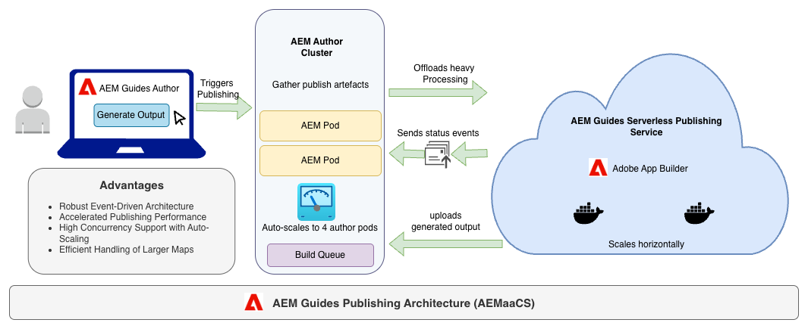

# Häufig gestellte Fragen

Im Folgenden finden Sie eine Liste von Antworten auf häufig gestellte Fragen, die detaillierte Einblicke in die Verwaltung von Veröffentlichungs-Workflows, Skalierungsverhalten und Infrastrukturleistung durch Adobe Experience Manager Guides bieten. Es richtet sich an Benutzer in Unternehmen, Administratoren und Dokumentations-Teams, die Experience Manager Guides für die Veröffentlichung in großem Maßstab verwenden. In der Abbildung wird der gesamte Workflow der Experience Manager Guides-Veröffentlichungsarchitektur erläutert.

## Wie viele Veröffentlichungsanfragen kann Experience Manager Guides pro Tag ausführen?

Die Anzahl der Veröffentlichungsanfragen, die Experience Manager Guides pro Tag verarbeiten kann, hängt von der Größe und dem Typ des Inhalts ab. Gemäß der Konfiguration ermöglicht das System einen Veröffentlichungsauftrag pro Prozessorkern. Beim aktuellen Setup können 20 Veröffentlichungsaufträge parallel ausgeführt werden (2 Pods × je 10 Kerne).

Wenn die Produktionsumgebung automatisch skaliert wird, kann diese Zahl auf 40 gleichzeitige Veröffentlichungsaufträge ansteigen, wenn die Pods auf 4 skaliert werden.

## Wie viele Veröffentlichungsanfragen können gleichzeitig ausgeführt werden, bevor sie in die Warteschlange gestellt werden?

- Minimum (Standard): 20 Veröffentlichungsaufträge (2 Pods)
- Maximal (skaliert): 40 Veröffentlichungsaufträge (4 Pods)

Diese Zahl kann je nach Gesamtauslastung des Servers variieren. Wenn andere Hintergrund-Sling-Aufträge ausgeführt werden, nutzen sie gemeinsame Verarbeitungskerne, wodurch die gleichzeitige Ausführung möglicherweise auf unter 20 reduziert wird.

## Hat die Ausführung mehrerer Veröffentlichungsanfragen Auswirkungen auf andere Anwendungsfunktionen, z. B. die Bearbeitung von DITA-Dateien?

Es kann Leistungseinbußen geben, die jedoch im Allgemeinen minimal sind. Die meisten Verarbeitungsvorgänge erfolgen zur I/O-Laufzeit (Server-loser Publishing-Service), während die AEM-Instanz hauptsächlich I/O-Vorgänge zur Erstellung von Abhängigkeiten und zum Abrufen des Status ausführt. Infolgedessen bleibt die CPU-Auslastung innerhalb von AEM gering und das Authoring-/Bearbeitungserlebnis ist größtenteils unbeeinflusst.

## Wie verwaltet Experience Manager Guides große Dateien und Grafiken wie SVGs oder DITA-Dateien mit mehr als 500 KB?

Alle großen Dateien werden komprimiert und im JCR (Java Content Repository) gespeichert. Die IO-Laufzeitumgebung ruft das gesamte ZIP-Paket ab, bevor die Veröffentlichung gestartet wird. Selbst bei der Verarbeitung mehrerer großer Dateien (z. B. jeweils 500 KB) wirkt sich dies aufgrund der optimierten Verpackung und der parallelen I/O-Handhabung nicht wesentlich auf die Download- oder Übertragungsgeschwindigkeit aus.

## Welche Veröffentlichungsinfrastruktur und -konfiguration wird von Experience Manager Guides verwendet?

Experience Manager Guides verwendet containerisierte, Server-lose Microservices für die Veröffentlichung. Jede neue Version des Publishing-Service wird als Docker-Image veröffentlicht, das automatisch in der Cloud-Umgebung von Adobe bereitgestellt wird. Dieses Design stellt Folgendes sicher:

- Keine dedizierte Wartung der Infrastruktur für Kunden
- Automatische Skalierung zur Handhabung des Veröffentlichungsbedarfs
- Schnelle Updates und minimale Ausfallzeiten

## Wenn die Veröffentlichungswarteschlange oder das Verwaltungssystem aufgrund von Überlastung abstürzt, sind dann andere AEM-Funktionen betroffen?

Nein, der Experience Manager Guides ist in einer fehlertoleranten Architektur aufgebaut. Wenn die Publishing-Warteschlange überlastet ist, werden Anfragen automatisch wiederholt und Pods automatisch skaliert, um die zusätzliche Last zu verarbeiten. Ab einem bestimmten Schwellenwert wird eine Lastdrosselung angewendet, um die Stabilität aufrechtzuerhalten. Andere Anwendungsbereiche (Authoring, Überprüfung, Asset-Management) bleiben davon unberührt.

## Gibt es ein Überwachungs-Tool oder Protokollzugriff, um festzustellen, wann Experience Manager Guides stark ausgelastet ist (ähnlich wie bei der Jenkins-Überwachung)?

Nein, Sie haben derzeit keinen Zugriff auf interne Überwachungs-Tools. Für interne Adobe-Teams kann die Überwachung wie folgt durchgeführt werden:

- Splunk für Protokoll- und Fehlerverfolgung
- Kubernetes (K8s)-CLI zur Überprüfung der Leistung auf Pod-Ebene und des Skalierungsverhaltens

Wenn eine Leistungsbeeinträchtigung festgestellt wird, sollten sich Kunden an den Adobe-Support wenden, um Ermittlungen und Analysen einzuleiten.

## Welche Verarbeitung erfolgt, bevor eine Veröffentlichungsanfrage an den Microservice gesendet wird?

Beim Trigger einer Veröffentlichungsanfrage über die Registerkarte „Vorgaben“ in der Zuordnungskonsole werden folgende Schritte ausgeführt:

1. Das System akzeptiert die Anfrage und validiert die Grundlinien- und bedingten Voreinstellungen.
2. AEM aggregiert alle qualifizierten DITA-Assets und -Abhängigkeiten.
3. Diese Assets werden in einem ZIP-Paket gebündelt.
4. Der Server-lose Veröffentlichungs-Service dreht einen Docker-Container hoch, lädt die Assets herunter, führt den Veröffentlichungsvorgang aus und platziert die generierten Ausgabe-Artefakte wieder in Experience Manager Guides.

Dieser Workflow stellt eine zuverlässige, isolierte und skalierbare Veröffentlichungsausführung sicher.

## Wie lange dauert eine Zuordnung, bis sie im Microservice-Container veröffentlicht wird, und welche Faktoren bestimmen diese Zeit?

Eine Veröffentlichungsanfrage dauert in der Regel einige Minuten, bevor sie an den Microservice-Container gesendet wird. Diese Anfangszeit wird für die Abhängigkeitsaggregation in AEM verwendet.

Sobald die Anfrage auf dem Server-losen Veröffentlichungs-Service empfangen wurde, hängt die gesamte Veröffentlichungszeit von Folgendem ab:

- Größe der DITA-Zuordnung
- Anzahl der Themen und Medien-Assets
- Komplexität von bedingten Inhalten und Formatierungsregeln

Die Veröffentlichung größerer oder komplexerer Karten kann proportional länger dauern.

## Kann Experience Manager Guides Veröffentlichungsanfragen in der Warteschlange priorisieren (anstelle von „first-come“, „first-serve„)?

Derzeit werden alle Veröffentlichungsaufträge gleich behandelt und folgen einem First-Come-, First-Serve-(FCFS)-Modell. Derzeit ist kein Mechanismus zur Priorisierung verfügbar.

In zukünftigen Versionen könnte jedoch eine Priorisierungslogik (z. B. auf der Grundlage der Auftragsgröße oder der geschäftlichen Bedeutung) als Teil von Verbesserungen der Warteschlangenoptimierung eingeführt werden.

## Wie handhabt Experience Manager Guides die automatische Skalierung für Veröffentlichungsanfragen?

Experience Manager Guides Publishing Infrastructure unterstützt die automatische Skalierung auf der Grundlage der Auslastung. Bei steigender Veröffentlichungsnachfrage:

- Zusätzliche Pods (Container) werden automatisch erzeugt.
- Jeder Pod kann mehrere Veröffentlichungsaufträge parallel verarbeiten.
- Sobald die Auslastung abnimmt, skalieren Pods herunter, um Kosten und Leistung zu optimieren.

Dies gewährleistet hohe Verfügbarkeit, konsistente Leistung und minimale Warteschlangenzeiten bei Spitzenlast.

## Was passiert, wenn ein Veröffentlichungsauftrag fehlschlägt oder eine Zeitüberschreitung auftritt?

Wenn eine Veröffentlichungsanfrage aufgrund eines vorübergehenden Problems fehlschlägt (z. B. Netzwerkunterbrechung, Service-Zeitüberschreitung):

- Es wird automatisch ein erneuter Zustellversuch basierend auf der im Veröffentlichungs-Service konfigurierten Wiederholungslogik unternommen.
- Protokolle und Fehlermeldungen werden zu Diagnosezwecken im Backend erfasst.
- Sie können den Fehlerstatus anzeigen und die Veröffentlichung bei Bedarf manuell über die Zuordnungskonsole wiederholen.

## Können Sie den Fortschritt eines Veröffentlichungsauftrags überwachen oder verfolgen?

Ja, Experience Manager Guides bietet auf der Registerkarte „Voreinstellungen“ der Zuordnungskonsole Echtzeit-Statusaktualisierungen für Aufträge, darunter:

- Start- und Abschlusszeit des Auftrags
- Aktuelles Stadium (Komprimieren, Versenden, Veröffentlichen oder Hochladen von Ergebnissen)
- Fehlerbenachrichtigungen (falls vorhanden)

Dies hilft Ihnen, den Auftragsfortschritt zu verstehen und potenzielle Verzögerungen zu identifizieren.

## Welche Best Practices können die Veröffentlichungsleistung in Experience Manager Guides verbessern?

Befolgen Sie die folgenden Best Practices, um eine optimale Veröffentlichungsgeschwindigkeit sicherzustellen:

- Vermeiden Sie unnötige große Bilddateien oder nicht referenzierte Themen
- Verwenden von Baselines zur Begrenzung des Veröffentlichungsumfangs
- Verwalten und Organisieren der DITA-Zuordnungshierarchien
- Planen umfangreicher Veröffentlichungen außerhalb der Spitzenzeiten
- Effektive Verwendung bedingter Filter zur Verringerung der Verarbeitungslast
