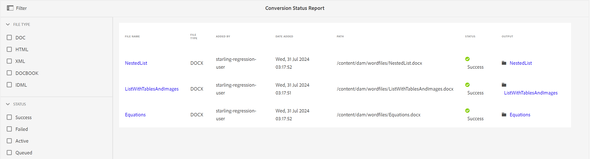

# Bericht zum Konversionsstatus {#id205BBA00WZZ}

Adobe Experience Manager Guides bietet eine leistungsstarke Konvertierungsfunktion zum Konvertieren von Dokumenten in verschiedene Formate in DITA. Der Konversionsstatusbericht bietet eine konsolidierte Ansicht aller von Experience Manager Guides ausgeführten Konversionsaufgaben.

Führen Sie die folgenden Schritte aus, um den Konversionsstatusbericht anzuzeigen:

1. Klicken Sie oben auf das Adobe Experience Manager-Logo und anschließend auf **Tools**.

1. Wählen Sie **Guides** aus der Liste der Tools aus.

1. Wählen Sie die **Konversionsstatusbericht** aus.

   Der Konversionsstatusbericht wird für alle im System ausgeführten Konvertierungsaufgaben angezeigt.

   {width="800" align="left"}

1. Die Berichtseite ist in zwei Teile unterteilt:

   - **filter:**

     Sie können die Berichtsdaten nach Dateityp und Konvertierungsstatus filtern. In der Datei können Sie die Berichtsdaten für Word-Dokumente, strukturierte HTML-, XML-, DocBook- und IDML-Dokumente anzeigen. Im Status können Sie die Berichtsdaten für Aufgaben anzeigen, die erfolgreich ausgeführt wurden, fehlgeschlagen sind, aktiv sind oder sich in der Warteschlange befinden.

     Im folgenden Screenshot werden die Berichtsdaten für Konversionsaufgaben mit dem Status Erfolgreich angezeigt.

     {width="800" align="left"}

   - **Berichtsdaten:**

     Die Berichtsdaten enthalten die folgenden Spalten:

      - **Dateiname**: Name der Quelldatei, für die der Konvertierungsprozess ausgeführt wurde. Wenn Sie den Link Dateiname auswählen, gelangen Sie zum Speicherort des Quelldokuments.

      - **Dateityp**: Typ des Quelldokuments, bei dem es sich um Word, strukturierte HTML, XML, IDML und DocBook handeln kann.

      - **Hinzugefügt von**: Name des Benutzers, der die Konvertierungsaufgabe ausgeführt hat.

      - **Datum hinzugefügt**: Datum, an dem die Aufgabe ausgeführt wurde. Durch Klicken auf den Link Datum hinzugefügt wird die Protokolldatei heruntergeladen.

      - **Path**: Vollständiger Pfad des Quelldokuments.

      - **Status**: Status der Konversionsaufgaben - Erfolg, Fehlgeschlagen, Aktiv oder In Warteschlange.

      - **Ausgabe**: Pfad des erfolgreich konvertierten Dokuments. Wenn Sie auf den Link Ausgabe klicken, gelangen Sie an den Speicherort, an dem die Ausgabe gespeichert wird.

**Übergeordnetes Thema:**[ Einführung in Berichte](reports-intro.md)
