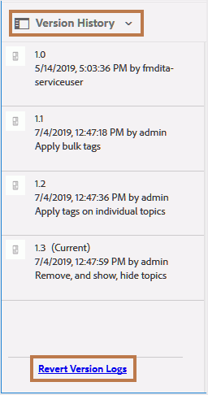

# Versionsverlauf wiederhergestellter Dateien - Bericht {#id205BBC00PRK}

Wenn Sie an mehreren gleichzeitigen Versionen zusammen mit mehreren Autoren arbeiten, ist es erforderlich, dass Ihr Inhalt über mehrere Versionen verfügt. Es kann einige allgemeine Informationen über mehrere Versionen hinweg geben, die verschiedene Autoren in ihrem Projekt verwenden können. Um solche Arbeitszuweisungen zu verarbeiten, könnten Autoren mehrere Versionen von Dateien erhalten. Bei solchen Versionen kann es sich einfach um eine neuere Version einer Datei oder um eine frühere Version handeln. Es ist eine komplexe Aufgabe, zu ermitteln, wann und warum eine Datei zurückgesetzt wurde.

Mit AEM Guides können Sie einen Versionsverlaufsbericht für eine einzelne Datei oder für alle Dateien in einem Ordner erstellen. Dieser Versionsverlauf gibt Ihnen einen Überblick über alle Versionen einer Datei, die zurückgesetzt wurden und die diese Versionen erstellt haben, sowie den Grund für die Erstellung dieser Versionen.

Der Zugriff auf diesen Bericht ist an folgenden Stellen möglich:

- **Assets UI**: Wählen Sie eine Datei aus und öffnen Sie in der linken Leiste den **Versionsverlauf**. Die Ansicht **Versionsverlauf** enthält den Link **Versionsprotokolle wiederherstellen** unten im Bedienfeld. Wenn Sie auf diesen Link klicken, wird der Verlauf der ausgewählten Datei mit den wiederhergestellten Versionen angezeigt.

  {width="300" align="left"}

- **Themenvorschau**: Wenn Sie ein Thema in der Vorschau anzeigen, können Sie auch das Bedienfeld **Versionsverlauf** von der linken Leiste aus aufrufen. Sie erhalten ein Bedienfeld ähnlich der Benutzeroberfläche von Assets, von dem aus Sie auf den Link **Versionsprotokolle wiederherstellen** klicken können, um auf den wiederhergestellten Versionsverlauf des aktiven Dokuments zuzugreifen.

- **AEM Tools-Abschnitt**: Sie können auch über den Abschnitt &quot;AEM Tools&quot;auf diesen Bericht zugreifen. Im folgenden Verfahren wird erläutert, wie Sie über den Abschnitt &quot;AEM Tools&quot;auf den Verlauf der Zurückkehrversion zugreifen können.

Führen Sie die folgenden Schritte aus, um auf den Bericht Verlauf zurücksetzen zuzugreifen:

1. Klicken Sie oben auf den Adobe Experience Manager-Link und wählen Sie **Tools** aus.

1. Wählen Sie **Guides** aus der Liste der Tools aus.

1. Klicken Sie auf die Kachel **Versionsverlauf wiederherstellen** .

   Es wird eine leere Seite Versionsverlauf wiederherstellen angezeigt, auf der Sie eine Datei oder einen Ordner durchsuchen und auswählen müssen, um den Bericht zu generieren.

1. Klicken Sie auf **Protokolle anzeigen** , um den Bericht für die ausgewählte Datei oder den ausgewählten Ordner zu generieren.

   {width="800" align="left"}

   Der Bericht enthält folgende Details:

   - **Dateiname**: Der Titel des Themas. Durch Klicken auf den Titel-Link des Themas wird die Themenvorschau geöffnet.

   - **Zeitstempel**: Datum und Uhrzeit, zu der das Thema auf eine frühere Version zurückgesetzt wurde.

   - **Benutzer**: Name des Benutzers, der zu einer früheren Version zurückgekehrt ist.

   - **Aus** zurücksetzen: Die ursprüngliche Versionsnummer der Datei, von der sie zurückgesetzt wurde.

   - **Auf** zurücksetzen: Die Version, auf die die Datei zurückgesetzt wurde.

   - **Kommentar**: Jeder Kommentar des Benutzers, der die Datei zurückgesetzt hat.

**Übergeordnetes Thema:**[ Berichte](reports-intro.md)
