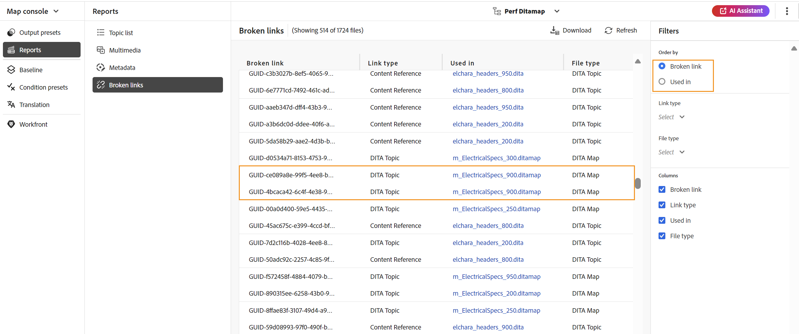

# DITA-Zuordnungsbericht über die Zuordnungskonsole {#id231HF0Z0NXA}

Adobe Experience Manager Guides verfügt über eine Funktion in der Zuordnungskonsole , mit der Sie die Gesamtintegrität Ihrer Zuordnung überprüfen und Berichte dafür generieren können.

Sie können die Themenliste anzeigen, die Metadaten aller Verweise verwalten, die Multimedialiste anzeigen und alle fehlerhaften Links für die aktuelle Zuordnung auf der Registerkarte **Berichte** in der Zuordnungskonsole beheben, auf die Sie wie folgt zugreifen können:

1. Öffnen Sie **Bedienfeld** Repository“ die DITA-Zuordnungsdatei in der Zuordnungsansicht.

   >[!NOTE]
   >
   > Sie können eine DITA-Karte auch direkt in der Registerkarte **Map-**&quot; in der Dropdown-Liste links oben auf der Startseite öffnen.

1. Wählen Sie das Symbol **In Map-Konsole öffnen** aus.

   {width="600" align="left"}

1. Wählen **Berichte** im linken Bedienfeld aus.

Sie können alle vier Berichte über das Bedienfeld **Berichte** finden. Je nach Bedarf können Sie einen der Berichte wie hier gezeigt auswählen.

{align="left"}

Das Bedienfeld „Berichte“ bietet Zugriff auf vier verschiedene Berichtstypen. Jeder Bericht wird zusammen mit seiner Barrierefreiheit und seinen Funktionen im Folgenden detailliert erläutert.

## Bericht zur Themenliste

Der **Themenliste**-Bericht enthält detaillierte Informationen zu Ihren Themen, z. B. den Referenztyp, den Dokumentstatus und den Autor.

Sie können den Themenlistenbericht einer Zuordnung anzeigen, indem Sie die folgenden Schritte ausführen:

1. Wählen **Themenliste** im Bedienfeld Berichte aus. Die Liste der in der DITA-Karte vorhandenen Themen wird angezeigt.

   {align="left"}

1. Im Bedienfeld **Filter** können Sie Ihre Themen nach **Verweistyp** \(direkt oder indirekt\), **Dokumentstatus** \(wenn sich Ihre Themen beispielsweise im Status Bearbeiten, In Überprüfung oder Überprüft befinden, werden diese aufgelistet\) oder **Autor** des Themas filtern.

   >[!NOTE]
   >
   > Alle Filter bieten eine erschöpfende Liste der im System vorhandenen Optionen.

1. Sie können auch die folgenden Themenfilteroptionen verwenden, um die folgenden Spalten in der Liste anzuzeigen:

   - **Titel** Der Titel des Themas wird in der DITA-Zuordnung angegeben. Sie können das Thema auswählen, um es zu bearbeiten.
   - **Dateiname** Name der Datei.
   - **UUID** Die universell eindeutige Kennung \(UUID\) der Datei.
   - **Dateispeicherort** Der vollständige Pfad des Themas.
   - **Referenztyp** Der Referenztyp - direkt oder indirekt.
   - **Dokumentstatus** Der Status des Themas.
   - **Autor** Der Benutzer, der zuletzt an dem Thema gearbeitet hat. Die Liste wird paginiert und asynchron geladen, sodass nur eine begrenzte Anzahl von Benutzern gleichzeitig angezeigt wird und beim Scrollen oder Navigieren mehr abgerufen wird. Dies verbessert die Ladegeschwindigkeit und die Gesamtleistung, insbesondere bei der Arbeit mit einer großen Anzahl von Benutzern.
   - **Übergeordnete Zuordnung** Die Liste aller Zuordnungen, auf die das Thema direkt verwiesen wird.
   >[!NOTE]
   >
   > Wählen Sie **Aktualisieren**, um eine neue Themenliste zu erhalten und Änderungen in Ihrer Zuordnungsdatei oder Verweise in Ihrer Themendatei anzuzeigen.

1. Wählen Sie **Herunterladen**, um den Schnappschuss aller Themen in der DITA-Karte herunterzuladen. Das Excel-Arbeitsblatt enthält die ausgewählten Spalten und Themen, die in der Ansicht **Themenliste** gefiltert wurden.

## Metadatenbericht

Der **Metadatenbericht** liefert einen detaillierten Bericht Ihrer Referenzen in der aktuellen DITA-Zuordnung, z. B. Referenztyp, Dokumentstatus, Tags, Dateispeicherort usw.

Sie können den Metadatenbericht einer Zuordnung anzeigen, indem Sie die folgenden Schritte ausführen:

1. Wählen **Metadaten** im Bedienfeld „Berichte“ aus. Die Liste aller Verweise einer Zuordnung wird zusammen mit den Metadaten wie Tags, dem Dokumentstatus und den benutzerdefinierten Metadaten angezeigt. Informationen zum Hinzufügen einer neuen benutzerdefinierten Metadatenspalte finden Sie [ Abschnitt Hinzufügen benutzerdefinierter ](#add-custom-metadata-columns) .

   {align="left"}

1. Im Bedienfeld **Filter** können Sie Ihre Themen nach dem **Dokumentstatus** \(z. B. wenn Ihre Themen den Status „Bearbeiten“, „In Überprüfung“ oder „Überprüft“ aufweisen, werden diese aufgelistet\), **Verweise** \(direkt oder indirekt\), **Dateityp** \(Zuordnung, Thema, Dokument, Bild, Video und andere\) der Referenz.

   >[!NOTE]
   >
   > Alle Filter bieten eine erschöpfende Liste der im System vorhandenen Optionen.

1. Sie können auch festlegen, dass nur die **Dateien ohne Tags“ angezeigt werden**, oder auch bestimmte Tags aus dem Filter **Tags** auswählen, um die zugehörigen Dateien anzuzeigen.
1. Sie können auch die folgenden Themenfilteroptionen verwenden, um die folgenden Spalten in der Metadatenliste anzuzeigen:
   - **Titel** \(standardmäßig ausgewählt\) Der Titel der referenzierten Datei wird in der DITA-Zuordnung angegeben. Sie können die Datei auswählen, um sie zu bearbeiten.

     >[!NOTE]
     >
     > Ein ausgechecktes Symbol wird auch neben dem Titel einer ausgecheckten Datei angezeigt. Sie können den Mauszeiger über das Symbol bewegen, um den Namen des Benutzers anzuzeigen.

   - **Dateiname** Der Name der Datei.
   - **Dateispeicherort** Der vollständige Pfad der Datei.
   - **UUID** Die universell eindeutige Kennung \(UUID\) der Datei.
   - **Tags** \(standardmäßig ausgewählt\) Auf die Datei angewendete Tags.

     >[!NOTE]
     >
     > Standardmäßig können Sie zwei Tags für eine Datei anzeigen. Um weitere Tags anzuzeigen, wählen Sie **Weitere anzeigen** aus. Wählen Sie **Weniger anzeigen**, um die Liste erneut zu verkleinern.

   - **Dokumentstatus** \(standardmäßig ausgewählt\) Der aktuelle Status der Referenzdatei.
   - **Referenztyp** Der Referenztyp - direkt oder indirekt
   - **Dateityp** \(standardmäßig ausgewählt) Typ der Quelldatei. Die verfügbaren Optionen sind „Zuordnung“, „Thema“ und „Bild“.
   - **Gesperrt von** Der Benutzer, der die Datei gesperrt hat.

1. Wählen Sie **Herunterladen**, um den Schnappschuss aller Verweise in der DITA-Karte herunterzuladen. Das Excel-Blatt enthält die ausgewählten Spalten und die in der Ansicht **Metadaten** gefilterten Verweise.

### Massenverwaltung von Metadaten aus dem Metadatenbericht

Sie können Tags auf ein einzelnes Thema anwenden oder die Bulk-Tagging-Funktion verwenden, um mehrere Tags auf mehrere Themen, eine DITA-Karte oder eine Unterzuordnung anzuwenden. Sie können auch den Dokumentstatus aller ausgewählten Themen in den nächstmöglichen allgemeinen Dokumentstatus ändern.

### Metadaten aktualisieren

Um Metadaten zu aktualisieren, führen Sie die folgenden Schritte aus:

1. Um Metadaten zu aktualisieren, wählen Sie die Dateien aus, für die Sie sie aktualisieren möchten. Sie können die Dateien auswählen, die im Bedienfeld „Metadaten“ angezeigt werden, indem Sie das Kontrollkästchen neben &quot;**&quot;**. Wenn Sie alle Datensätze auswählen möchten, verwenden Sie die Registerkarte **Alle auswählen** über der Titelleiste, wie unten dargestellt.

   >[!NOTE]
   >
   > Sie können keine ausgecheckten Dateien auswählen. Ein ausgechecktes Symbol wird auch neben dem Titel einer ausgecheckten Datei angezeigt. Sie können den Mauszeiger über das Symbol bewegen, um den Namen des Benutzers anzuzeigen.

   {align="left"}

1. Wählen **oben** Verwalten“ aus.

   {width="350" align="left"}

1. Wenn Sie neue Tags hinzufügen möchten, wählen Sie in der Dropdown-Liste neue Tags aus, um sie auf alle ausgewählten Themen anzuwenden. Sie können auch jedes Tag löschen, indem Sie auf das Kreuz-Symbol neben dem Tag klicken.

   >[!NOTE]
   >
   > Die allgemeinen Tags, die auf alle ausgewählten Themen angewendet werden, werden aufgelistet.

1. Wählen Sie einen neuen Dokumentstatus aus, wenn Sie den Dokumentstatus aller ausgewählten Verweise ändern möchten. Die Dropdown-Liste zeigt den allgemeinen möglichen Status für alle ausgewählten Themen an. Wenn der aktuelle Status Ihrer Themen beispielsweise In Überprüfung ist, können Sie den Status Entwurf, Genehmigt oder Überprüft anzeigen.
1. Wählen Sie **Aktualisieren** aus, um die Metadaten zu aktualisieren. Für die Metadaten wird eine Bestätigungsmeldung angezeigt, unabhängig davon, ob sie erfolgreich aktualisiert wurden oder ob Aktualisierungen fehlgeschlagen sind. Sie können auch **Bericht herunterladen** auswählen, um den Schnappschuss des Berichts herunterzuladen. Dieser Snapshot enthält die Details des aktualisierten Status für die ausgewählten Referenzen.

### Hinzufügen benutzerdefinierter Metadatenspalten

Mit dieser Funktion können Sie je nach Bedarf benutzerdefinierte Metadatenspalten hinzufügen, die dann in den Metadatenberichten angezeigt werden. Darüber hinaus bietet es eine größere Flexibilität beim Reporting von Metadaten. Um eine neue benutzerdefinierte Metadatenspalte hinzuzufügen, führen Sie die folgenden Schritte aus:

1. Um eine benutzerdefinierte Metadatenspalte hinzuzufügen, wählen Sie **Workspace** (angezeigt als **Einstellungen** für **On-Premise**) aus den drei Punkten oben rechts auf der Metadatenseite.

   {width="600" align="left"}

1. Wählen Sie **Metadaten** im linken Bereich des angezeigten Popup-Fensters aus.
1. Fügen Sie ein neues benutzerdefiniertes Metadatenfeld gemäß der Anforderung mithilfe der Registerkarte **Hinzufügen** hinzu.

   {width="600" align="left"}

1. Geben Sie einen bestimmten Metadatenpfad und einen entsprechenden Titel für denselben Pfad an, den Sie in den Spalten des Metadatenberichts hinzufügen möchten. Beispiel: Benutzerdefinierte Metadaten mit der Titelsprache und einem bestimmten Pfad werden hinzugefügt.

   >[!NOTE]
   >
   > Wenn Sie eine bestimmte Metadatenspalte entfernen möchten, können Sie sie aus der angezeigten Liste löschen. Darüber hinaus können Sie den **Titel** bearbeiten, um den Anzeigetitel der Spalte zu ändern.

   {width="600" align="left"}

1. Wählen Sie **Metadatenansicht** Speichern **und** Aktualisieren) aus. Eine neue benutzerdefinierte Spalte **Sprache** wird der Liste der Spalten im Filterbereich hinzugefügt.

   >[!NOTE]
   >
   > Das Hinzufügen einer neuen Metadatenspalte wird auch im Bedienfeld **Versionsverlauf** im Editor angezeigt. Weitere Informationen finden Sie unter **[Metadaten](web-editor-features.md)**.

   {width="600" align="left"}

Ebenso können Sie die oben genannten Schritte ausführen, um neue benutzerdefinierte Metadatenfelder hinzuzufügen, die basierend auf Ihrer Anforderung in den Metadatenberichten benötigt werden.

## Multimedia-Bericht

Der Bericht **Multimedia** enthält detaillierte Informationen zu den in Ihrer Zuordnung verwendeten Multimedia-Dateien, z. B. den Titel, den Typ \(Audio, Video und Bilder\), die Dateien, in denen Multimedia verwendet wird, und den Referenztyp der Dateien, in denen sie verwendet wurden. Sie können auch die UUID und den Speicherort des Multimediums im Repository anzeigen. Führen Sie die folgenden Schritte aus, um einen Bericht zu den Multimedia-Inhalten anzuzeigen:

1. Wählen Sie **Multimedia** im Bedienfeld Bericht aus. Die Liste der in der DITA-Karte vorhandenen Multimedia-Inhalte wird angezeigt.
1. Im Bedienfeld **Filter** können Sie die Liste nach Multimedia oder nach den in Verweisen verwendeten Namen sortieren.

   - Bei der Sortierung nach **Multimedia** wird der Name des Multimediums in der ersten Spalte angezeigt und dann werden die Namen aller Verweise, in denen sie verwendet wurden, in einer anderen Spalte in derselben Zeile angezeigt. Beispielsweise zeigt der folgende Screenshot die Multimedia-Datei testSong.mp3 in der ersten Spalte und zwei Verweise, in denen sie verwendet wird, werden in der dritten Spalte in derselben Zeile angezeigt.

     {width="650" align="left"}

   - Wenn Sie nach **Verwendet in** Spalte sortieren, sehen Sie die transponierte Ansicht, in der die Namen der Verweise, in denen Multimedia verwendet wurde, in der ersten Spalte aufgeführt sind, während die Multimedianamen in einer anderen Spalte in separaten Zeilen aufgeführt sind. Beispiel: Der folgende Screenshot zeigt die Namen zweier Verweise \(testing_direct und video content topic\) in der ersten Spalte und die multimedia testSong.mp3 wird in der dritten Spalte in zwei separaten Zeilen angezeigt.

     {width="650" align="left"}

1. Sie können Ihre Multimedia-Dateien nach **Multimediatyp** und **Verweistyp** filtern. Die Liste der Multimediadateien wird basierend auf Ihrer Auswahl in der Dropdown-Liste angezeigt. Beispielsweise können Sie festlegen, dass nur die Audioreferenzen in Ihrer DITA-Karte angezeigt werden sollen und dass eine Datei nur die darin verwendeten Audioreferenzen anzeigt.

1. Sie können auch die folgenden Filteroptionen verwenden, um die folgenden Spalten in der Liste anzuzeigen:

   - **Multimedia** \(standardmäßig ausgewählt\) Der Titel des Multimediums wird in der DITA-Zuordnung angegeben. Sie können das Multimedia-Element auswählen, um es zu bearbeiten.
   - **Multimedia-Speicherort** Der vollständige Pfad des Multimedia-Elements.
   - **Multimedia-UUID** Die universell eindeutige Kennung \(UUID\) der Datei.
   - **Multimediatyp** \(standardmäßig ausgewählt) Typ des Multimediums. Die verfügbaren Optionen sind Audio, Video oder Bild.
   - **Verwendet in** \(standardmäßig ausgewählt\) Die Referenzen, in denen das Multimedia verwendet wurde. Sie können die Referenz auswählen, um sie zu bearbeiten.
   - **Referenztyp** \(standardmäßig ausgewählt\) Der Referenztyp - direkt oder indirekt.
   >[!NOTE]
   >
   > Wählen Sie **Aktualisieren**, um eine neue Multimedia-Liste zu erhalten und Änderungen in Ihrer Kartendatei oder Multimedia-Dateien in Ihrer DITA-Karte anzuzeigen.

1. Wählen Sie **Herunterladen**, um den Schnappschuss aller Multimedia-Dateien in der DITA-Karte herunterzuladen. Das Excel-Blatt enthält die ausgewählten Spalten und die Multimedia-Dateien, die in der Ansicht **Multimedia** gefiltert wurden.

## Bericht zu fehlerhaften Links

Der **Beschädigte Links** ist ein nützlicher Bericht, der Ihnen die Details der beschädigten Links in Ihrer aktuellen Karte bereitstellt. Sie können die fehlerhaften Links anzeigen, die für DITA-Themen, Multimedia-Dateiverweise, Inhaltsschlüsselverweise usw. verwendet werden können. Sie haben auch die Möglichkeit, sie hier selbst zu reparieren.
Der Bericht enthält detaillierte Informationen wie den fehlerhaften Link, den Link-Typ, die Dateien, in denen der Verweis verwendet wird, und den Typ der Dateien, in denen sie verwendet wurden.
Sie können den Bericht nach fehlerhaften Links anzeigen, indem Sie die folgenden Schritte ausführen:

1. Wählen Sie **Fehlerhafte Links** im Bedienfeld Berichte aus. Die Liste der fehlerhaften Links oder Verweise, die in der DITA-Zuordnung vorhanden sind, wird angezeigt.
1. Im Bedienfeld **Filter** können Sie die Liste nach Links oder nach den in Verweisen verwendeten Namen sortieren.

   - Bei der Sortierung nach **Ungültiger Link** werden die Pfade der fehlerhaften Links in der ersten Spalte und anschließend die Namen aller Verweise, in denen sie verwendet wurden, in einer anderen Spalte in separaten Zeilen angezeigt. Wenn derselbe fehlerhafte Link in mehreren Dateien verwendet wird, werden sie in einer Zeile angezeigt und als gruppierte oder untergeordnete Zeilen angezeigt. Der folgende Screenshot zeigt beispielsweise zwei fehlerhafte Links in der ersten Spalte und die Referenz, in der sie verwendet werden, `m_ElectricalSpecs_900.ditamap` in der dritten Spalte in zwei separaten Zeilen angezeigt wird.

   {align="left"}

   - Bei Sortierung nach **Verwendet in** wird die transponierte Ansicht angezeigt, in der die Namen der Verweise, in denen die fehlerhaften Links verwendet wurden, in der ersten Spalte aufgeführt sind, während die fehlerhaften Links in einer anderen Spalte in derselben Zeile aufgeführt sind. Der folgende Screenshot zeigt beispielsweise den Verweis (in dem der fehlerhafte Link verwendet wird) `m_ElectricalSpecs_900.ditamap` in der ersten Spalte, während die fehlerhaften Links in der dritten Spalte in derselben Zeile angezeigt werden.

   {align="left"}

1. Sie können Ihre fehlerhaften Links nach den **Dateityp** und **Verknüpfungstyp** filtern. Die Liste der fehlerhaften Links wird je nach Auswahl in der Dropdown-Liste angezeigt. Sie können beispielsweise festlegen, dass nur die Inhaltsreferenzen in Ihrer DITA-Karte angezeigt werden sollen und dass eine Datei nur die fehlerhaften Inhaltsreferenzen anzeigt, die darin verwendet werden.

   DITA-Topic, DITA-Map, Dateireferenz, Schlüsselreferenz, Inhaltsreferenz, Inhaltsschlüsselreferenz, Bildreferenz, Multimedia-Dateireferenz und Multimedia-Schlüsselreferenz sind verfügbare Werte für die **Link-Typ**-Dropdown-Liste, und DITA-Topic, DITA-Map, Dokument, Bild, Video, Audio und andere sind verfügbare Werte für die **Dateityp**.
1. Sie können auch die folgenden Filteroptionen verwenden, um die folgenden Spalten in der Liste anzuzeigen:

   - **Beschädigter Link** (standardmäßig ausgewählt) Der Pfad des beschädigten Links ist in der DITA-Zuordnung angegeben.

   - **Verknüpfungstyp** (standardmäßig ausgewählt) Der Typ der Links. Die verfügbaren Optionen sind DITA Topic, DITA Map, Dateireferenz, Schlüsselreferenz, Inhaltsreferenz, Inhaltsschlüsselreferenz, Bildreferenz, Multimedia-Dateireferenz und Multimedia-Schlüsselreferenz.

   - **Verwendet in** (standardmäßig ausgewählt) Die Referenzen, in denen der fehlerhafte Link verwendet wurde. Sie können die Referenz auswählen, um sie im Autorenmodus anzuzeigen.

   - **Dateityp** (standardmäßig ausgewählt) Der Referenztyp - DITA-Thema, DITA-Karte, Dokument, Bild, Video, Audio und andere.

   Wählen Sie **Aktualisieren**, um eine neue Liste fehlerhafter Links zu erhalten und Änderungen in Ihrer Zuordnungsdatei anzuzeigen oder festzustellen, ob ein fehlerhafter Link in Ihrer DITA-Zuordnung aktualisiert wurde.
1. Sie können auf das Symbol **Link reparieren** () klicken, um den fehlerhaften Link zu beheben.

   >[!NOTE]
   >
   > Bewegen Sie den Mauszeiger über den Pfad des fehlerhaften Links unter der Spalte Beschädigter Link , um das Symbol Link reparieren () anzuzeigen.

   Sie können einen Link in beiden Ansichten reparieren - wenn Sie nach (fehlerhaften **) oder** Verwendet in **sortiert**.

   >[!NOTE]
   >
   > Wenn Sie einen fehlerhaften Link reparieren, während Sie nach fehlerhaften Links sortiert haben, wird der Link in allen Dateien korrigiert, in denen er verwendet wird (die in einer einzigen Zeile gruppiert sind).

1. Sie müssen die erforderlichen Referenzdetails im Dialogfeld **Link aktualisieren** aktualisieren. Welche Details im Dialogfeld **Link aktualisieren** erforderlich sind, hängt vom Referenztyp ab.\
   Nachdem Sie einen Link korrigiert haben, wird er nicht mehr unter der Liste der fehlerhaften Links angezeigt. Stattdessen können Sie sie unter der Themenliste oder den Metadaten anzeigen.

1. Wählen Sie **Herunterladen** aus, um den Schnappschuss aller fehlerhaften Links in der DITA-Karte herunterzuladen. Die Excel-Datei enthält die ausgewählten Spalten und die fehlerhaften Links, die in der Ansicht „Beschädigte Links“ gefiltert wurden.

**Übergeordnetes Thema:**[ Einführung in Berichte](reports-intro.md)
