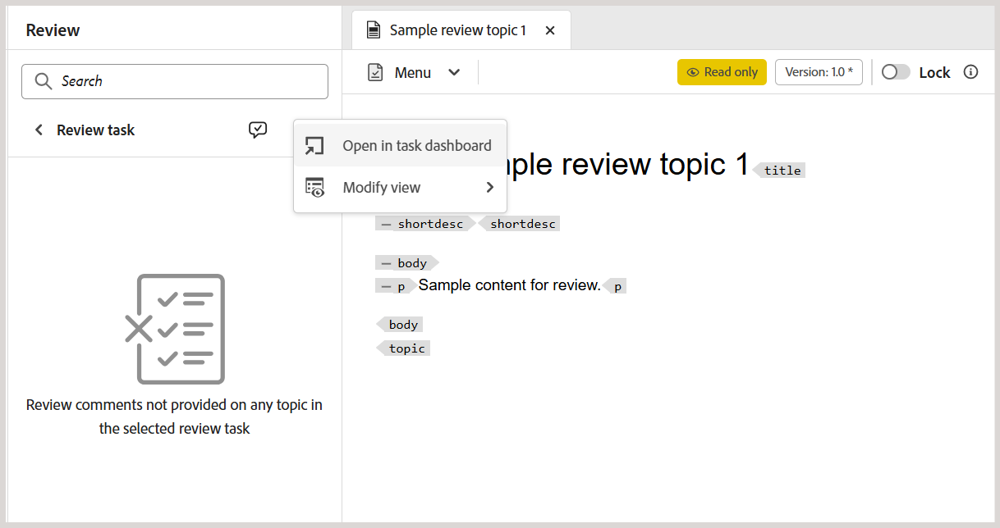
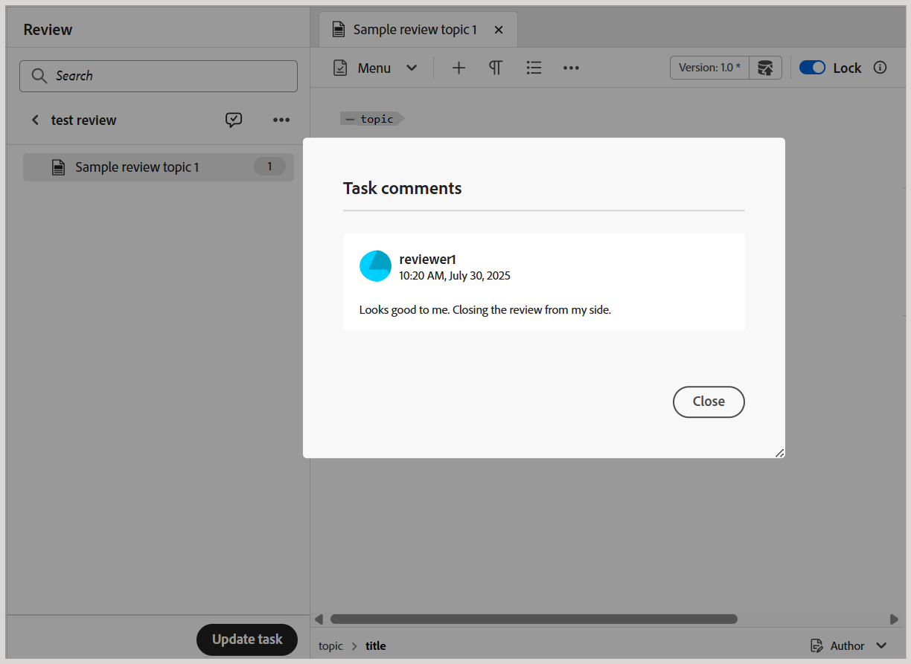
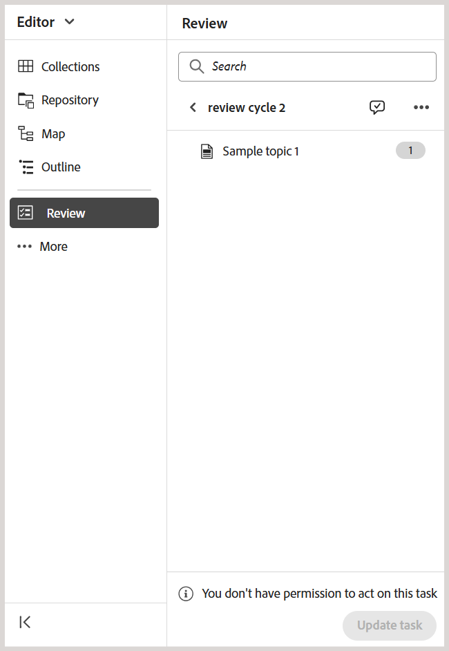

# Anfordern einer erneuten Überprüfung oder Schließen einer Prüfungsaufgabe als Autor

>[!IMPORTANT]
>
> Die in diesem Artikel beschriebenen neuen Funktionen werden standardmäßig mit der Version 2508 von Experience Manager Guides as a Cloud Services aktiviert. Überprüfungen, die vor der Migration erstellt wurden, sind nicht betroffen und verwenden weiterhin den früheren Workflow. Wenn Sie es vorziehen, die vorhandenen Funktionen ohne diese Aktualisierungen weiterhin zu verwenden, wenden Sie sich an Ihr Customer Success-Team, damit die neuen Funktionen deaktiviert werden.

Wenn eine Prüfungsaufgabe von einem Reviewer als abgeschlossen markiert wird, wird eine Benachrichtigung an den Aufgabeninitiator ausgelöst, damit dieser auf die Aufgabe und die zugehörigen Kommentare auf Aufgabenebene zugreifen und diese überprüfen kann.

Als Initiator der Prüfungsaufgabe können Sie dann anhand des Feedbacks entscheiden, wie Sie fortfahren möchten. Folgende Optionen sind verfügbar:

- Erneute Überprüfung anfordern
- Prüfungsaufgabe schließen

## Anfordern einer erneuten Überprüfung oder Schließen einer Prüfungsaufgabe

Führen Sie die folgenden Schritte aus, um eine erneute Überprüfung oder das Schließen einer Prüfungsaufgabe anzufordern:

1. Öffnen Sie die Prüfungsaufgabe im Editor.
2. Wählen Sie im Prüfungsbedienfeld die Prüfungsaufgabe aus der Liste **Aktive Aufgaben** aus.

   >[!NOTE]
   >
   > Sie können die Aufgabe auch im Aufgaben-Dashboard öffnen, um eine umfassendere Ansicht zu erhalten. Wählen Sie dazu **Im Aufgaben-Dashboard öffnen** aus dem Menü Optionen einer beliebigen aktiven Prüfungsaufgabe aus. Dadurch werden die Aufgabendetails in der Projektekonsole geöffnet.

   
3. Wählen Sie das Dialogfeld **Aufgabenkommentare** aus, um auf die von den Überprüfenden hinzugefügten Kommentare auf Aufgabenebene zuzugreifen und sie zu überprüfen.

   .

   Das **Aufgabenkommentare** wird auf der rechten Seite angezeigt.

   {width="350" align="left"}.
4. Wählen Sie **Aufgabe aktualisieren** aus, um weitere Aktionen für die ausgewählte Prüfungsaufgabe durchzuführen.
5. Wählen Sie **Dialogfeld** Aufgabe aktualisieren“ eine der folgenden Aktionen aus:

   - **Erneute Überprüfung anfordern**: Startet eine weitere Überprüfungsrunde. Sie können eine andere Version des Themas zur Überprüfung auswählen. Standardmäßig wird die neueste (oder die zuletzt bearbeitete) Version des Themas oder der Zuordnungsdatei, die zur Überprüfung gesendet wird, ausgewählt. Sie können auch die Option **Versionen bearbeiten** verwenden, um die Version ausgewählter Themen je nach Bedarf auf **Neueste Version**, **Version ein** und **Grundlinie** festzulegen.  Prüfer, die die vorherige Überprüfung abgeschlossen haben, erhalten eine Benachrichtigung, um Feedback zur aktualisierten Version zu geben. Andere Reviewer, die die Überprüfungsaufgabe nicht als abgeschlossen markiert haben, werden über die Aktualisierung des Themas benachrichtigt.

   - **Überprüfung schließen**: Schließt die Überprüfungsaufgabe. Die Schaltfläche **Aufgabe aktualisieren** am unteren Rand des Prüfungsbereichs ändert sich in **Geschlossen** und alle an der Prüfungsaufgabe beteiligten Benutzer erhalten eine Benachrichtigung, die den Abschluss angibt.

   Weitere Informationen zum Trigger von Prüfungsbenachrichtigungen finden Sie unter [Grundlegendes zu Prüfungsbenachrichtigungen](./review-understanding-review-notifications.md).

   {width="350" align="left"}

   >[!NOTE]
   >
   > Das **Aktualisierungsaufgabe** enthält auch eine Spalte **Dokumentstatus**, um den aktuellen Status der aufgelisteten Prüfungsthemen bei Verwendung von Experience Manager Guides as a Cloud Services anzugeben.

6. Wählen Sie **Bestätigen** aus.

Wenn Sie als Autor oder Initiator einer Prüfungsaufgabe die Aufgabe schließen, wird die Schaltfläche **Aufgabe aktualisieren** am unteren Rand des Prüfungsbereichs in **Geschlossen** geändert, was bedeutet, dass die Aufgabe nicht mehr aktiv ist.

{width="350" align="left"}

Außerdem bleibt die Schaltfläche **Aufgabe aktualisieren** im Prüfungsbereich für die anderen Benutzer der Prüfungsaufgabe deaktiviert. Wenn Sie z. B. als einer der Validierungsverantwortlichen einer Prüfungsaufgabe die Aufgabe im Editor öffnen, wird die Schaltfläche Aufgabe aktualisieren mit einer Meldung deaktiviert **Sie sind nicht berechtigt, diese Aufgabe zu bearbeiten**. Nur der Initiator einer Prüfungsaufgabe hat die Berechtigung, die Aufgabe über den Editor zu aktualisieren.

{width="350" align="left"}
