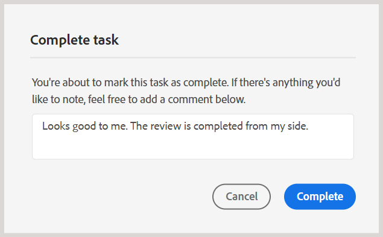

# Beenden der Prüfungsaufgabe als Prüferin bzw. Prüfer

>[!IMPORTANT]
>
> Die in diesem Artikel beschriebenen neuen Funktionen werden standardmäßig mit der Version 2508 von Experience Manager Guides as a Cloud Services aktiviert. Überprüfungen, die vor der Migration erstellt wurden, sind nicht betroffen und verwenden weiterhin den früheren Workflow. Wenn Sie es vorziehen, die vorhandenen Funktionen ohne diese Aktualisierungen weiterhin zu verwenden, wenden Sie sich an Ihr Customer Success-Team, damit die neuen Funktionen deaktiviert werden.

Als Reviewer können Sie eine Prüfungsaufgabe als abgeschlossen markieren, sobald Sie alle Inhalte geprüft haben und den Autor benachrichtigen möchten. Sie können zu diesem Zeitpunkt auch abschließende Kommentare hinterlassen.

Führen Sie die folgenden Schritte aus, um eine Prüfungsaufgabe abzuschließen:

1. Öffnen Sie die Ihnen zugewiesene Prüfungsaufgabe.
2. Wählen Sie **Als erledigt markieren** oben aus, wie unten dargestellt:

   {width="350" align="left"}

   Das **Aufgabe abschließen** wird angezeigt.
3. Fügen Sie im Dialogfeld **Aufgabe abschließen** abschließende Kommentare für den Autor hinzu und wählen Sie **Abschließen**.

   >[!NOTE]
   >
   > Die Kommentare auf Aufgabenebene dienen als Zusammenfassung oder abschließende Kommentare und unterscheiden sich von den Kommentaren auf Textebene, die während der Themenüberprüfung hinzugefügt wurden. In diesem Dialogfeld können Sie entweder Folgeaktionen umreißen, z. B. den Autor auffordern, bestimmte Kommentare zu kommentieren, und die Aufgabe zur Überprüfung erneut senden, oder angeben, dass die Überprüfung abgeschlossen ist.

   Beispielsweise können Sie als Prüfer einen Kommentar als Folgemaßnahme für den Autor hinzufügen:

   {width="350" align="left"}

   Oder fügen Sie einen Kommentar hinzu, um den Abschluss der Aufgabe anzugeben, wie unten dargestellt:

   {width="350" align="left"}

Sie haben die Aufgabe erfolgreich als abgeschlossen markiert und ihr Status ist jetzt auf &quot;**&quot;**. Sobald die Aufgabe als abgeschlossen markiert ist, sind keine weiteren Aktionen mehr zulässig. Der Autor oder Initiator der Überprüfungsaufgabe erhält eine Benachrichtigung, auf die er unverzüglich aufmerksam gemacht wird. Weitere Informationen zum Trigger von Prüfungsbenachrichtigungen finden Sie unter [Grundlegendes zu Prüfungsbenachrichtigungen](./review-understanding-review-notifications.md).

{width="350" align="left"}

Wenn der Autor oder Initiator der Aufgabe anhand des Feedbacks [die Prüfungsaufgabe schließen](./review-close-review-task.md) wird der Aufgabenstatus in der Benutzeroberfläche „Überprüfen“ in &quot;**&quot;**.

{width="350" align="left"}

## Anzeigen von Kommentaren auf Aufgabenebene

Alle Kommentare auf Aufgabenebene werden im Dialogfeld **Kommentare zu Aufgaben** angezeigt, das im schreibgeschützten Modus verfügbar ist. Wenn Sie eine Prüfungsaufgabe mit einem abschließenden Kommentar abschließen, wird Ihre Eingabe in diesem Dialogfeld zur späteren Verwendung aufgezeichnet.

Um über die Überprüfungs-Benutzeroberfläche auf Kommentare auf Aufgabenebene zuzugreifen, navigieren Sie zum linken Bedienfeld und wählen Sie das Symbol **Aufgabenkommentare** aus.

{width="350" align="left"}

Das **Aufgabenkommentare** wird auf der rechten Seite angezeigt.

{width="350" align="left"}

Die Kommentare innerhalb des Dialogfelds werden in chronologischer Reihenfolge angezeigt, wobei die jüngsten Kommentare zuerst und die ältesten Kommentare zuletzt angezeigt werden. Diese Reihenfolge hilft Ihnen, die Konversation im Laufe der Zeit zu verfolgen.

Das **Aufgabenkommentare** Dialogfeld ist für alle an der Prüfungsaufgabe beteiligten Benutzenden zugänglich, einschließlich des Autors oder Initiators der Prüfungsaufgabe und anderer Prüfer. Daher können die Kommentare von anderen Reviewern (falls beteiligt) auch im Dialogfeld Aufgabenkommentare angezeigt werden. Dies trägt dazu bei, eine klare und nachvollziehbare Kommunikation während des gesamten Überprüfungsprozesses sicherzustellen.

Nach der Überprüfung des Feedbacks auf Aufgabenebene kann der Autor entweder eine erneute Überprüfung anfordern oder die Prüfungsaufgabe schließen. In beiden Fällen bleiben alle während des Überprüfungsprozesses erfassten Kommentare im Dialogfeld **Aufgabenkommentare** zur Referenz verfügbar.

