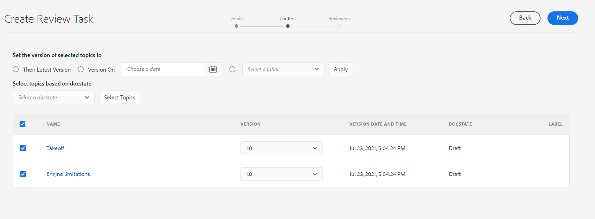

# Senden von Themen zur Überprüfung {#id199RD0S035Z}

Der Überprüfungs-Workflow erstellt eine Umgebung mit mehreren Reviewern, in der der Initiator eine Liste von zu überprüfenden Themen angibt, mehrere Reviewer hinzufügt und eine Zeitleiste für die Überprüfungsaufgabe zuweist. Adobe Experience Manager Guides ermöglicht es Benutzenden, die den Gruppen „Autoren“ und „Herausgeber“ angehören, eine Überprüfung einzuleiten.

Da der Überprüfungs-Workflow projektspezifisch ist, muss der Initiator der Überprüfung Teil des Projektteams sein oder über Rechte zum Erstellen eines Projekts verfügen. Zum Zeitpunkt der Erstellung eines Projekts definieren Sie die Team-Mitglieder für das Projekt und weisen ihnen verschiedene Rollen oder Gruppen zu. Weitere Informationen zu Projekten finden Sie unter [DITA-Projekt erstellen](authoring-create-dita-project.md#).

Sie können eine Prüfungsaufgabe aus folgenden Elementen erstellen:

- **Editor**: Ermöglicht es Ihnen, ein einzelnes Thema oder eine DITA-Karte zur Überprüfung zu senden. Beachten Sie, dass der Workflow zum Erstellen einer Prüfungsaufgabe häufig im Editor und in der Assets-Benutzeroberfläche verwendet wird. Nur die Methode zum Starten des Überprüfungs-Workflows unterscheidet sich. Weitere Informationen zum Starten des Überprüfungs-Workflows aus dem Editor finden Sie unter [Überprüfungsaufgabe erstellen](web-editor-left-panel.md#review) im Editor.

- **Assets-Benutzeroberfläche**: Ermöglicht es Ihnen, ein oder mehrere Themen und eine DITA-Karte zur Überprüfung zu senden. Die Freigabe von Dokumenten zur Überprüfung aus dem Workflow der Assets-Benutzeroberfläche wird in diesem Abschnitt behandelt.

In der Assets-Benutzeroberfläche gibt es zwei Möglichkeiten, wie ein Autor/Publisher eine Prüfungsaufgabe erstellen kann:

- Ein oder mehrere Themen zur Überprüfung senden
- Senden mehrerer Themen aus einer DITA-Karte zur Überprüfung

## Ein oder mehrere Themen zur Überprüfung senden {#id1721E600FY4}

>[!IMPORTANT]
>
> Bevor Sie eine Prüfungsaufgabe erstellen, stellen Sie sicher, dass Sie ein Projekt erstellt und diesem Projekt Reviewer hinzugefügt haben.

So erstellen Sie eine Prüfungsaufgabe und senden Themen zur Überprüfung:

>[!NOTE]
>
> Sie können eine Prüfungsaufgabe nur erstellen, wenn Sie Autor oder Publisher eines DITA-Projekts sind.

1. Navigieren Sie zum gewünschten Ordner in der Assets-Benutzeroberfläche.

1. Wählen Sie das **Auswählen**-Symbol in der Schnellaktion und wählen Sie die Themen aus, die Sie zur Überprüfung senden möchten.

   {width="300" align="left"}

1. Wählen Sie in der Symbolleiste **Prüfungsaufgabe erstellen** aus. Die Seite zur Erstellung der Prüfungsaufgabe wird angezeigt.

   >[!NOTE]
   >
   > Sie können eine Prüfungsaufgabe nur für Themen mit einer Revision erstellen. Wenn für das ausgewählte Thema keine Revision vorhanden ist, wird eine Eingabeaufforderung angezeigt.

   {width="650" align="left"}

1. Geben Sie einen **Titel** für die Aufgabe ein und wählen Sie ein DITA-Projekt aus.

1. Wählen **in der Dropdown** Liste Projekt ein DITA-Projekt für diese Prüfungsaufgabe aus. Sie können auch den Projektnamen eingeben, um ihn schnell in der Dropdown-Liste zu finden.

1. Wählen **in der Dropdown** Liste „Zuweisen an“ die Validierungsverantwortlichen aus, denen Sie die Themen zur Überprüfung senden möchten.

   Sie können einzelnen Benutzern des Projekts oder Benutzergruppen eine Prüfungsaufgabe zuweisen. Beachten Sie, dass Sie eine Prüfungsaufgabe nur dann einzelnen Benutzern zuweisen können, wenn Sie der Administratorgruppe des Projekts angehören. Andernfalls sehen Sie die Benutzergruppen nur im Feld Zuweisen an .

   >[!NOTE]
   >
   > Der Überprüfungs-Workflow ist projektspezifisch. Beim Erstellen von Projekten fügen Sie die Team-Mitglieder zum Projekt hinzu und weisen sie Gruppen zu. Wenn Sie also hier das Projekt auswählen, können Sie die Mitglieder auswählen, die Teil dieses Projekts sind. Weitere Informationen zu Projekten finden Sie unter [DITA-Projekt erstellen](authoring-create-dita-project.md#).

1. Geben Sie eine **Beschreibung** für die Aufgabe ein.

   Diese Beschreibung wird als Text der Benachrichtigungs-E-Mail verwendet, die an die Validierungsverantwortlichen gesendet wird.

1. Wählen Sie das **Fälligkeitsdatum** und die Uhrzeit aus, um den Termin für die Überprüfung festzulegen.

   >[!NOTE]
   >
   > Bei Erreichen der Frist wird der Initiator per E-Mail darüber informiert, dass die Prüfungsaufgabe abgeschlossen ist. Der Initiator kann die Frist für die Prüfungsaufgabe über das [Überprüfungs-Dashboard“ ](review-manage-tasks-review-dashboard.md#).

1. Wählen Sie die Stammzuordnung aus dem **Stammzuordnungspfad**. Diese Rootmap wird verwendet, um alle wichtigen Verweise und Glossarbegriffe aufzulösen, die im Überprüfungsinhalt verwendet werden. Wenn Sie die Rootmap nicht auswählen, werden die wichtigsten Referenzen oder Glossarbegriffe, die mit dem DITA-Thema verknüpft sind, nicht aufgelöst, bevor das Thema zur Überprüfung gesendet wird.

   Wenn Sie die Überprüfung für eine DITA-Zuordnung erstellen, wird **Rootmap-Pfad** standardmäßig auf den Pfad dieser Zuordnung festgelegt. Wenn Sie die Überprüfung für ein oder mehrere Themen erstellen, wird der **Stammordnungspfad** standardmäßig auf die in den Benutzereinstellungen definierte Zuordnung festgelegt.

   >[!NOTE]
   >
   > Die ausgewählte Stammzuordnung hat die höchste Priorität, um Schlüsselverweise aufzulösen. Weitere Informationen finden Sie unter [Schlüsselverweise auflösen](map-editor-other-features.md#id176GD01H05Z).

1. Da Sie verschiedenen Themen unterschiedliche Reviewer zuweisen können, steuert die Option **Zulassen, dass Verantwortliche jedes Thema überprüfen**, ob Reviewer alle Themen in einer Prüfungsaufgabe oder nur die Themen überprüfen können, denen sie zugewiesen sind.

   Wenn Sie allen Reviewern erlauben möchten, ein beliebiges Thema in der Prüfungsaufgabe zu überprüfen, wählen Sie **Zulassen, dass Verantwortliche ein beliebiges Thema überprüfen können**.

   Wenn Sie diese Option nicht auswählen, haben Prüfer, die im Feld **Zuweisen zu** hinzugefügt wurden, Zugriff, um nur die Themen zu überprüfen, die ihnen zugewiesen sind.

1. Wählen Sie **Weiter** aus.

   Die Inhaltsseite wird angezeigt.

   {align="left"}

1. Wählen Sie auf der Inhaltsseite eine Version des Themas aus, das Sie zur Überprüfung freigeben möchten.

   Sie können eine der folgenden Methoden verwenden, um eine Version auszuwählen:

   - *\(Standard\)* Wählen Sie die Option **Aktuelle Version**, um die zuletzt gespeicherte Revision der Themen auszuwählen.
   - Wählen Sie die Option **Version ein** und geben Sie Datum und Uhrzeit an, um eine Version wie am angegebenen Datum und zur angegebenen Uhrzeit auszuwählen. Wenn am angegebenen Datum keine Version des Themas verfügbar ist, wird eine Version ausgewählt, die unmittelbar nach dem angegebenen Datum und der angegebenen Uhrzeit verfügbar ist.
   - Wählen Sie die **Bezeichnung auswählen** und wählen Sie eine Bezeichnung aus der Dropdown-Liste aus.
1. Nachdem Sie Ihre Auswahl für die Auswahl einer Version getroffen haben, klicken Sie auf **Anwenden**.

   Die auf der ausgewählten Option basierende Version wird für die Themen ausgewählt.

   >[!NOTE]
   >
   > Sie können die gewünschte Version auch manuell aus der Dropdown-Liste **Version** jedes Themas auswählen.

1. Wählen Sie **Weiter** aus.

   Die Seite Reviewer wird angezeigt, auf der Sie Reviewer hinzufügen oder entfernen können. Standardmäßig werden die im Feld Zuweisen an hinzugefügten Reviewer automatisch zu jedem für die Überprüfung ausgewählten Thema hinzugefügt.

   {width="650" align="left"}

1. Auf der Seite „Validierungsverantwortliche“ können Sie Validierungsverantwortliche hinzufügen oder entfernen. Die folgenden Vorgänge sind auf der Seite Validierungsverantwortliche verfügbar:

   - **Alle auswählen**: Wählt alle Themen in der Themenliste aus. Nach Auswahl aller Themen können Sie ganz einfach einen Batch-Vorgang durchführen.
   - **Auswahl aufheben**: Hebt die Auswahl der Themen in der Themenliste auf.

     >[!NOTE]
     >
     > Sie können ein Thema auch einzeln auswählen oder die Auswahl aufheben, indem Sie das Kontrollkästchen neben dem Thema aktivieren.

   - **Hinzufügen**: Zeigt das Dialogfeld „Reviewer hinzufügen“ an. Sie können den Namen eines Reviewers oder einer Benutzerrolle \(oder einer Gruppe\) eingeben, den bzw. die Sie als Reviewer zu den ausgewählten Themen hinzufügen möchten.
   - **Entfernen**: Zeigt das Dialogfeld „Reviewer entfernen“ an. Sie können den Namen eines Reviewers oder einer Benutzerrolle \(oder einer Gruppe\) eingeben, den bzw. die Sie als Reviewer aus den ausgewählten Themen entfernen möchten.

     >[!NOTE]
     >
     > Sie können eine Überprüfung auch aus einem Thema entfernen, indem Sie im Feld des Überprüfers das Kreuzzeichen auswählen.

   - **Neu zuweisen**: Zeigt das Dialogfeld „Reviewer neu zuweisen“ an. Sie können den Namen eines Reviewers oder einer Benutzerrolle \(oder einer Gruppe\) eingeben, dem bzw. der die Überprüfungsaufgabe zugewiesen werden soll. Dadurch werden alle vorhandenen Reviewer aus den ausgewählten Themen entfernt und die neu ausgewählten Reviewer diesen Themen zugewiesen.
   - **Exportieren**: Ermöglicht den Export der Aufgabendetails für die Überprüfung in eine CSV-Datei. Die Datei enthält Details wie den Pfad und Titel des Themas, den Namen des Reviewers und die Version der Themen, die zur Überprüfung gesendet werden.
   - **Reviewer bearbeiten**: Wenn Sie das Symbol in der Themenliste auswählen, wird das Dialogfeld „Reviewer bearbeiten“ angezeigt. Sie können Reviewer für ausgewählte Themen in diesem Dialogfeld hinzufügen oder entfernen.
1. Wählen **Erstellen**, um die Prüfungsaufgabe zu erstellen.

   Eine Bestätigungsmeldung wird angezeigt, wenn die Prüfungsaufgabe erfolgreich erstellt wurde. Der [Dokumentstatus](web-editor-document-states.md#) für die zur Überprüfung gesendeten Themen wird auf „In Überprüfung“ festgelegt.

   >[!NOTE]
   >
   > Sie können auch oben rechts im Bildschirm Benachrichtigungsklingel auswählen und bestätigen, dass die Prüfungsaufgabe erfolgreich erstellt wurde. Im Benachrichtigungsbereich finden Sie jeweils eine Benachrichtigung für die Reviewer, die Teil der Prüfungsaufgabe waren, und eine Benachrichtigung für den Initiator der Überprüfung.

Allen Reviewern wird eine E-Mail gesendet, in der sie darüber informiert werden, dass ihnen ein oder mehrere Themen zur Überprüfung zugewiesen wurden. Die E-Mail enthält einen direkten Link, über den sie in einem Browser-Fenster auf das Thema zugreifen können.

Falls mehrere Themen zugewiesen sind, können die Reviewer sie in einer Dropdown-Liste mit Themen im Webbrowser anzeigen und auswählen.

## Senden mehrerer Themen zur Überprüfung von einer DITA-Karte

Eine DITA-Karte ist eine logische Organisation von Themen innerhalb eines Buches. Wenn Sie ein einzelnes Thema zur Überprüfung senden, erhält der Reviewer keine Informationen über die Position dieses Themas im Buch. Wenn ein Reviewer Informationen über den genauen Ort des zu überprüfenden Themas hat, erhält er einen besseren Kontext des zu überprüfenden Themas.

Mit Experience Manager Guides können Sie ein oder mehrere Themen in einer DITA-Karte gleichzeitig zur Überprüfung senden. Der Reviewer erhält die vollständige Zuordnungsdatei zusammen mit Themen, die zur Überprüfung freigegeben wurden. Dadurch wird es für den Prüfer einfacher, einen Kontext des Themas in der Karten- oder Buchdatei zu erhalten.

Sie können dieselbe DITA-Zuordnung in zur Überprüfung in mehreren Prüfungsaufgaben freigeben. Beispiel: In einer DITA-Zuordnung gibt es Themen A, B, C, D und E. In einer Prüfungsaufgabe können Sie A, B und C zur Überprüfung freigeben und in einer anderen Prüfungsaufgabe können Sie die Themen C, D und E zur Überprüfung senden. Der Überprüfungsprozess ermöglicht die Freigabe desselben Themas und einer Zuordnungsdatei in mehreren Überprüfungsaufgaben. Für das allgemeine Thema in mehreren Prüfungsaufgaben überschreiben die Kommentare, die in einer Prüfungsaufgabe abgegeben werden, nicht die Kommentare in den anderen Prüfungsaufgaben und führen auch nicht mit diesen zusammen.

>[!IMPORTANT]
>
> Wenn ein Thema einer Zuordnungsdatei in mehreren Prüfungsaufgaben freigegeben wurde, wird sein Status In Überprüfung angezeigt, bis alle Prüfungsaufgaben abgeschlossen sind.

Um ein oder mehrere Themen zusammen mit der Zuordnungsdatei zur Überprüfung zu senden, führen Sie die folgenden Schritte aus:

>[!IMPORTANT]
>
> Nachdem Sie eine Überprüfung über eine Zuordnungsdatei initiiert haben, dürfen Sie die Struktur der Zuordnungsdatei nicht ändern, indem Sie neue Themen hinzufügen oder vorhandene Themen entfernen.

1. Navigieren Sie zum gewünschten Ordner in der Assets-Benutzeroberfläche.

   >[!NOTE]
   >
   > Stellen Sie sicher, dass die Ansicht der Konsole entweder auf Kartenansicht oder auf Listenansicht eingestellt ist.

1. Wählen Sie die Karte aus, von der aus Sie die Themen zur Überprüfung senden möchten.

1. Wählen Sie in der Symbolleiste **Prüfungsaufgabe erstellen** aus. Die Seite zur Erstellung der Prüfungsaufgabe wird angezeigt.

1. Geben Sie einen **Titel** für die Aufgabe ein.

1. Wählen **in der Dropdown** Liste Projekt ein DITA-Projekt für diese Prüfungsaufgabe aus. Sie können auch den Projektnamen eingeben, um ihn schnell in der Dropdown-Liste zu finden.

   >[!NOTE]
   >
   > Sie können eine Prüfungsaufgabe nur für Themen mit einer Revision erstellen. Falls Ihre Karte Themen enthält, die keine Revision haben, wird Ihnen eine Eingabeaufforderung mit einer Liste solcher Dateien angezeigt. Dateien ohne Revision sind von der Prüfungsaufgabe ausgeschlossen.

1. Wählen **in der Dropdown** Liste „Zuweisen an“ die Validierungsverantwortlichen aus, denen Sie die Themen zur Überprüfung senden möchten.

   Sie können einzelnen Benutzern des Projekts oder Benutzergruppen eine Prüfungsaufgabe zuweisen. Beachten Sie, dass Sie eine Prüfungsaufgabe nur dann einzelnen Benutzern zuweisen können, wenn Sie der Administratorgruppe des Projekts angehören. Andernfalls sehen Sie die Benutzergruppen nur im Feld Zuweisen an .

   >[!NOTE]
   >
   > Der Überprüfungs-Workflow ist projektspezifisch. Beim Erstellen von Projekten fügen Sie die Team-Mitglieder zum Projekt hinzu und weisen sie Gruppen zu. Wenn Sie also hier das Projekt auswählen, können Sie die Mitglieder auswählen, die Teil dieses Projekts sind. Weitere Informationen zu Projekten finden Sie unter [DITA-Projekt erstellen](authoring-create-dita-project.md#).

1. Geben Sie eine **Beschreibung** für die Aufgabe ein.

   Diese Beschreibung wird als Text der Benachrichtigungs-E-Mail verwendet, die an die Validierungsverantwortlichen gesendet wird.

1. Wählen Sie das **Fälligkeitsdatum** und die Uhrzeit aus, um den Termin für die Überprüfung festzulegen.

   >[!NOTE]
   >
   > Bei Erreichen der Frist wird der Initiator per E-Mail darüber informiert, dass die Prüfungsaufgabe abgeschlossen ist. Der Initiator kann die Frist für die Prüfungsaufgabe über das [Überprüfungs-Dashboard“ ](review-manage-tasks-review-dashboard.md#).

1. Da Sie verschiedenen Themen unterschiedliche Reviewer zuweisen können, steuert die Option **Zulassen, dass Verantwortliche jedes Thema überprüfen**, ob Reviewer alle Themen in einer Prüfungsaufgabe oder nur die Themen überprüfen können, denen sie zugewiesen sind.

   Wenn Sie allen Reviewern erlauben möchten, ein beliebiges Thema in der Prüfungsaufgabe zu überprüfen, wählen Sie **Zulassen, dass Verantwortliche ein beliebiges Thema überprüfen können**.

   Wenn Sie diese Option nicht auswählen, haben Prüfer, die im Feld **Zuweisen zu** hinzugefügt wurden, Zugriff, um nur die Themen zu überprüfen, die ihnen zugewiesen sind.

1. Wählen Sie **Weiter** aus.

   Die Inhaltsseite wird mit allen Themen angezeigt, auf die in der Zuordnungsdatei verwiesen wird. Wenn Ihre DITA-Karte verschachtelte Karten enthält, werden hier auch Themen aus den verschachtelten Karten aufgeführt.

   {align="left"}

1. Wählen Sie auf der Inhaltsseite eine Version des Themas aus, das Sie zur Überprüfung freigeben möchten.

   Sie können eine der folgenden Methoden verwenden, um eine Version auszuwählen:

   - *\(Standard\)* Wählen Sie die Option **Aktuelle Version**, um die zuletzt gespeicherte Revision der Themen auszuwählen.
   - Wählen Sie die Option **Version ein** und geben Sie das Datum und die Uhrzeit an, zu der eine Version gemäß dem Datum und der Uhrzeit ausgewählt werden soll. Wenn am angegebenen Datum keine Version des Themas verfügbar ist, wird eine Version ausgewählt, die unmittelbar nach dem angegebenen Datum und der angegebenen Uhrzeit verfügbar ist.
   - Wählen Sie die **Bezeichnung auswählen** und wählen Sie eine Bezeichnung aus der Dropdown-Liste aus. Alle Themen, die die ausgewählte Bezeichnung enthalten, werden in der Dropdown **Liste** Version) ausgewählt.
   - Wählen Sie die **Baseline auswählen** und wählen Sie eine Baseline aus der Dropdown-Liste aus. Alle Themenversionen, die Teil der ausgewählten Grundlinie sind, werden in der Dropdown-Liste **Version** ausgewählt.
1. Nachdem Sie Ihre Auswahl für die Auswahl einer Version getroffen haben, klicken Sie auf **Anwenden**.

   Die auf der ausgewählten Option basierende Version wird für die Themen ausgewählt.

   >[!NOTE]
   >
   > Sie können die gewünschte Version auch manuell aus der Dropdown-Liste **Version** jedes Themas auswählen.

1. Wählen Sie **Weiter** aus.

   Die Seite Reviewer wird angezeigt, auf der Sie Reviewer hinzufügen oder entfernen können. Standardmäßig werden die im Feld Zuweisen an hinzugefügten Reviewer automatisch zu jedem für die Überprüfung ausgewählten Thema hinzugefügt.

1. Auf der Seite „Validierungsverantwortliche“ können Sie Validierungsverantwortliche hinzufügen oder entfernen. Die folgenden Vorgänge sind auf der Seite Validierungsverantwortliche verfügbar:

   - **Alle auswählen**: Wählt alle Themen in der Themenliste aus. Nach Auswahl aller Themen können Sie ganz einfach einen Batch-Vorgang durchführen.
   - **Auswahl aufheben**: Hebt die Auswahl der Themen in der Themenliste auf.

     >[!NOTE]
     >
     > Sie können ein Thema auch einzeln auswählen oder die Auswahl aufheben, indem Sie das Kontrollkästchen neben dem Thema aktivieren.

   - **Hinzufügen**: Zeigt das Dialogfeld „Reviewer hinzufügen“ an. Sie können den Namen eines Reviewers oder einer Benutzerrolle \(oder einer Gruppe\) eingeben, den bzw. die Sie als Reviewer zu den ausgewählten Themen hinzufügen möchten.
   - **Entfernen**: Zeigt das Dialogfeld „Reviewer entfernen“ an. Sie können den Namen eines Reviewers oder einer Benutzerrolle \(oder einer Gruppe\) eingeben, den bzw. die Sie als Reviewer aus den ausgewählten Themen entfernen möchten.
   - **Neu zuweisen**: Zeigt das Dialogfeld „Reviewer neu zuweisen“ an. Sie können den Namen eines Reviewers oder einer Benutzerrolle \(oder einer Gruppe\) eingeben, dem bzw. der die Überprüfungsaufgabe zugewiesen werden soll. Dadurch werden alle vorhandenen Reviewer aus den ausgewählten Themen entfernt und die neu ausgewählten Reviewer diesen Themen zugewiesen.
   - **Exportieren**: Ermöglicht den Export der Aufgabendetails für die Überprüfung in eine CSV-Datei. Die Datei enthält Details wie den Pfad und Titel des Themas, den Namen des Reviewers und die Version der Themen, die zur Überprüfung gesendet werden.
   - **Reviewer bearbeiten**: Wenn Sie das Symbol in der Themenliste auswählen, wird das Dialogfeld „Reviewer bearbeiten“ angezeigt. Sie können Reviewer für ausgewählte Themen in diesem Dialogfeld hinzufügen oder entfernen.
   >[!IMPORTANT]
   >
   > Sie müssen mindestens einen Validierungsverantwortlichen zuweisen, um die Prüfungsaufgabe zu erstellen.

1. Wählen **Erstellen**, um die Prüfungsaufgabe zu erstellen.

   Eine Bestätigungsmeldung wird angezeigt, wenn die Prüfungsaufgabe erfolgreich erstellt wurde. Der [Dokumentstatus](web-editor-document-states.md#) für die zur Überprüfung gesendeten Themen wird auf „In Überprüfung“ festgelegt.

   >[!NOTE]
   >
   > Sie können auch oben rechts in der Benutzeroberfläche das Benachrichtigungsbedienfeld auswählen und bestätigen, dass die Aufgabe erfolgreich erstellt wurde. Im Benachrichtigungsbereich finden Sie jeweils eine Benachrichtigung für die Überprüfungen, die Teil der Prüfungsaufgabe waren, und eine Benachrichtigung für den Initiator der Überprüfung.

   >[!IMPORTANT]
   >
   > Nachdem Sie eine Überprüfung initiiert haben, dürfen Sie die DITA-Karte oder -Themen nicht an einen anderen Speicherort verschieben oder löschen. Dies führt zu einer Unterbrechung des Überprüfungsprozesses.

Alle validierungsverantwortlichen Personen werden per E-Mail darüber informiert, dass ihnen zu überprüfende Themen zugewiesen wurden. Die E-Mail enthält einen direkten Link, über den sie in einem Browser-Fenster auf das Thema zugreifen können. Die Themen werden zusammen mit der DITA-Karte im Review-Modus geöffnet.

## Themen zu einer laufenden Prüfungsaufgabe hinzufügen oder daraus entfernen

Als Autor oder Initiator einer Prüfungsaufgabe können Sie einer laufenden Prüfungsaufgabe neue Themen hinzufügen (wenn diese noch nicht zur Überprüfung gesendet wurden) oder Themen aus einer laufenden Prüfungsaufgabe entfernen, ohne den Prüfungs-Workflow zu beeinträchtigen.

Führen Sie die folgenden Schritte aus, um Themen zu einer laufenden Prüfungsaufgabe hinzuzufügen oder daraus zu entfernen:

1. Navigieren Sie im Prüfungsbedienfeld zu der Prüfungsaufgabe, die Sie ändern möchten, und wählen Sie **Aufgabendetails öffnen** aus dem Kontextmenü aus.

   Die **„Aufgabendetails** wird angezeigt.

1. Wählen Sie die **CONTENT**, um die aktuell in der Prüfungsaufgabe enthaltenen Themen anzuzeigen.
1. Überprüfen Sie die Themenliste und ändern Sie die Auswahl nach Bedarf.

   - Wählen Sie neue Themen aus, die zuvor nicht zur Überprüfung gesendet wurden.
   - Heben Sie die Auswahl der Themen auf, die Sie aus der Prüfungsaufgabe entfernen möchten.

   >[!NOTE]
   >
   > Mindestens ein Thema muss ausgewählt bleiben, um eine laufende Prüfungsaufgabe zu aktualisieren.

   

1. Nachdem Sie die Themenliste geändert haben, werden die entsprechenden Aktualisierungen automatisch auf die Registerkarte **VALIDIERUNGSVERANTWORTLICHE** der Seite Aufgabendetails übertragen.

   

   Überprüfen Sie die aktualisierte Themenliste auf der Registerkarte Reviewer . Für neu hinzugefügte Themen müssen Sie Reviewer zuweisen, es sei denn, die Einstellung **Zulassen, dass Verantwortliche beliebige Themen überprüfen können** ist für Ihre Prüfungsaufgabe aktiviert.
1. Wählen Sie **Aktualisieren** aus.

Sobald die Prüfungsaufgabe aktualisiert wurde, erhalten die Validierungsverantwortlichen Benachrichtigungen (sowohl AEM als auch E-Mail) auf Grundlage ihres Prüfungsstatus:

- **In Bearbeitung**: Prüfende, die noch an der Aufgabe arbeiten, werden darüber informiert, dass die Aufgabe aktualisiert wurde.
- **Abgeschlossen**: Prüfer, die ihre Überprüfung abgeschlossen haben, erhalten eine Benachrichtigung, in der sie um eine Überprüfung gebeten werden.

Weitere Informationen finden Sie unter [Grundlegendes zu Prüfungsbenachrichtigungen](./review-understanding-review-notifications.md).

**Übergeordnetes Thema:**[ Einführung zur Überprüfung](review.md)
