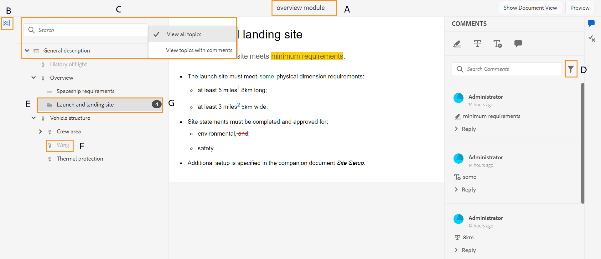
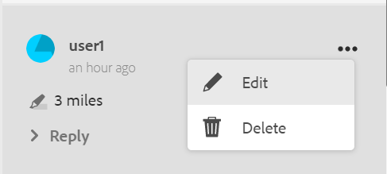
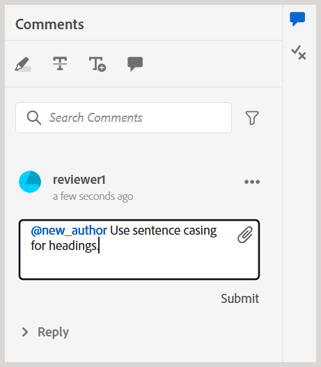
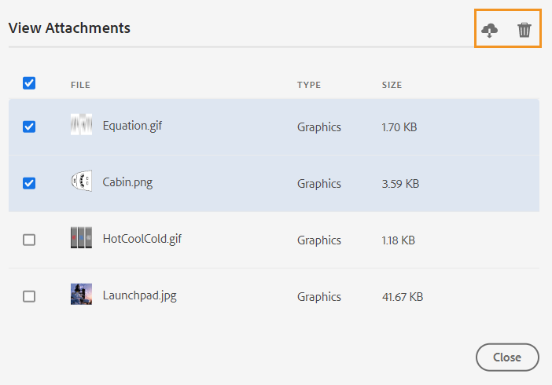

# Themen überprüfen {#id2056B0W0FBI}

Wenn Sie ein Prüfer sind, erhalten Sie eine E-Mail mit einer Prüfungsanfrage mit dem Link zu den Prüfthemen. Über diesen Link können Sie auf die Überprüfungsseite zugreifen, auf der Sie Ihr Feedback zu den freigegebenen Themen hinzufügen können.

>[!NOTE]
>
> Beim Zugriff auf die Überprüfungsanfrage über die Benachrichtigung können Sie festlegen, dass sie einem anderen Benutzer zugewiesen wird, der Teil desselben Überprüfungsprojekts ist. Weitere Informationen finden Sie unter [Prüfungsaufgabe mithilfe einer Benachrichtigung neu zuweisen](./reassign-review-using-notification.md).

Führen Sie die folgenden Schritte aus, um ein Thema zu überprüfen:

1. Wählen Sie den direkten Link aus, der in der E-Mail mit der Überprüfungsanfrage angegeben ist.

   Das Thema oder der Zuordnungs-Link wird in einem Browser geöffnet.

   >[!NOTE]
   >
   > Sie können den Link zur Themenüberprüfung auch über den Bereich Benachrichtigungen im Posteingang in der Benutzeroberfläche von Adobe Experience Manager aufrufen.

1. Je nachdem, wie die Themenüberprüfung initiiert wird, können Sie einen der beiden folgenden Bildschirme anzeigen:

   >[!NOTE]
   >
   > Die Benutzeroberfläche sieht möglicherweise anders aus, wenn Sie die Überprüfung in erstellt haben:
   >
   > - Adobe Experience Manager Guides as a Cloud Service Version November 2022 oder früher
   > - Adobe Experience Manager Guides Version 4.1 oder früher

   Der folgende Bildschirm wird angezeigt, wenn eine DITA-Zuordnung verwendet wird, um den Überprüfungs-Workflow zu starten:

   {align="left"}

   Folgende Optionen sind auf diesem Bildschirm verfügbar:

   - **A**: Der Name der Prüfungsaufgabe.
   - **B**: Wählen Sie das Symbol Themenansicht aus, um den Themenbereich ein- oder auszublenden.

   - **C**: Sie können nach dem gewünschten Thema suchen, indem Sie einen Teil des Textes des Titels oder Dateipfads in die Suchleiste eingeben.

     Wählen Sie  in der Nähe der Suchleiste aus, um alle Themen oder Themen mit Kommentaren anzuzeigen. Standardmäßig können Sie alle in der Prüfungsaufgabe vorhandenen Themen anzeigen.

   - **D**: Die durch ***F*** hervorgehobenen Zahlen können gefiltert werden, indem die gewünschte Filteroption hier ausgewählt wird. Kommentare können nach Typ, Status, Prüfer oder Version gefiltert werden. Wenn Sie beispielsweise anzeigen möchten, wie viele durchgestrichene Kommentare in jedem der zu überprüfenden Themen vorgenommen wurden, wählen Sie das Filtersymbol aus und wählen Sie dann **Überprüfungstyp** \> **Löschen**.

     >[!NOTE]
     >
     > Beim Anwenden der Filter werden im Bedienfeld Kommentare nur die Kommentare angezeigt, die den ausgewählten Filtern entsprechen. Die Anzahl der gefilterten Kommentare wird auf der linken Seite im Themenbereich angezeigt.

   - **E**: Ein Thema, das dem aktuellen Reviewer zur Überprüfung zugewiesen ist, wird schwarz angezeigt und kann ausgewählt werden. Wenn der Validierungsverantwortliche ein Thema auswählt, wird dieses Thema an den Anfang des Bildschirms gebracht.
   - **F**: Ein Thema, das nicht zur Überprüfung verfügbar ist, wird ausgegraut. Das Thema wird im schreibgeschützten Modus angezeigt und Sie dürfen keine Prüfungskommentare zu diesen Themen hinzufügen.

   - **G**: Anzahl der eingegangenen Kommentare zu einem Thema. Diese Zahl ändert sich je nach angewendetem Filter.

   Alle Themen in der Karte werden als einzelnes zusammengesetztes Dokument angezeigt. Die Themen, die der Reviewer überprüfen darf, werden normal angezeigt. Die Themen, die die Überprüfung nicht überprüfen darf, werden nicht angezeigt.

   {align="left"}

   Im obigen Screenshot wird das Thema „Allgemeine Beschreibung“ für den aktuellen Reviewer freigegeben, was normalerweise angezeigt wird. Das nächste Thema, Verlauf des Fluginhalts , wird jedoch nicht zur Überprüfung freigegeben und es wird im schreibgeschützten Modus angezeigt. Das Thema, das derzeit im Fokus steht, wird auch im Inhaltsverzeichnis hervorgehoben.

   Der folgende Bildschirm wird angezeigt, wenn ein oder mehrere Themen ausgewählt und zur Überprüfung freigegeben werden:

   {align="left"}

   >[!NOTE]
   >
   > Bei mehreren Themen werden sie als zusammengesetztes Dokument in der Dokumentansicht angezeigt. Der obige Screenshot zeigt zwei verschiedene Themen, die nacheinander in einer einzigen Ansicht vorgestellt werden.

1. Öffnen Sie das Bedienfeld „Kommentare **durch Auswahl** Symbols „Kommentare“ in der oberen rechten Ecke der Symbolleiste.

   Geben Sie Kommentare zur Überprüfung ein, indem Sie den entsprechenden Kommentartyp in der Symbolleiste auswählen und die Eingabetaste drücken, um Ihren Kommentar zu übermitteln.
Das Kommentarfeld unterstützt mehrzeilige Einträge und ermöglicht es Benutzern, es nach Bedarf zu erweitern, um detailliertes Feedback zu geben. Sie können **Umschalt** + **Eingabetaste** verwenden, um beim Schreiben des Kommentars in die nächste Zeile zu wechseln.

   >[!NOTE]
   >
   > Im Bedienfeld Kommentare werden nur die Kommentare zu den aktuellen Themen angezeigt. Wenn Sie den Fokus auf ein anderes Thema verschieben, werden die Kommentare zum anderen Thema angezeigt.

1. Klicken Sie **die Schaltfläche** Schließen“, nachdem Sie die Überprüfung des Themas abgeschlossen haben. Durch Klicken auf **Schließen** werden Sie zu der Seite weitergeleitet, von der aus Sie auf das Prüfungsthema zugegriffen haben.

## Zusätzliche Funktionen auf dem Überprüfungsbildschirm

**Dokumentansicht und Themenansicht** - Wenn mehrere Themen zur Überprüfung freigegeben werden, wird den Reviewern standardmäßig eine zusammengesetzte Dokumentansicht mit Themen angezeigt. Im Falle einer DITA-Kartenüberprüfung werden alle Themen in der Karte in Form eines einzigen Dokuments präsentiert, das einer Buchansicht ähnelt. Bei Bedarf können Sie auch ein bestimmtes Thema auswählen. Nur dieses Thema wird dann auf dem Überprüfungsbildschirm angezeigt.

Wenn Sie ein einzelnes Thema anzeigen, erhalten Sie eine zusätzliche Option, um zur Dokumentansicht zurückzukehren. Im folgenden Screenshot wird ein bestimmtes Thema aus einer Zuordnungsdatei zur Überprüfung geöffnet. Mit der hervorgehobenen Option **Dokumentansicht anzeigen** können Benutzer zur Dokumentansicht der Zuordnungsdatei zurückkehren.

>[!NOTE]
>
> Jede Bildschirmauflösung mit einer Breite von mehr als 1600 Pixel ist mit den Standardfeldbreiten (links und rechts) kompatibel, sodass keine horizontale Bildlaufleiste angezeigt wird und der Inhalt in der Dokumentansicht korrekt ausgerichtet bleibt. Außerdem können Sie die Größe des Bildschirms jederzeit ändern, um die entsprechende Dokumentansicht in der Überprüfungs-Benutzeroberfläche beizubehalten.

{align="left"}

**Arbeiten mit verschiedenen Arten von Kommentar-Tools** - Sie können Inline-Kommentare hinzufügen, indem Sie Text markieren, durch Text streichen, Text einfügen oder eine Kommentar-Anmerkung hinzufügen. Nachfolgend werden die verschiedenen Arten von Kommentar-Tools beschrieben, die in der Symbolleiste „Kommentare“ verfügbar sind:

{width="350" align="left"}

- **Hervorheben** \(\): Um einen Hervorhebungskommentar hinzuzufügen, wählen Sie den Text aus und wählen Sie das Symbol „Hervorheben“. Sie können auch zuerst das Symbol „Hervorheben“ und dann den gewünschten Text auswählen.

  {width="650" align="left"}

  Im Bedienfeld „Kommentare“ wird ein Popup angezeigt, in dem Sie Ihren Kommentar für den hervorgehobenen Inhalt hinzufügen können.

- **Durchstreichen** \(\): Wenn Sie das Entfernen von Inhalten vorschlagen möchten, können Sie dies tun, indem Sie den Inhalt auswählen und dann das Symbol „Durchstreichen“ auswählen. Sie können auch zuerst den gewünschten Text auswählen und dann die Löschen-Taste drücken.

  Im Bedienfeld Kommentare wird ein Popup angezeigt, in dem Sie Ihren Kommentar für den gelöschten Inhalt hinzufügen können.

- **Text einfügen** \(\): Wenn Sie Text einfügen möchten, klicken Sie auf das Symbol „Text einfügen“ und platzieren Sie den Cursor an der Stelle, an der Sie den Text einfügen möchten, und geben Sie die Informationen ein. Oder platzieren Sie den Cursor an die Stelle, an der Sie Text einfügen möchten, und beginnen Sie mit der Eingabe. Die hinzugefügten Informationen werden in grüner Schriftart angezeigt.

- **Kommentar hinzufügen**\(\): Wenn Sie einen Kommentar vom Typ Haftnotiz hinzufügen möchten, klicken Sie auf das Symbol Kommentar hinzufügen und geben Sie den Kommentar in das Popup-Fenster ein.

**Kontextuelle Symbolleiste**

Mit der kontextuellen Symbolleiste können Sie Text auch schnell markieren oder durchstreichen. Führen Sie die folgenden Schritte aus, um mithilfe der kontextuellen Symbolleiste einen Kommentar abzugeben:

1. Wählen Sie den Text aus, den Sie markieren oder durchstreichen möchten. Die kontextuelle Symbolleiste wird angezeigt.

   {width="550" align="left"}

1. Wählen Sie das Symbol **Hervorheben** oder **Durchstreichen** aus.
1. Sie können im Kommentarbereich Kommentare für die Hervorhebungs- oder Durchgestrichen-Aktion hinzufügen.

**Überprüfen mithilfe des Bedienfelds &quot;**&quot; - Das Bedienfeld „Kommentare“ zeigt eine Liste der Kommentare an, die zum aktuellen Thema abgegeben wurden. In diesem Bedienfeld werden auch Kommentare anderer Validierungsverantwortlicher aufgelistet, wenn das Thema an mehrere Validierungsverantwortliche gesendet wird. Jeder Kommentar im Kommentarbereich ist mit dem entsprechenden Text im aktuellen Thema verknüpft. Damit können Sie den kommentierten Text leichter identifizieren. Bei jedem Kommentar wird der Name des Reviewers angezeigt, der den Kommentar hinzugefügt hat, zusammen mit dem Zeitstempel.

Die Kommentare werden in der Reihenfolge des kommentierten Texts im Dokument angezeigt. Es gibt beispielsweise einen Hervorhebungskommentar für den ersten Satz und einen Textkommentar für den zweiten Satz im ersten Absatz. Dann wird der Textkommentar vor dem eingefügten Textkommentar angezeigt.

Nachfolgend werden die Aufgaben beschrieben, die Sie mit dem Bedienfeld „Kommentare“ ausführen können:

- Wenn Sie einen Kommentar auswählen, wird der entsprechende Kommentar hervorgehoben und seine Position im Dokument angezeigt.
- Sie können Antworten auf Kommentare hinzufügen.
- Sie können Ihren eigenen Kommentar bearbeiten, indem Sie den kommentierten Text im Kommentarbedienfeld auswählen und dann **Bearbeiten** aus dem Menü „Optionen“ auswählen.
- Sie können Ihre eigenen Kommentare löschen, indem Sie im Bedienfeld Kommentare den Kommentar auswählen und dann die Option **Löschen** aus dem Menü Optionen auswählen.

  {width="300" align="left"}

  >[!NOTE]
  >
  > Das Menü Optionen wird nur angezeigt, wenn Sie den Mauszeiger über eigene Kommentare bewegen. Es wird nicht für die Kommentare von anderen Reviewern angezeigt.

- Alle teilnehmenden Benutzer können auf Kommentare anderer Benutzer antworten. Wählen Sie bei einem Kommentar **Antworten** und drücken Sie die Eingabetaste , um eine Antwort zu senden. Das Antwortfeld ist mehrzeilig und erweiterbar, sodass Benutzende detaillierte Antworten auf Kommentare bereitstellen können. Sie können **Umschalt** + **Eingabetaste** verwenden, um beim Schreiben der Antwort in die nächste Zeile zu wechseln.

**Vorschaumodus**

- Beim Öffnen eines Themas im Vorschaumodus wird angezeigt, wie ein Thema angezeigt wird, wenn es von einem Autor angezeigt wird, nachdem alle Änderungen angewendet wurden. Beispielsweise wird der gesamte eingefügte Text als normaler Text angezeigt und der gesamte gestrichelte \(gelöschte\) Text wird aus dem Inhalt entfernt.

- Der folgende Screenshot zeigt den Inhalt im *-*:

{width="550" align="left"}

Der folgende Screenshot zeigt den Inhalt im *-*:

{width="550" align="left"}

**Benutzer einer Aufgabe in einem Kommentar taggen**

Wenn Sie an einer Prüfungsaufgabe mit mehreren Reviewern arbeiten, können Sie die Kommunikation verbessern, indem Sie bestimmte Benutzende sowohl in neuen Kommentaren als auch in Antworten taggen. Als Reviewer können Sie einen Kommentar einreichen oder auf einen vorhandenen antworten und dabei andere Benutzende taggen, die an derselben Prüfungsaufgabe beteiligt sind, um deren Aufmerksamkeit zu erregen oder Folgemaßnahmen zuzuweisen. Diese Funktion ist nur für aktive Prüfungsaufgaben verfügbar.

>[!NOTE]
>
> Um die Liste der einer Prüfungsaufgabe zugewiesenen Benutzer anzuzeigen und sie in einem Kommentar zu taggen, benötigen Sie *Lesezugriff* auf `/home/users and /home/groups` Knoten. Weitere Informationen finden Sie unter [Benutzerverwaltung und Sicherheit](../cs-install-guide/user-admin-sec.md#additional-notes-on-user-groups).   Wenn das Tagging nach der Bestätigung des Zugriffs immer noch nicht verfügbar ist, muss Ihr Administrator möglicherweise eine `user-admin` Lizenz zuweisen, um diese Funktion zu aktivieren.

{width="350" align="left"}

Getaggte Benutzende erhalten sowohl eine E-Mail- als auch eine AEM-Benachrichtigung, sodass sie umgehend informiert werden. Weitere Informationen zum Trigger von Prüfungsbenachrichtigungen finden Sie unter [Grundlegendes zu Prüfungsbenachrichtigungen](./review-understanding-review-notifications.md).

{width="350" align="left"}

**Anhänge zu Kommentaren hinzufügen** -   Wenn Sie Ihren Kommentar durch zusätzliche Informationen ergänzen möchten, die in einer anderen Datei verfügbar sind, können Sie dies tun, indem Sie ihn mit Ihrem Kommentar anhängen. Als Reviewer können Sie einfach eine oder mehrere Dateien aus Ihrem lokalen System zu Ihrem Kommentar hinzufügen. Sie können eine Datei zu allen unterstützten Kommentarformen hinzufügen - Hervorheben, Durchstreichen, Text einfügen oder Kommentar.

Wenn Sie einen der Kommentare einfügen, wird das Kommentar-Popup angezeigt. Nachdem Sie im Popup-Fenster zusätzliche Kommentare oder Informationen eingegeben haben, können Sie diese mit der Eingabetaste übermitteln. Nachdem der Kommentar hinzugefügt wurde, haben Sie die Möglichkeit, diesem Kommentar einen Anhang hinzuzufügen.

{align="left"}

Im obigen Screenshot enthält das Dokument das Popup-Fenster des hervorgehobenen Kommentars, und der Kommentar wird auch im Bedienfeld Kommentare hinzugefügt. Das Dateianhang-Symbol ist zusammen mit dem Kommentar an beiden Speicherorten verfügbar.

Führen Sie die folgenden Schritte aus, um Ihrem Kommentar einen Anhang hinzuzufügen:

1. Wählen Sie das Symbol *Anlage hinzufügen* aus, das auf dem Kommentar , mit dem Sie eine Anlage hinzufügen möchten.

   Das Dialogfeld „Datei öffnen“ wird angezeigt.

1. Wählen Sie eine oder mehrere Dateien aus, die Sie anhängen möchten.

   Die ausgewählten Dateien werden zusammen mit dem Kommentar im Bedienfeld Kommentare angezeigt.

   Im Bedienfeld Kommentare können Sie den Dateinamen und dessen Größe einsehen. Sie haben auch die Möglichkeit, eine Datei zu entfernen, indem Sie auf das Löschsymbol klicken, das mit dem Dateinamen  ist.

1. Wählen Sie **Absenden**.

   Die Anlagen werden hochgeladen und dem Kommentar hinzugefügt.

**Zusätzliche Hinweise zum Arbeiten mit Anhängen:**

- Standardmäßig werden nur zwei Dateien angezeigt, die mit einem Kommentar versehen sind. Wenn es mehr Dateien gibt, zeigt **Schaltfläche „Anlage anzeigen** auf der rechten Seite die Anzahl aller Anlagen \(die mehr als zwei sind\), die mit dem Kommentar verbunden sind. Sie können die Zahl auswählen, um alle Anhänge anzuzeigen. Wenn Sie beispielsweise vier Anhänge mit einem Kommentar haben, wird auf der Schaltfläche +2 angezeigt.

{width="550" align="left"}

- Wenn Sie den Mauszeiger über einen Anhang bewegen, erhalten Sie die Möglichkeit, den Anhang herunterzuladen oder zu entfernen. Das Entfernen des Anhangs ist nur verfügbar, wenn der aktuelle Reviewer diesen Kommentar hinzugefügt hat, wie im folgenden Screenshot gezeigt:

{width="550" align="left"}

Die anderen Reviewer oder Autoren erhalten nur die Option „Anlage herunterladen“.

{width="550" align="left"}

- Sie können alle Anlagen, die mit einem Kommentar verbunden sind, über das Dialogfeld **Anlagen anzeigen** herunterladen. Wählen Sie die Anhänge aus und klicken Sie **Kommentarebene auf** Symbol „Herunterladen“.

- Sie können auch die Anlagen, die mit einem Kommentar verknüpft sind, im Dialogfeld **Anlagen anzeigen** löschen. Wählen Sie die Anlagen aus und klicken Sie auf **Symbol** Löschen“.

{width="550" align="left"}

**Bedienfeld „Bedingungen** -   Wenn Ihr Thema bedingte Inhalte hat, sehen Sie auf der rechten Seite das **Bedingungen** \(\). Wenn Sie **Symbol** Bedingungen“ auswählen, wird das Bedienfeld Bedingungen geöffnet, in dem Sie den Inhalt entsprechend den verfügbaren Bedingungen im Thema markieren können.

:   Standardmäßig ist **Option „Alle Bedingungen hervorheben** aktiviert, alle Bedingungen sind ausgewählt, der gesamte Inhalt wird angezeigt und der bedingte Inhalt wird sowohl im Vorschau- als auch im Vorschaumodus hervorgehoben angezeigt.

:   Sie können die Option **Alle Bedingungen hervorheben** deaktivieren und alle im Thema vorhandenen Inhalte als normalen Text ohne Hervorhebungen anzeigen.

{width="350" align="left"}

Sie können eine bestimmte Bedingung aus- oder einblenden.

- Wenn Sie eine Bedingung ausblenden, wird der Inhalt mit dieser Bedingung im Überprüfungsmodus nicht hervorgehoben.
- Wenn Sie eine Bedingung anzeigen, wird der bedingte Inhalt im Überprüfungsmodus hervorgehoben. Im folgenden Screenshot beispielsweise verwendet nur der Inhalt zwei Bedingungen - `win` und `mac` ist hervorgehoben.

{width="650" align="left"}

Im Vorschaumodus werden der nicht bedingte Inhalt und der bedingte Inhalt, der die beiden angezeigten Bedingungen verwendet - `win` und `mac` - angezeigt. Der verbleibende bedingte Inhalt, für den die Bedingungen ausgeblendet sind, wird nicht angezeigt.

**Echtzeit-Überprüfung** -   Das Bedienfeld „Kommentare“ wird in Echtzeit mit Kommentaren und dem Feedback oder der Aktion des Autors zu den Kommentaren aktualisiert.

- Mehrere Reviewer können im selben Dokument Kommentare hinterlassen oder gleichzeitig auf Kommentare antworten. Um herauszufinden, wer das Dokument derzeit überprüft, bewegen Sie den Mauszeiger über das Benutzersymbol oben rechts im Bildschirm.

- Wenn ein Thema Teil mehrerer Prüfungsaufgaben ist, werden die in einer Aufgabe abgegebenen Kommentare in der anderen Aufgabe nicht angezeigt.

- Durch Auswahl des Symbols Veralteter Kommentar \(\) werden die Unterschiede zwischen der neuesten und der kommentierten Version des Dokuments angezeigt. Die Versionsnummern \(der zu vergleichenden Versionen\) werden oben in den Dokumenten angezeigt.

  {align="left"}

  >[!NOTE]
  >
  > Wenn Sie den Mauszeiger über das Symbol Veralteter Kommentar bewegen, wird die Versionsnummer des Themas angezeigt, zu dem der Kommentar hinzugefügt wurde. Wenn beispielsweise ein Kommentar zu Version 1.0 abgegeben wurde, wird derselbe angezeigt.

- Wenn Sie einen veralteten Kommentar auswählen, wird die Version dieses Kommentars im linken Bereich geöffnet. Die vorherige Version wird im linken Bereich angezeigt und die aktuelle Version wird im rechten Bereich angezeigt. Alle Kommentare zur veralteten Version werden auf der linken Seite importiert. Sie können die vorherige Version mit der aktuellen Version vergleichen.

**Kommentare filtern** -   Sie können Kommentare in einem Dokument filtern, um bestimmte Kommentare nach Bedarf anzuzeigen. Um Kommentare zu filtern, wählen **das Symbol** Filter) \(\) aus, das im Menü rechts neben dem Textfeld Kommentare suchen im Bedienfeld Kommentare angezeigt wird.

Wählen Sie eine oder mehrere der folgenden Filteroptionen aus dem Dialogfeld **Filtertyp** und wählen Sie **Anwenden**.

- **Überprüfungstyp** - Filtern nach Kommentartyp - Hervorheben, Löschen, Einfügen oder Kommentar.
- **Prüfungsstatus** - Filtern Sie nach dem Status des Kommentars wie „Angenommen“, „Abgelehnt“ oder „Keine“.
- **Reviewer** - Filtern Sie nach dem Namen des Reviewers.

- **Versionen** - Filtern Sie nach den Kommentaren, die zu einer bestimmten Version des Themas eingegangen sind.

  Bei Verwendung der Filter werden die Kommentare im rechten Bereich entsprechend der Auswahl gefiltert und die Anzahl der Kommentare im linken Bereich wird entsprechend aktualisiert.

Um den Filter zu entfernen und alle Kommentare anzuzeigen, heben Sie die Auswahl aller Filter im Dialogfeld **Filtertyp** auf und wählen Sie **Anwenden** aus.

**Übergeordnetes Thema:**[ Einführung zur Überprüfung](review.md)
