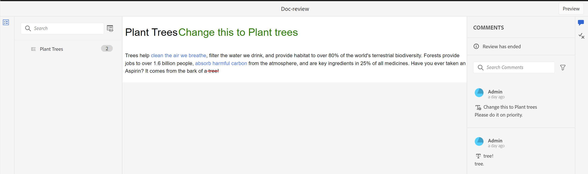

# Anzeigen einer abgeschlossenen Prüfungsaufgabe

Sie können Prüfungsaufgaben für die Projekte abschließen, für die Sie der Autor (oder Initiator) sind. Sobald eine Prüfungsaufgabe abgeschlossen ist, können Sie und alle Reviewer im schreibgeschützten Modus darauf zugreifen.

## Als Prüfer

Als Reviewer können Sie einen Indikator im Kommentarbereich anzeigen, um anzuzeigen, dass die Überprüfung beendet wurde. Die Symbolleiste „Kommentare“ wird nicht angezeigt. Sie können also weder Text markieren, durchstreichen, einfügen noch Kommentare hinzufügen. Sie können einen Kommentar lesen, aber keine Kommentare bearbeiten oder löschen. Sie können auch keine Antwort auf die Kommentare hinzufügen. Die kontextuelle Symbolleiste (zum Hervorheben oder Durchstreichen von Text) kann nicht angezeigt werden. Das Symbol für veraltete Kommentare wird auch nicht in einer abgeschlossenen Prüfungsaufgabe angezeigt.

Sie können jedoch auch nach Kommentaren suchen oder diese filtern. Sie können auch Bedingungen ein- oder ausblenden und entsprechend bedingte Inhalte anzeigen. Sie können alle Anhänge herunterladen, aber keine Anhänge für die Kommentare hochladen oder löschen.

{align="left"}

## Als Autor

Sie können die abgeschlossenen Prüfungsaufgaben im Bedienfeld **Überprüfen** auf Projektebene im Abschnitt **Geschlossene Aufgaben** anzeigen, wie im Screenshot gezeigt. Sie können Prüfungsaufgaben basierend auf Projekten suchen oder filtern. Sie können beispielsweise bestimmte Projekte im Dialogfeld **Filter** auswählen und im aktiven Prüfungsbereich anzeigen lassen. Sie können die Ergebnisse mithilfe der Optionen **Von mir initiierte Aufgaben** und **Nur aktive Aufgaben anzeigen** weiter filtern.

{align="left"}

Bei geschlossenen Prüfungsaufgaben können Sie einen Kommentar lesen, aber einen Kommentar nicht akzeptieren oder ablehnen. Kommentare können nicht bearbeitet oder gelöscht werden. Sie können auch keine Antwort für den Kommentar hinzufügen. Das Symbol Veraltete Kommentare und das Symbol Kommentare in Autorenansicht importieren werden für eine abgeschlossene Prüfungsaufgabe nicht angezeigt. Das Symbol Thema zurücksetzen und das Symbol Importieren wird deaktiviert, nachdem die Prüfungsaufgabe abgeschlossen ist, wie im Screenshot gezeigt.

Sie können auch alle Kommentare durchsuchen oder filtern, die im Review-Fenster vorhanden sind. Sie können alle Anhänge herunterladen, aber keine Anhänge für die Kommentare hochladen oder löschen.

{align="left"}

Daher können Sie sowohl als Prüfer als auch als Autor den überprüften Inhalt zusammen mit den Kommentaren anzeigen, jedoch keine Änderungen an einer abgeschlossenen Prüfungsaufgabe vornehmen.
