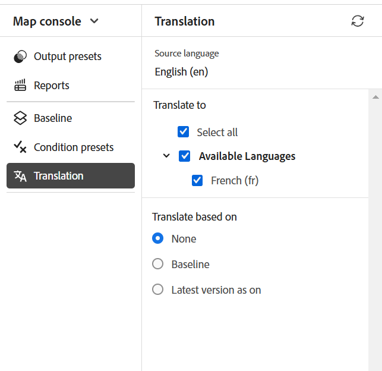

# Übersetzen von Dokumenten aus der Map-Konsole {#id21BKF0Z0YZF}

>[!TIP]
>
> Es wird empfohlen, diese Übersetzungsfunktion aus dem Editor zu verwenden, wenn Sie ein Upgrade auf Adobe Experience Manager Guides as a Cloud Service Version Februar 2022 oder höher durchgeführt haben.

Experience Manager Guides verfügt über eine leistungsstarke Funktion im Editor, mit der Sie Ihre Inhalte in mehrere Sprachen übersetzen können. Sie können ein neues Übersetzungsprojekt erstellen und die Übersetzungsaufträge später zum vorhandenen Übersetzungsprojekt hinzufügen. Sie können auch ein mehrsprachiges Übersetzungsprojekt erstellen, das Übersetzungsaufträge für alle ausgewählten Sprachen enthält.

>[!NOTE]
>
> Ihre bzw. Ihr Admin kann die Registerkarte Verwalten (für die Übersetzung verwendet) im Editor konfigurieren. Weitere Informationen finden Sie *Abschnitt „Übersetzungsfunktion im Editor konfigurieren* im Abschnitt Installieren und Konfigurieren von Adobe Experience Manager Guides as a Cloud Service.

## Voraussetzungen

Bevor Sie diese Schritte ausführen, stellen Sie sicher, dass Sie die erforderlichen Sprachstamm- und Zielordner erstellt haben

1. Erstellen Sie einen Stammordner, um Ihre Quellinhalte zu speichern. Der Stammordner muss mit dem Namen der Sprache \(z. B. Englisch\) oder dem Sprach-Code \(en\) erstellt werden.
1. Erstellen Sie die Zielordner, in die Sie Ihre Inhalte übersetzen möchten. Wenn Sie beispielsweise Ihre Inhalte in Deutsch oder Französisch übersetzen möchten, müssen Sie einen Ordner mit dem Namen -de \(für Deutsch\) oder -fr \(für Französisch\) erstellen.

>[!NOTE]
>
> Der Stammordner und die Zielordner müssen auf derselben Ebene erstellt werden.

## Ein Übersetzungsprojekt erstellen

1. Öffnen Sie **Bedienfeld** Repository“ die DITA-Zuordnungsdatei in der Zuordnungsansicht.
1. Wählen Sie das Symbol **In Map-Konsole öffnen** aus.
1. Navigieren Sie auf der Seite der Zuordnungskonsole zur Registerkarte **Übersetzung** . Im **Übersetzungsbedienfeld** werden die verfügbaren Sprachgruppen angezeigt.

1. Als Benutzer können Sie die für Ihr Ordnerprofil konfigurierten Sprachgruppen anzeigen. Die Sprachgruppen zeigen die Sprachordner zusammen mit ihren Sprachcodes an. Beispielsweise enthält die Sprachgruppe G1 die Sprachordner Italienisch \(it\), Deutsch \(de\), Französisch \(fr\) und Englisch \(en\).

   {width="300" align="left"}

   *Wählen Sie die Sprachgruppen oder Sprachen aus, in die Sie Ihre Dokumente übersetzen möchten.*

   >[!IMPORTANT]
   >
   > Sie können nur die Sprachen auswählen und in diese übersetzen, für die Sie den Zielordner parallel zur Quellsprache erstellt haben. Ein auf einer anderen Ebene erstellter Sprachordner, z. B. eine Ebene unterhalb des Ordners der Ausgangssprache, wird ebenfalls nicht angezeigt. Stellen Sie sicher, dass Sie alle Zielsprachordner auf derselben Ebene wie den Ordner für die Ausgangssprache erstellen.

1. Sie können eine beliebige Sprachgruppe als Ziel für die Übersetzung auswählen. Wenn Sie **Alle auswählen** werden die ausgewählten Dateien in alle verfügbaren Sprachen innerhalb der vorhandenen Sprachgruppen übersetzt.

   Die Option „Sprachordner“ ist ausgegraut und zeigt ein Warnzeichen an:

   - Wenn der Zielordner für eine Sprache fehlt.
   - Wenn die Zielsprache mit der Ausgangssprache identisch ist.

   >[!NOTE]
   >
   > Wenn Sie den Zielordner für eine Sprache erstellen, nachdem Sie die Sprachgruppe erstellt haben, aktualisieren Sie den Browser, um die Sprache in den Sprachgruppen zu aktivieren.

1. Wenn Sie eine bestimmte Sprache auswählen, wird sie in allen ausgewählten Sprachgruppen als ausgewählt angezeigt. Wenn man in eine Sprache übersetzt, wird es in einem Schritt für alle Sprachgruppen übersetzt. Wenn beispielsweise Deutsch sowohl in den G1- als auch in den G2-Sprachgruppen vorhanden ist, wird es für beide ausgewählt.

1. Unter **Andere Sprachen** können Sie eine beliebige Sprache auswählen, für die Sie den Zielordner erstellt haben, die jedoch nicht zu Sprachgruppen gehört.

1. Sie können auch eine der folgenden Optionen auswählen, um Ihr Projekt zu übersetzen:

   **Keine** Wählen Sie diese Option, um die Standardversionen der Dateien zu übersetzen. Standardmäßig ist diese Option aktiviert.

   **Baseline verwenden** Sie können für die Übersetzung Ihres Projekts eine Baseline auswählen. Wählen Sie **Baseline verwenden** und wählen Sie eine auf der Karte erstellte Baseline aus. Alle Dateien, die Teil der ausgewählten Baseline sind, werden auf der Seite Übersetzung angezeigt. Nach der Übersetzung Ihrer Inhalte können Sie die übersetzten Baselines exportieren. Weitere Informationen zum Exportieren der übersetzten Baseline finden Sie unter [Exportieren der übersetzten Baseline](generate-output-use-baseline-for-publishing.md#id196SE600GHS).

   **Neueste Version verwenden als ein**: Wählen Sie diese Option, um die Version der Themen nach Erstellungsdatum und -uhrzeit zu filtern. Wenn Sie Datum und Uhrzeit auswählen, wird nur die neueste Version der Dateien angezeigt, die am oder vor dem ausgewählten Datum und der ausgewählten Uhrzeit erstellt wurden.

1. Wählen Sie **Anwenden** aus. Eine Liste mit Details zu Themen und zugehörigen Assets wird angezeigt.
1. Wählen Sie die Themen aus, die Sie zur Übersetzung senden möchten. Sie können auch die Themenfilteroptionen für die folgenden Spalten verwenden:

   - **Title**: Titel der Quelldatei.  Bewegen Sie den Mauszeiger über den Titel der Quelldatei, um den Titel der Zieldatei oder der übersetzten Datei anzuzeigen.
   - **Dateiname**: Name der Quelldatei
   - **Dateityp**: Typ der Quelldatei. Die verfügbaren Optionen sind „Zuordnung“, „Thema“ und „Bild“.
   - **Verweistyp**: Direkte oder indirekte Verweise
   - **Version**: Versionsnummer der Quelldatei.

     Wenn eine Datei Änderungen gespeichert hat, die noch nicht versioniert sind (d. h. die nicht als neue Version in Ihrer Zuordnung gespeichert wurden), wird neben der Datei ein Informationssymbol angezeigt, das das Vorhandensein nicht versionierter Änderungen angibt.

     {width="650" align="left"}

     >
     >
     > Um nur Dateien mit nicht versionierten Änderungen anzuzeigen, aktivieren Sie die Einstellung **Nur Assets mit nicht versionierten Änderungen anzeigen** im Bedienfeld Filter . Darüber hinaus ist die Markierung für unversioniert nur sichtbar, wenn Dateien basierend auf ihren neuesten Versionen übersetzt werden.
   - **Versionsbezeichnung**: Bezeichnung für die ausgewählte Version der Quelldatei
   - **Target-Version**: Versionsnummer der Zieldatei
   - **Dokumentstatus**: Status der Quelldatei. Die verfügbaren Optionen sind „Entwurf“, „In Überprüfung“ und „Überprüft“.
   - **Zielsprache**: Die Sprache, in die die Quelldatei übersetzt werden soll
   - **Übersetzungsstatus**: Die verfügbaren Optionen sind: Nicht synchronisiert, Fehlende Kopie, In Bearbeitung und Synchronisiert.
   - **Target Label**: Bezeichnung für die ausgewählte Version der Zieldatei
1. Wählen **oben rechts** Zur Übersetzung senden“ aus.

   {align="left"}

1. Wählen Sie aus der Dropdown **Liste Neues Übersetzungsprojekt erstellen**.

   {width="350" align="left"}

   Neben einem neuen Übersetzungsprojekt können Sie auch aus den folgenden Optionen auswählen:

   - Sie können für **Übersetzungsprojekt „Nur** erstellen“ auswählen.
   - Sie können auch **Neues XLIFF-Übersetzungsprojekt erstellen** um den XML-Inhalt in das XML Localization Interchange File Format (XLIFF) zu konvertieren. XLIFF ist ein offenes XML-basiertes Format, das verwendet wird, um die Datenübertragung zwischen verschiedenen Tools zu standardisieren, die im Prozess der Inhaltsübersetzung verwendet werden. Experience Manager Guides unterstützt XLIFF Version 1.2.
In einem XLIFF-Projekt werden die Inhalte in das dem Branchenstandard entsprechende XLIFF-Format exportiert, das Übersetzungsanbietern zur Verfügung gestellt werden kann. Das XLIFF-Format ermöglicht die potenzielle Wiederverwendung von Segmenten, die Sie bereits während der Übersetzungsphase übersetzt haben.\
     Nachdem die XLIFF-Inhalte übersetzt wurden, können sie in Experience Manager Guides importiert werden, wodurch eine übersetzte Version des Original-DITA-Projekts erstellt wird.

   >[!NOTE]
   >
   > Der XLIFF-Export funktioniert nur mit der Konfiguration für menschliche Übersetzung.

   - Sie können **Neues mehrsprachiges Übersetzungsprojekt erstellen** auswählen, das Übersetzungsaufträge für alle Sprachen enthält, die Sie für die Übersetzung ausgewählt haben. Wenn Sie beispielsweise Französisch, Deutsch und Spanisch ausgewählt haben, wird ein Projekt erstellt, das Übersetzungsaufträge für alle drei Sprachen enthält.
   - Wenn Sie bereits über ein Übersetzungsprojekt verfügen, können Sie diesem Projekt Themen hinzufügen. Wählen Sie **Option „Zu vorhandenem Übersetzungsprojekt hinzufügen** aus der Projektliste aus und wählen Sie ein Projekt aus der Liste Vorhandenes Übersetzungsprojekt aus. Sie können diese Projekte nach aktueller, aufsteigender oder absteigender Reihenfolge sortieren.

   - Wenn Sie **Zu vorhandenem Übersetzungsprojekt hinzufügen** auswählen, aktualisiert dieser Vorgang den vorhandenen Asset-Eintrag im Projekt, wenn das Asset bereits hinzugefügt wurde und der Status des zugehörigen Übersetzungsauftrags sich im Status *Entwurf* befindet.
      - Wenn die Zielsprache nicht im Projekt vorhanden ist, wird ein neues Projekt für das einsprachige Übersetzungsprojekt erstellt und ein neuer Auftrag für das mehrsprachige Übersetzungsprojekt erstellt.

      - Wenn der Auftrag bereits für die Zielsprache vorhanden ist und der Auftragsstatus nicht den Status *Entwurf* aufweist, wird innerhalb desselben Projekts ein neuer Auftrag erstellt, um die Assets für die Übersetzung hinzuzufügen.

   >[!NOTE]
   >
   > Wenn es sich bei Ihrem vorhandenen Projekt um ein Umfangsprojekt handelt, wird &quot;\(Scoping\)“ an den Namen angehängt.

   - Wenn Sie den Umfang für ein zu übersetzendes Projekt erstellen müssen, können Sie **Neues Scoping-Übersetzungsprojekt erstellen** auswählen. Dadurch werden die Kopien nicht zur Übersetzung gesendet und der ursprüngliche Übersetzungsstatus der Dateien wird beibehalten. Die Zielsprachkopie der referenzierten Themen, die zum Berechnen des Umfangs gesendet werden, hat keine Auswirkungen.

1. Geben Sie im Feld **Projekttitel** einen Namen für das Projekt ein.
1. Wählen **Senden** aus, um ein neues Übersetzungsprojekt zu erstellen.

Ein neues Übersetzungsprojekt wird mit der ausgewählten Version der Themen erstellt. Zu diesem Zeitpunkt wird eine Popup-Meldung angezeigt, die bestätigt, dass das Übersetzungsprojekt erstellt wurde. Sobald alle Kopien der Zielsprache im Übersetzungsprojekt verfügbar sind, erhalten Sie eine Benachrichtigung im Posteingang. Sobald die Zielsprachenkopien im Übersetzungsprojekt verfügbar sind, können Sie mit dem Übersetzungsauftrag beginnen. Für die Detailansicht [Übersetzungsauftrag starten](translation-first-time.md#id225IK030OE8).

>[!NOTE]
>
> Wenn Sie die Übersetzung für ein oder mehrere Themen in einem Übersetzungsauftrag ablehnen, wird der **In Bearbeitung** Übersetzungsstatus aller abgelehnten Themen auf ihren ursprünglichen Status zurückgesetzt. Der Status der referenzierten Themen wird entsprechend dem aktuellen Übersetzungsstatus überprüft und zurückgesetzt. Außerdem werden die im Zielprojekt erstellten Übersetzungsdateien nicht gelöscht, selbst wenn die Übersetzung dafür abgelehnt wird.

## Hinzufügen der Übersetzungsregeln

Mit Experience Manager Guides können Ihre Admins die Übersetzungsregeln konfigurieren. Das SRX-Format (Segmentation Rules eXchange) ist ein Standard für den Austausch von Segmentierungsregeln zwischen verschiedenen Benutzern und Übersetzungsumgebungen. Sie können einen Ordner erstellen und ihm Ihre benutzerdefinierten SRX-Dateien hinzufügen.

SRX-Dateien sollten wie `<language-code>.srx` benannt werden. Beispiel: en-US oder ar-AE.

>[!NOTE]
> 
> Beim Titel wird nicht zwischen Groß- und Kleinschreibung unterschieden. Daher kann „en-US“, „en-us“ oder „en-us“ verwendet werden. Experience Manager Guides kann auch &quot;-&quot; (Bindestrich) oder „_“ (Unterstrich) auflösen. Sie können also „en-US“ oder „en_US“ verwenden.

Außerdem können Sie diese Dateien in jedem Ordner unter dem `./content/dam` Adobe Experience Manager Assets-Stammordner ablegen.

Nachdem Sie den Ordner erstellt haben, der die SRX-Dateien enthält, können Sie den Ordnerpfad in der Konfiguration des SRX-Speicherorts für Übersetzungen in Ihrem Ordnerprofil hinzufügen.

Es wird empfohlen, für eine bessere Leistung nur SRX-Dateien in dem Ordner zu behalten, der im Profilordner konfiguriert ist.

Experience Manager Guides wählt die SRX-Regeln entsprechend der Quellsprache des Übersetzungsprojekts aus. Es wird nach einer benutzerdefinierten SRX-Datei für eine Sprache gesucht. Wenn Sie keine benutzerdefinierte SRX-Datei definieren, werden die Regeln gemäß den vordefinierten Übersetzungsregeln ausgewählt.

Weitere Informationen zum Einrichten globaler Profile und Profile auf Ordnerebene finden Sie im Abschnitt *Konfigurieren von Authoring* Vorlagen“ unter Installieren und Konfigurieren von Adobe Experience Manager Guides as a Cloud Service.

## Übergeben Sie die Versionsbezeichnung an die Zielversion

Mit Experience Manager Guides können Sie die Bezeichnung der Quelldatei an die Zieldatei übergeben. Auf diese Weise können Sie die Quellversion für die übersetzte Datei leicht identifizieren.

Um die Quellversionsbeschriftung in der Zielkopie hinzuzufügen, muss der Systemadministrator die Option **Quellversionsbeschriftungen in die Zielversion übertragen** auf der Registerkarte **Übersetzung** in **Workspace-** aktivieren (wird **Einstellungen** für **On-Prem**).

Wenn Sie beispielsweise Quelldateien haben, auf die die Versionsbezeichnung `Release 1.0` angewendet wurde, können Sie auch die Quellbezeichnung \(`Release 1.0`\) an die übersetzte Datei übergeben.

{width="650" align="left"}

>[!NOTE]
>
> Die Quellbeschriftung ist nur an eine Zielversion angehängt. Wenn Sie die Quellbeschriftung in eine andere Version verschieben, wird sie automatisch in der neuesten Zielbeschriftung angezeigt.

## Versionsunterschied für nicht synchronisierte Dateien anzeigen 

Experience Manager Guides bietet die Funktion, die Unterschiede zwischen der ausgewählten Version und der letzten übersetzten Quellversion der Themen zu überprüfen. Sie können die **nicht synchron)** basierend auf den vorgenommenen Änderungen übersetzen.

{width="650" align="left"}

Klicken Sie auf **Unterschied anzeigen** Symbol \(\) für ein Thema, um die Unterschiede zwischen der zuletzt übersetzten Version und der aktuellen Version der ausgewählten Datei anzuzeigen.

>[!NOTE]
>
> **Unterschied anzeigen** wird das Symbol \(\) nur für DITA-Dateien angezeigt, die den Übersetzungsstatus &quot;**&quot;**.

Das **Versionsunterschied** wird angezeigt. Hier werden die **Letzte übersetzte Version** und die **Ausgewählte Version** Nummer auf der linken Seite angezeigt. Im Vorschaufenster werden die Unterschiede zwischen der zuletzt übersetzten Version und der ausgewählten Themenversion angezeigt.

{width="650" align="left"}

## Nicht synchronisierte Assets schließen

Wenn Sie Änderungen an einigen Assets vornehmen, werden diese Assets nicht mehr synchronisiert. Sie können die geänderten Assets entweder erneut übersetzen oder den Status „Nicht synchronisiert“ verwerfen. Wenn Sie zum Beispiel einige sehr geringfügige Änderungen vorgenommen haben, die wirklich keine Übersetzung benötigen, können Sie deren Status als „Synchronisiert“ markieren.

Um den Status „Nicht synchronisiert“ zu schließen, führen Sie die folgenden Schritte aus:

1. Wählen Sie die Assets aus, für die Sie den Status ändern möchten.
1. Klicken Sie **oben auf die Schaltfläche** Mark In Sync \(\). Das **Als synchronisiert markieren** wird angezeigt.

   {width="550" align="left"}

1. Wählen Sie **Synchronisierung erzwingen** aus. Für die ausgewählten nicht synchronisierten Assets wird der Status auf „Synchronisiert“ festgelegt.

>[!NOTE]
>
> **Synchronisiert markieren** wird die Schaltfläche \(\) nur für Assets angezeigt, deren Übersetzungsstatus „Nicht synchronisiert“ lautet.

## Anzeigen laufender Übersetzungsprojekte für eine Karte oder ein Thema

Einige der Verweise auf Ihrem Übersetzungs-Dashboard befinden sich möglicherweise im Status In Bearbeitung . Diese Verweise haben einen Link **In Bearbeitung** unter der Spalte **Übersetzungsstatus**. Wenn Sie den Link auswählen, wird das Dialogfeld **In Bearbeitung** Projekte“ geöffnet. Im Dialogfeld können Sie die Liste aller laufenden Übersetzungsprojekte (zusammen mit der Zielsprache\) anzeigen, die die ausgewählte Referenz enthalten.

>[!NOTE]
>
> Sie können den Link In Bearbeitung für die übersetzten Projekte anzeigen, die in Adobe Experience Manager Guides as a Cloud Service ab Version Februar 2023 erstellt wurden.

Wählen Sie den Namen der Referenz im Dialogfeld aus, um sie im Vorschaumodus zu öffnen. Sie können auch das Übersetzungsprojekt auswählen, um die Übersetzung zu starten.

{width="550" align="left"}

## Abgeschlossenes Übersetzungsprojekt automatisch löschen oder deaktivieren

>[!NOTE]
> 
>Diese Funktion ist für neue Übersetzungsprojekte verfügbar, die Sie mit Experience Manager Guides Version 2404 oder höher erstellen.  Dies hat keine Auswirkungen auf bestehende Projekte.

Ihr Administrator kann die Option **Bereinigung des Übersetzungsprojekts nach Abschluss** auf der Registerkarte **Übersetzung** in den **Workspace-Einstellungen** konfigurieren (angezeigt als **Einstellungen** für **On-Prem**), um die Übersetzungsprojekte automatisch zu deaktivieren oder zu löschen.

Für die Dokumentverwaltung bietet Experience Manager Guides die Möglichkeit, die Übersetzungsprojekte nach Abschluss der Übersetzung zu löschen.

Sie können die Übersetzungsprojekte auch deaktivieren, wenn Sie sie später verwenden möchten. Beim Löschen eines Projekts werden alle im Projekt vorhandenen Dateien und Ordner gelöscht. Durch Deaktivieren eines Projekts wird es nicht gelöscht, sondern im Repository beibehalten. Sie können jedoch ein deaktiviertes Projekt nicht aktualisieren oder bearbeiten.  Das Löschen oder Deaktivieren eines Projekts wirkt sich nicht auf den Übersetzungsstatus von Verweisen aus.

**Übergeordnetes Thema:**&#x200B;[&#x200B; Einführung in den Editor](web-editor.md)
