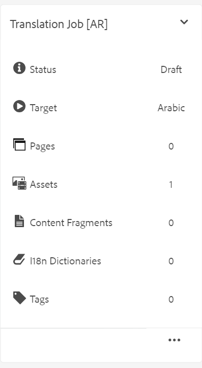

# Geänderte Themen übersetzen {#id16A5A0B6072}

Wenn Sie Änderungen an einigen Themen vornehmen, müssen diese Themen erneut übersetzt werden. Sie können geänderte Themen aus der DITA-Karte verfolgen. Wählen Sie im Ordner für die Quellsprache die DITA-Zuordnungsdatei aus der Zuordnungskonsole aus und klicken Sie auf die Registerkarte Übersetzung . Sie können den Status der einzelnen Themen einsehen, unabhängig davon, ob sie neu übersetzt werden müssen oder nicht.

Führen Sie die folgenden Schritte aus, um ein geändertes Thema zur erneuten Übersetzung zu senden:

1. Wählen Sie die DITA-Zuordnungsdatei aus dem Ordner für die Quellsprache aus der **Zuordnungskonsole** im Editor aus.

1. Wählen Sie die **Übersetzung** aus.

1. Wählen Sie **Bedienfeld**&#x200B;Übersetzung“ auf der linken Seite die **Verfügbare Sprachen** für die Sie den Status überprüfen möchten, und wählen Sie **Übernehmen**.

   Sie können den Übersetzungsstatus für jedes Thema anzeigen. Themen, für die eine andere Themenrevision verfügbar ist als die, die zur Übersetzung gesendet wurde, haben den Status **Nicht synchronisiert**.

   >[!NOTE]
   >
   > Der Übersetzungs-Workflow vergleicht die zuletzt gespeicherte Revision der Themendatei im Ordner der Ausgangssprache mit der übersetzten Version.

   Wenn Sie den Pfeil auswählen, um weitere Details anzuzeigen, können Sie die bestimmte Sprachkopie anzeigen, die nicht synchronisiert ist.

   {width="800" align="left"}

1. Aktivieren Sie das Kontrollkästchen, um die Themen auszuwählen, die zur erneuten Übersetzung gesendet werden sollen.

   Wenn Sie ein Thema auswählen, das nicht synchronisiert ist, wird **Schaltfläche** Als synchronisiert markieren“ über der Titelleiste angezeigt.

   Mit der Schaltfläche **Synchronisieren** können Sie den Status Nicht synchronisiert für die Themen in der DITA-Zuordnung außer Kraft setzen.  Wenn Sie zum Beispiel einige sehr geringfügige Änderungen vorgenommen haben, die wirklich keine Übersetzung benötigen, können Sie deren Status als „Synchronisiert“ markieren.

   >[!NOTE]
   >
   > Wenn Sie die Schaltfläche **Als synchronisiert markieren** auswählen, wird der Themenstatus für die ausgewählten Themen, die nicht synchronisiert sind, auf „Synchronisiert“ festgelegt.

1. Sie können die Schaltfläche **Zur Übersetzung senden** auswählen.

1. Sie können wählen, ob Sie ein neues Übersetzungsprojekt erstellen oder Themen zu einem vorhandenen Übersetzungsprojekt hinzufügen möchten. Geben Sie die erforderlichen Details an, um das Übersetzungsprojekt zu konfigurieren.

1. Wählen Sie **Absenden**.

   Eine Bestätigungsmeldung wird angezeigt, dass das Thema zur Übersetzung versendet wurde.

1. Navigieren Sie in der Projektkonsole zum Übersetzungsprojekt. Im Ordner wird eine neue Karte für Übersetzungsaufträge erstellt. Klicken Sie auf die Auslassungszeichen, um die Assets des Ordners anzuzeigen.

   {width="300" align="left"}

1. Um die Übersetzung zu starten, klicken Sie auf der Karte Übersetzungsauftrag auf den Pfeil und wählen Sie **Starten** aus der Liste aus. Eine Meldung informiert Sie darüber, dass der Vorgang gestartet wurde.

   Sie können den Status des zu übersetzenden Themas auch anzeigen, indem Sie unten auf der Karte „Übersetzungsauftrag“ auf die Auslassungspunkte klicken.

   >[!NOTE]
   >
   > Wenn Sie den menschlichen Übersetzungs-Service verwenden, müssen Sie die Inhalte für die Übersetzung exportieren. Sobald Sie die übersetzten Inhalte haben, müssen Sie sie wieder in das Übersetzungsprojekt importieren.

1. Nach Abschluss der Übersetzung ändert sich der Status in **Bereit für Überprüfung**. Klicken Sie auf die Auslassungszeichen, um Themendetails anzuzeigen, und führen Sie einen der folgenden Schritte in der Symbolleiste aus:

   - Wählen Sie **In Assets einblenden** aus, um die Übersetzung anzuzeigen und zu überprüfen.

   - Wählen **Übersetzung akzeptieren**, wenn Sie der Meinung sind, dass die Änderungen korrekt übersetzt wurden. Eine Bestätigungsmeldung wird angezeigt.

   - Wählen **Übersetzung ablehnen**, wenn Sie der Meinung sind, dass der Vorgang wiederholt werden muss. Eine Ablehnungsmeldung wird angezeigt.

   >[!NOTE]
   >
   > Es ist wichtig, das übersetzte Asset zu akzeptieren oder abzulehnen, da sonst die Datei am temporären Speicherort bleibt und nicht in DAM kopiert wird.

1. Navigieren Sie zurück zur DITA-Zuordnungsdatei im Ordner für die Ausgangssprache in der Assets-Benutzeroberfläche. Die neu übersetzten Themen sind jetzt synchronisiert.

**Übergeordnetes Thema:**[&#x200B;Übersicht über die Inhaltsübersetzung](translation.md)
