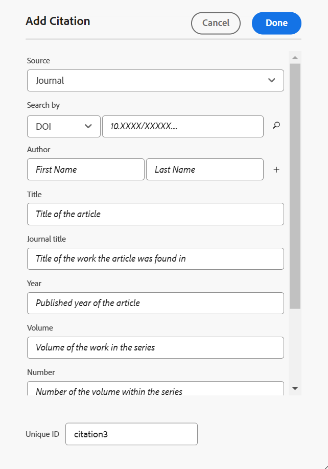
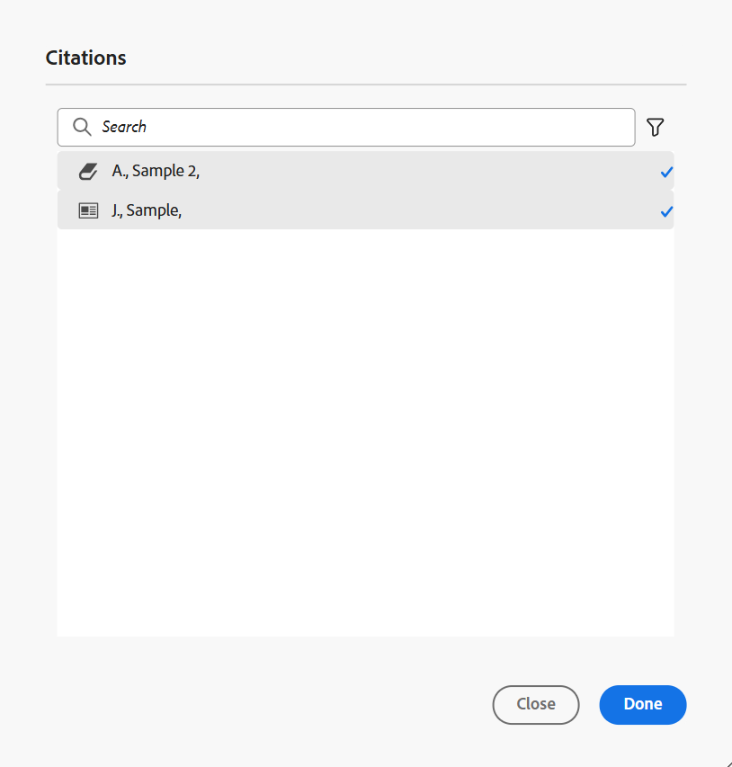

# Hinzufügen und Verwalten von Zitaten in Ihren Inhalten

Zitate sind Verweise auf die Quelle von Informationen, die Ihrem Inhalt hinzugefügt werden. Mithilfe von Zitaten können Sie den Autoren die Quellinformationen zuschreiben und den Lesern helfen, die Quellinformationen zu verfolgen. Das Hinzufügen von Zitaten macht Ihre Inhalte zuverlässiger und verhindert Plagiate. Sie ermöglichen es Ihnen auch, gut recherchierte Inhalte anzuzeigen.

In Adobe Experience Manager Guides können Sie Zitate hinzufügen, importieren und sie auf Ihre Inhalte anwenden. Sie können diese Zitate aus jeder Quelle von Büchern, Websites und Zeitschriften hinzufügen.

Mit Experience Manager Guides können Sie Ihre Zitate bearbeiten, in der Vorschau anzeigen und sortieren. Nachdem Sie Ihre Zitate zum Inhalt hinzugefügt haben, können Sie die Ausgabe mit dem nativen PDF generieren. Sie können die Bibliografie- oder Verweisseite auch in der nativen PDF-Ausgabe hinzufügen.

Experience Manager Guides unterstützt verschiedene Zitatstile, wie die Modern Language Association (MLA), die American Psychological Association (APA), Chicago, das Institute for Electrical and Electronics Engineers (IEEE) und die American Heart Association (AHA). Es wird empfohlen, diese klar und konsequent anzuwenden.

>[!NOTE]
>
>Derzeit unterstützt Experience Manager Guides nur native PDF für Zitate.

## Zitate hinzufügen

Gehen Sie wie folgt vor, um Zitate hinzuzufügen:

1. Wählen Sie **linken Bedienfeld** Symbol  aus.

   Das **Zitate**-Bedienfeld wird geöffnet.

   {width="350" align="left"}

1. Wählen Sie im **Zitate**-Bedienfeld  aus. Aus dem Dropdown-Menü können Sie ein neues Zitat hinzufügen oder ein Zitat importieren.

1. Wählen Sie **Neues Zitat** aus, um ein neues Zitat hinzuzufügen.

   Das **Zitat hinzufügen** wird geöffnet.

    {width="300" align="left"}

1. Füllen Sie die Felder im Dialogfeld **Zitat hinzufügen** aus.

   >[!NOTE]
   >
   >Sie können auch die ISBN-, DOI- oder PubMed-ID hinzufügen. AEM Guides füllt die anderen Felder automatisch aus.

   | Buch | Website | Journal |
   | --- | ---|---|
   | **Source**   Wählen Sie aus der Dropdown-Liste die Quelle des Zitats als Buch aus. | **Source**  Wählen Sie in der Dropdown-Liste die Quelle des Zitats als Website aus. | **Source**   Wählen Sie in der Dropdown-Liste die Quelle des Zitats als Journal aus. |
   | **Suchen nach**   Wählen Sie **ISBN** oder **DOI** aus der Dropdown-Liste aus, um nach der digitalen ID zu suchen, die mit dem Zitat verknüpft ist.    DOI: Digitale Objektkennung   ISBN: Eindeutige numerische Buchkennung | **Suchen nach**   Wählen Sie **DOI** aus der Dropdown-Liste aus, um nach der digitalen ID zu suchen, die mit dem Zitat verknüpft ist. | **Suchen nach**   Wählen Sie **DOI** oder PubMed ID aus der Dropdown-Liste aus, um nach der digitalen ID zu suchen, die mit der Zitatangabe verknüpft ist.      |
   | **Autor**   Fügen Sie den Vor- und Nachnamen des Autors des Zitats hinzu. Wählen Sie  aus, um weitere Namen hinzuzufügen. | **Autor**   Fügen Sie den Vor- und Nachnamen des Autors des Zitats hinzu. Wählen Sie  aus, um weitere Namen hinzuzufügen. | **Autor**   Fügen Sie den Vor- und Nachnamen des Autors des Zitats hinzu. Wählen Sie aus, um weitere Namen hinzuzufügen. |
   | **Titel**   Fügen Sie den Titel des Buchs hinzu. | **Titel**   Fügen Sie den Titel der Web-Seite hinzu. | **Titel**   Fügen Sie den Titel des Artikels hinzu. |
   | **Editor**   Fügen Sie den Editor des Buchs hinzu. | **Website-Name**   Fügen Sie den Namen der Website hinzu. | **Journaltitel**   Fügen Sie den Titel des Werks hinzu, in dem der Artikel gefunden wird. |
   | **Edition**   Fügen Sie die Ausgabe des Buches hinzu. | **URL**   Fügen Sie den Weblink der Website hinzu, um den Inhalt zu durchsuchen. | **Jahr**   Fügen Sie das Jahr hinzu, in dem der Artikel veröffentlicht wird. |
   | **Stadt**   Fügen Sie die Stadt der Veröffentlichung hinzu. | **Zugriffsdatum**  Fügen Sie das Datum hinzu, an dem der Inhalt der Website aufgerufen wird. | **Volumen**   Fügen Sie das Volumen der Arbeit in der Reihe hinzu. |
   | **Publisher**   Fügen Sie den Namen des Herausgebers des Buchs hinzu. | **Veröffentlichungsdatum**   Fügen Sie das Datum hinzu, an dem der Inhalt der Website veröffentlicht wird. | **Number**   Fügen Sie die Nummer des Volumes innerhalb der Serie hinzu. |
   | **Year**   Fügen Sie das Jahr hinzu, in dem das Buch veröffentlicht wird. | **Aktualisierungsdatum**   Fügen Sie das Datum hinzu, an dem der Inhalt der Website aktualisiert wird. | **Seiten**   Fügen Sie die Seitennummer oder den Seitenbereich hinzu, in dem der Artikel gefunden wird. |
   | **Version**   Fügen Sie die Version des Buches hinzu. | **Eindeutige ID**   Fügen Sie eine eindeutige ID für die Zitierung hinzu. Eine eindeutige ID ist eine eindeutige Kennung für dieses Zitat. | **URL**  Fügen Sie den Weblink zum Protokoll hinzu. |
   | **Serie**  Fügen Sie die Serie des Buches hinzu. |  | **Eindeutige ID**   Fügen Sie eine eindeutige ID für das Zitat hinzu. Eine eindeutige ID ist eine eindeutige Kennung für dieses Zitat. |
   | **URL**   Fügen Sie den Weblink zum Buch hinzu. |  |  |
   | **Eindeutige ID**   Fügen Sie eine eindeutige ID für die Zitierung hinzu. Eine eindeutige ID ist eine eindeutige Kennung für dieses Zitat. |  |  |

1. Wählen Sie **Fertig** aus.

   Dem Zitatbereich wird ein neues Zitat hinzugefügt.

>[!NOTE]
>
> Das Hinzufügen einer eindeutigen ID für das Zitatfeld ist obligatorisch.  Sie können die eindeutige ID nicht mehr ändern, nachdem die Zitierung hinzugefügt wurde.

## Zitate importieren

Gehen Sie wie folgt vor, um Zitate zu importieren:

1. Wählen Sie im linken Bedienfeld die Option **Zitate**  aus.

   Das **Zitate**-Bedienfeld wird geöffnet.

1. Wählen Sie **Bedienfeld** Zitate“ die Option  und wählen Sie dann **Importieren** aus der Dropdown-Liste aus.
1. Durchsuchen Sie eine .bib-Datei aus Ihrem System und importieren Sie sie .

   >[!TIP]
   >
   > Eine Dateinamenerweiterung .bib ist eine BibTeX-Bibliografische Datenbankdatei. Es ist eine speziell formatierte Textdatei, die Referenzen zu einer bestimmten Informationsquelle auflistet.

   Nachdem die Datei erfolgreich importiert wurde, können Sie die Verweise im Bereich „Zitate“ anzeigen.

   >[!NOTE]
   > <ol><li> Experience Manager Guides importiert nur die Zitate, die eindeutig und noch nicht vorhanden sind.
    &gt; <li> Experience Manager Guides kann Zitate aus einem Buch, einem Journal oder einer Website importieren. Derzeit werden Zitate aus anderen Quellen nicht unterstützt.

## Zitate verwalten

Die Zitate werden im linken Bereich alphabetisch sortiert. Suchen Sie nach den Zitaten entsprechend den Quellen, die in Ihrem Thema verwendet werden sollen.

### Filter

Wählen Sie **Symbol** Filter neben der Suchleiste aus und wählen Sie die Quelloptionen aus der Dropdown-Liste aus, um die Zitatliste zu filtern. Es ermöglicht sowohl eine einzelne als auch mehrere Auswahlen.

* **Alle Quellen**: Hier wird eine vollständige Liste der Zitate angezeigt, einschließlich aller Quellen.

* **Buch**: Es zeigt die Liste der Zitate aus Büchern.

* **Website**: Zeigt die Liste der Zitate von Websites an.

* **Journal**: Zeigt die Liste der Zitate aus Journalen an.

### Suchen

Suchen Sie die Zitierung für Ihren Inhalt.

1. Wählen Sie im linken Bedienfeld Zitate aus.
Das **Zitate**-Bedienfeld wird geöffnet.

1. Verwenden Sie die Suchleiste, um aus einer langen Liste nach dem entsprechenden Zitat zu suchen.

### Zitatstil ändern {#change-citation-style}

Ihr Systemadministrator kann den Stil der Zitate über das Dropdown **Zitate** auf der Registerkarte **Allgemein** in den **Einstellungen** ändern.
Diese Stile bestimmen, wie Zitate im Vorschaubereich oder in der nativen PDF-Ausgabe angezeigt werden.

Die folgenden Optionen sind in der Dropdown-Liste verfügbar:

| MLA | APA | Chicago | IEEE | AHA |
|---|---|---|---|---|
| Moderne   | American Psychological Association Stil | Chicago Manual of Style | Institut für Elektro- und Elektronikingenieure | American Heart Association-Stil |
| Beispiel:   Crawford, Claire, et al. *Emotional Content of Dark Memories*.Edited by Memory, Band 16, 2010, Amsterdam. | Beispiel:   Crawford, C., J., &amp; , C. (2010). *Emotional Content of Dark Memories* (505-16 ed.). 10.1080/ 09658210902067289 | Beispiel:   Crawford, Claire, et al. *Emotionaler Inhalt dunkler Erinnerungen*. 505-16, 2010. | Beispiel:   C. Crawford, J. und C. *Emotionaler Inhalt dunkler Erinnerungen*. Amsterdam, 2010. | Beispiel:   C. Crawford, J. und C. *Emotionaler Inhalt dunkler Erinnerungen*. Amsterdam, 2010. |

## Zitat bearbeiten

Gehen Sie wie folgt vor, um das Zitat zu bearbeiten:

1. Bewegen Sie den Mauszeiger über den Namen des Zitats in der Liste. Wählen Sie  Symbol **Optionen** aus.

1. Wählen Sie **Bearbeiten** aus.

Das **Zitat bearbeiten** wird geöffnet.

1. Nehmen Sie die erforderlichen Änderungen vor. Wählen Sie **Fertig** aus.
Das ausgewählte Zitat wird bearbeitet.

>[!NOTE]
>
>Sie können die eindeutige ID nicht mehr ändern, nachdem die Zitierung hinzugefügt wurde.

## Vorschau eines Zitats anzeigen

Gehen Sie wie folgt vor, um eine Vorschau eines Zitats anzuzeigen:

Bewegen Sie den Mauszeiger über den Namen des Zitats in der Liste. Auswählen      Symbol **Optionen**.

1. Wählen Sie **Vorschau** aus.
Sie können den Inhalt und das Format des Zitats im Vorschaubereich in der Vorschau anzeigen.

   >[!NOTE]
   >
   >Die Vorschau basiert auf dem Zitatstil, den Ihr Administrator in den **Einstellungen** ausgewählt hat.

1. Wählen Sie eine beliebige Stelle auf dem Bildschirm aus, um das Vorschaufeld zu schließen.

   {width="550" align="left"}

>[!NOTE]
>
> Sie können ein in ein Thema eingefügtes Zitat auch über die Assets-Benutzeroberfläche oder die Registerkarte Vorschau des Editors in der Vorschau anzeigen.

## Zitate einfügen

Führen Sie die folgenden Schritte aus, um Zitate in ein Thema einzufügen:
1. Wählen Sie das Thema im Repository-Bereich aus und doppelklicken Sie dann darauf, um es im Bearbeitungsfenster zu öffnen.
1. Platzieren Sie den Cursor an der Position des Themas, an der das Zitat hinzugefügt werden soll.

Sie können Zitate zum Thema aus der Hauptsymbolleiste oder dem linken Bereich einfügen.

### In der Haupt-Symbolleiste

1. Wählen Sie das Symbol **Zitate**  in der Hauptsymbolleiste aus.
1. Wählen Sie **Dialogfeld**Zitate“ das Zitat aus. Sie können auch mehrere Zitate auswählen.
   {width="300" align="left"}
1. Sie können Zitate filtern, indem Sie die ersten Buchstaben in das Suchfeld des Dialogfelds **Zitat** eingeben.

1. Wählen Sie **Fertig** aus.
Das ausgewählte Zitat wird an der Cursorposition im Thema hinzugefügt.

### Vom linken Bedienfeld

>[!NOTE]
> 
>Um das Symbol **Zitate** im linken Bereich anzuzeigen, muss Ihr Systemadministrator die Option **Zitate** auf der Registerkarte **Panels** in **Settings** aktivieren.

1. Wählen Sie **Zitate**  Symbol im linken Bedienfeld aus.
1. Ziehen Sie das Zitat aus dem Bedienfeld **Zitate** und legen Sie es an der entsprechenden Position im Thema ab.

   Sie können auch **Einfügen** unter **Optionen** auswählen, um ein Zitat einzufügen.

   
1. Um mehrere Zitate auszuwählen, klicken Sie mit der rechten Maustaste auf ein Zitat im Thema und wählen **Zitat ändern** aus dem Kontextmenü aus.
1. Wählen Sie die Zitate, die Sie einfügen möchten, im Dialogfeld **Zitat** aus.
1. Wählen Sie **Fertig** aus, um sie zum Thema hinzuzufügen.

Nachdem Sie Zitate in das Thema eingefügt haben, können Sie sie im Web-Editor in der Vorschau anzeigen. Sie können auch Inhalte mit Zitaten veröffentlichen, indem Sie die native PDF verwenden.

## Zitat löschen

Sie können Zitate aus dem Zitationsbedienfeld oder aus einem Thema löschen, in das Sie eingefügt haben.

### Löschen eines Zitats aus dem Zitatbereich

Gehen Sie wie folgt vor, um ein Zitat aus dem Zitationsbereich zu löschen:

1. Bewegen Sie den Mauszeiger über den Namen des Zitats in der Liste.
1. Wählen Sie das Symbol  **Optionen** aus.
1. Wählen Sie die   **Löschen** .
Das Bestätigungsdialogfeld wird geöffnet.
1. Wählen Sie **Ja** aus.
Das ausgewählte Zitat wird aus dem Zitatbereich gelöscht.

### Löschen eines Zitats aus einem Thema

Gehen Sie wie folgt vor, um ein bereits im Thema verwendetes Zitat zu löschen:

Platzieren Sie im Thema den Cursor am Ende des Zitats.

1. Klicken Sie mit der rechten Maustaste auf ein Zitat im Thema und wählen **Zitat ändern** aus dem Kontextmenü. Das Dialogfeld „Zitat“ wird geöffnet.
   

1. Sie können die Zitate auswählen, die Sie in das Dokument einfügen möchten.

   >[!NOTE]
   >
   >Die bereits im Thema verwendeten Zitate werden durch die Zitate ersetzt, die Sie im Dialogfeld auswählen.

1. Wählen Sie **Fertig** aus.

## Generieren der Ausgabe von Inhalten mit Zitaten

Nachdem Sie Zitate in das Thema eingefügt haben, können Sie Inhalte mit Zitaten mithilfe von nativem PDF veröffentlichen.

In der nativen PDF-Ausgabe werden die Zitate innerhalb des Inhalts angezeigt, in den Sie sie eingefügt haben. Sie können auch eine Bibliografie-Seite erstellen. Wenn Sie ein Zitat auswählen, werden Sie zur Seite „Bibliografie“ weitergeleitet.

Erstellen Sie ein **Zitate**-Seitenlayout in den PDF-Vorlagen und schließen Sie es in Ihr Dokument ein. Alle im Buch verwendeten Zitate werden auf einer Seite aufgelistet, die in der PDF-Ausgabe angezeigt wird. Weitere Informationen zum Erstellen eines Seiten-Layouts finden Sie unter [Erstellen eines Seiten-Layouts](../native-pdf/components-pdf-template.md#create-page-layout).

Um die Ansicht und das Erscheinungsbild der Zitatseite zu ändern, rufen Sie [PDF-Vorlagen anpassen](../native-pdf/pdf-template.md) auf.

### Anwenden eines Inhaltsstils auf ein Zitat

Formatieren Sie das Zitat, wenn Sie es zum Thema hinzufügen.

1. Wählen Sie **Stylesheets** im **Vorlagen**-Bereich einer nativen PDF-Ausgabevorgabe aus.   Dadurch wird das **STYLES**-Bedienfeld geöffnet, das alle Stiloptionen enthält.

1. Suchen Sie im Suchbereich nach `<cite>`.

Weitere Informationen zu Stilen finden Sie unter [Arbeiten mit den allgemeinen Inhaltsstilen](../native-pdf/stylesheet.md).
