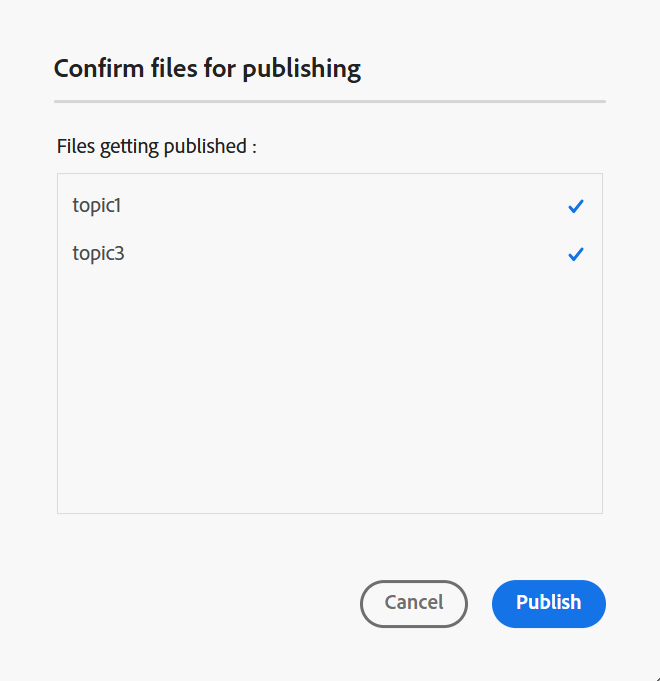

# Erstellen von Ausgabevorgaben für die Wissensdatenbank aus dem Editor {#id218CL400JW3}

Führen Sie die folgenden Schritte aus, um Ausgabevorgaben für Ihre DITA-Zuordnung zu erstellen:

1. Navigieren Sie in der Assets-Benutzeroberfläche zu der Zuordnungsdatei, die Sie bearbeiten möchten.

1. Um eine exklusive Sperre für die Zuordnungsdatei zu erhalten, wählen Sie die Zuordnungsdatei aus und klicken Sie auf **Checkout**.

1. Wählen Sie die **Themen bearbeiten** aus dem Aktionsmenü in der Zuordnungsdatei aus.

   Die Zuordnungsdatei wird im Editor zur Bearbeitung geöffnet.

   >[!NOTE]
   >
   > Sie können mit dem erweiterten Zuordnungs-Editor ein beliebiges Thema zur Karte hinzufügen oder daraus löschen. Weitere Informationen finden Sie unter [Arbeiten mit dem erweiterten Zuordnungs-Editor](map-editor-advanced-map-editor.md#).

1. Wählen Sie das Symbol **In Map-Konsole öffnen** aus. Die Zuordnung wird in der Zuordnungskonsole geöffnet.

1. Navigieren Sie zur Registerkarte **Ausgabevorgaben** und wählen Sie das Symbol + aus, um eine Ausgabevorgabe für Ihre DITA-Zuordnung zu erstellen.

1. Wählen Sie **Wissensdatenbank** aus der Dropdownliste **Typ**, geben Sie den Namen ein und wählen Sie **Adobe Experience Manager** im Dialogfeld **Neue** aus.
1. Wählen Sie die **Zum aktuellen Ordnerprofil hinzufügen**, um eine Ausgabevorgabe für das aktuelle Ordnerprofil zu erstellen.  zeigt eine Vorgabe auf Ordnerprofilebene an.

   Weitere Informationen zu [Verwalten von globalen und Ordnerprofilausgabevorgaben](./web-editor-manage-output-presets.md).

1. Wählen Sie **Hinzufügen** aus.

   Die Voreinstellung für die Wissensdatenbank wird erstellt.

   

Nachdem die Voreinstellung erstellt wurde, können Sie die Ausgabe für bestimmte Artikel in der Wissensdatenbank generieren. Navigieren Sie dazu zur Registerkarte **Artikel** und wählen Sie die Themen aus, für die Sie die Ausgabe generieren möchten.
1. Wählen Sie **oben** Ausgabe generieren“ aus, um die Ausgabe zu generieren.

   

1. Wählen Sie in **Eingabeaufforderung Dateien für** Veröffentlichung bestätigen die Dateien aus, die Sie veröffentlichen möchten, und bestätigen Sie Ihre Auswahl durch **Veröffentlichen**.

   

Sie sehen den Status des Ausgabegenerierungsprozesses. Die Spalte **Themen** listet die Themen auf, für die Ausgaben generiert werden, während die Spalte **Status** den Veröffentlichungsstatus jedes Themas anzeigt.

Um die Ausgabe anzuzeigen, schließen Sie das Dialogfeld „Ausgabe generiert“ und wählen **Ausgabe anzeigen** auf der Seite „Voreinstellung“ aus.

>[!NOTE]
>
> Sie können eine vorhandene Ausgabevorgabe auch über das Menü Optionen umbenennen, duplizieren oder löschen.

**Übergeordnetes Thema**&#x200B;[&#x200B; Artikelbasierte Veröffentlichung im Editor](web-editor-article-publishing.md)
