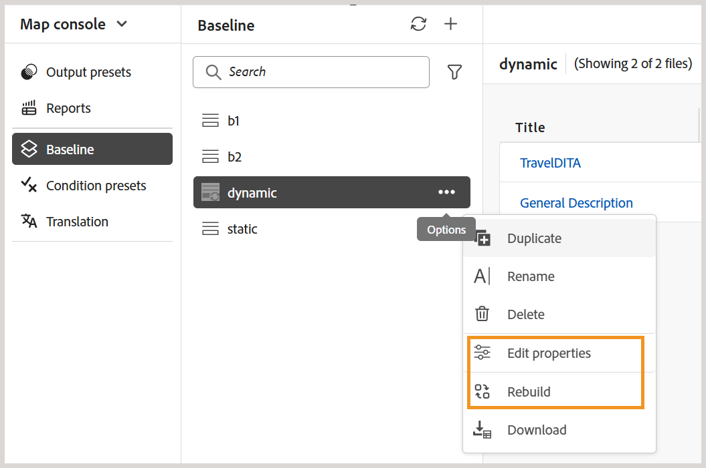

# Neue Baseline (Beta) in Experience Manager Guides

>[!NOTE]
>
> Dieser Artikel gilt für die neue Grundlinie , die derzeit als Funktion *Beta* verfügbar ist und eine verbesserte Leistung und Stabilität bietet, die mit der Version Experience Manager Guides 2026.03.0 verfügbar ist. Wenden Sie sich an das Customer Success-Team, um die neue Grundlinie-Funktion in Ihrem Setup zu aktivieren.

Die neue Grundlinie behandelt wichtige Zuverlässigkeits- und Leistungsprobleme im Zusammenhang mit großen, komplexen Zuordnungen. Sie verfügt über eine neu gestaltete Basisarchitektur, die ein schnelleres, stabileres und konsistenteres Basiserlebnis bietet.

Das neue Baseline-Modell verbessert die Handhabung von Baseline, indem es die üblichen Probleme behebt:

- Langsames Laden und schlechtes Ansprechverhalten bei der Arbeit mit großen Baselines
- Inkonsistente Baseline-Status aufgrund partieller Aktualisierungen oder fehlgeschlagener Validierungen
- Eingeschränkte Sichtbarkeit und Kontrolle bei der Verwaltung umfangreicher Grundlinien-Inhalte
- Leistungsengpässe bei der grundlegenden Erstellung, Aktualisierung oder Neuerstellung

In den folgenden Abschnitten wird das neue Baseline-Modell beschrieben, einschließlich der damit eingeführten Verbesserungen, der wichtigsten Verhaltensänderungen, die vor der Migration zu berücksichtigen sind, und Anweisungen für die Migration zu und die Verwendung der neuen Baseline:

- [Wichtige Verbesserungen der neuen Baseline](#key-enhancements-introduced-in-the-new-baseline)
- [Das Verhalten muss sich vor der Migration auf die neue Baseline ändern](#behavior-changes-to-know-before-migrating-to-the-new-baseline)
- [Zur neuen Baseline migrieren](#migrate-to-new-baseline)
- [Neue Baseline verwenden](#use-the-new-baseline)

## Wichtige Verbesserungen der neuen Baseline

Die neue Baseline führt zu signifikanten Verbesserungen, die die Baseline-Verwaltung schneller und einfacher skalierbar machen, ohne die Art und Weise zu ändern, wie Sie arbeiten. Ziehen Sie einen Wechsel zur neuen Grundlinie für Folgendes in Betracht:

- **Verbesserte Leistung und Skalierbarkeit:** Das grundlegende Datenmodell und das Rendering-Verhalten wurden optimiert, um mit großen Baselines effizient zu skalieren, wobei das inkrementelle Laden und eine optimierte Datenstruktur verwendet werden, um die Reaktionsfähigkeit zu verbessern.
- **Bessere Benutzeroberflächen- und Backend-Konsistenz:** Alle Änderungen an einer Baseline (z. B. Versions- oder Abhängigkeitsaktualisierungen) werden jetzt erst nach erfolgreicher Backend-Validierung in der Benutzeroberfläche angezeigt, was die Erstellung ungültiger Baselines verhindert.
- **Filtern, Sortieren und Navigation:** Grundlinien unterstützen ein umfassendes Filtern über mehrere Attribute hinweg, einschließlich Dokumentstatus, Kennzeichnungen, Dateityp, Referenztyp und GUID-basierte Suche über die gesamte Grundlinie hinweg. Paginierung wird für große Baselines unterstützt, mit einer Option zum Einschließen von Dateien, die keine Bezeichnungen haben.
- **Deutliche Sichtbarkeit der Auswirkungen auf Abhängigkeiten:** Auswirkungen auf Abhängigkeiten (für hinzugefügte oder entfernte Abhängigkeiten) werden als Vorschau angezeigt, bevor Versionsänderungen angewendet werden, sodass Sie die Änderungen überprüfen können, bevor Sie sie anwenden.
- **Flexiblere Beschriftungsverwaltung:** Beschriftungen können innerhalb einer Grundlinie zwischen Versionen verschoben werden, was eine größere Flexibilität bei der Verwaltung von Beschriftungen über verschiedene Themenversionen hinweg bietet.
- **Deterministisches Bearbeitungs- und Speicherverhalten:** grundlegende Bearbeitungen unterstützen Aktualisierungen auf Zeilenebene, laden ressourcenintensive Daten (z. B. Versionsbäume und Abhängigkeitsunterschiede) nur während Versionsaktualisierungen und führen Speichervorgänge deterministisch in einem Schritt durch - wodurch unerwartete Speicherfehler und partielle Aktualisierungen reduziert werden.
- **Zuverlässigere Baseline-Erstellung:** Baselines werden mithilfe gespeicherter Referenzdaten und nicht durch Parsen zur Laufzeit erstellt, wobei die erforderlichen Versionsinformationen im Voraus validiert werden, um unvollständige oder ungültige Baselines zu verhindern.
- **API- und Automatisierungsunterstützung:** Das neue Basismodell wird durch REST-APIs und die Java-SDK vollständig unterstützt und ermöglicht so die Automatisierung und Integration in externe Workflows.

## Das Verhalten muss sich vor der Migration auf die neue Baseline ändern

Bevor Sie zum neuen Baseline-Modell migrieren, überprüfen Sie die folgenden Verhaltensänderungen. Diese Änderungen wirken sich darauf aus, wie Baselines erstellt, aktualisiert und verwaltet werden, und sie können sich auf bestehende Workflows auswirken.

| Bereich | Änderung (Beschreibung) |
|------|-------------|
| **Referenzauflösung** | Direkte Zuordnungsverweise sind als &quot;**&quot;**. Ungültige Verweise werden übersprungen und Verweise aus `reltable` weiterhin ausgeschlossen. |
| **Automatisch auswählen** | Die Versionsauswahl wird unmittelbar vor dem Auflösen direkter Verweise ausgewertet, wodurch eine genaue Versionsauflösung gewährleistet ist. |
| **Grundlegende Erstellungsregeln** | Version **1.0** ist obligatorisch. Baselines mit fehlenden oder mehrdeutigen Versionen können nach der Migration anders aufgelöst werden. |
| **Umgang mit Migrationen** | Ungültige Verweise werden übersprungen. **DIRECT**-Verweise haben Vorrang, nicht angeheftete Verweise werden auf die neueste Version verschoben, und ab Version **5.0** zusätzliche Metadaten hinzugefügt. |
| **Baseline-Datenmodell** | Das neue diagrammbasierte Baseline-Modell entfernt veränderliche Felder und ist nicht mit dem vorherigen Baseline-Modell abwärtskompatibel. |
| **API-Nutzung** | Grundlegende Vorgänge werden über REST-APIs und die Java-SDK unterstützt. Rohe Baseline-Objekte werden nicht mehr verfügbar gemacht. |
| **Versionsbereinigung** | Nach der Migration berücksichtigt die Versionsbereinigung nur Baselines, die im neuen Baseline-Repository gespeichert sind. |

## Zu neuer Baseline migrieren

Nachdem Sie die Funktion im Customer Success-Team aktiviert haben, müssen Sie die vorhandenen Baselines zur neuen Baseline migrieren.

Führen Sie die folgenden Schritte aus, um die vorhandene Baseline zur neuen Baseline zu migrieren.

1. Klicken Sie oben auf das Adobe Experience Manager-Logo und anschließend auf **Tools**.
1. Wählen Sie im Bedienfeld **Tools** die Option **Guides** aus.
1. Wählen Sie die Kachel **Massenprozessor** aus.

   {align="left"}

   Die Seite **Guides Bulk Processor** wird angezeigt.

1. Wählen Sie **Neuer Prozess** oben rechts auf der Seite aus, um eine neue Verarbeitungsaufgabe zu starten.

   Das **Neuer Prozess**-Dialogfeld wird angezeigt.

1. Geben Sie die folgenden Details im Dialogfeld an:

   1. **Funktionstyp**: Wählen Sie **Grundlinie** aus der Dropdown-Liste aus.
   1. **Ordner und Datei(en) auswählen** Navigieren Sie zu und wählen Sie einen oder mehrere Ordner und Dateien aus, die verarbeitet werden sollen.
   1. **Zu ignorierende Ordner auswählen** Wählen Sie optional Unterordner innerhalb des ausgewählten übergeordneten Ordners aus, die von der Migration ausgeschlossen werden sollen.

   {align="left"}

1. Wählen Sie **Erstellen** aus.

Ein Popup-Fenster mit **Asset-Verarbeitung erfolgreich ausgelöst** wird angezeigt. Sie können den Status der Verarbeitungsaufgabe auf der Seite anzeigen.

Sie können auch **Protokolle anzeigen** auswählen, um die Protokolle für die Migrationsaufgabe zu überprüfen und herunterzuladen.

{align="left"}

Der Protokollbericht enthält Details zur Migration, einschließlich der Anzahl der migrierten Zuordnungen, der erfolgreich migrierten Baselines und der zugehörigen Details.

{align="left"}

>[!NOTE]
>
> Während der Migration sollten keine grundlegenden Änderungen vorgenommen werden, insbesondere in Arbeitskopien, um Fehler zu vermeiden. Nach der Migration müssen einige Baselines möglicherweise neu erstellt werden, wenn Versionen fehlen.

## Neue Baseline verwenden

Das neue Baseline-Modell verwendet dieselben Workflows und dieselbe Benutzeroberfläche wie die vorhandene Baseline-Funktion in Experience Manager Guides. Sie können mit den verfügbaren Optionen [Baseline über die &#x200B;](./web-editor-baseline.md) erstellen und verwalten“ fortfahren.

>[!NOTE]
>
> Das neue Baseline-Modell unterstützt nicht das Erstellen und Verwalten von Baselines über das Zuordnungs-Dashboard.

In diesem Abschnitt werden nur die Änderungen und Verbesserungen beschrieben, die mit dem neuen Basismodell eingeführt wurden. Allgemeine Baseline-Workflows bleiben unverändert, es sei denn, sie werden ausdrücklich erwähnt.

**Neue/erweiterte Optionen in der neuen Baseline-Benutzeroberfläche**

Beim Arbeiten mit Basislinien, die mit dem neuen Basismodell erstellt wurden **werden die folgenden Aktualisierungen**:

- Die Option **Baseline exportieren** im Menü „Optionen“ wird für Baselines, die **manuelle und automatische Aktualisierungen erstellt wurden, in Herunterladen** umbenannt.

  

- Dynamische Baselines können direkt über das Bedienfeld **Baseline** geöffnet und mithilfe der verfügbaren Aktionen im Menü „Optionen“ verwaltet werden.

  

  Sie können auch die neuen Optionen verwenden, die für dynamische Baselines eingeführt wurden, die mit dem neuen Baseline-Modell erstellt wurden:
   - **Eigenschaften bearbeiten**: Ermöglicht die Bearbeitung der Eigenschaften einer vorhandenen Baseline.
   - **Neu erstellen**: Ermöglicht es Ihnen, eine dynamische Baseline bei jeder Änderung neu zu erstellen.

     {align="left"}

- Die **Download**-Aktion unterstützt paginierte Downloads. Der gesamte grundlegende Inhalt, der mit den angewendeten Filtern übereinstimmt, ist im Download enthalten, nicht nur der auf der aktuellen Seite sichtbare Inhalt.
- Filtern Sie Dateien nach GUID zusätzlich zu Dateinamen oder Dateispeicherort. Eine zusätzliche Option zum **Filtern von Dateien ohne Kennzeichnungen** ist ebenfalls verfügbar.

  
- Das neue Baseline-Modell unterstützt eine deterministische Bearbeitung, sodass Sie jeweils eine Referenz mit validierter Abhängigkeitsauflösung aktualisieren können.

  +++Schritte zum Bearbeiten der Verweise einer neuen Baseline

  Führen Sie die folgenden Schritte aus, um eine Baseline zu bearbeiten:

   - Öffnen Sie die Baseline über das Bedienfeld **Baseline**.

     Die tabellarische Ansicht der Verweise der Basislinien wird angezeigt.

   - Navigieren Sie zur Datei, die Sie bearbeiten möchten, und bewegen Sie den Mauszeiger über diese Datei.
   - Wählen Sie das Symbol **Bearbeiten** aus.

     {align="left"}

     Das **Version bearbeiten** wird angezeigt.
   - Wählen Sie die gewünschte Version aus dem Dropdown **Version** aus (ändern Sie beispielsweise von Version 1.0 zu 1.1).

     {align="left"}

     Hinzugefügte und entfernte Abhängigkeiten werden ausgewertet und als Vorschau angezeigt. Überprüfen Sie die Änderungen, bevor Sie sie anwenden.

     

     Wenn keine Abhängigkeitsänderungen erkannt werden, wird eine Meldung mit leerem Status angezeigt.

   - Wählen Sie **Aktualisieren** aus, um die Änderungen anzuwenden.

  Die Baseline wird mit der ausgewählten Version aktualisiert.
  +++
