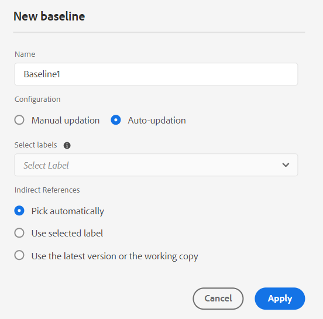

# Erstellen und Verwalten von Grundlinien im Web-Editor {#id223MB0ZF043}

>[!TIP]
>
> Es wird empfohlen, diese Grundlinie-Funktion aus dem Web Editor zu verwenden, wenn Sie auf AEM Guides as a Cloud Service Version vom März oder höher aktualisiert haben.

AEM Guides bietet die im Web Editor integrierte Grundlinie-Funktion, mit der Benutzer Grundlinien erstellen und Themen aus verschiedenen Versionen veröffentlichen oder übersetzen können. Sie können auch mehrere Ausgabevorgaben derselben DITA-Map parallel veröffentlichen.

## Erstellen einer Grundlinie

Sie können eine Grundlinie im Web Editor erstellen, indem Sie die folgenden Schritte ausführen:

1. Öffnen Sie im Bereich &quot;Repository&quot;die DITA-Map-Datei in der Kartenansicht.
1. Klicken Sie auf die Registerkarte **Verwalten**. Im Bedienfeld **Grundlinie** werden die Grundlinien der DITA-Zuordnung angezeigt.

   {width="800" align="left"}

1. Wählen Sie im Bedienfeld **Grundlinie** das Symbol + oben rechts aus, um eine Grundlinie zu erstellen.
1. Geben Sie in **Name** einen Namen für die Grundlinie ein.
1. In **Konfiguration** können Sie entweder die Option **Manuelles Update** oder die Option **Automatisches Update** auswählen:

   **Manuelle Aktualisierung**: Sie können manuell eine statische Grundlinie mit einer bestimmten Version der Themen und des referenzierten Inhalts erstellen, die zu einem bestimmten Datum und zu einer bestimmten Uhrzeit verfügbar ist, oder eine für eine Version der Themen definierte Beschriftung:

   - Wählen Sie in **Version basierend auf,** eine der folgenden Optionen aus:

      1. **Datum** &lt;Zeitstempel\>: Wählt die Version der Themen wie am angegebenen Datum und zur angegebenen Uhrzeit aus.
      1. **Beschriftung**: Wählen Sie diese Option, um die Themen entsprechend der auf sie angewendeten Bezeichnung auszuwählen. Wenn für die Themen Beschriftungen angegeben sind, werden die Beschriftungen im Dropdown-Menü aufgeführt. Sie können einen Titel aus der Liste auswählen. Sie können auch eine Beschriftung in das Textfeld einfügen.

         Für die direkten Verweise in statischen Grundlinien werden die Beschriftungen von der zuletzt gespeicherten Version der Karte abgerufen. Wenn Sie beispielsweise die Bezeichnungen `Label Release 1.0` und `Label Release 1.1` für die Versionen 1.0 und 1.1 von Thema A erstellt haben, fügen Sie dann Thema A zur Karte hinzu, die als Version 1.0 gespeichert wurde. In diesem Fall können Sie die Beschriftungen `Label Release 1.0` und `Label Release 1.1` im Dropdown-Menü für statische Grundlinien-Beschriftungen anzeigen.

         Wenn Sie **Beschriftung,** auswählen, können Sie die direkten und indirekten Verweise auswählen.
         - Bei direkten Verweisen innerhalb der DITA-Zuordnung erhalten Sie die Möglichkeit, die neueste Version von Themen zu verwenden, auf die die angegebene Bezeichnung nicht angewendet wurde.

           >[!NOTE]
           >
           > Wenn Sie eine nicht vorhandene Beschriftung eingeben und die Option **Keine Grundlinie erstellen** auswählen, schlägt die Grundlinienerstellung fehl und zeigt eine Fehlermeldung in der Nähe des Grundlinien-Namens im Bedienfeld Grundlinie an.

         - Bei indirekten Verweisen innerhalb der DITA-Zuordnung erhalten Sie eine zusätzliche Option, die neueste Version von Themen zu verwenden, auf die die angegebene Bezeichnung nicht angewendet wurde. Sie können auch die Option **Automatisch auswählen** für den referenzierten Inhalt wählen. Das System wählt automatisch die Version des referenzierten Inhalts aus, die der Version des Inhalts entspricht, in dem er referenziert wird.

         Nachdem Sie eine Bezeichnung oder Version als Datum ausgewählt haben, werden alle referenzierten Themen und Mediendateien in der Zuordnung entsprechend ausgewählt. Diese Themenauswahl wird nicht auf der Benutzeroberfläche angezeigt, sondern im Backend gespeichert.

   **Automatische Aktualisierung**: Wählen Sie diese Option für die Grundlagenerstellung aus, um die Themen automatisch entsprechend der auf sie angewendeten Bezeichnung auszuwählen.

   Grundlinien, die mit der automatischen Aktualisierungskonfiguration erstellt wurden, werden dynamisch aktualisiert. Wenn Sie eine Grundlinie erstellen, eine Grundlinie herunterladen oder ein Übersetzungsprojekt mit einer Grundlinie erstellen, werden die Dateien dynamisch anhand der aktualisierten Beschriftungen ausgewählt. Wenn Sie beispielsweise Version 1.2 eines Themas mit Label Release 1.0 für die Grundlinie und später aktualisierte Version 1.5 mit Label Release 1.0 verwendet haben, wird die Grundlinie dynamisch aktualisiert und Version 1.5 wird verwendet.

   {width="300" align="left"}

   - **Beschriftungen**: Wenn für die Themen Beschriftungen angegeben sind, wählen Sie im Dropdown-Menü **Beschriftungen** aus den [aufgelisteten Beschriftungen](#labels-list) aus.
Die zuerst ausgewählten Titel erhalten höhere Priorität als die späteren.

     >[!NOTE]
     >
     >Während die Beschriftungen gezogen werden, wird eine Ladefunktion angezeigt und die Dropdown-Liste ist deaktiviert.

     Bei dynamischen Grundlinien werden die Beschriftungen von der zuletzt gespeicherten Version und der aktuellen Arbeitskopie der Karte abgerufen. Wenn Sie beispielsweise Bezeichnungen erstellt haben   `Label Release A.1.0 ` und `Label Release A.1.1` für die Versionen 1.0 und 1.1 von Thema A und die Beschriftungen `Label Release B.1.0` und `Label Release B.1.1` für die Versionen 1.0 und 1.1 von Thema B . Anschließend können Sie Thema A zu Karte A in Version 1.0 und Thema B zu Karte A in 1.0* hinzufügen (Arbeitskopie). In diesem Fall können Sie `Label Release A.1.0 `, `Label Release A.1.1`, `Label Release B.1.0` und `Label Release B.1.1` in der Dropdown-Liste der dynamischen Grundlinien-Beschriftungen anzeigen.

1. **Indirekte Verweise**: Für indirekte Verweise in der DITA-Zuordnung erhalten Sie die folgenden Optionen:

   - **Automatisch auswählen**: Sie können für den referenzierten Inhalt **Automatisch auswählen** auswählen. Das System wählt automatisch die Version des referenzierten Inhalts entsprechend der Version des Inhalts aus, in dem er referenziert wird.

   - **Ausgewählte Bezeichnung verwenden**: Sie können eine Grundlinie mit der ausgewählten Bezeichnung erstellen, die für eine Version von Themen definiert ist.
   - **Verwenden Sie die neueste Version oder die Arbeitskopie**: Verwenden Sie die neueste Version der Themen, auf die nicht die angegebene Beschriftung angewendet wurde, oder, falls keine Version erstellt wurde, verwenden Sie die Arbeitskopie der Themen, um die Grundlinie zu erstellen.
1. Klicken Sie auf **Übernehmen**.

Die Grundlinie wird erstellt. Die Grundlinien-Erstellung erfolgt asynchron, sodass Sie im Web Editor weiterhin an anderen Dateien arbeiten können. Nachdem die Grundlinie erstellt wurde, wird eine Popup-Meldung angezeigt, die bestätigt, dass die Grundlinie erstellt wurde, und Sie erhalten auch eine Inbox-Benachrichtigung für dieselbe Grundlinie.

## Grundlinien verwalten

Sie können Ihre vorhandenen Grundlinien mithilfe der verschiedenen Funktionen im Dashboard Grundlinie verwalten.

- Sie können über das Textfeld im Bedienfeld &quot;Grundlinie&quot;nach einer vorhandenen Grundlinie suchen. Verwenden Sie das Symbol **Filter anwenden** , um alle Grundlinien anzuzeigen oder die Grundlinien mit dem Erstellungsstatus als &quot;Erfolgreich&quot;, &quot;In Bearbeitung&quot;oder &quot;Fehlgeschlagen&quot;aufzulisten.
- Verwenden Sie das Symbol **Aktualisieren** im Bedienfeld &quot;Grundlinie&quot;, um alle Grundlinien erneut zu überprüfen und eine neue Liste der Grundlinien für die DITA-Karte anzuzeigen, die in der Kartenansicht geöffnet ist.
- Sie können den Inhalt einer vorhandenen statischen Grundlinie anzeigen oder bearbeiten, indem Sie im Bedienfeld **Grundlinie** auf die Grundlinie in der Liste doppelklicken. Das Grundlinien-Bearbeitungsfenster in der Mitte zeigt die DITA-Map-Datei, den Inhalt oder die Themen der Zuordnung und den referenzierten Inhalt an.

  >[!NOTE]
  >
  >Der Bearbeitungsvorgang für statische Grundlinien wird nur für wenige Referenzänderungen empfohlen. Der Bearbeitungsvorgang wird nicht empfohlen, um die Version der DITA-Hauptkarte zu ändern, da alle Verweise neu berechnet werden müssen. Dies kann bei großen DITA-Maps zu einem Fehler bei der Grundlinien-Aktualisierung führen. Für die größeren DITA-Maps können Sie eine neue Grundlinie erstellen oder die Eigenschaften der Grundlinie bearbeiten.
  >
  >Der Bearbeitungsvorgang bei dynamischen Grundlinien ermöglicht es Ihnen, die Eigenschaften der Grundlinie zu bearbeiten, da die Verweise für dynamische Grundlinien zur Laufzeit mithilfe der Beschriftungen generiert werden.

  {width="800" align="left"}

  Sie können auch die folgenden Vorgänge auf der Grundlinie im Menü Optionen ausführen:

### Grundlinie duplizieren

Sie können eine Grundlinie duplizieren und entsprechend Ihren Anforderungen ändern.
{width="300" align="left"}
*Duplizieren Sie eine Grundlinie basierend auf einer Bezeichnung oder erstellen Sie eine exakte Kopie.*

1. Wählen Sie im Menü Optionen einer Grundlinie die Option **Duplizieren** aus. Das Dialogfeld **Grundlinie duplizieren** wird geöffnet.
>[!NOTE]
>
>Der Standardname der Grundlinie ist `<selected baseline name>`_suffix (z. B. sample-baseline_1). Sie können den Namen entsprechend Ihren Anforderungen ändern.

   In **Wählen Sie die Version basierend auf** aus, können Sie entweder die Option **Exakt Copy** oder die Option **Beschriftung** auswählen:

   - **Exakte Kopie**: Experience Manager Guides wählt dieselbe Version aller Themen aus und erstellt eine exakte Kopie der duplizierten Grundlinie.
   - **Beschriftung**: Mithilfe des Dropdown-Menüs können Sie eine der [aufgelisteten Beschriftungen](#labels-list) auswählen. Experience Manager Guides wählt die Themenversionen mit dem ausgewählten Titel aus, während bei den übrigen Themen die Version aus der duplizierten Grundlinie ausgewählt wird. Sie wählen beispielsweise die Bezeichnung `Release 1.0` aus der Dropdown-Liste aus und wählt dann die Versionen der Themen aus, für die Sie diese Bezeichnung definiert haben. Bei allen anderen Themen wird die Version aus der duplizierten Grundlinie ausgewählt.
1. Klicken Sie auf **Duplizieren**.

- **Benennen Sie** um oder **löschen** Sie eine vorhandene Grundlinie.
- Fügen Sie vorhandene Beschriftungen für statische Grundlinien aus der Option **Beschriftungen verwalten** hinzu, entfernen Sie sie oder nehmen Sie Änderungen daran vor. Wenn Ihr Administrator vordefinierte Beschriftungen konfiguriert hat, werden diese Beschriftungen in der Dropdown-Liste Titel hinzufügen angezeigt. Weitere Informationen zum Hinzufügen von Bezeichnungen finden Sie unter [Bezeichnungen verwenden](web-editor-use-label.md#).

  >[!NOTE]
  >
  > Der Prozess zum Hinzufügen oder Entfernen von Beschriftungen erfolgt asynchron, sodass Sie im Web Editor weiterhin an anderen Dateien arbeiten können. Nachdem der Titel hinzugefügt oder entfernt wurde, wird eine Popup-Meldung angezeigt, in der bestätigt wird, dass der Titel hinzugefügt oder entfernt wurde, und Sie erhalten auch eine Inbox-Benachrichtigung.

- **Eigenschaften bearbeiten** einer vorhandenen statischen Grundlinie, die Sie beim Erstellen der Grundlinie festgelegt haben.
- Exportieren Sie die Momentaufnahme einer Grundlinie in eine Microsoft Excel-Datei mit der Option **Grundlinie exportieren** .

### Liste der Titel {#labels-list}

Die im Dropdown-Menü aufgelisteten Beschriftungen basieren auf den folgenden Kriterien:
- Die Beschriftungen sollten zu einer Version der Themen in der DITA-Zuordnung hinzugefügt werden (auf der die Grundlinie erstellt wird).
- Und nur die Referenzen der ersten Ebene (Themen oder Unterkarten) der DITA-Map werden für die Auswahl der Beschriftungen berücksichtigt.

## Standardfilter

Mithilfe des Symbols Filter im Bedienfeld **Baseline-Filter** können Sie Filter auf die Grundlinie anwenden, die im Fenster der Grundlinienbearbeitung geöffnet wurde:

{width="300" align="left"}

- Filtern Sie die Dateien nach Dateinamen oder Dateispeicherort.
- Filtern Sie die Dateien anhand der Werte für verschiedene Spalten wie Dateityp, Referenztyp usw.
- Wählen Sie die Spalten aus, die im Bearbeitungsfenster für die Grundlinie angezeigt werden sollen.

>[!NOTE]
>
> Sie können auf eine Spaltenüberschrift klicken und die Dateien nach den Spalten im Bearbeitungsfenster für die Grundlinie sortieren.

**Eine Grundlinie speichern oder zurücksetzen**

Nachdem Sie die Grundlinie bearbeitet haben, können Sie auf die Schaltfläche **Speichern** oben klicken, um die Änderungen an der Grundlinie zu speichern. Sie können auf die Schaltfläche **Zurücksetzen** klicken, wenn Sie die Änderung nicht speichern und die Grundlinie zurücksetzen möchten. Wenn Sie auf die Schaltfläche **Zurücksetzen** klicken, wird eine Warnung angezeigt, dass Ihre nicht gespeicherten Änderungen verloren gehen.

**Übergeordnetes Thema:**[ Arbeiten mit dem Web-Editor](web-editor.md)

