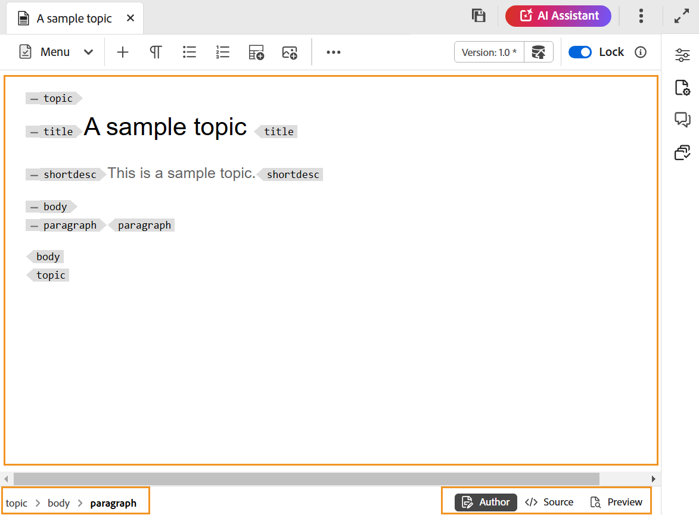

# Inhaltsbearbeitungsbereich im Editor

Im Inhaltsbearbeitungsbereich wird der Inhalt des Themas oder der Karte angezeigt. Sie nehmen alle Inhaltsbearbeitungen in diesem Bereich vor. Es bietet eine WYSIWYG-Ansicht des Inhalts, den Sie bearbeiten.

Unten links im Inhaltsbearbeitungsbereich befindet sich der Breadcrumb des Elements an der aktuellen Cursorposition. In der rechten unteren Ecke werden die verfügbaren Editor-Ansichten angezeigt.

Weitere Informationen zu den Editor-Ansichten, die für eine Themendatei im Inhaltsbearbeitungsbereich verfügbar sind, finden Sie unter Ansicht [Editor-Ansichten](./web-editor-views.md).

>[!NOTE]
>
> Wenn Sie an einer Zuordnungsdatei arbeiten, werden im Inhaltsbearbeitungsbereich verschiedene Optionen oder Ansichten angezeigt, einschließlich einer **Layout**-Ansicht für die Zuordnungsdatei. Weitere Informationen finden Sie unter [Funktionen des Zuordnungs-Editors](./map-editor-advanced-map-editor.md).

**Übergeordnetes Thema:**&#x200B;[&#x200B; Einführung in den Editor](web-editor.md)
