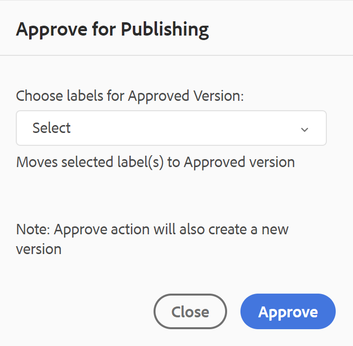

# Dokumentstatus {#id1821HC00URO}

Um die Bereitschaft der Dokumente zu verwalten, stellt Adobe Experience Manager Guides die Dokumentenstatuseigenschaft bereit, die den aktuellen Status des Dokuments angibt. Dokumentstatus helfen Ihnen dabei, schnell herauszufinden, ob ein Dokument neu ist, sich im Status „Wird überprüft“ oder „Abgeschlossen“ befindet.

## Typen von Dokumentstatus

Für ein Dokument kann jeder der Dokumentstatus im Profil **Dokumentstatus** definiert sein. Beispielsweise kann ein Dokument einen der folgenden Dokumentstatus haben:

- Entwurf - Gibt an, dass das Dokument erstellt und mit neuen Änderungen gespeichert wird.
- In-Review - gibt an, dass ein Prüfungs-Workflow für das Dokument eingeleitet wurde.
- Überprüft : Gibt an, dass das Dokument von den vorgesehenen Benutzern überprüft wurde.

Diese Status werden manuell oder automatisch entsprechend den Profileinstellungen des Dokumentstatus festgelegt. Beispiel: Das Dokumentstatusprofil ist mit dem Startstatus „Entwurf“ konfiguriert, und der Status „In Überprüfung“ wird für die zu überprüfenden Dokumente definiert. Wenn Sie dann ein Dokument erstellen, wird der Dokumentstatus auf &quot;*&quot;*. Wenn Sie eine Prüfungsaufgabe initiieren, wird der Status des Dokuments in „In Überprüfung“ geändert.

Sie können den Dokumentstatus für ein einzelnes oder mehrere Dokumente auch manuell ändern. Wenn Sie sich jedoch dafür entscheiden, den Dokumentstatus für mehrere Dokumente zu ändern, wird der zulässige Status durch die allgemeinen Zustände bestimmt, die für die ausgewählten Dokumente zulässig sind. Angenommen, Sie haben die Dokumentstatus in der gleichen Reihenfolge als „Entwurf“, „In Überprüfung“, „Überprüft“ und „Bereit zur Veröffentlichung“ definiert. Bei Dokument 1.dita wird der Status auf *Entwurf* und bei Dokument 2.dita auf Überprüft gesetzt. Wenn Sie sowohl „one.dita“ als auch „two.dita“ auswählen, lautet der Status des zulässigen Dokuments *Bereit zur Veröffentlichung*. Da two.dita den Status *Überprüft* aufweist, ist der nächste mögliche Status für two.dita nur *Bereit zur Veröffentlichung*, der angezeigt wird, wenn beide Dokumente ausgewählt sind.

>[!NOTE]
>
> Ein Dokument kann immer nur in einem Status vorhanden sein.

## Status des Dokuments über den Editor ändern

Um den Status eines Dokuments zu ändern, führen Sie die folgenden Schritte aus:

1. Öffnen Sie das Dokument im Editor und wählen Sie dann im rechten Bedienfeld Dateieigenschaften aus.
1. Wählen Sie im Bedienfeld Dateieigenschaften den neuen Status aus der Dropdown-Liste **Dokumentstatus** aus. Sie können nur die Dokumentstatus auswählen, die im Abschnitt „Statusübergang“ des Dokumentstatusprofils zulässig sind.

   >[!NOTE]
   >
   >Admins können alle Dokumentstatus anzeigen und das Dokument in einen beliebigen Status ändern.

1. Wählen **in der** „Speichern“ aus.

## Ändern des Dokumentstatus über die Assets-Benutzeroberfläche

1. Wählen Sie in der Assets-Benutzeroberfläche ein oder mehrere Dokumente aus, deren Dokumentstatus Sie ändern möchten.
1. Wählen Sie in der Hauptsymbolleiste **Eigenschaften** aus.
1. Wählen Sie den neuen Status aus der Dropdown-Liste **Dokumentstatus** aus. Sie können nur die Dokumentstatus auswählen, die im Abschnitt „Statusübergang“ des Dokumentstatusprofils zulässig sind.

   >[!NOTE]
   >
   >Admins können alle Dokumentstatus anzeigen und das Dokument in einen beliebigen Status ändern.

1. Klicken Sie auf **Speichern und schließen**.

### Dokumentstatus anzeigen

Die Kartenansicht der Assets-Benutzeroberfläche zeigt den aktuellen Status zusammen mit dem Erstellungsdatum und der Größe des jeweiligen DITA-Themas oder der DITA-Karte an.

{align="left"}

## Dokumentstatus in DDLC verwenden

Dokumentstatus spielen eine wichtige Rolle bei der Verwaltung des Lebenszyklus von Dokumenten in DDLC. Wenn Ihr Unternehmen sich strikt an das DDLC hält, ist es wichtig, einen Mechanismus zur Steuerung der Bearbeitung von Dokumenten auf der Grundlage ihres Status zu haben. Sie können beispielsweise die Bearbeitung von Dokumenten zulassen, wenn sie sich im Status *Entwurf* oder *In Überprüfung* befinden. Sobald ein Dokument jedoch überprüft wurde und zur Veröffentlichung bereit ist, sollte es eine Möglichkeit geben, weitere Änderungen von Dokumenten zu verhindern.

Experience Manager Guides bietet einen Workflow für die Dokumentvalidierung, mit dem Sie den Lebenszyklus Ihres Dokumentenentwicklungsprozesses steuern können. Sobald ein Dokument zur Veröffentlichung bereit ist oder den vorletzten Status erreicht hat, können Sie es als genehmigt markieren. Nachdem ein Dokument genehmigt wurde, erstellt Experience Manager Guides eine neue Version des Dokuments und macht sie schreibgeschützt. Anschließend können Sie das Dokument zur Veröffentlichung verschieben oder eine Grundlinie für die weitere Verarbeitung erstellen.

Um eine neue Version aus den Dokumenten zu starten, die als genehmigt markiert sind, muss ein Autor eine neue Version starten. Beim Starten einer neuen Version ändert sich der Dokumentstatus erneut in *Entwurf*. Durch das Ändern des Dokumentstatus in *Entwurf* wird das Dokument wieder bearbeitbar und Sie können mit der nächsten Version fortfahren.

Um die Dokumentgenehmigungsfunktion zu verwenden, führen Sie die folgenden Schritte aus:

>[!NOTE]
>
> Die Funktion für den Validierungs-Workflow muss von Ihrem Administrator aktiviert werden. Weitere Informationen finden Sie im *„Genehmigungs-Workflow aktivieren* im Abschnitt Installieren und Konfigurieren von Adobe Experience Manager Guides as a Cloud Service.

1. Öffnen Sie im Editor das Dokument, das Sie zur Genehmigung markieren möchten.

1. Wählen Sie das Symbol **Als genehmigt markieren**.

1. Wenn sich das Dokument in dem Status befindet, der als genehmigt markiert werden soll, wird das folgende Dialogfeld angezeigt:

   {width="300" align="left"}

   Wenn Ihr Dokument nicht als genehmigt markiert werden kann, wird die folgende Meldung angezeigt:

   {width="300" align="left"}

1. Wenn Ihr Dokument bereit ist, als genehmigt gekennzeichnet zu werden, wählen Sie eine Kennzeichnung aus der Dropdown-Liste und wählen Sie **Genehmigen**.

   >[!NOTE]
   >
   > Wenn Ihr Administrator keine vordefinierte Liste von Kennzeichnungen konfiguriert hat, wird Ihnen ein Freiformtextfeld zur Eingabe einer Kennzeichnung angezeigt.

1. Nachdem das Dokument erfolgreich als genehmigt markiert wurde **wird eine** des Dokuments im schreibgeschützten Modus angezeigt. Alle Bearbeitungsoptionen werden aus allen drei Modi „Author“, &quot;Source&quot; und „Preview“ entfernt. Sie erhalten jedoch weiterhin Zugriff auf das Dropdown **Menü**, das die Optionen **Versionsverlauf** und **Tags** enthält.

   {width="650" align="left"}

   >[!NOTE]
   >
   > Im Vorschaumodus wird das Dropdown-Menü mit den Optionen Versionsverlauf und Tags aus der Symbolleiste entfernt.

Nachdem ein Dokument als genehmigt markiert wurde, ist es nicht mehr zur Bearbeitung verfügbar. Wenn Sie das Dokument für die nächste Version verwenden möchten, müssen Sie es wieder in den Status *Entwurf* versetzen. Um den Dokumentstatus eines genehmigten Dokuments wieder in den Modus *Entwurf* zu ändern, führen Sie die folgenden Schritte aus:

1. Wählen Sie in einem genehmigten Dokument das Symbol **Neue Version starten** aus.

   Die Meldung Neue Version starten wird angezeigt.

1. Wählen Sie **Bestätigen** aus.

   Der Status des Dokuments wird in Entwurf geändert und das Dokument wird im Editor im Bearbeitungsmodus geöffnet.

**Übergeordnetes Thema:**[ Einführung in den Editor](web-editor.md)
