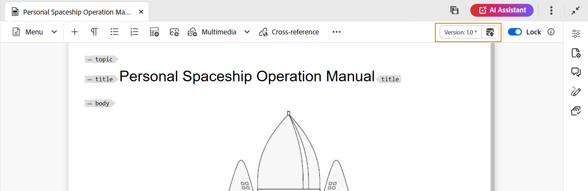

# Bearbeiten von Themen im Editor {#id2056B040VUI}

Der Editor verfügt über eine Reihe von Bearbeitungsfunktionen, mit denen Sie mühelos Themendateien erstellen oder ändern können. Allgemein würden Sie die folgenden Schritte ausführen, um ein Thema im Editor zu bearbeiten.

>[!IMPORTANT]
>
> Wenn während der Arbeit am Editor ein Anwendungsfehler auftritt, aktualisieren Sie die Seite, um weiter zu arbeiten.

1. Um Änderungen an Ihrem Thema vorzunehmen, klicken Sie in den Textbereich des erforderlichen Elements und nehmen Sie Änderungen vor.

1. Um ein bestimmtes Element einzufügen, bewegen Sie den Cursor an das Ende des Elements, nach dem Sie das neue Element einfügen möchten, und wählen Sie das gewünschte Element in der Symbolleiste aus. Sie können auch den Tastaturbefehl `Alt+1` verwenden, um das Popup **Element einfügen** aufzurufen.

   Es wird eine Liste der Elemente angezeigt, die im Thema verwendet werden können. Experience Manager Guides platziert Elemente intelligent entsprechend ihrer gültigen Position im Thema.

   >[!NOTE]
   >
   > Sie können auch auswählen, welches Symbol in der Symbolleiste angezeigt werden soll, indem Sie die `ui_config.json` unter - `/etc/designs/fmdita/clientlibs/xmleditor/` konfigurieren. Weitere Informationen zum Anpassen von Funktionen erhalten Sie von Ihrem Systemadministrator.

1. Nachdem Sie die Bearbeitung des Dokuments abgeschlossen haben, klicken Sie auf **Alle speichern**.

   >[!NOTE]
   >
   > Wenn Sie keine Änderungen in das Adobe Experience Manager-Repository übernehmen möchten, wählen Sie **Schließen** und dann **Ohne Speichern schließen** im Dialogfeld Nicht gespeicherte Änderungen aus.

## Teilweise Auswahl von Inhalten über Elemente hinweg

Mit Experience Manager Guides können Sie auch Inhalte über Elemente hinweg auswählen. Nach Auswahl des Inhalts können Sie die folgenden Schritte ausführen:

- Formatierung und Löschung: Formatieren und Kursiv formatieren, unterstreichen oder sogar löschen Sie ausgewählte Inhalte. Der Inhalt der gültigen offenen Tags wird dann zusammengeführt und unter einem einzigen Element angezeigt. Sie können beispielsweise den Inhalt innerhalb eines Absatzes auswählen und die Auswahl auf einen anderen Absatz erweitern. Wenn Sie dann den ausgewählten Inhalt fett formatieren, wird der gesamte fettgedruckte Inhalt aus den geöffneten Tags zusammengeführt und unter einem einzigen Absatzelement angezeigt.

Wenn Sie den ausgewählten Inhalt löschen, wird der verbleibende Inhalt nach dem Löschen in den geöffneten Tags zusammengeführt.

- Den Inhalt mit einem gültigen Element umgeben: Führen Sie die folgenden Schritte aus, um den Inhalt mit einem gültigen Element einzuschließen:

   - Wählen Sie den Inhalt in einem Element aus.
   - Wählen Sie Hinzufügen“ aus, um das Dialogfeld **Element einfügen** anzuzeigen. Das Dialogfeld listet die gültigen Elemente für den ausgewählten Inhalt auf.

     >[!NOTE]
     >
     > Sie können das Dialogfeld Element einfügen auch anzeigen, indem Sie auf das Kontextmenü des ausgewählten Inhalts klicken.

   - Wählen Sie ein Element im Dialogfeld aus. Der ausgewählte Inhalt wird unter diesem Element umschlossen. Wenn Sie beispielsweise den Inhalt in einem Absatz auswählen und dann das `<note>` Element im Dialogfeld **Element einfügen** auswählen, wird der ausgewählte Inhalt unter einer Anmerkung angezeigt.

      {width="300" align="left"}

## Browser beim Bearbeiten der Dateien aktualisieren

Experience Manager Guides bietet Unterstützung zum Aktualisieren des Browsers, während Sie Ihre Inhalte im Editor bearbeiten. Mit dieser Funktion können Sie Inhalte weiter bearbeiten, falls während der Arbeit ein Anwendungsfehler auftritt. Wenn Sie auf die Browser-Aktualisierung klicken, während eine oder mehrere Dateien mit nicht gespeicherten Änderungen zur Bearbeitung geöffnet werden, werden Sie gewarnt, dass die nicht gespeicherten Änderungen verloren gehen können. Sie haben die Möglichkeit, den Aktualisierungsvorgang abzubrechen und Ihre Dateien zu speichern, um Ihre Änderungen beizubehalten.

Selbst nach Aktualisierung des Browsers werden die Ansichten des linken und rechten Bedienfelds im Editor beibehalten. Experience Manager Guides stellt den letzten gespeicherten Status der im Editor geöffneten Dateien wieder her, wenn Sie den Browser aktualisieren. Beispielsweise werden die im Repository-Bereich geöffneten Dateien erneut geöffnet. Das Kartenbedienfeld wird zusammen mit der zuvor geöffneten Karte beibehalten.

Das aktive Thema oder die DITA-Karte wird im Inhaltsbearbeitungsbereich erneut geöffnet.

Das rechte Bedienfeld wird ebenfalls wieder geöffnet und zeigt dieselbe Ansicht wie vor der Aktualisierung an.

## Arbeitskopie-Anzeige

Experience Manager Guides stellt die Arbeitskopie-Anzeige bereit, die anzeigt, ob die aktuelle \(Arbeitskopie\) der Datei mit der gespeicherten Version synchronisiert ist oder nicht. Wenn Sie Änderungen an Ihrer aktuellen Kopie vorgenommen und Ihre Datei nicht gespeichert haben, wird auf der Registerkarte Datei des Themas ein \*-Zeichen zusammen mit dem Titel angezeigt. Diese Anzeige dient als Erinnerung zum Speichern Ihrer Änderungen und verschwindet, wenn Sie Ihre Datei speichern.

{width="550" align="left"}

Experience Manager Guides gibt auch an, ob die zuletzt gespeicherte \(Working\)-Kopie der Datei mit der gespeicherten Version synchronisiert ist. Wenn Sie einige nicht gespeicherte Änderungen zwischen der Arbeitskopie und der zuletzt gespeicherten Version haben, wird ein \*-Zeichen zusammen mit den Versionsinformationen angezeigt, die in der rechten oberen Ecke der Registerkarte Datei des Themas angezeigt werden. Dieser Indikator dient als Erinnerung daran, eine Version aus Ihrer aktuellen \(Working\) Kopie der Datei zu speichern und zu erstellen.

{width="550" align="left"}

## Zugriff auf gesperrte Dateien im Authoring- und Source-Modus

Wenn eine DITA- oder Markdown-Datei von einem anderen Benutzer gesperrt oder ausgecheckt wird, ist das Bearbeiten oder Ändern des Inhalts nicht möglich. Sie können die Datei jedoch zusätzlich zum Vorschaumodus weiterhin im schreibgeschützten Format sowohl im **Author**- als auch **2** Source **-Modus anzeigen.**

Im schreibgeschützten Modus können Sie den Inhalt, die Tags und die Attribute innerhalb des **author** oder **Source** Modus anzeigen. Sie können auch die Dateieigenschaften ändern.

>[!NOTE]
>
> Als Administrator erhalten Sie Zugriff auf die Funktion **Entsperren erzwingen** mit der Sie eine Datei entsperren können, die von einer anderen Person gesperrt wurde.

<!-- This is no more available -->
<!--
The toolbar displays the following icons for read-only access:

- Toggle Tags view
- Version History
- Version Label

Experience Manager Guides also displays a **Read only access** indicator near the version number.
 

You can access the **Layout** view for read-only DITA maps. This view lets you see the DITA map and its properties but prevents edits.

>[!NOTE]
>
> Your folder-level administrative users must update *ui_config.json* so that you can harmoniously access the read-only files in the  Author, Source, and Layout modes.

 -->

## Suchen einer geöffneten Datei in der Repository-Ansicht

Beim Öffnen einer Datei im Editor bietet Experience Manager Guides die Funktion zum Suchen der Datei in der Repository-Ansicht. Sie findet beispielsweise das aktuelle Thema, während Sie es bearbeiten.

Sie können die Funktion zum Suchen der Datei mit der Option **Dateien immer im Repository suchen** auf der Registerkarte **Erscheinungsbild** der **Benutzereinstellungen** deaktivieren.

**Übergeordnetes Thema:**&#x200B;[ Arbeiten mit dem Editor](web-editor.md)
