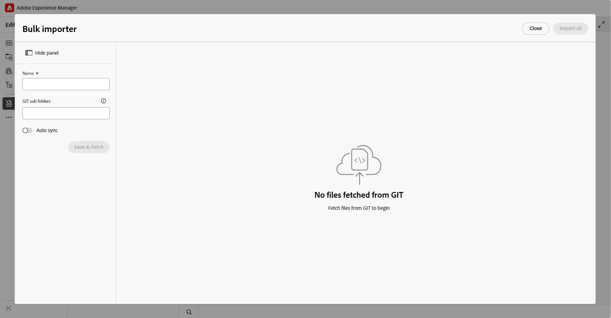

# Importieren von Inhalten mit dem Git-Connector

>[!NOTE]
>
> Diese Funktion ist standardmäßig deaktiviert. Um sie in Ihrer Umgebung zu aktivieren, wenden Sie sich an Ihr Customer Success-Team.

Mit dem Git-Connector können Sie [Inhalte aus verbundenen Git-Repositorys in Experience Manager Guides importieren](#import-content-from-the-connected-git-repository). Nachdem die Inhalte importiert wurden, können Sie die Funktionen für Authoring, Review, Übersetzung und Publishing von Experience Manager Guides verwenden, um Dokumentation zu entwickeln und bereitzustellen.

Wenn sich Inhalte im Quell-Repository ändern, können Sie Aktualisierungen erneut abrufen, Konflikte überprüfen und die neuesten Änderungen mit Experience Manager Guides synchronisieren.

## Wichtigste Funktionen

Mit dem Git-Connector können Autoren Inhalte direkt aus einem Git-Repository in Experience Manager Guides abrufen, ohne dass Dateien manuell übertragen werden müssen. Nach der Konfiguration haben Autoren Zugriff auf die folgenden Funktionen.

**Inhaltsaufnahme**

- Synchronisiert Dateien aus einem beliebigen (öffentlichen oder privaten) Git-Repository in Experience Manager Guides.
- Filtert nach Quellordnerpfad, um ein einzelnes Unterverzeichnis anstelle eines gesamten Repositorys aufzunehmen.
- Verwendet eine `gitignore-aware` Regel-Engine zum automatischen Überspringen von Dateien, die durch `.gitignore` oder benutzerdefinierte Regeln ausgeschlossen wurden.
- Behält GUIDs bei der erneuten Synchronisierung bei, um vorhandene DITA-Querverweise nach einer Aktualisierung intakt zu halten.

**Inkrementelle (Delta-)Synchronisation**

- Verfolgt den zuletzt synchronisierten Commit und ruft nur Dateien ab, die bei nachfolgenden Synchronisierungen hinzugefügt, geändert oder gelöscht wurden, anstatt das gesamte Repository erneut zu importieren.
- Erzeugt einen Delta-Bericht, in dem jede geänderte Datei und ihr vor dem Import vorgenommener Änderungstyp aufgelistet sind.
- Beibehaltung konsistenter Abrufzeiten unabhängig von der Repository-Größe Benchmarkdaten finden Sie unter [Leistungs-Benchmarks](#performance-benchmarks).

## Funktionsweise des Git-Connectors

Das folgende Diagramm zeigt, wie der Git-Connector Inhalte aus einem Quell-Repository in Experience Manager Guides verschiebt.

Der Git-Connector verschiebt Inhalte aus einem Git-Repository in vier Schritten in Experience Manager Guides:

1. **Crawlen und synchronisiert**: Ein Crawler stellt eine Verbindung zu Ihrem konfigurierten Git-Repository und -Profil her und synchronisiert Inhalte bei Bedarf mit dem Connector.
1. **Aufnehmen und Erkennen von**: Eingehende Dateien werden gescannt und anhand dessen gehasht, was bereits in Experience Manager Guides vorhanden ist. Dateien ohne widersprüchliche Änderungen werden automatisch durchlaufen. Dateien mit widersprüchlichen Änderungen werden zur manuellen Auflösung markiert.
1. **Persist**: Aufgelöste Inhalte werden verarbeitet und in AEM zusammen mit Ihren anderen Experience Manager Guides-Inhalten gespeichert.
1. **Experience Manager Guides-Workflow**: Nach der Speicherung ist der Inhalt wie jeder andere Experience Manager Guides-Inhalt für das Erstellen, Überprüfen, Übersetzen und Veröffentlichen verfügbar.

## Leistungsbenchmarks

Die folgenden Benchmarks zeigen vollständige (nicht inkrementelle) Synchronisierungszeiten **Bulk Importer** auf Experience Manager as a Cloud Service in zunehmendem Repository-Umfang.

| Skalierung | Abrufzeit | Importzeit | Gesamtzeit | Batches | Durchsatz |
|---|---|---|---|---|---|
| 1.000 Dateien | 1 M 53 S | 3m 30s | 5M 29S | 10 × 100 | ~286 Dateien/min |
| 5.000 Dateien | 1m 55s | 18m 21s | 20m 27s | 20 × 250 | ~273 Dateien/min |
| 10.000 Dateien | 1 M 39 S | 36m 22s | 37 m 24 s | 40 × 250 | ~267 Dateien/min |
| 50.000 Dateien | 1 m 25 s | 2 Stunden 43 Min. | 2 Std. 58 m | 200 × 250 | ~270 Dateien/min |

## Importieren von Inhalten mit dem Git-Connector

Nachdem Ihr Administrator den Git-Connector in Experience Manager Guides konfiguriert hat, können Sie ihn vom Editor verwenden, um Inhalte aus einem Git-Repository zu importieren.

## Voraussetzungen

Bevor Sie mit der Verwendung dieser Funktion beginnen, stellen Sie Folgendes sicher:

- Die Git-Connector-Funktion muss für Ihre Umgebung aktiviert sein.
- (*falls aktiviert*) Ihr Administrator hat den Git-Connector in Ihrer Umgebung konfiguriert. Weitere Informationen finden Sie unter [Erstellen und Konfigurieren des Git-Connectors über die Benutzeroberfläche](../install-conf-guide/conf-git-connector.md).
- Sie haben *Lesezugriff* auf das Git-Repository, das den Inhalt enthält, den Sie importieren möchten.
- Sie wissen, welche Repository-Verzweigung und welcher Quellordner Sie importieren möchten.
- Sie kennen den Zielordner in Experience Manager Guides, in dem die importierten Inhalte gespeichert werden.

## Importieren von Inhalten aus dem verbundenen Git-Repository

Führen Sie die folgenden Schritte aus, um Inhalte aus einem Git-Repository zu importieren:

1. Öffnen Sie im Editor den linken Bereich.
1. Wählen Sie **Datenquellen** aus.

   Die verbundenen Datenquellen werden angezeigt.

1. Wählen Sie die Kachel **Git-Connector** aus.

1. Klicken Sie auf das Symbol &quot;+&quot; und dann auf **Massenimport**.

   Das **Massenimport** Dialogfeld wird angezeigt.

   

1. Geben **im Dialogfeld &quot;**-Import“ einen Namen für den Import ein, wählen Sie einen Unterordner aus Ihrem konfigurierten Git-Repository aus und klicken Sie auf **Speichern und abrufen**.  Die Liste der für den Import verfügbaren Dateien wird im Dialogfeld angezeigt. Überprüfen Sie die Liste und validieren Sie den Inhalt, bevor Sie fortfahren.

   

1. Wählen Sie nach der Überprüfung der Dateien **Alle importieren** aus, um den Inhalt in Experience Manager Guides zu importieren.

   >[!NOTE]
   >
   > Sie können **Automatische Synchronisierung** aktivieren, um Inhalte aus Ihrem Git-Repository automatisch zu synchronisieren und in Experience Manager Guides zu importieren. Wenn Fehler erkannt werden, wird die automatische Synchronisierung nicht ausgelöst und der Autor muss den Inhalt manuell importieren, indem er **Alle importieren)**. Nach der Aktivierung kann die automatische Synchronisierung für das Import-Tool nicht mehr deaktiviert werden.

Nachdem der Inhalt importiert wurde, wird er beim Einrichten **Git-Connectors unter dem konfigurierten** Target-AEM-Stammverzeichnis“ gespeichert.

## Git-importierte Inhalte verwalten

Nachdem Inhalte in Experience Manager Guides importiert wurden, können Sie die verfügbaren Aktionen verwenden, um die Inhalte zu verwalten und mit den Änderungen im Quell-Repository synchronisiert zu halten.

{width="600"}

- **Vorschau**: Vorschau importierter Inhalte. Wenn das Quell-Repository Aktualisierungen enthält, überprüfen Sie die Unterschiede und verwenden Sie die Option **Refetch**, um die neuesten Änderungen zu importieren. Wenn die Unterschiede eine Zusammenführung erfordern, zeigen Sie [Git-Connector-Konflikte lösen](#review-and-resolve-content-conflicts) an.
- **Löschen**: Import-Tool entfernen, das nicht mehr benötigt wird.
- **Umbenennen**: Benennen Sie das Importtool um, damit es leichter identifiziert werden kann.
- **Protokoll anzeigen**: Anzeigen des Importprotokolls, um Details zum Importvorgang anzuzeigen.
- **Bericht anzeigen**: Anzeigen und Herunterladen des **Massenimportberichts** der Details wie:

  - Gesamtzahl der importierten Dateien
  - Anzahl erfolgreicher Importe
  - Anzahl fehlgeschlagener Importe

  {width="600"}

  Sie können auch den detaillierten Bericht herunterladen. Wenn einige Dateien nicht importiert werden können, verwenden Sie **Fehlgeschlagene Importe wiederholen**, um erneut zu versuchen, sie zu importieren.

## Überprüfen und Beheben von Inhaltskonflikten

Wenn Sie Inhalte erneut aus einem Git-Repository abrufen, werden Unterschiede im Inhalt zwischen der Repository-Version und den entsprechenden in Experience Manager Guides verfügbaren Inhalten als Konflikte angezeigt. Sie müssen diese Konflikte lösen und zusammenführen, bevor Sie die Daten in Experience Manager Guides importieren.

Führen Sie die folgenden Schritte aus, um Konflikte zu lösen und zusammenzuführen:

1. Öffnen Sie das Dialogfeld Massenimport-Tool und wählen Sie **Erneut abrufen** aus.
1. Wenn Konflikte erkannt werden, wird die Registerkarte **Zusammenführen erforderlich** mit den Dateien angezeigt, die Konflikte enthalten. Wählen Sie die Registerkarte **Zusammenführen erforderlich** und wählen Sie dann eine Datei aus der Liste aus, um die Konflikte zu überprüfen und zu lösen.
1. Bei Dateien mit Konflikten wird eine Drei-Wege-Zusammenführungsansicht angezeigt.

   

   Der linke Bereich (**AEM**) zeigt den aktuellen Inhalt aus dem AEM-Repository an, während der rechte Bereich (**GIT**) den eingehenden Inhalt aus dem Remote-Git-Repository anzeigt. Der mittlere Bereich (**Result**) wird zunächst mit dem AEM-Repository-Inhalt gefüllt und dient als Zusammenführungs-Editor, in dem Konflikte behoben werden. Das endgültige zusammengeführte Ergebnis wird in diesem mittleren Bereich erstellt und angezeigt.

1. Überprüfen Sie die im Editor hervorgehobenen Unterschiede und lösen Sie die Konflikte mithilfe der Zusammenführungssteuerelemente:

   - Wenn Sie die neuesten Änderungen aus dem Git-Repository verwenden möchten, stellen Sie sicher, dass das Kontrollkästchen für den Konflikt im Abschnitt **GIT** ausgewählt ist, und wählen Sie dann das entsprechende `<<<` aus. Der ausgewählte Git-Inhalt ersetzt den widersprüchlichen Inhalt im Abschnitt **Ergebnis**.

     

   - Wenn Sie Inhalte aus beiden Versionen beibehalten möchten, deaktivieren Sie das Kontrollkästchen für den Konflikt und fügen Sie dann mit dem `<<<`-Steuerelement die erforderlichen Inhalte zum Abschnitt **Ergebnis** hinzu, ohne den vorhandenen Inhalt zu ersetzen.

     

   - Ebenso können Sie das `>>>` im Abschnitt AEM verwenden, um die derzeit in Experience Manager Guides verfügbare Version beizubehalten.

1. Führen Sie nach der Überprüfung des zusammengeführten Inhalts eine der folgenden Aktionen aus:

   - Verwenden Sie **AEM akzeptieren** um den Inhalt im Abschnitt **Ergebnis** vollständig durch die Version aus dem Abschnitt **AEM** zu ersetzen, wobei Ihre lokalen Änderungen beibehalten werden.
   - Verwenden Sie **GIT akzeptieren** um den Inhalt im Abschnitt **Ergebnis** vollständig durch die Version aus dem Abschnitt **GIT** zu ersetzen, wobei die Repository-Änderungen beibehalten werden.

**Vollständige Zusammenführung** ist unabhängig davon erforderlich, welche der oben genannten Optionen Sie verwenden. Wenn Sie diese Option wählen, wird der aktuelle Inhalt von **Result** als aufgelöste Version für diese Datei gesperrt und die Datei als zusammengeführt markiert.

Nachdem alle Dateien, die die Konflikte enthalten, als zusammengeführt markiert wurden **ist die Schaltfläche &quot;** importieren“ aktiviert. Wählen Sie **Alle importieren**, um den Prozess zum Lösen von Konflikten abzuschließen.

Wenn eine Datei im Git-Repository geändert, aber in Experience Manager Guides nicht geändert wurde, ist keine Zusammenführung erforderlich. Solche Dateien werden automatisch unter &quot;**Updates“** und können direkt importiert werden.

{width="600"}