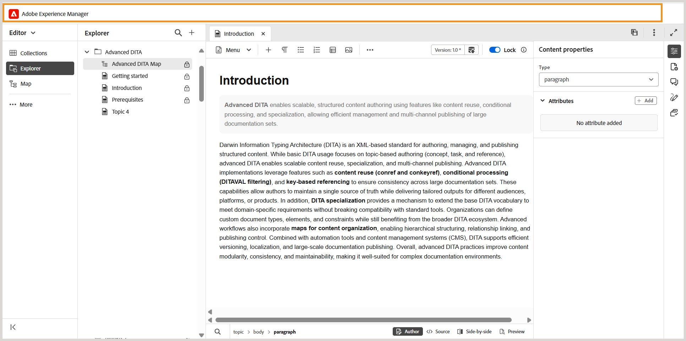
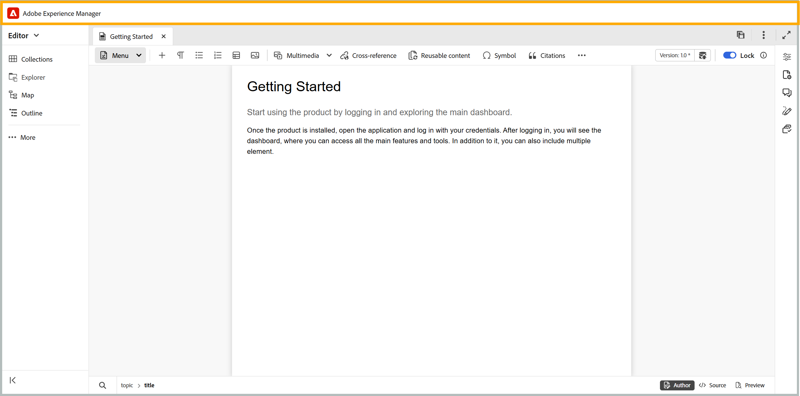
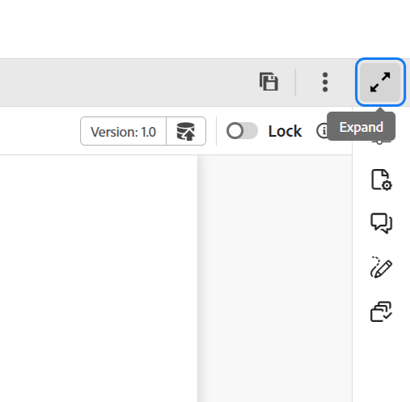

# Kopfzeilenleiste im Editor

Die Kopfzeilenleiste ist die obere Leiste des Editors, in der das Adobe Experience Manager-Logo angezeigt wird (oder eine Unified Shell, wenn Sie Unified Shell als Experience Manager Guides-Benutzeroberfläche verwenden). Wenn Sie das Logo auswählen, werden Sie zur Experience Manager-Navigationsseite weitergeleitet.

>[!BEGINTABS]

>[!TAB Neuer Editor]

Diese Ansicht zeigt an, wie der Inhalt im neuen Editor gerendert wird

>[!TAB Alter Editor]

Diese Ansicht zeigt an, wie der Inhalt im alten Editor gerendert wird

>[!ENDTABS]

Verwenden Sie das Symbol **Erweitern** in der Symbolleiste, um die Kopfzeilenleiste auszublenden und den Inhaltsbereich zu maximieren. Um die Standardansicht wiederherzustellen, wählen Sie **Erweiterte Ansicht beenden** aus.

{width="350"}

**Übergeordnetes Thema:**[ Einführung in den Editor](web-editor.md)
