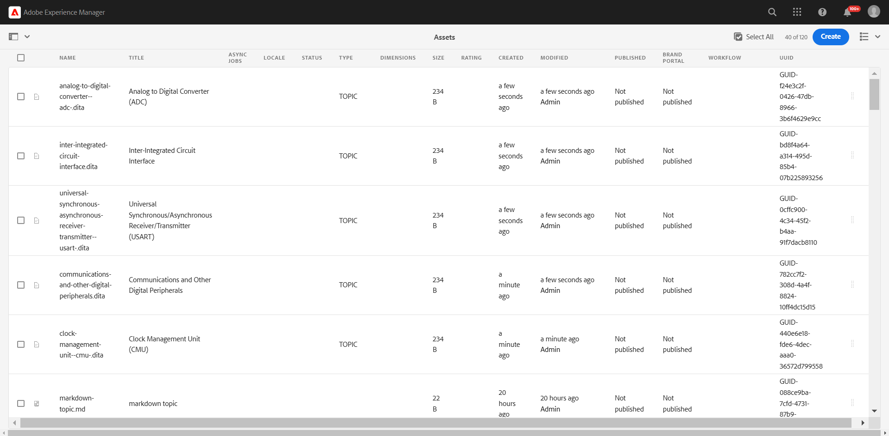

# Starten des Web Editors {#id2056B0140HS}

Sie können den Web Editor von den folgenden Speicherorten aus starten:

- [AEM](#id2056BG00RZJ)
- [AEM Assets-Benutzeroberfläche](#id2056BG0307U)
- [DITA-Zuordnungskonsole](#id2056BG090BF)

Die folgenden Abschnitte beschreiben, wie Sie den Web Editor von verschiedenen Standorten aus aufrufen und starten können.

## AEM {#id2056BG00RZJ}

Wenn Sie sich bei AEM anmelden, wird Ihnen die Navigationsseite angezeigt:

{width="800" align="left"}

Wenn Sie auf den Link **Handbücher** klicken, gelangen Sie direkt zum Webeditor.

{width="800" align="left"}

Da Sie den Web Editor gestartet haben, ohne eine Datei auszuwählen, wird ein leerer Web-Editor-Bildschirm angezeigt. Sie können eine Datei zur Bearbeitung aus AEM Repository oder Ihrer Favoriten-Sammlung öffnen.

- Klicken Sie auf das Symbol **Guides** ( ), um zur AEM Navigationsseite zurückzukehren.

- Mit der Schaltfläche **Schließen** gelangen Sie je nach Einrichtung zu einem Ziel:

  

  
 Cloud Services 

  Wenn Sie Cloud Service verwenden, klicken Sie auf die Schaltfläche **Schließen** , um zur AEM Navigationsseite zurückzukehren.
  

  

  
 On-Premise Software

  Wenn Sie die On-Premise-Software von AEM Guides (4.2.1 und höher) verwenden, klicken Sie rechts auf die Schaltfläche **Schließen** , um zu Ihrem aktuellen Dateipfad in der Assets-Benutzeroberfläche zurückzukehren.

  

## AEM Assets-Benutzeroberfläche {#id2056BG0307U}

Ein anderer Speicherort, von dem aus Sie den Web Editor starten können, ist die AEM Assets-Benutzeroberfläche. Sie können ein oder mehrere Themen auswählen und direkt im Web-Editor öffnen. Gehen Sie wie folgt vor, um ein Thema im Web Editor zu öffnen:

1. Navigieren Sie in der Assets-Benutzeroberfläche zu dem Thema, das Sie bearbeiten möchten.

   >[!NOTE]
   >
   > Sie können auch die UUID des Themas sehen.

   .

   {width="800" align="left"}

   >[!IMPORTANT]
   >
   > Stellen Sie sicher, dass Sie über Lese- und Schreibberechtigungen für den Ordner verfügen, der das Thema enthält, das Sie bearbeiten möchten.

1. Um eine exklusive Sperre für das Thema zu erhalten, wählen Sie das Thema aus und klicken Sie auf **Auschecken**.

   >[!IMPORTANT]
   >
   > Wenn Ihr Administrator die Option **Bearbeitung ohne Checkout deaktivieren** konfiguriert hat, müssen Sie die Datei vor der Bearbeitung auschecken. Wenn Sie die Datei nicht auschecken, wird die Bearbeitungsoption nicht angezeigt.

1. Schließen Sie den Asset-Auswahlmodus und klicken Sie auf das Thema, das Sie bearbeiten möchten.

   Die Vorschau des Themas wird angezeigt.

   Sie können den Web Editor über die Listenansicht, die Kartenansicht und den Vorschaumodus öffnen.

   >[!IMPORTANT]
   >
   > Wenn Sie mehrere Themen zur Bearbeitung öffnen möchten, wählen Sie die gewünschten Themen in der Asset-Benutzeroberfläche aus und klicken Sie auf Bearbeiten. Stellen Sie sicher, dass der Popup-Blocker in Ihrem Browser nicht aktiviert ist. Ansonsten wird nur das erste Thema in der ausgewählten Liste zur Bearbeitung geöffnet.

   {width="800" align="left"}

   Wenn Sie ein Thema nicht in der Vorschau anzeigen möchten und es direkt im Web-Editor öffnen möchten, klicken Sie in der Kartenansicht im Schnellaktionsmenü auf das Symbol Bearbeiten :

   {width="800" align="left"}

1. Klicken Sie auf **Bearbeiten** , um das Thema im Web-Editor zu öffnen.

   {width="800" align="left"}

## DITA-Zuordnungskonsole {#id2056BG090BF}

Gehen Sie wie folgt vor, um den Web Editor über die DITA Map-Konsole zu öffnen:

1. Navigieren Sie in der Assets-Benutzeroberfläche zu der DITA-Zuordnungsdatei, die das Thema enthält, das Sie bearbeiten möchten, und klicken Sie darauf.

   Die DITA-Map-Konsole wird angezeigt.

1. Klicken Sie auf **Themen**.

   Eine Liste der Themen in der Zuordnungsdatei wird angezeigt. Die UUID der Themen wird unter dem Thementitel angezeigt.

1. Wählen Sie die Themendatei aus, die Sie bearbeiten möchten.

1. Klicken Sie auf **Thema bearbeiten**.

   {width="800" align="left"}

1. Das Thema wird im Web-Editor geöffnet.

   >[!IMPORTANT]
   >
   > Wenn Ihr Administrator die Option **Bearbeitung ohne Checkout deaktivieren** konfiguriert hat, müssen Sie die Datei vor der Bearbeitung auschecken. Wenn Sie die Datei nicht auschecken, wird das Dokument im schreibgeschützten Modus im Editor geöffnet.

**Übergeordnetes Thema:**[ Arbeiten mit dem Web-Editor](web-editor.md)
