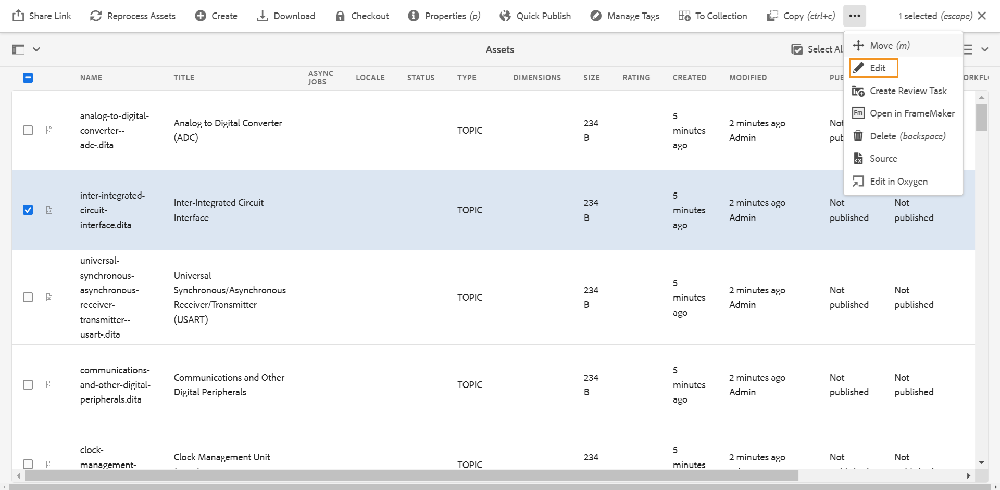

# Editor starten {#id2056B0140HS}

Sie können den Editor an den folgenden Stellen starten:

- [Adobe Experience Manager-Navigationsseite](#adobe-experience-manager-navigation-page)
- [Adobe Experience Manager Assets-Benutzeroberfläche](#adobe-experience-manager-assets-ui)
- [Kartenkonsole](#map-console)

In den folgenden Abschnitten wird beschrieben, wie Sie den Editor von verschiedenen Speicherorten aus aufrufen und starten können.

## Adobe Experience Manager-Navigationsseite

Wenn Sie sich bei Experience Manager anmelden, wird die Navigationsseite angezeigt:

{align="left"}

Wenn Sie den Link **Guides** auswählen, gelangen Sie zur Startseite von [Adobe Experience Manager Guides](./intro-home-page.md).

{align="left"}

Um den Editor zu starten, navigieren Sie zur Navigationsleiste und wählen Sie dann **Editor** aus dem Dropdown-Menü aus. Die Startseite ist standardmäßig ausgewählt.

{width="350" align="left"}

Da Sie den Editor gestartet haben, ohne eine Datei auszuwählen, wird ein leerer Editor-Bildschirm angezeigt. Sie können eine Datei zur Bearbeitung aus Experience Manager (**)** Ihren **Sammlungen** öffnen.

{align="left"}

Alternativ können Sie den Editor auch starten, indem Sie die vorhandenen Dateien im Widget **Aktuelle Dateien** und **Sammlungen** des [Adobe Experience Manager Guides-](./intro-home-page.md) öffnen.

Um zur Experience Manager-Navigationsseite zurückzukehren, klicken Sie auf das Adobe Experience Manager-Logo oben links in der Kopfzeile.

## Adobe Experience Manager Assets-Benutzeroberfläche

Ein weiterer Speicherort, von dem aus Sie den Editor starten können, ist die Experience Manager Assets-Benutzeroberfläche. Sie können ein oder mehrere Themen auswählen und direkt im Editor öffnen.

Gehen Sie wie folgt vor, um ein Thema im Editor zu öffnen:

1. Navigieren Sie in der Assets-Benutzeroberfläche zu dem Thema, das Sie bearbeiten möchten.

   >[!NOTE]
   >
   > Sie können auch die UUID des Themas anzeigen.

   {align="left"}

   >[!IMPORTANT]
   >
   > Stellen Sie sicher, dass Sie über Lese- und Schreibberechtigungen für den Ordner verfügen, der das zu bearbeitende Thema enthält.

1. Um eine exklusive Sperre für das Thema zu erhalten, wählen Sie das Thema aus und klicken Sie auf **Checkout**.

   >[!IMPORTANT]
   >
   > Wenn Ihr Administrator die Option **Bearbeitung deaktivieren, ohne die Datei zu sperren** konfiguriert hat, müssen Sie die Datei vor der Bearbeitung auschecken. Wenn Sie die Datei nicht auschecken, können Sie die Option Bearbeiten nicht anzeigen.

1. Schließen Sie den Asset-Auswahlmodus und wählen Sie das Thema aus, das Sie bearbeiten möchten.

   Die Vorschau des Themas wird angezeigt.

   Sie können den Editor in der Listenansicht, Kartenansicht und im Vorschaumodus öffnen.

   >[!IMPORTANT]
   >
   > Wenn Sie mehrere Themen zur Bearbeitung öffnen möchten, wählen Sie die gewünschten Themen in der Asset-Benutzeroberfläche aus und klicken Sie auf **Bearbeiten**. Vergewissern Sie sich, dass in Ihrem Browser kein Popup-Blocker aktiviert ist, da ansonsten nur das erste Thema in der ausgewählten Liste zur Bearbeitung geöffnet wird.

   {align="left"}

   Wenn Sie ein Thema nicht in der Vorschau anzeigen und es direkt im Editor öffnen möchten, wählen Sie **Bearbeiten** im Schnellaktionsmenü in der Kartenansicht aus:

   {align="left"}

   Das Thema wird im Editor geöffnet.

   {align="left"}

Sie können auch eine Zuordnungsdatei in der Assets-Benutzeroberfläche öffnen und den Editor starten, um die Themen in der Zuordnungsdatei zu bearbeiten.

Gehen Sie wie folgt vor, um eine Zuordnung im Editor zu öffnen:

1. Navigieren Sie in der Assets-Benutzeroberfläche zu und wählen Sie die Zuordnungsdatei aus, die das zu bearbeitende Thema enthält.
1. Navigieren Sie in der DITA-Zuordnungskonsole zur Registerkarte **Themen** . Eine Liste von Themen in der Zuordnungsdatei wird angezeigt.
1. Wählen Sie die Themendatei aus, die Sie bearbeiten möchten.
1. Wählen Sie **Thema bearbeiten** aus.

   {align="left"}

1. Das Thema wird im Editor geöffnet.

   >[!IMPORTANT]
   >
   > Wenn Ihr Administrator die Option **Bearbeitung deaktivieren, ohne die Datei zu sperren** konfiguriert hat, müssen Sie die Datei vor der Bearbeitung auschecken. Wenn Sie die Datei nicht auschecken, wird das Dokument im Editor im schreibgeschützten Modus geöffnet.

## Kartenkonsole

Gehen Sie wie folgt vor, um den Editor über die Zuordnungskonsole zu öffnen:

1. Öffnen Sie die Startseite und starten Sie die Kartenkonsole.

   {width="350" align="left"}

   Da Sie die Zuordnungskonsole gestartet haben, ohne eine Zuordnungsdatei auszuwählen, wird ein leerer Bildschirm der Zuordnungskonsole angezeigt. Sie können auch eine Zuordnungsdatei aus Experience Manager (**)** Ihren **Sammlungen** öffnen.

   {width="500" align="left"}

1. Wählen Sie **Karte auswählen**, um eine Zuordnungsdatei mit den Themen zu öffnen, die Sie im Editor bearbeiten möchten.
1. Wählen Sie den Pfad aus, in dem sich Ihre Zuordnungsdatei befindet. Die ausgewählte Zuordnungsdatei wird der Zuordnungskonsole hinzugefügt.
1. Navigieren Sie zur Zuordnungsdatei und wählen Sie **Im Editor öffnen** aus dem Dropdown-Menü aus.

   {align="left"}

   Die Zuordnungsdatei mit den Themen ist im Editor zur Bearbeitung geöffnet.

   {align="left"}

**Übergeordnetes Thema**: [Einführung in den Editor](web-editor.md)
