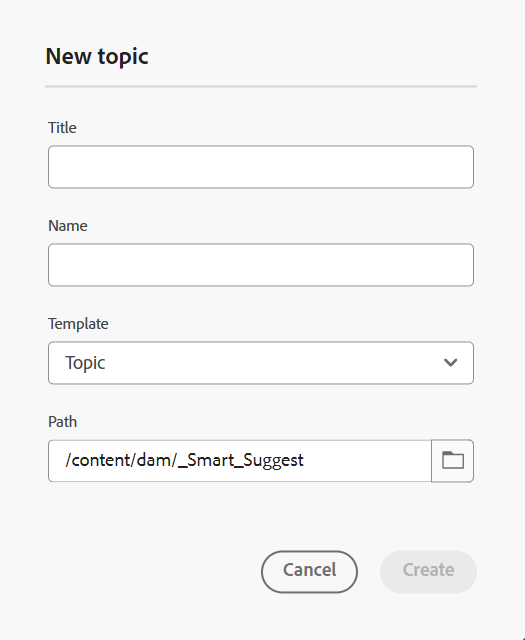

# Linkes Bedienfeld im Editor

Das linke Bedienfeld bietet schnellen Zugriff auf Sammlungen, Repository-Ansichten, Zuordnungsansichten und mehr Funktionen. Sie können das Bedienfeld erweitern, indem Sie **Symbol &quot;**&quot; in der linken unteren Ecke der Benutzeroberfläche auswählen. Verwenden Sie nach dem Erweitern das Symbol **Reduzieren**, um das Bedienfeld zu reduzieren. In der erweiterten Ansicht werden die Namen der Symbole angezeigt, die in der reduzierten Ansicht als QuickInfos angezeigt werden.

>[!NOTE]
>
>Die Größe des linken Bedienfelds kann geändert werden. Um die Größe des Bereichs zu ändern, bringen Sie den Cursor auf die Bereichsbegrenzung, der Cursor ändert sich in einen Doppelpfeil, wählen Sie und ziehen Sie, um die Größe des Bereichs zu ändern.

Das linke Bedienfeld bietet Zugriff auf die folgenden Funktionen:

- [Sammlungen](#collections)
- [Repository](#repository)
- [Explorer](#explorer)
- [Map](#map)
- [Wiederverwendbarer Inhalt](#reusable-content)
- [umreißen](#outline)

Einige Funktionen im linken Bereich sind unter dem Abschnitt **Mehr** verfügbar. Wählen Sie das Symbol Mehr , um auf die folgenden Funktionen zuzugreifen:

- [Glossar](#glossary)
- [Bedingungen](#conditions)
- [Subjektschema](#subject-scheme)
- [Snippets](#snippets)
- [Vorlagen](#templates)
- [Zitate](#citations)
- [Sprachvariablen](#language-variables)
- [Variablen](#variables)
- [Suchen und Ersetzen](#find-and-replace)
- [PDF-Vorlagen](#pdf-templates)
- [Überprüfung](#review)


Eine zusätzliche Option mit der Bezeichnung **Workfront** wird auch im linken Bereich angezeigt, wenn Adobe Workfront konfiguriert ist.

Weitere Informationen finden Sie unter [Workfront-Integration](./workfront-integration.md).

>[!NOTE]
>
> Die im linken Bedienfeld verfügbaren Funktionen werden von Ihrem Administrator verwaltet, sodass er die einzelnen im linken Bedienfeld vorhandenen Funktionen aktivieren oder deaktivieren kann. Im linken Bereich werden nur aktivierte Funktionen angezeigt. Weitere Informationen finden Sie im Abschnitt **Bedienfelder** der [Registerkartenleiste](./web-editor-tab-bar.md).

Die Funktionen des linken Bedienfelds werden im Detail wie folgt erläutert:

## Sammlungen

Wenn Sie an einem Satz von Dateien oder Ordnern arbeiten, können Sie diese Ihrer Favoritenliste hinzufügen, um schnell darauf zuzugreifen. **Sammlungen** zeigen die Liste der von Ihnen hinzugefügten Dokumente und andere öffentlich zugängliche Listen von Dokumenten der anderen Benutzer an.

Standardmäßig können Sie die Dateien nach Titeln anzeigen. Wenn Sie mit dem Mauszeiger auf eine Datei zeigen, können Sie den Dateititel und den Dateipfad als QuickInfo anzeigen.

>[!NOTE]
>
> Als Administrator können Sie die Liste der Dateien nach Dateinamen im Editor anzeigen. Wählen Sie die **Dateiname** im Abschnitt **Konfiguration von Editor-Dateien** Benutzereinstellungen **aus**.

<details>
    <summary> Erstellen einer neuen Sammlung </summary>


Um eine neue Sammlung zu erstellen, klicken Sie auf das Symbol &quot;+&quot; neben dem Bedienfeld „Sammlungen“, um das Dialogfeld **Neue Sammlung** aufzurufen:

{width="300" align="left"}

Geben Sie einen Titel und eine Beschreibung für die Sammlung ein, die Sie erstellen möchten. Wenn Sie **Öffentlich** auswählen, wird dieser Favorit auch anderen Benutzern angezeigt.

>[!NOTE]
>
> Sie können eine Sammlung auch über die Experience Manager Guides-Startseite erstellen. Öffnen Sie die Startseite, navigieren Sie zum Widget **Sammlungen** im Abschnitt [Übersicht](./intro-home-page.md#overview) und wählen Sie **Neue Sammlung** aus.

</details>

<details>
    <summary> Hinzufügen einer Datei zu Sammlungen </summary>


Um eine Datei zu Sammlungen hinzuzufügen, verwenden Sie eine der folgenden Methoden:

- Navigieren Sie zur gewünschten Datei oder zum gewünschten Ordner in der Repository-Ansicht, wählen Sie das Symbol *Optionen* aus, um das Kontextmenü zu öffnen, und wählen Sie **Hinzufügen zu** > **Sammlungen**. Im Dialogfeld **Zu Sammlungen hinzufügen** können Sie die Datei/den Ordner zu einem vorhandenen Favoriten hinzufügen oder einen neuen erstellen.

  {width="300" align="left"}

- Klicken Sie im Editor mit der rechten Maustaste auf die Registerkarte einer Datei, um das Kontextmenü zu öffnen. Wählen Sie **Hinzufügen zu** > **Sammlungen**, um die Datei Ihrer Favoritenliste hinzuzufügen.

  {align="left"}


>[!NOTE]
>
> - Um ein Element aus der Favoritenliste zu entfernen, klicken Sie auf das Optionssymbol neben dem Element in einer Favoritensammlung und wählen Sie **Aus Sammlungen entfernen**.
> - Um die Datei in der Vorschau anzuzeigen, ohne sie zu öffnen, wählen Sie eine Datei aus und wählen **dann** Vorschau“ aus dem Menü „Optionen“.

</details>

**Optionsmenü für eine Sammlung**

Sie können auch viele Aktionen über das Menü Optionen ausführen, das für eine Sammlung verfügbar ist:

{width="650" align="left"}

- **Umbenennen**: Umbenennen der ausgewählten Sammlung.
- **Löschen**: Löscht die ausgewählte Sammlung.
- **Aktualisieren**: Erstellt eine neue Liste mit Dateien und Ordnern aus dem Repository.
- **In Assets-Benutzeroberfläche anzeigen**: Den Datei- oder Ordnerinhalt in der Assets-Benutzeroberfläche anzeigen.

>[!NOTE]
>
> Sie können die Liste mithilfe des Symbols **Aktualisieren** oben aktualisieren. Beim zusätzlichen Aktualisieren der Liste werden die Sammlungen neu geladen, was dazu führt, dass alle erweiterten Sammlungen im Bedienfeld reduziert werden.


## Repository

>[!NOTE]
>
> Ab Version 2025.11.0 wird **Repository** im Editor veraltet sein und durch **Explorer** für **Cloud Service** ersetzt. Bei **On-Premise**-Setup können Sie Repository bis Version 5.1 von Experience Manager Guides weiterhin über die Editor-Oberfläche anzeigen und verwenden.

Wenn Sie das Repository-Symbol auswählen, erhalten Sie eine Liste der in DAM verfügbaren Dateien und Ordner. Standardmäßig können Sie die Dateien nach Titeln anzeigen. Wenn Sie mit dem Mauszeiger auf eine Datei zeigen, können Sie den Dateititel und den Dateinamen als QuickInfo anzeigen.

>[!NOTE]
>
> Als Administrator können Sie die Liste der Dateien nach Dateinamen im Editor anzeigen. Wählen Sie die **Dateiname** im Abschnitt **Konfiguration von Editor-Dateien** Benutzereinstellungen **aus**.

Es werden 75 Dateien gleichzeitig geladen. Jedes Mal, wenn Sie **Mehr laden**… auswählen, werden 75 Dateien geladen und die Schaltfläche wird nicht mehr angezeigt, wenn alle Dateien aufgelistet wurden. Dieses Laden im Batch ist effizient, und Sie können schneller auf die Dateien zugreifen als alle Dateien, die in einem Ordner vorhanden sind.

Sie können einfach zur gewünschten Datei in DAM navigieren und sie im Editor öffnen. Wenn Sie über die erforderlichen Zugriffsrechte zum Bearbeiten der Datei verfügen, können Sie dies tun.

Sie können auch eine Audio- oder Videodatei im Editor auswählen und wiedergeben. Sie können die Lautstärke oder
Die Ansicht des Videos. Im Kontextmenü haben Sie auch die Optionen zum Herunterladen, Ändern der Wiedergabe
Geschwindigkeit oder Bild im Bild anzeigen.

Wählen Sie eine Karte aus und drücken Sie die Eingabetaste oder doppelklicken Sie, um sie in der **Kartenansicht“** öffnen. Weitere Informationen finden Sie in der **Kartenansicht** Funktionsbeschreibung im linken Bereich. Wählen Sie ein Thema aus und drücken Sie die Eingabetaste oder doppelklicken Sie, um es im [Inhaltsbearbeitungsbereich“ ](./web-editor-content-editing-area.md) öffnen. Die Möglichkeit, direkt im Editor in einer Datei zu navigieren und sie zu öffnen, spart Zeit und erhöht die Produktivität.

## Filtern der Suche im Repository

Der Editor bietet erweiterte Filter für die Textsuche. Sie können in den Dateien im ausgewählten Pfad des Adobe Experience Manager-Repositorys nach einem Text suchen und filtern. Dabei werden Titel, Dateiname und Inhalt in den Dateien durchsucht.


{width="300" align="left"}

*Filter anwenden, um nach den Dateien zu suchen, die den`personal spaceship.`* enthalten

Wählen Sie das Symbol **Filtersuche** \(\) aus, um das Popup-Fenster „Filter“ zu öffnen.

>[!NOTE]
>
> Wenn Sie nach Text suchen oder Dateien filtern, wird auf dem Symbol **Suche filtern** \(\) ein blauer Punkt angezeigt, um anzugeben, dass wir uns im Suchbereich befinden und dass einige Filter angewendet wurden.


Sie haben die folgenden Optionen, um die Dateien zu filtern und Ihre Suche im Adobe Experience Manager-Repository einzugrenzen:

- **DITA-Dateien**: Sie können nach allen **DITA-Themen** und **DITA-Karten** suchen, die im ausgewählten Pfad vorhanden sind. Diese sind standardmäßig ausgewählt.
- **Nicht-DITA-Dateien**: Sie können im ausgewählten Pfad nach **DITAVAL-**, **Image-**, **Multimedia**, **Documents** und **JSON** suchen.

   {width="300" align="left"}

  *Verwenden Sie die Filter für die schnelle Suche, um nach DITA- und Nicht-DITA-Dateien zu suchen.*

>[!NOTE]
>
> Sie können auch den Filter **DITA Topic** verwenden, um nach Inhalten zu suchen, die für Markdown-Dateien im Repository spezifisch sind, einschließlich Titel, Themeninhalt und Eigenschaften. Diese Funktion gilt derzeit nur für neu erstellte Markdown-Dateien.

**Erweiterte Filterung**

Wählen Sie das Symbol **Erweiterte**, um das Dialogfeld **Erweiterter Filter** anzuzeigen.

Sie können die folgenden Optionen auf den Registerkarten **Allgemein** und **Erweitert** anzeigen.

 {width="650" align="left"}


**Allgemein**

- **Suchergebnisse mit**: Suchen Sie nach Text in den Dateien, die im ausgewählten Pfad des Adobe Experience Manager-Repositorys vorhanden sind. Der Text wird im Titel, im Dateinamen und im Inhalt der Dateien durchsucht.

Dies ist mit dem Suchfeld im Repository-Fenster synchronisiert. Wenn Sie beispielsweise `general purpose` in das Suchfeld im Repository-Bereich eingeben, wird es auch im Dialogfeld **Erweiterter Filter** angezeigt und umgekehrt.

- **Suchen in**: Wählen Sie den Pfad aus, unter dem Sie die Dateien im Adobe Experience Manager-Repository suchen möchten.
- **DITA-Dateien**: Sie können nach allen **DITA-Themen** und **DITA-Karten** suchen, die im ausgewählten Pfad vorhanden sind. Diese sind standardmäßig ausgewählt.
- **Nicht-DITA-Dateien**: Sie können im ausgewählten Pfad nach **DITAVAL-**, **Image-**, **Multimedia**, **Documents** und **JSON** suchen.
- **Gesperrt von**: Zeigt eine Liste von Benutzern an. Die Liste wird paginiert und asynchron geladen, sodass nur eine begrenzte Anzahl von Benutzern gleichzeitig angezeigt wird und beim Scrollen oder Navigieren mehr abgerufen wird. Dies verbessert die Ladegeschwindigkeit und die Gesamtleistung, insbesondere bei der Arbeit mit einer großen Anzahl von Benutzern.
- **Geändert nach**/**Geändert vor**: Inhalt nach Änderungsdatum filtern. Wählen Sie einen Datumsbereich aus dem Kalender aus oder wählen Sie eine der folgenden Zeitrahmen-Optionen:
   - In den letzten zwei Stunden
   - In letzter Woche
   - Im letzten Monat
   - Im letzten Jahr
- **Tags**: Filtern von Inhalten basierend auf Tags.

**Erweitert**

- **DITA-Elemente**: Sie können auch in den Attributen der angegebenen DITA-Elemente nach bestimmten Werten suchen.
   - Wählen Sie **Element hinzufügen** aus, um die Elemente, Attribute und Werte hinzuzufügen.
   - Wenden Sie die ausgewählten Filter an.

- Wählen Sie **Alle löschen**, um alle angewendeten Filter zu löschen.


- Wählen Sie das Symbol **Filter schließen**  aus, um den Filter zu schließen und zur Strukturansicht des Repositorys zurückzukehren.

  >[!NOTE]
  >
  >Ihre bzw. Ihr Systemadmin kann auch die Textfilter konfigurieren und andere Filter ein- oder ausblenden. Weitere Informationen finden Sie *Abschnitt „Konfigurieren von Textfiltern* im Abschnitt Installieren und Konfigurieren von Adobe Experience Manager Guides as a Cloud Service.
  >
  >Die Liste der gefilterten Dateien, die den gesuchten Text enthalten, wird angezeigt. Beispielsweise werden die Dateien, die die `personal spaceship` enthalten, im vorherigen Screenshot aufgelistet. Sie können mehrere Dateien aus der gefilterten Liste auswählen, um sie per Drag-and-Drop auf eine Karte zu ziehen, die zur Bearbeitung geöffnet ist.

### Menü „Optionen“

Neben dem Öffnen von Dateien über den linken Bereich können Sie auch viele Aktionen über das Menü Optionen in der Repository-Ansicht ausführen. Je nachdem, ob Sie einen Ordner, eine Themendatei oder eine Mediendatei auswählen, werden unterschiedliche Optionen angezeigt.

**Optionen für einen Ordner**

Sie können die folgenden Aktionen mithilfe des Menüs Optionen ausführen, das für einen *Ordner* in der Repository-Ansicht verfügbar ist:

{width="550" align="left"}


- **Neu**: Erstellen Sie ein neues DITA-Thema, eine neue DITA-Karte oder einen neuen Ordner.

<details>
    <summary> Schritte zum Erstellen eines neuen Themas </summary>

Schritte zum Erstellen eines neuen Themas:
1. Wählen Sie **Neu** > **Thema** aus.
2. Das **Neues Thema** wird angezeigt.

   {width="300" align="left"}

3. Geben **im Dialogfeld** Neues Thema“ die folgenden Details an:
   - Ein Titel für das Thema.
   - \(Optional\)* Der Dateiname für das Thema. Der Dateiname wird basierend auf dem Thementitel automatisch vorgeschlagen. Wenn Ihr Administrator automatische Dateinamen basierend auf der UUID-Einstellung aktiviert hat, wird das Feld Name nicht angezeigt.
   - Eine Vorlage, auf der das Thema basieren soll. Bei einem vorkonfigurierten Setup können Sie beispielsweise aus den Vorlagen „Leer“, „Konzept“, „DIGITAL“, „Referenz“, „Aufgabe“, „Thema“, „Markdown“, „Glossar“ und „Fehlerbehebung“ wählen. Wenn für Ihren Ordner ein Ordnerprofil konfiguriert ist, zeigen Sie nur die Themenvorlagen an, die für das Ordnerprofil konfiguriert sind.

   - Pfad zum Speichern der Themendatei. Standardmäßig wird der Pfad des aktuell ausgewählten Ordners im Repository im Feld Pfad angezeigt.
4. Wählen Sie **Erstellen**. Das Thema wird unter dem angegebenen Pfad erstellt. Außerdem wird das Thema im Editor zur Bearbeitung geöffnet.

</details>

<details>
<summary> Schritte zum Erstellen einer neuen DITA-Zuordnung </summary>


Schritte zum Erstellen einer neuen DITA-Zuordnung:

1. Wählen Sie **Neu** > **DITA-Karte**.
2. Das **Neue Zuordnung** wird angezeigt.

   {width="300" align="left"}

3. Geben **im Dialogfeld** Neue Zuordnung“ die folgenden Details an:
   - Ein Titel für die Karte.
   - *\(Optional\)* Der Dateiname für die Zuordnung. Der Dateiname wird basierend auf dem Zuordnungstitel automatisch vorgeschlagen. Wenn Ihr Administrator automatische Dateinamen basierend auf der UUID-Einstellung aktiviert hat, wird das Feld Name nicht angezeigt.
   - Eine Vorlage, auf der die Zuordnung basieren soll. Für ein vorkonfiguriertes Setup können Sie beispielsweise aus den Vorlagen „Bookmap“ oder „DITA Map“ auswählen.
   - Pfad, in dem die Zuordnungsdatei gespeichert werden soll. Standardmäßig wird der Pfad des aktuell ausgewählten Ordners im Repository im Feld Pfad angezeigt.
4. Wählen Sie **Erstellen**. Die Zuordnung wird innerhalb des im Feld Pfad angegebenen Ordners erstellt und hinzugefügt. Außerdem wird die Karte in der Kartenansicht geöffnet. Sie können die Zuordnungsdatei im Zuordnungs-Editor öffnen und ihr ein Thema hinzufügen. Weitere Informationen zum Hinzufügen von Themen zu einer Zuordnungsdatei finden Sie unter [Erstellen einer Zuordnung](map-editor-create-map.md#). Wählen Sie alternativ **In Map-Konsole öffnen** aus, um die Zuordnung in der Map-Konsole zu öffnen.
</details>

<details>
<summary> Schritte zum Erstellen eines neuen Ordners </summary>

Schritte zum Erstellen eines neuen Ordners:

1. Wählen Sie **Neu** > **Ordner** aus.
2. Das **Neuer Ordner**-Dialogfeld wird angezeigt.

   {width="300" align="left"}

3. Geben **im Dialogfeld** Neuer Ordner“ die folgenden Details an:
   - Ein Titel für den Ordner, der automatisch in den Ordnernamen konvertiert wird.
   - Pfad, in dem der Ordner gespeichert werden soll. Standardmäßig wird der Pfad des aktuell ausgewählten Ordners im Repository im Feld Pfad angezeigt.
4. Wählen Sie **Erstellen**. Der Ordner wird in dem Ordner erstellt und hinzugefügt, von dem aus die Option Ordner erstellen ausgeführt wurde.

</details>

- **Assets hochladen**: Laden Sie eine Datei aus Ihrem lokalen System in den ausgewählten Ordner im Adobe Experience Manager-Repository hoch. Sie können auch Dateien aus Ihrem lokalen System per Drag-and-Drop auf das aktuelle Arbeitsthema ziehen. Dies ist sehr nützlich, wenn Sie Bilder aus Ihrem lokalen System in Ihr Thema einfügen möchten.

  {width="300" align="left"}

  Sie können einen Ordner auswählen, in den Sie die Datei hochladen möchten, und es wird auch eine Vorschau des Bildes angezeigt. Wenn Sie die Datei umbenennen möchten, können Sie dies im Textfeld Dateiname tun. Wählen Sie **Hochladen** aus, um den Datei-Upload abzuschließen. Wenn Sie eine Bilddatei per Drag-and-Drop auf ein Thema gezogen haben, wird die Bilddatei zum Artikel hinzugefügt und auch hochgeladen.

  Wenn Ihr Admin die Option UUIDs in *XMLEditorConfig* aktiviert hat, wird die UUID des hochgeladenen Bildes in der Eigenschaft **Source** angezeigt.

  {align="left"}

- **Dateien in Ordner suchen**: Versetzt den Fokus auf die Repository-Suche, in der Sie den Suchbegriff eingeben können. Die Suche wird unter dem ausgewählten Ordner im Repository durchgeführt. Sie können auch einen Filter anwenden, um DITA-Dateien, Bilddateien oder beides zurückzugeben.

  {width="300" align="left"}

  Sie können auch mit der UUID einer Datei suchen. In diesem Fall zeigen die Suchergebnisse den Titel der DITA/XML-Datei an. Wenn es sich bei der Datei um eine Bilddatei handelt, wird die UUID der Datei angezeigt. Im folgenden Suchbeispiel wird die UUID einer Bilddatei durchsucht und in den Suchergebnissen die UUID der Originalbilddatei sowie der Thementitel der Datei angezeigt, in der auf dieses Bild verwiesen wird.

  {width="300" align="left"}

- **Reduzieren**: Reduziert den ausgewählten Ordner im Repository.

  >[!NOTE]
  >
  > Erweitern Sie den Ordner mit dem Symbol **\>** neben einem Ordner.

- **Zu Sammlungen hinzufügen**: Fügt den ausgewählten Ordner zu den Favoriten hinzu. Sie können sie zu einer vorhandenen oder neuen Sammlung hinzufügen.

- **Aktualisieren**: Erstellt eine neue Liste mit Dateien und Ordnern aus dem Repository.
- **In Assets-Benutzeroberfläche anzeigen**: Zeigt den Ordnerinhalt in der Assets-Benutzeroberfläche an.

**Optionen für eine Datei**

Sie erhalten Zugriff auf verschiedene Optionen im Menü Optionen , je nachdem, ob Sie eine Mediendatei oder eine DITA-Datei auswählen. Einige gängige Optionen für Medien- und DITA-Dateien sind:

- Bearbeiten
- In FrameMaker öffnen
- Duplizieren
- Sperren/Entsperren
- Vorschau
- Verschieben nach
- Umbenennen
- Löschen
- Generieren
- Als PDF herunterladen
- Hinzufügen zu
- Kopieren
- In der Assets-Benutzeroberfläche anzeigen
- Eigenschaften


{width="550" align="left"}

Die verschiedenen Optionen im Menü „Optionen“ werden nachfolgend erläutert:

- **Bearbeiten**: Öffnen Sie die Datei zur Bearbeitung. Im Falle einer .ditamap/.bookmap-Datei wird diese zur Bearbeitung im [Map Editor](map-editor-advanced-map-editor.md#) geöffnet.

- **Duplizieren**: Mit dieser Option erstellen Sie ein Duplikat oder eine Kopie der ausgewählten Datei. Sie haben außerdem die Möglichkeit, die doppelte Datei in der Aufforderung Asset duplizieren umzubenennen. Standardmäßig wird die Datei mit dem Suffix \ (wie Dateiname\_1.extension\) erstellt. Der Titel der Datei bleibt gleich wie der der Quelldatei, und die neue Datei beginnt mit Version 1.0. Alle Verweise, Tags und Metadaten werden kopiert, während die Baselines nicht in die doppelte Datei kopiert werden.
- **Sperren**: Sperrt die ausgewählte Datei, damit sie bearbeitet werden kann. Wenn die Datei gesperrt ist, wird durch Bewegen des Mauszeigers über dem Sperrsymbol **Gesperrt von Ihnen** angezeigt, wenn Sie sie gesperrt haben, oder **Gesperrt von [Benutzername]**, wenn ein anderer Benutzer sie gesperrt hat.

- **Vorschau**: Erhalten Sie eine schnelle Vorschau der Datei (.dita, .xml, Audio, Video oder Bild), ohne sie zu öffnen. Sie können die Größe des Vorschaubereichs ändern. Wenn der Inhalt `<xref>` oder `<conref>` enthält, können Sie diese auswählen, um sie in einer neuen Registerkarte zu öffnen. Der Titel der Datei wird im Fenster angezeigt. Wenn kein Titel vorhanden ist, wird der Dateiname angezeigt. Um das Bedienfeld **Vorschau** zu schließen, können Sie entweder das Symbol zum Schließen auswählen oder eine beliebige Stelle außerhalb des Bereichs auswählen.

  {align="left"}

- **Umbenennen**: Verwenden Sie diese Option, um die ausgewählte Datei umzubenennen. Geben Sie den Namen der neuen Datei im Dialogfeld **Asset umbenennen** ein.
   - Sie können eine Datei beliebigen Typs umbenennen.
   - Die Dateierweiterung kann nicht geändert werden.
   - Zwei Dateien dürfen nicht denselben Namen haben. Sie können also eine Datei nicht in einen bereits vorhandenen Namen umbenennen. Ein Fehler wird angezeigt.

- **Verschieben nach**: Verwenden Sie diese Option, um die ausgewählte Datei in einen anderen Ordner zu verschieben.
   - Sie können entweder den Namen des Zielordners eingeben oder **Pfad auswählen** um den Zielordner auszuwählen.
   - Sie können eine Datei beliebigen Typs an ein beliebiges Ziel im Inhaltsordner verschieben.
   - Zwei Dateien dürfen nicht denselben Namen haben. Daher können Sie eine Datei nicht in einen Ordner verschieben, in dem bereits eine Datei mit demselben Namen vorhanden ist.

  Wenn Sie versuchen, eine Datei in einen Ordner zu verschieben, in dem eine Datei mit demselben Namen, aber einem anderen Titel vorhanden ist, wird das Dialogfeld Umbenennen und Datei verschieben angezeigt, und Sie müssen die Datei vor dem Verschieben umbenennen. Die verschobene Datei im Zielordner hat den neuen Dateinamen.

  {width="550" align="left"}

  >[!NOTE]
  >
  > Sie können eine Datei auch per Drag-and-Drop in einen anderen Zielordner ziehen.

  **Ausschlussszenarien**

  In Experience Manager Guides ist es in den folgenden Szenarien nicht zulässig, eine Datei umzubenennen oder zu verschieben:

   - Sie können eine Datei nicht verschieben oder umbenennen, wenn sie Teil eines Überprüfungs- oder Übersetzungs-Workflows ist.

   - Wenn die Datei von einem anderen Benutzer gesperrt wird, ist ein Umbenennen oder Verschieben der Datei nicht möglich. Die Optionen Umbenennen oder Verschieben nach für die Datei werden nicht angezeigt.

  >[!NOTE]
  >
  > Wenn Ihnen der Administrator Berechtigungen für einen Ordner erteilt hat, werden nur die Optionen **Umbenennen** oder **Verschieben nach** angezeigt.

  <details>
    <summary> Cloud Services </summary>

  Beim Umbenennen oder Verschieben einer Datei werden vorhandene Verweise von oder auf die Datei nicht beschädigt, da jede Datei eine eindeutige UUID hat.
  </details>

- **Löschen**: Mit dieser Option können Sie die ausgewählte Datei löschen. Vor dem Löschen der Datei wird eine Bestätigungsaufforderung angezeigt.

   - Vor dem Löschen der Datei wird eine Bestätigungsaufforderung angezeigt.
   - Wenn keine andere Datei auf die Datei verweist, wird sie gelöscht und eine Erfolgsmeldung wird angezeigt.
   - Wenn die Datei gesperrt ist, können Sie sie nicht löschen, und es wird eine Fehlermeldung angezeigt.

     >[!NOTE]
     >
     > Wenn Ihr Administrator das Löschen gesperrter Dateien verhindert hat, wird nur die Fehlermeldung angezeigt. Weitere Informationen finden Sie *Abschnitt „Löschen von ausgecheckten Dateien verhindern* im Abschnitt Installieren und Konfigurieren von Adobe Experience Manager Guides as a Cloud Service.

   - Wenn die Datei einer Sammlung hinzugefügt wird, wird das **Löschen erzwingen** angezeigt, und Sie können das Löschen erzwingen.
   - Wenn die Datei von einer anderen Datei referenziert wird, wird **Löschen erzwingen** Dialogfeld mit der Bestätigungsmeldung angezeigt, und Sie können die Datei erzwingen:

     {width="300" align="left"}

     >[!NOTE]
     >
     > Wenn der Administrator die Berechtigung zum Löschen von Dateien erteilt hat, ist **Löschen erzwingen** aktiviert. Andernfalls ist **Löschen erzwingen** deaktiviert und es wird eine Meldung angezeigt, dass Sie nicht berechtigt sind, referenzierte Dateien zu löschen. Weitere Informationen finden Sie im Abschnitt *Verhindern des Löschens referenzierter Dateien* im Abschnitt Installieren und Konfigurieren von Adobe Experience Manager Guides as a Cloud Service.

   - Wenn Sie ein referenziertes Thema löschen und die Datei mit Verweisen zur Bearbeitung geöffnet haben, wird der fehlerhafte Link für die referenzierte Datei angezeigt.

  >[!NOTE]
  >
  > Sie können die ausgewählte Datei auch auf ähnliche Weise mit der Löschen -Taste der Tastatur löschen.

- **Kopieren**: Sie können aus den folgenden Optionen auswählen:

   - **UUID kopieren**: Kopieren Sie die UUID der ausgewählten Datei in die Zwischenablage.

   - **Pfad kopieren**: Kopieren Sie den vollständigen Pfad der ausgewählten Datei in die Zwischenablage.

- **Hinzufügen zu**: Sie können aus den folgenden Optionen auswählen:
   - **Sammlungen**: Fügt die ausgewählte Datei zu Sammlungen hinzu. Sie können sie zu einer vorhandenen oder neuen Sammlung hinzufügen.

   - **Wiederverwendbarer Inhalt**: Fügt die ausgewählte Datei der Liste Wiederverwendbarer Inhalt im linken Bereich hinzu.

- **Eigenschaften**: Hiermit können Sie die Eigenschaftsseite der ausgewählten Datei öffnen. Sie können auf diese Eigenschaftenseite auch über die Assets-Benutzeroberfläche zugreifen, indem Sie eine Datei auswählen und dann in der Symbolleiste das Symbol Eigenschaften auswählen.

- **Im Zuordnungs-Dashboard öffnen**: Wenn die ausgewählte Datei eine DITA-Zuordnung ist, wird durch diese Option das Zuordnungs-Dashboard geöffnet.

- **In Map-Konsole öffnen**: Falls die ausgewählte Datei eine DITA-Map ist, wird mit dieser Option die Map-Konsole geöffnet.

- **In Sauerstoff bearbeiten**: Wählen Sie diese Option, um die ausgewählte Datei im Oxygen Connector-Plug-in zu bearbeiten. Die Datei wird zur Bearbeitung geöffnet.

  >[!NOTE]
  >
  >Wenden Sie sich an Ihr Customer Success-Team , um diese Funktion in der Umgebung aktivieren zu lassen. Dies ist nicht als Teil der vordefinierten Unterstützung aktiviert. Weitere Informationen finden Sie im Abschnitt [Konfigurieren der Option zur Bearbeitung in Oxygen](../cs-install-guide/conf-edit-in-oxygen.md) im Installations- und Konfigurationshandbuch.


- **In Assets-Benutzeroberfläche anzeigen**: Verwenden Sie diese Option, um eine Vorschau einer .dita/.xml-Datei in der Assets-Benutzeroberfläche anzuzeigen. Bei einer .ditamap/.bookmap-Datei werden alle Themendateien innerhalb der Karte in einer einzigen einheitlichen Seitenansicht angezeigt.

- **Als PDF herunterladen**: Verwenden Sie die Option, um die PDF-Ausgabe zu generieren und herunterzuladen.

- **Generieren**: Verwenden Sie die Option, um eine Karte oder Themen innerhalb einer Karte auf einer Sites-Seite, in einem Inhaltsfragment oder in einem Experience Fragment zu veröffentlichen.

## Explorer

>[!NOTE]
>
> Ab Version 2025.11.0 wird der Begriff „Repository“ im Editor durch &quot;**&quot;** Cloud Service-Einrichtung ersetzt. Bei der On-Premise-Einrichtung wird das Repository im Editor weiterhin angezeigt und aufgerufen.

Explorer bietet die meisten Funktionen, die zuvor im Repository verfügbar waren, einschließlich:

- Navigation durch Dateien und Ordner
- Optionsmenü für Dateien und Ordner

Aber es führt ein verbessertes Such- und Filtererlebnis ein, das die Benutzerfreundlichkeit und Effizienz verbessert.

Ausführliche Informationen zum Kontextmenü für Dateien und Ordner finden Sie unter [Optionsmenü](#options-menu).

Ausführliche Informationen zum Sucherlebnis finden Sie unter [Suchbereich](./search-panel-explorer.md).

## Map

Wenn Sie das Symbol Kartenansicht auswählen, wird die Kartenansicht angezeigt, in der eine Liste von Themen in der Kartendatei angezeigt wird. Wenn Sie keine Zuordnungsdatei geöffnet haben, erscheint die Zuordnungsansicht leer. Ein Doppelklick auf eine Kartendatei öffnet die Kartendatei in dieser Ansicht. Sie können auf eine Datei innerhalb der Karte doppelklicken, um sie im Editor zu öffnen.

Standardmäßig können Sie die Dateien nach Titeln anzeigen. Wenn Sie mit dem Mauszeiger auf eine Datei zeigen, können Sie den Dateititel und den Dateipfad als QuickInfo anzeigen.

>[!NOTE]
>
>Als Administrator können Sie auch den Dateinamen der übergeordneten Zuordnung anzeigen, die derzeit in der Zuordnungsansicht geöffnet ist. Wählen Sie die **Dateiname** im Abschnitt **Konfiguration von Editor-Dateien** Benutzereinstellungen **aus**.


Wenn Sie eine Karte in der Kartenansicht öffnen, wird der Titel der aktuellen Karte in der Mitte der Registerkartenleiste angezeigt. Wenn der Titel zu lang ist, werden Auslassungspunkte angezeigt. Sie können auch den Mauszeiger über den Titel bewegen, um den vollständigen Titel in der QuickInfo anzuzeigen.

Wenn Sie Schlüsselattribute für die Themen- oder Zuordnungsreferenzen definieren, können Sie den Titel, das entsprechende Symbol und den Schlüssel im linken Bereich anzeigen. Die Taste wird als `keys=<key-name>` angezeigt.

{width="300" align="left"}

Wenn Sie Bearbeitungsrechte für die Zuordnungsdateien haben, können Sie auch die Dateien bearbeiten. Weitere Informationen zum Öffnen und Bearbeiten eines Themas über DITA Map finden Sie unter [Themen über DITA Map bearbeiten](map-editor-advanced-map-editor.md#id17ACJ0F0FHS).

Die folgenden Optionen sind für eine Zuordnungsdatei in der Zuordnungsansicht verfügbar:

- **In Map-Konsole öffnen**: Öffnet die Map-Datei in der Map-Konsole.
- **Bearbeiten**: Öffnet die Zuordnungsdatei zur Bearbeitung.
- **Optionen**: Öffnet das Kontextmenü für die ausgewählte Zuordnungsdatei.

Mit dem Menü Optionen der Zuordnungsdatei können Sie die folgenden Aktionen ausführen:

{align="left"}

- **Bearbeiten**: Öffnen Sie die Zuordnungsdatei zur Bearbeitung im Zuordnungs-Editor.

- **Alle auswählen** Wählen Sie alle Dateien in der Zuordnung aus.

- **Auswahl aufheben**: Heben Sie die Auswahl der ausgewählten Dateien in der Zuordnung auf.

- **lock**: Ermöglicht es Ihnen, die ausgewählten Dateien in der Zuordnung zu sperren.

- **Entsperren**: Entsperrt die Zuordnungsdatei und stellt sie zur Bearbeitung bereit. Die Änderungen werden nicht auf eine frühere Version zurückgesetzt.

- **Als neue Version speichern und entsperren**: Erstellen Sie eine neuere Version und lösen Sie die Sperre für die ausgewählten Dateien in der Zuordnung.

- **Vorschau**: Öffnet eine Vorschau der Zuordnungsdatei. In dieser Ansicht werden alle Themendateien innerhalb der Zuordnung in einer einzigen, einheitlichen Seitenansicht angezeigt.

- **Kopieren**: Sie können aus den folgenden Optionen auswählen:
   - **UUID kopieren**: Kopieren Sie die UUID der Zuordnungsdatei in die Zwischenablage.
   - **Pfad kopieren**: Kopieren Sie den vollständigen Pfad der Zuordnungsdatei in die Zwischenablage.

- **Im Explorer suchen**: Zeigt den Speicherort der Zuordnungsdatei im Explorer (oder DAM) an.

- **Hinzufügen zu**: Sie können aus den folgenden Optionen auswählen:
   - **Sammlungen**: Fügt die Zuordnungsdatei zu Sammlungen hinzu. Sie können sie zu einer vorhandenen oder neuen Sammlung hinzufügen.

   - **Wiederverwendbarer Inhalt**: Fügt die Zuordnungsdatei zur Liste der wiederverwendbaren Inhalte im linken Bereich hinzu.

- **Eigenschaften**: Verwenden Sie diese Option, um die Eigenschaftenseite der Zuordnungsdatei zu öffnen. Sie können auf diese Eigenschaftsseite auch über die Assets-Benutzeroberfläche zugreifen, indem Sie eine Datei auswählen und in der Symbolleiste auf das Symbol Eigenschaften klicken.

- **Karten-Dashboard öffnen**: Öffnet das Karten-Dashboard.

- **In Assets-Benutzeroberfläche anzeigen**: Verwenden Sie diese Option, um eine Vorschau der Zuordnungsdatei in der Assets-Benutzeroberfläche anzuzeigen. In dieser Ansicht werden alle Themendateien innerhalb der Zuordnung in einer einzigen, einheitlichen Seitenansicht angezeigt.
- **Karte herunterladen**: Wählen Sie diese Option, um das Dialogfeld **Karte herunterladen** zu öffnen.

  Im **Karte herunterladen** können Sie die folgenden Optionen auswählen:

  **Baseline verwenden**: Wählen Sie diese Option, um eine Liste der Baselines zu erhalten, die für die DITA-Zuordnung erstellt wurden. Wenn Sie die Zuordnungsdatei und deren Inhalte basierend auf einer bestimmten Baseline herunterladen möchten, wählen Sie die Baseline aus der Dropdown-Liste aus. Weitere Informationen zum Arbeiten mit Grundlinien finden Sie unter [Arbeiten mit Grundlinien](./generate-output-use-baseline-for-publishing.md).

  **Dateihierarchie reduzieren**: Wählen Sie diese Option, um alle referenzierten Themen und Mediendateien in einem Ordner zu speichern.

  Sie können die Zuordnungsdatei auch herunterladen, ohne eine Option auszuwählen. In diesem Fall werden die letzten persistierten Versionen der referenzierten Themen und Mediendateien heruntergeladen.

  Nachdem Sie auf die Schaltfläche **Herunterladen** geklickt haben, wird die Anfrage für das Zuordnungspaket in die Warteschlange gestellt. Das **Erfolg**-Dialogfeld wird angezeigt, wenn das Paket erfolgreich erstellt wurde.  Sie können die Schaltfläche **Herunterladen** im Dialogfeld **Erfolg** auswählen.

  Sie erhalten die Benachrichtigung „Map-Download bereit“, wenn die Karte zum Herunterladen bereit ist. Falls der Download fehlschlägt, erhalten Sie die Benachrichtigung, dass der Map-Download fehlgeschlagen ist.

  Sie können auf den Download-Link über den Adobe Experience Manager-Benachrichtigungs-Posteingang zugreifen. Wählen Sie die generierte Zuordnungsbenachrichtigung im Posteingang aus, um die Zuordnung im ZIP-Format herunterzuladen.

  >[!NOTE]
  >
  >  Standardmäßig bleiben die heruntergeladenen Zuordnungen fünf Tage lang im Adobe Experience Manager-Benachrichtigungs-Posteingang.

- **Zuordnungskontext schließen**: Schließt die Zuordnungsdatei.

Der folgende Screenshot zeigt das Optionsmenü für eine Datei in der Kartenansicht:

{align="left"}

Mit dem Menü Optionen können Sie die folgenden Aktionen ausführen:

- **Bearbeiten**: Öffnen Sie die Datei zur Bearbeitung. Im Falle einer .ditamap/.bookmap-Datei wird diese zur Bearbeitung im [Map Editor](map-editor-advanced-map-editor.md#) geöffnet.

- **lock**: Sperrt die ausgewählte Datei. Bei gesperrten Dateien ändert sich diese Option in **Entsperren**.


  >[!NOTE]
  >
  > - Wenn eine Datei von einem Benutzer gesperrt ist, wird durch Bewegen des Mauszeigers über dem Sperrsymbol der Benutzer \(name\) angezeigt, der die Datei gesperrt hat.
  > - Wenn Sie eine Datei einchecken, werden Sie aufgefordert, die Änderungen zu speichern. Wenn Sie Ihre Änderungen nicht speichern, wird nur die Datei eingecheckt.

- **Vorschau**: Erhalten Sie eine schnelle Vorschau der Datei (.dita, .xml, Audio, Video oder Bild), ohne sie zu öffnen. Sie können die Größe des Vorschaubereichs ändern. Wenn der Inhalt `<xref>` oder `<conref>` enthält, können Sie diese auswählen, um sie in einer neuen Registerkarte zu öffnen.  Der Titel der Datei wird im Fenster angezeigt. Wenn kein Titel vorhanden ist, wird der Dateiname angezeigt. Um den Bereich **Vorschau** zu schließen, können Sie entweder das Symbol zum Schließen auswählen oder eine beliebige Stelle außerhalb des Bereichs auswählen.
- **Kopieren**: Sie können aus den folgenden Optionen auswählen:
   - **UUID kopieren**: Kopieren Sie die UUID der ausgewählten Datei in die Zwischenablage.
   - **Pfad kopieren**: Kopieren Sie den vollständigen Pfad der ausgewählten Datei in die Zwischenablage.


- **Im Explorer suchen**: Zeigt den Speicherort der ausgewählten Datei im Explorer \(oder DAM\) an.
- **Alle erweitern**: Alle Themen in den Zuordnungsdateien erweitern.

- **Alle reduzieren**: Alle Themen ausblenden, die Teil der aktuellen Zuordnungsdatei sind.

- **Hinzufügen zu**: Sie können aus den folgenden Optionen auswählen:
   - **Sammlungen**: Fügt die ausgewählte Datei zu Sammlungen hinzu. Sie können sie zu einer vorhandenen oder neuen Sammlung hinzufügen.

   - **Wiederverwendbarer Inhalt**: Fügt die ausgewählte Datei der Liste Wiederverwendbarer Inhalt im linken Bereich hinzu.

- **Eigenschaften**: Hiermit können Sie die Eigenschaftsseite der ausgewählten Datei öffnen. Sie können auf diese Eigenschaftsseite auch über die Assets-Benutzeroberfläche zugreifen, indem Sie eine Datei auswählen und in der Symbolleiste auf das Symbol Eigenschaften klicken.

- **In Assets-Benutzeroberfläche anzeigen**: Verwenden Sie diese Option, um eine Vorschau einer .dita/.xml-Datei in der Assets-Benutzeroberfläche anzuzeigen. Bei einer .ditamap/.bookmap-Datei werden alle Themendateien innerhalb der Karte in einer einzigen einheitlichen Seitenansicht angezeigt.

- **Generieren**: Generieren Sie die Ausgabe für die ausgewählte Datei auf der Sites-Seite, im Inhaltsfragment oder im Experience Fragment.

>[!NOTE]
>
> Sie können auch die Eigenschaften ausgewählter Themen in einer DITA-Map über das Menü **Weitere Optionen** unter Verweise öffnen und bearbeiten.

## Wiederverwendbarer Inhalt

Eines der Hauptmerkmale von DITA ist die Möglichkeit, Inhalte wiederzuverwenden. Das Bedienfeld **Wiederverwendbarer Inhalt** kann Ihre DITA-Dateien speichern, aus denen Sie in der Regel wiederverwendbare Inhalte einfügen. Nach dem Hinzufügen bleiben die DITA-Dateien sitzungsübergreifend im Bedienfeld „Wiederverwendbarer Inhalt“. Das bedeutet, dass Sie Ihre DITA-Dateien nicht erneut hinzufügen müssen, um später darauf zuzugreifen.

Sie können wiederverwendbare Inhalte einfach per Drag-and-Drop aus dem Bedienfeld auf Ihr aktuelles Thema ziehen und es wird einfach und schnell eingefügt. Sie können auch eine Vorschau des Inhalts erhalten, bevor Sie ihn in Ihr Dokument einfügen.

Standardmäßig können Sie die Dateien nach Titeln anzeigen. Wenn Sie mit dem Mauszeiger auf eine Datei zeigen, können Sie den Dateititel und den Dateipfad als QuickInfo anzeigen.

>[!NOTE]
>
> Als Administrator können Sie die Liste der Dateien nach Dateinamen im Editor anzeigen. Wählen Sie die **Dateiname** im Abschnitt **Konfiguration von Editor-Dateien** Benutzereinstellungen **aus**.

Um eine DITA-Datei zu Ihrem Bedienfeld „Wiederverwendbarer Inhalt“ hinzuzufügen, verwenden Sie eine der folgenden Methoden:

- Wählen Sie das Symbol **+** neben Wiederverwendbarer Inhalt aus, um das Dialogfeld Datei durchsuchen zu öffnen. Wählen Sie die Datei aus, die Sie hinzufügen möchten, und wählen Sie dann **Hinzufügen** aus, um den Vorgang abzuschließen.

- Wählen Sie in der Repository-Ansicht das **Optionen**-Symbol der gewünschten Datei aus und wählen Sie **Hinzufügen zu** > **Wiederverwendbarer Inhalt** aus dem Kontextmenü.

- Klicken Sie im Editor mit der rechten Maustaste auf die Registerkarte einer Datei, um das Kontextmenü zu öffnen, und wählen Sie **Hinzufügen zu** > **Wiederverwendbarer Inhalt**.


Nachdem die Datei hinzugefügt wurde, können Sie alle wiederverwendbaren Inhaltselemente aus der Datei im Bedienfeld Wiederverwendbarer Inhalt anzeigen. Wiederverwendbare Inhalte werden mit ihren IDs und Elementnamen angezeigt.

Wenn Sie eine Datei zur Liste wiederverwendbarer Inhalte hinzufügen, wird der Titel der Datei anstelle der UUID der Datei angezeigt. Um die UUID der Datei zu überprüfen, bewegen Sie den Mauszeiger über den Titel der Datei, und die UUID der Datei wird in der QuickInfo angezeigt.

{width="400" align="left"}

>[!NOTE]
>
> Sie können der Liste wiederverwendbarer Inhalte mehrere Dateien hinzufügen. Anschließend können Sie den gewünschten Inhalt aus dem Bedienfeld Wiederverwendbarer Inhalt in Ihr Dokument einfügen.

**Aktualisieren**: Überprüft erneut alle wiederverwendbaren Inhalte und zeigt eine neue Liste der wiederverwendbaren Inhalte an.

Verwenden Sie eine der folgenden Methoden, um Inhalte aus dem Bedienfeld „Wiederverwendbarer Inhalt“ einzufügen:

- Bewegen Sie den Mauszeiger über ein Element, das Sie einfügen möchten, wählen Sie das Symbol **Optionen** und wählen Sie **Wiederverwendbaren Inhalt einfügen** aus der Dropdown-Liste aus.

  {width="400" align="left"}

  >[!NOTE]
  >
  > Wählen Sie eine Datei aus und wählen Sie **Vorschau** aus dem Menü **Optionen**, um eine Vorschau der Datei anzuzeigen, ohne sie zu öffnen. Sie können auch eine Vorschau der in einem Thema vorhandenen Verweise anzeigen. Die Referenz-ID wird im Fenster angezeigt.
  >
  > Die **Vorschau**-Option ist auch im Menü **Optionen** eines Elements verfügbar, das Ihnen vor dem Einfügen eine kurze Vorschau des Elements liefert.

- Ziehen Sie das wiederverwendbare Inhaltselement per Drag-and-Drop aus dem Bedienfeld an die gewünschte Position in Ihrem Dokument.

## umreißen

Wenn Sie das Symbol **Gliederung** auswählen, erhalten Sie eine hierarchische Ansicht der im Dokument verwendeten Elemente.

{width="300" align="left"}

Die Gliederungsansicht bietet die folgenden Funktionen:

- Eine Baumansicht aller im Dokument verwendeten Elemente.

- Wenn ein Element eine ID, ein Attribut und einen Text hat, können Sie diese zusammen mit dem Element anzeigen.

- Greifen Sie in der Autoren- und Source-Ansicht auf die Gliederungsansicht zu.

- Verwenden Sie die Dropdown-Liste Filter , um alle Elemente oder nur die beschädigten Verweise anzuzeigen:

- Wenn Sie ein Element in der Gliederungsansicht auswählen, wird der Inhalt des Elements in der Authoring- oder Source-Ansicht ausgewählt. Die Gliederungsansicht bleibt mit der Autoren- und der Source-Ansicht synchronisiert. Wenn Sie Änderungen in einer Ansicht vornehmen, können Sie diese in der Gliederungsansicht anzeigen. Wenn Sie beispielsweise einen Absatz hinzufügen oder ein Element in der Autorenansicht aktualisieren, wird dies in der Gliederungsansicht angezeigt.

  {width="650" align="left"}

- Elemente per Drag-and-Drop verschieben. Sie können ein Element einfach ersetzen, indem Sie ein anderes Element darauf ablegen. Wenn Sie ein Element per Drag-and-Drop auf ein anderes Element ziehen und ein gestricheltes Rechteckfeld um das Element herum anzeigen, bedeutet dies, dass das Element ersetzt wird. Es ersetzt das Element, auf dem das Element abgelegt wird.

  {align="left"}

  Wenn Sie ein Element per Drag-and-Drop ziehen, zeigt ein gestricheltes Rechteck an, dass das Element an der aktuellen Position platziert werden kann. Wenn Drag-and-Drop ungültig ist, wird eine Fehlermeldung angezeigt, die darauf hinweist, dass der Vorgang nicht zulässig ist.

  {align="left"}

- Das Menü **Optionen** in der Ansicht *Gliederung* ermöglicht die Durchführung allgemeiner Vorgänge wie Ausschneiden, Kopieren, Löschen, ID generieren, Element vor oder nach dem aktuellen Element einfügen, ein Element umbenennen oder ersetzen, Element einschließen, Element entpacken und ein Ausschnitt aus dem ausgewählten Element erstellen.

>[!NOTE]
>
>Weitere Informationen zum Generieren einer ID, zum Einfügen eines Elements vor oder nach dem aktuellen Element und zum Entpacken eines Elements finden Sie unter [Weitere Funktionen im Editor](web-editor-other-features.md#).

**Konfigurieren von Anzeigen**

Mit der Option **Konfigurieren anzeigen** können Sie Folgendes anzeigen:

- **ID anzeigen**: Zeigt die ID des Elements an.
- **Attribut anzeigen**: Zeigt das Attribut zusammen mit seinem Wert an.
- **Text anzeigen**: Zeigt den Text an. Wenn der Text länger als 20 Zeichen ist, wird ein Auslassungszeichen angezeigt.

Wenn ein Blockelement über einen eigenen Text verfügt, wird er zusammen mit diesem Blockelement angezeigt. Wenn er keinen eigenen Text hat, wird der Text des ersten untergeordneten Elements zusammen mit diesem Blockelement angezeigt.

{width="550" align="left"}

Wenn Ihr Administrator ein Profil für Attribute erstellt hat, erhalten Sie diese Attribute zusammen mit den konfigurierten Werten. Sie können auch von Ihrem Administrator konfigurierte Anzeigeattribute auf der Registerkarte **Anzeigeattribute** in den **Workspace-** zuweisen (die für **On-Premise** als **Einstellungen** angezeigt wird). Die für ein Element definierten Attribute werden im Layout- und Gliederungsansicht angezeigt.


**Suchfunktion**

Mithilfe der Suchfunktion können Sie nach einem Element anhand seines Namens, seiner ID, seines Textes oder seines Attributwerts suchen.

Bei der Suche wird nicht zwischen Groß- und Kleinschreibung unterschieden und die Zeichenfolge wird genau zurückgegeben. Die Suchergebnisse werden anhand der Position des Elements im Dokument sortiert.

Sie können im Element nach einer Zeichenfolge suchen, wenn diese in der Ansicht **Gliederung** angezeigt wird. Wenn beispielsweise die Zeichenfolge &quot;Adobe&quot; im Elementtext vorhanden und im Bedienfeld Gliederungsansicht angezeigt wird (wie Sie **Text anzeigen** aus dem Dropdown-Menü „Anzeigeoptionen“ ausgewählt haben), wird das enthaltende Element gefiltert. Wenn der Text jedoch nicht im Gliederungsansichtsbereich angezeigt wird (da Sie **Text anzeigen** in der Dropdown-Liste „Ansichtsoptionen“ nicht ausgewählt haben), wird das enthaltende Element nicht gefiltert. Ebenso finden Sie die Zeichenfolge in der ID oder den Attributen, sofern Sie sie ausgewählt haben.

## Glossar

Experience Manager Guides ermöglicht die einfache Erstellung und Verwendung von Glossardokumenten. Sie können Glossarthemendateien erstellen und sie dann in eine gemeinsame Glossarzuordnung einbinden. Sobald diese Zuordnung als Stammzuordnung hinzugefügt wurde, werden die Glossareinträge im Glossar-Bedienfeld angezeigt.

{width="650" align="left"}

Um einen Begriff aus dem Glossar einzufügen, ziehen Sie den Eintrag einfach per Drag-and-Drop aus dem Bedienfeld an die gewünschte Position in Ihrem Thema. Das Menü Optionen eines Glossarbegriffs bietet einen schnellen Überblick **Vorschau** des Eintragsbegriffs, **Pfad kopieren** der Eintragsbegriffdatei oder Auffinden der Eintragsbegriffdatei im Repository.

<details>
    <summary> Schritte zum Suchen und Ersetzen von Text in Glossarkürzeln </summary>

Führen Sie die folgenden Schritte aus, um nach Textausdrücken zu suchen und sie durch Glossarabkürzungen zu ersetzen:

1. Öffnen Sie das DITA-Thema oder die DITA-Karte, in dem bzw. der Sie den Text oder die Begriffe suchen und konvertieren möchten.
1. Wählen Sie das Glossar-Bedienfeld aus, um die in der Stammzuordnung vorhandenen Glossarbegriffe anzuzeigen. Sie können diese Begriffe per Drag-and-Drop in das geöffnete Thema einfügen.
1. Wählen Sie das **Hotspot**-Tool \( \) im Glossar-Bedienfeld, um bestimmte Textbegriffe zu suchen und in verknüpfte Glossar-Abkürzungen zu konvertieren. Umgekehrt können Sie damit auch nach Glossarkürzeln suchen und diese in Textbegriffe konvertieren.

</details>


Sie können die folgenden Einstellungen des Hotspot-Tools konfigurieren:

{width="300" align="left"}


- **Glossarschlüssel**: Wählen Sie die Glossarschlüssel aus der DITA-Karte aus, die Sie für die Suche im ausgewählten Thema verwenden möchten. Die ausgewählten Tasten werden unten angezeigt. Sie können eine ausgewählte Taste entfernen, indem Sie auf das Symbol **Entfernen** klicken.

- **Themen**: Wählen Sie entweder das **Aktuelles Thema**, das im Editor geöffnet ist, alle **Geöffneten Themen** in der aktuellen Karte oder die **Aktuelle Karte**, die im Karten-Editor bearbeitet wird, um die Begriffe zu suchen.
- **Themen nach Status filtern**: Sie können die Suche auf Themen mit dem ausgewählten Dokumentstatus beschränken. Die Themen können den Status Entwurf, Bearbeiten, In-Überprüfung, Genehmigt, Überprüft, Fertig oder einen der von der Organisation konfigurierten Status aufweisen.
- **Aktion**: Sie können entweder die Glossarschlüssel (**für jedes Thema manuell)** &quot;**für alle Themen“**. Wenn Sie **Manuell für jedes Thema** auswählen, werden Sie aufgefordert, dies zu bestätigen, bevor Sie jeden Begriff in jedem Thema konvertieren. Wenn Sie **Automatisch für alle Themen** auswählen, werden alle Begriffe in allen Themen automatisch konvertiert.
- **Konvertieren**: Sie können entweder einen gesuchten **Text in Glossarbegriff** oder **Glossarbegriff in Text konvertieren.**
- **Optionen**: Sie können aus den folgenden Optionen auswählen:
   - **Übereinstimmung unter Berücksichtigung von Groß**- und Kleinschreibung: Sucht nach einem Begriff, um die Übereinstimmung mit derselben Groß-/Kleinschreibung zu finden. „USB“ entspricht beispielsweise nicht „USB“.
   - **Nur die erste Instanz konvertieren**: Wenn mehrere Instanzen des gesuchten Begriffs in einem Thema vorhanden sind, wird nur die erste Instanz konvertiert.
   - **Datei vor Konvertierung sperren**: Die gesuchte Datei wird gesperrt, bevor die Begriffe konvertiert werden.
   - **Neue Version nach Konvertierung erstellen**: Nach Abschluss der Konvertierung von Begriffen wird eine neue Version des Themas erstellt.
- **Weiter** wird angezeigt, wenn Sie die Option **Manuell für jedes Thema** auswählen. Wählen Sie **Weiter**, um die Begriffe für jedes Thema basierend auf den ausgewählten Einstellungen zu konvertieren. Es fordert bei jedem Thema zur Konvertierung der Begriffe auf und wechselt zur nächsten Datei. Sie können einen Begriff konvertieren oder überspringen und zum nächsten Begriff wechseln.

  {width="300" align="left"}

- **Konvertieren** wird angezeigt, wenn Sie die Option **Automatisch für alle Themen** auswählen. Wählen Sie **Konvertieren** aus, um alle im Dokument enthaltenen Begriffe in verknüpfte Glossarabkürzungen zu konvertieren.

Eine Liste der **Themen aktualisiert** mit den konvertierten Begriffen und **Themen mit Fehler** wird angezeigt. Bewegen Sie den Mauszeiger über das Infosymbol neben Themen mit Fehler , um die Details des Fehlers anzuzeigen.

>[!NOTE]
>
> Aktualisieren Sie das Thema, um die konvertierten Begriffe anzuzeigen.

## Bedingungen

Im Bedienfeld Bedingungen werden die von Ihrem Administrator definierten bedingten Attribute im globalen Profil oder im Profil auf Ordnerebene angezeigt. Sie können Bedingungen zu Ihrem Inhalt hinzufügen, indem Sie die gewünschte Bedingung einfach per Drag-and-Drop auf Ihren Inhalt ziehen. Der bedingte Inhalt wird mit der für die Bedingung definierten Farbe hervorgehoben, damit er leicht identifiziert werden kann.

Sie können auch mehrere Bedingungen auf ein Element anwenden, indem Sie mehrere Bedingungen auf ein Element ziehen und dort ablegen. Wenn Sie mehrere Bedingungen auf ein Element anwenden, zeigt das Bedienfeld Eigenschaften die angewendeten Bedingungen getrennt durch ein Komma an.

{align="left"}

In der Code-Ansicht werden die Bedingungen jedoch durch ein Leerzeichen getrennt. Wenn Sie eine Bedingung in der Code-Ansicht hinzufügen oder bearbeiten, stellen Sie sicher, dass mehrere Bedingungen durch ein Leerzeichen getrennt werden.

>[!IMPORTANT]
>
> Der folgende Screenshot zeigt einen Benutzer mit Administratorrechten. Als Benutzer mit Administratorrechten können Sie Bedingungen hinzufügen, bearbeiten und löschen. Andernfalls haben Sie als normaler Autor nur die Möglichkeit, Bedingungen anzuwenden.

{align="left"}

Um eine Bedingung hinzuzufügen oder zu definieren, klicken Sie auf das Symbol + neben dem Bedienfeld Bedingungen , um das Dialogfeld Bedingung definieren anzuzeigen:

{width="400" align="left"}

Wählen Sie aus der Liste Attribut das bedingte Attribut aus, das Sie definieren möchten, geben Sie einen Wert für die Bedingung ein und geben Sie dann die Bezeichnung an, die im Bedienfeld Bedingungen angezeigt wird. Definieren Sie eine Gruppe für die Bedingung. Sie können einer Gruppe mehrere Bedingungen hinzufügen. Sie können auch eine Farbe für die Bedingung definieren. Diese Farbe wird als Hintergrundfarbe des Inhalts festgelegt, auf den die Bedingung angewendet wird.

Sie können die Bedingungen gruppieren und in verschachtelten Ordnern strukturieren. Mit Gruppen können Sie Bedingungen auf mehreren Ebenen erstellen und sie besser für die Verwendung im Inhalt organisieren.

Beispielsweise können Sie Bedingungsgruppen von Produkten wie *Acrobat* und *AEM Guides* erstellen. Sie können die bedingten Attribute für beide Gruppen auswählen. Unter jeder Gruppe können Sie bestimmte Werte wie *Benutzer*, *Admin*, *Prüfer* und *Autor* haben.

>[!NOTE]
>
> Geben Sie entweder ein, um eine neue Gruppe zu erstellen, oder wählen Sie eine vorhandene Gruppe für ein bestimmtes Attribut aus.

Sie können `/` verwenden und Untergruppen wie `AEM Guides/Cloud Service` definieren.


{width="300" align="left"}


Um eine Bedingung zu bearbeiten, wählen Sie **Bearbeiten** aus dem Menü „Optionen“. Das Dialogfeld Bedingung bearbeiten wird angezeigt:

{width="400" align="left"}

Geben Sie die Details auf die gleiche Weise an wie bei der Konfiguration bei der Definition einer neuen Bedingung.

## Subjektschema

Subject Scheme maps sind eine spezielle Form von DITA-Karten, mit denen taxonomische Themen und kontrollierte Werte definiert werden können. Je nach Ihren Anforderungen können Sie eine Zuordnung für das Betreffschema erstellen und in Ihrer Stammzuordnungsdatei darauf verweisen. Mit Experience Manager Guides können Sie die Hierarchie der Betreffdefinitionen in Ihrem Betreffschema auf verschachtelter Ebene definieren.

Sie können das Betreffschema einfach in einer Zuordnung des Betreffschemas erstellen und dann verwenden. Nachdem diese Zuordnung als Stammzuordnung hinzugefügt wurde, wird das Betreffschema im Bedienfeld „Betreffschema“ angezeigt. Das Bedienfeld „Betreffschema“ zeigt das verfügbare Betreffschema verschachtelt oder hierarchisch an.

Experience Manager Guides unterstützt auch verschachtelte Zuordnungen von Betreffschemata. Außerdem können unter der Stamm-Zuordnung des Betreffschemas mehrere Betreffschemata definiert sein.

<details>
    <summary> Verwenden eines Betreffschemas in Experience Manager Guides </summary>
Das folgende Beispiel zeigt die Verwendung des Betreffschemas in Experience Manager Guides.

1. Erstellen Sie eine Datei mit einem Schema in einem Tool Ihrer Wahl. Der folgende XML-Code erstellt ein Betreffschema, das Werte für das `platform`-Attribut bindet.

   ```XML
   <?xml version="1.0" encoding="UTF-8"?>
   <!DOCTYPE subjectScheme PUBLIC "-//OASIS//DTD DITA Subject Scheme Map//EN" "subjectScheme.dtd">
   <subjectScheme id="GUID-4f942f63-9a20-4355-999f-eab7c6273270">
       <title>rw</title>
       <!-- Define new OS values that are merged with those in the unixOS scheme -->
       <subjectdef keys="os">
           <subjectdef keys="linux">    </subjectdef>
           <subjectdef keys="mswin">    </subjectdef>
           <subjectdef keys="zos">    </subjectdef>
       </subjectdef>
       <!-- Define application values -->
       <subjectdef keys="app" navtitle="Applications">
           <subjectdef keys="apacheserv">    </subjectdef>
           <subjectdef keys="mysql">    </subjectdef>
       </subjectdef>
       <!-- Define an enumeration of the platform attribute, equal to       each value in the OS subject. This makes the following values       valid for the platform attribute: linux, mswin, zos -->
       <enumerationdef>
           <attributedef name="platform">    </attributedef>
           <subjectdef keyref="os">    </subjectdef>
       </enumerationdef>
       <!-- Define an enumeration of the otherprops attribute, equal to       each value in the application subjects.       This makes the following values valid for the otherprops attribute:       apacheserv, mysql -->
       <enumerationdef>
           <attributedef name="otherprops">    </attributedef>
           <subjectdef keyref="app">    </subjectdef>
       </enumerationdef>
   </subjectScheme>
   ```

   {width="300" align="left"}

1. Speichern Sie die Datei mit der Erweiterung a.ditamap und laden Sie sie in einen beliebigen Ordner in DAM hoch.

   >[!NOTE]
   >
   > Sie können der Schemadatei einen Verweis in der übergeordneten DITA-Zuordnung hinzufügen.

   {width="550" align="left"}

1. Legen Sie die übergeordnete Zuordnung als Stammzuordnung in „Benutzereinstellungen **fest**. Nachdem diese Zuordnung als Stammzuordnung hinzugefügt wurde, wird das Betreffschema im Bedienfeld „Betreffschema“ angezeigt.

   {width="650" align="left"}


1. Öffnen Sie im Editor die Datei, in der Sie die Definitionen des Betreffschemas verwenden möchten.
1. Wenden Sie das Betreffschema auf Ihre Inhalte an, indem Sie einfach das gewünschte Betreffschema per Drag-and-Drop auf Ihren Inhalt ziehen. Der Inhalt wird dann in der definierten Farbe hervorgehoben.
</details>

<details>
    <summary> Umgang mit hierarchischen Definitionen von Betreffdefinitionen und Auflistungen </summary>

Experience Manager Guides verarbeitet nicht nur die Auflistungen und die Objektdefinitionen in derselben Zuordnung, sondern bietet auch die Funktion zum Definieren von Auflistungen und Objektdefinitionen in zwei separaten Zuordnungen. Sie können eine oder mehrere Betreffdefinitionen in einer Zuordnung und die Auflistungsdefinitionen in einer anderen Zuordnung definieren und dann die Zuordnungsreferenz hinzufügen. Beispielsweise erstellt der folgende XML-Code Betreffdefinitionen und Auflistungsdefinitionen in zwei separaten Zuordnungen.

Die Definitionen des Betreffs sind in `subject_scheme_map_1.ditamap` definiert.


```XML
  <?xml version="1.0" encoding="UTF-8"?> 
    <!DOCTYPE subjectScheme PUBLIC "-//OASIS//DTD DITA Subject Scheme Map//EN" "../dtd/libs/fmdita/dita_resources/DITA-1.3/dtd/subjectScheme/dtd/subjectScheme.dtd"> 
    <subjectScheme id="subject-scheme.ditamap_f0bfda58-377b-446f-bf49-e31bc87792b3"> 

    <title>subject_scheme_map_1</title> 
    
    <subjectdef keys="os" navtitle="Operating system">
        <subjectdef keys="linux" navtitle="Linux">
        <subjectdef keys="redhat" navtitle="RedHat Linux">
        </subjectdef>
        <subjectdef keys="suse" navtitle="SuSE Linux">
        </subjectdef>
        </subjectdef>
        <subjectdef keys="windows" navtitle="Windows">
        </subjectdef>
        <subjectdef keys="zos" navtitle="z/OS">
        </subjectdef>
        </subjectdef>
        <subjectdef keys="deliveryTargetValues">
        <subjectdef keys="print">
        </subjectdef>
        <subjectdef keys="online">
        </subjectdef>
    </subjectdef>
    <subjectdef keys="mobile" navtitle="Mobile">
        <subjectdef keys="android" navtitle="Android">
        </subjectdef>
        <subjectdef keys="ios" navtitle="iOS">
    </subjectdef>
    </subjectdef>
    <subjectdef keys="cloud" navtitle="Cloud">
        <subjectdef keys="aws" navtitle="Amazon Web Services">
        </subjectdef>
        <subjectdef keys="azure" navtitle="Microsoft Azure">
        </subjectdef>
        <subjectdef keys="gcp" navtitle="Google Cloud Platform">
        </subjectdef>
    </subjectdef>
    </subjectScheme>
```

Die Definition der Auflistung ist vorhanden in    subject_scheme_map_2.ditamap.

```XML
    ?xml version="1.0" encoding="UTF-8"?> 
        <!DOCTYPE subjectScheme PUBLIC "-//OASIS//DTD DITA Subject Scheme Map//EN" "../dtd/libs/fmdita/dita_resources/DITA-1.3/dtd/subjectScheme/dtd/subjectScheme.dtd"> 
        <subjectScheme id="subject-scheme.ditamap_17c433d9-0558-44d4-826e-3a3373a4c5ae"> 
        <title>subject_scheme_map_2</title> 
        <mapref format="ditamap" href="subject_scheme_map_1.ditamap" type="subjectScheme"> 
        </mapref> 
        <enumerationdef>
        <attributedef name="platform">
        </attributedef>
        <subjectdef keyref="mobile">
        </subjectdef>
        <subjectdef keyref="cloud">
        </subjectdef>
        </enumerationdef>
        </subjectScheme>
```

Hier werden die Betreffdefinitionen in `subject_scheme_map_1.ditamap` definiert, während die Auflistung def in `subject_scheme_map_2.ditamap` vorhanden ist. Der Verweis auf `subject_scheme_map_1.ditamap` wird auch in `subject_scheme_map_2.ditamap` hinzugefügt.

>[!NOTE]
>
> Da die `subject_scheme_map_1.ditamap` und `subject_scheme_map_2.ditamap` miteinander referenziert werden, werden die Themenschemata aufgelöst.

Die Verweise auf die Auflistung des Antragstellers werden in der folgenden Prioritätsreihenfolge aufgelöst:

1. Gleiche Zuordnung
1. Referenzierte Zuordnung


Die Verweise werden nicht aufgelöst, wenn die Auflistung nicht in derselben Zuordnung und in der referenzierten Zuordnung gefunden wird.

</details>

<details>
    <summary> Werte auf ein bestimmtes Element beschränken </summary>


Sie können die Bedingungen auch auf einige Elemente innerhalb eines Themas beschränken. Verwenden Sie das Tag `<elementdef>` , um das Element zu definieren, und das Tag `<attributedef>` , um die Bedingung zu definieren, die auf das Element angewendet werden kann.  Wenn Sie das Tag `<elementdef>` nicht hinzufügen, können Sie die Bedingungen auf alle Elemente anwenden.
Verwenden Sie beispielsweise die folgende Auflistung, um das Attribut `@platform` auf das Element `<shortdesc>` zu beschränken.  Die anderen Bedingungen sind für alle Elemente sichtbar.

```XML
<enumerationdef>
    <elementdef name="shortdesc">
    </elementdef>
    <attributedef name="platform">
    </attributedef>
    <subjectdef keyref="deliveryTargetValues">
    </subjectdef>
    <subjectdef keyref="os">
    </subjectdef>
  </enumerationdef>
```

</details>


**Attribute** Dropdown

Sie können den Wert des Betreffschemas auch über die Dropdown-Liste **Attribute** im Bedienfeld **Inhaltseigenschaften** in der Ansicht **Autor** ändern.

Führen Sie die folgenden Schritte aus, um den Wert zu ändern:

1. Wählen Sie ein Attribut aus der Dropdown **Liste „Attribut** aus.
1. Wählen Sie **Bearbeiten** aus.
1. Wählen Sie den erforderlichen Wert aus der Dropdown-Liste **Wert** aus.
1. Wählen Sie **Aktualisieren** aus.

Sie können auch Werte für ein Attribut anwenden, indem Sie mehrere Werte aus dem Dropdown-Menü auswählen.

**Source-Ansicht**

Sie können die Werte auch aus der Dropdown-Liste des Attributs in der Source-Ansicht ändern. Die Source-Ansicht verhindert auch, dass Sie einen falschen Wert hinzufügen.

{width="550" align="left"}

**Anzeigen und Anwenden des Betreffschemas im Bedienfeld „Bedingungen“**

Sie können das Betreffschema auch im Bedienfeld Bedingungen anzeigen und anwenden.

Um das Betreffschema im Bedienfeld Bedingungen anzuzeigen, muss Ihr Systemadministrator die Option **Betreffschema im Bedienfeld Bedingungen anzeigen** auf der Registerkarte Allgemein in **Workspace-Einstellungen** auswählen (**Einstellungen** für **On-Premise**). Weitere Informationen finden Sie in der [Registerkartenleiste](./web-editor-tab-bar.md).

Im Bedienfeld Bedingungen wird die flache vertikale Struktur der Objektdefinitionen innerhalb des Themenschemas angezeigt.

Sie können Bedingungen zu Ihrem Inhalt hinzufügen, indem Sie die gewünschte Bedingung auf Ihren Inhalt ziehen und dort ablegen. Der bedingte Inhalt wird mit der für die Bedingung definierten Farbe hervorgehoben.

## Snippets

Snippets sind kleine Inhaltsfragmente, die in verschiedenen Themen in Ihrem Dokumentationsprojekt wiederverwendet werden können. Das Bedienfeld „Ausschnitte“ zeigt eine Sammlung von Inhaltsausschnitten an, die Sie erstellt haben. Um einen Ausschnitt einzufügen, ziehen Sie den Ausschnitt aus dem Bedienfeld an die gewünschte Position im Thema. Im Snippets-Bedienfeld können Sie Snippets hinzufügen, bearbeiten, löschen, in der Vorschau anzeigen und einfügen.

>[!IMPORTANT]
>
> Der folgende Screenshot zeigt einen Benutzer mit Administratorrechten. Als Benutzer mit Administratorrechten können Sie Snippets hinzufügen, bearbeiten und löschen. Andernfalls haben Sie als normaler Autor nur die Möglichkeit, ein Snippet in der Vorschau anzuzeigen und einzufügen.

{align="left"}

**Erstellen eines Snippets**

Um einen Ausschnitt hinzuzufügen, verwenden Sie eine der folgenden Methoden:

1. Wählen Sie das Symbol **+** neben Ausschnitte aus, um das Dialogfeld **Neues**&quot; zu öffnen.

   {width="300" align="left"}

   Geben Sie im Dialogfeld Neues Snippet einen Titel an, der im Snippet-Bedienfeld angezeigt wird, eine Beschreibung, wählen Sie ein Format (DITA oder HTML) für Ihren Inhalt aus und geben Sie einen Code für den Snippet-Inhalt an, den Sie erstellen möchten. Wählen Sie **Erstellen** aus, um das Snippet zu speichern und zu erstellen.

2. Klicken Sie im Inhaltsbearbeitungsbereich mit der rechten Maustaste auf den Breadcrumb des Elements, das Sie als Snippet verwenden möchten, und wählen Sie **Snippet erstellen** aus dem Kontextmenü. Das Dialogfeld Neues Snippet wird angezeigt, wobei der XML-Code des ausgewählten Elements im Feld **Inhalt** ausgefüllt wird. Geben Sie **Titel** und **Beschreibung** für den Ausschnitt ein und wählen Sie **Erstellen** aus, um den Ausschnitt zu speichern.

3. Klicken Sie im Inhaltsbearbeitungsbereich mit der rechten Maustaste an eine beliebige Stelle auf den Inhalt, den Sie als Snippet verwenden möchten, und wählen Sie **Snippet erstellen** aus dem Kontextmenü. Das Dialogfeld Neues Snippet wird angezeigt, wobei der XML-Code des ausgewählten Elements im Feld **Inhalt** ausgefüllt wird. Geben Sie **Titel** und **Beschreibung** für den Ausschnitt ein und wählen Sie **Erstellen** aus, um den Ausschnitt zu speichern.

   Im folgenden Screenshot werden der Breadcrumb und der Inhaltsbereich hervorgehoben, von dem aus Sie das Kontextmenü aufrufen können.

   {width="350" align="left"}

**Einfügen eines Snippets**

Verwenden Sie eine der folgenden Methoden, um einen Ausschnitt einzufügen:

- Wählen Sie einen Ausschnitt aus dem Snippets -Bedienfeld aus und ziehen Sie ihn per Drag-and-Drop an die gewünschte Position im Thema. Sie können auch die Filteroptionen oben im Snippets-Bedienfeld verwenden, um Ihre Ansicht zu verfeinern:

   - **Alle Snippets anzeigen**: Listet alle verfügbaren Snippets auf, einschließlich DITA- und HTML-Formaten.
   - **Nur relevante Ausschnitte anzeigen**: Filtert die Liste, um nur die Ausschnitte anzuzeigen, die für Ihr aktuelles Thema oder Ihren Kontext relevant sind. Wenn Sie z. B. an einem DITA-Thema arbeiten, werden HTML-Ausschnitte aus der Liste ausgeschlossen, um die kontextbezogene Genauigkeit sicherzustellen.

- Platzieren Sie die Einfügemarke an der Stelle, an der Sie den Ausschnitt einfügen möchten, und wählen Sie im Menü Optionen des gewünschten Ausschnitts die Option Ausschnitt einfügen aus.


>[!NOTE]
>
> Im Kontextmenü eines Snippet-Eintrags können Sie auch „Bearbeiten“, „Löschen“, „Vorschau“ oder „Snippet einfügen“ auswählen.

## Vorlagen

Das Bedienfeld Vorlagen ist nur für Administratoren verfügbar. Mithilfe dieses Bedienfelds können Admins mühelos Vorlagen erstellen und verwalten, die dann von den Autoren verwendet werden können. Standardmäßig werden die Vorlagen unter den Vorlagen vom Typ *Zuordnung* und *Thema* kategorisiert.

{width="300" align="left"}

Standardmäßig können Sie die Dateien nach Titeln anzeigen. Wenn Sie mit dem Mauszeiger auf eine Vorlage zeigen, können Sie den Dateititel und den Dateinamen als QuickInfo anzeigen.

>[!NOTE]
>
> Als Administrator können Sie auch die Liste der Dateien im Editor anzeigen. Wählen Sie die **Dateiname** im Abschnitt **Konfiguration von Editor-Dateien** Benutzereinstellungen **aus**.

Informationen zum Erstellen benutzerdefinierter Vorlagen finden Sie unter [Erstellen von Karten basierend auf benutzerdefinierten Vorlagen](./create-maps-customized-templates.md).

## Zitate

In Experience Manager Guides können Sie Zitate hinzufügen, importieren und sie auf Ihre Inhalte anwenden. Sie können diese Zitate aus jeder Quelle von Büchern, Websites und Zeitschriften hinzufügen.

Weitere Informationen finden Sie unter [Hinzufügen und Verwalten von Zitaten in Ihren Inhalten](./web-editor-apply-citations.md).

## Sprachvariablen

Experience Manager Guides bietet die Funktion zur Verwendung von Sprachvariablen in der nativen PDF-Ausgabe. Sie können Sprachvariablen verwenden, um lokalisierte Zeichenfolgen in der PDF-Ausgabe zu definieren oder statischen Text in den Ausgabevorlagen zu lokalisieren. Sie können CSS-Stile verwenden, um die Zeichenfolgen aus einer CSS-Datei zu lokalisieren.

Weitere Informationen finden Sie unter [Unterstützung für Sprachvariablen](../native-pdf/native-pdf-language-variables.md).

## Variablen

Mit Experience Manager Guides können Sie Variablen für die native Veröffentlichung von PDF erstellen und verwalten. Weitere Informationen finden Sie unter [Variablen in der PDF-](../native-pdf/native-pdf-variables.md).


## Suchen und Ersetzen

Das Symbol „Suchen und Ersetzen“ befindet sich unten im linken Bereich. Im Bedienfeld „Suchen und Ersetzen“ können Sie über Dateien in einer Zuordnung oder einem Ordner innerhalb Ihres Repositorys hinweg nach Text suchen und diesen ersetzen. Sie können Vorgänge zum Suchen und Ersetzen für alle Themen in einer Zuordnung ausführen, einschließlich Themen in Unterzuordnungen und Markdown-Dateien.

{align="left"}

Standardmäßig können Sie die Dateien nach Titeln anzeigen. Wenn Sie mit dem Mauszeiger auf eine Datei zeigen, können Sie den Dateititel und den Dateipfad als QuickInfo anzeigen.

>[!NOTE]
>
> Als Administrator können Sie auch die Liste der Dateinamen im Editor anzeigen. Wählen Sie die **Dateiname** im Abschnitt **Konfiguration von Editor-Dateien** Benutzereinstellungen **aus**.

<details>
    <summary> Durchführen der globalen Suche und Ersetzung </summary>


Um die globale Suche und Ersetzung durchzuführen, führen Sie die folgenden Schritte aus:

1. Öffnen Sie das globale Bedienfeld **Suchen und Ersetzen**.
1. Wählen Sie das **Suchen in** und wählen Sie eine der folgenden Optionen aus, um die Suche durchzuführen.

   - **Aktuelle Karte**: Zum Suchen in der aktuell geöffneten Karte

     >[!NOTE]
     >
     > Diese Option wird angezeigt, wenn Sie bereits eine Karte zur Bearbeitung geöffnet haben.

   - **Path**: Zum Suchen nach dem ausgewählten Pfad
   - **Karte auswählen**: Zum Suchen in der ausgewählten Karte

1. Sie können das Dropdown-**„Optionen** verwenden und aus den folgenden Optionen auswählen:

   - **Datei vor Ersetzen sperren**: Wählen Sie diese Option, wenn Sie eine Datei vor dem Ersetzen des Suchbegriffs automatisch sperren möchten. Diese Einstellung ist relevanter, falls Ihr Administrator die Konfiguration so aktiviert hat, dass sie eine Datei vor der Bearbeitung sperrt. Wenn die Backend-Einstellung aktiviert ist, sollten Sie diese Option auswählen. Dadurch wird verhindert, dass das Dialogfeld Dateisperre Sie auffordert, jede Datei zu sperren, bevor Sie Änderungen vornehmen. Wenn Sie diese Option nicht auswählen, wird eine Eingabeaufforderung angezeigt, bevor eine Datei zur Bearbeitung geöffnet wird.
   - **Nur ganze Wörter**: Wählen Sie diese Option aus, wenn Sie nach der gesamten Suchzeichenfolge suchen möchten. Wenn Sie beispielsweise über in der Suchzeichenfolge eingeben, gibt das Suchergebnis alle Dateien zurück, die Wörter wie über und Überblick enthalten. Wählen Sie diese Option aus, wenn Sie die Suche auf den eingegebenen Begriff beschränken möchten.
   - **Neue Version nach Ersetzen erstellen**: Wählen Sie diese Option aus, wenn Sie eine neue Version des Themas erstellen möchten, in dem Sie den Text ersetzen möchten. Sie können auch Versionskommentare angeben, die mit jeder aktualisierten Datei hinzugefügt werden.

     Wenn Sie diese Option nicht auswählen, werden die Änderungen in der aktuellen Version des Themas gespeichert und es wird keine neue Version erstellt.

   - **Indirekte Verweise einschließen**: Wählen Sie diese Option aus, wenn Sie die Zeichenfolge in den indirekten Verweisen auch innerhalb der DITA-Zuordnung suchen möchten. Standardmäßig ist dies deaktiviert, sodass die Suche nur für die direkten Verweise durchgeführt wird.

1. Geben Sie den Suchbegriff oder Text ein, den Sie suchen möchten.
1. Geben Sie den Text ein, durch den Sie den Suchbegriff ersetzen möchten.
1. Drücken Sie die Eingabetaste oder wählen Sie **Suchen** Symbol \( \) aus, um die Suche durchzuführen.
1. Wählen Sie eine Datei aus der Suchergebnisliste aus. Die Datei wird im Inhaltsbearbeitungsbereich geöffnet, wobei der gesuchte Begriff im Inhalt hervorgehoben wird.

1. Wählen Sie **Einzelnes Vorkommen ersetzen** \( \) aus, um den aktuell hervorgehobenen Suchbegriff im Thema zu ersetzen, oder wählen Sie Nächste Übereinstimmung  oder  vorherige Übereinstimmung aus, um zum nächsten oder vorherigen Vorkommen des Textes zu wechseln.
1. Wählen Sie **Alle ersetzen** \( \), um alle Vorkommen des gesuchten Begriffs in einer Datei mit einem einzigen Klick durch den Ersetzungsbegriff zu ersetzen. Nachdem Sie alle Vorkommen in der ausgewählten Datei ersetzt haben, wird eine Benachrichtigung angezeigt.

Um das Symbol **Alle ersetzen** zu aktivieren, muss Ihr Systemadministrator die Option **Alle ersetzen aktivieren** auf der Registerkarte **Allgemein** in **Workspace-Einstellungen** (**Einstellungen** für **On-Prem**) auswählen.

    >[!NOTE]
    >
    > Bewegen Sie den Mauszeiger über eine Datei in der Suchergebnisliste, um das Symbol „Alles in Datei ersetzen“ rechts neben der Datei anzuzeigen. Sie erhalten auch das Symbol Datei ignorieren , um die Datei aus dem Suchergebnis zu entfernen. Die Dateien, die Sie ignorieren, werden aus der Liste entfernt und der gesuchte Begriff wird in ihnen nicht ersetzt.

Im gesamten System kann jeweils nur ein Vorgang zum Ersetzen aller Vorgänge ausgeführt werden. Bis zum Ausführen des Vorgangs wird der Status „Alle laufenden Vorgänge ersetzen“ angezeigt. Sie können auch den Vorgang „Alle ersetzen“ dazwischen abbrechen oder den Protokollbericht anzeigen. Wenn Sie den Vorgang abbrechen, erhalten Sie eine Benachrichtigung darüber in Ihrem Posteingang. Nachdem Sie alle Vorkommen in der ausgewählten Datei ersetzt haben, wird eine Erfolgsbenachrichtigung angezeigt.

{width="300" align="left"}

Sie können auch die Option **In Karte suchen** im Menü **Optionen** einer Karte verwenden, um Text in einer Karte zu suchen und zu ersetzen. Diese Option wird für eine Zuordnung angezeigt, die im Repository-Bereich oder in der Zuordnungsansicht geöffnet ist.

{width="550" align="left"}

</details>

## PDF-Vorlagen

Ermöglicht die Arbeit mit verschiedenen PDF-Vorlagen. Weitere Informationen finden Sie unter [PDF-Vorlagen](../native-pdf/pdf-template.md).

## Überprüfung

Experience Manager Guides bietet die Funktion zum Anzeigen aller Prüfungsaufgaben in Ihren Projekten. Sie können alle Überprüfungsprojekte und die aktiven Überprüfungsaufgaben innerhalb der Überprüfungsprojekte, zu denen Sie gehören, im Bedienfeld **Überprüfen** anzeigen.  Anschließend können Sie die Prüfungsaufgaben öffnen, um die Kommentare der verschiedenen Validierungsverantwortlichen anzuzeigen.

Im Überprüfungsfenster werden die Überprüfungsaufgaben angezeigt. Standardmäßig können Sie die Dateien nach Titeln anzeigen. Wenn Sie mit dem Mauszeiger auf eine Datei zeigen, können Sie den Dateititel und den Dateipfad als QuickInfo anzeigen.

>[!NOTE]
>
> Als Administrator können Sie die Liste der Dateien nach Dateinamen im Editor anzeigen. Wählen Sie die **Dateiname** im Abschnitt **Konfiguration von Editor-Dateien** Benutzereinstellungen **aus**.

Als Autor können Sie die Kommentare in einem Thema mit dem Editor bearbeiten.

<details>
    <summary> Schritte zum Überprüfen von Kommentaren </summary>


Führen Sie die folgenden Schritte aus, um die Prüfungskommentare in den aktiven Prüfungsaufgaben anzuzeigen, die in Ihren Projekten vorhanden sind:

1. Wählen Sie im linken Bedienfeld Überprüfen aus. Das Bedienfeld **Überprüfen** wird geöffnet.  Alle Überprüfungsprojekte und die aktiven Überprüfungsaufgaben innerhalb der Überprüfungsprojekte, zu denen Sie gehören, werden angezeigt.

   {width="300" align="left"}
1. Wählen Sie ein Überprüfungsprojekt aus und wählen Sie dann eine Überprüfungsaufgabe aus der Liste aus, um sie zu öffnen.
1. Sie können das Symbol **Projekt-Dashboard öffnen** auswählen, um das Projekt in der **Projektekonsole** zu öffnen.

   {width="300" align="left"}

1. Sie können Ihre Projekte auch wie folgt filtern:

   - Geben Sie den Suchbegriff oder Text ein, den Sie im Titel des Projekts finden möchten. Drücken Sie dann die Eingabetaste, um die Suche durchzuführen. Sie können beispielsweise alle Projekte mit dem Begriff „Leerzeichen“ im Titel durchsuchen.

   - Wählen Sie  aus, um das Dialogfeld **Filter** zu öffnen. Sie können alle oder nur bestimmte Projekte auswählen. Die ausgewählten Projekte werden im Bedienfeld **Überprüfen** aufgelistet.

     {width="300" align="left"}

     Das **Filter**-Dialogfeld enthält auch die folgenden Optionen, die mithilfe des Umschalters aktiviert oder deaktiviert werden können:

      - **Von mir initiierte Aufgaben**: Zeigt bei Aktivierung nur die von Ihnen initiierten Aufgaben an.
      - **Nur aktive Aufgaben anzeigen**: Wenn diese Option aktiviert ist, wird die Projektliste so gefiltert, dass nur die derzeit aktiven Aufgaben angezeigt werden.

     Standardmäßig sind beide Optionen deaktiviert. Außerdem wird der ausgewählte Umschaltstatus auch nach dem Aktualisieren der Seite beibehalten.

1. Standardmäßig werden Sie in Ihrem Überprüfungsprojekt eine flache Liste von Themen anzeigen, denen Kommentare zugeordnet sind. Wenden Sie die erforderlichen Filter in der linken Leiste an, um die Themen basierend auf den darin enthaltenen Überprüfungskommentaren zu filtern:

   - **Alle Themen anzeigen**: Listet alle in den Projekten vorhandenen Themen auf.
   - **Themen mit Kommentaren anzeigen**: Listet nur die Themen auf, die Prüfungskommentare enthalten.
1. Sie können auch den Suchbegriff oder Text eingeben, den Sie im Titel oder Dateipfad des Themas finden möchten. Die Themen, die den Begriff im Titel oder im Dateipfad enthalten, werden aufgelistet.
1. Doppelklicken Sie auf ein Thema, um es in der Autorenansicht zu öffnen. Sie können die Kommentare im Bedienfeld **Kommentare** anzeigen.

   {align="left"}

   >[!NOTE]
   > 
   > Das Bedienfeld **Überprüfen** und das Bedienfeld **Kommentare** sind immer synchron. Im Bedienfeld Kommentare werden die Kommentare basierend auf der im Bedienfeld Überprüfung geladenen Prüfungsaufgabe geladen.
   >Sie können die geschlossenen Prüfungsaufgaben in der linken Leiste des Prüfungsbereichs zusammen mit den aktiven Prüfungsaufgaben anzeigen.
   >Darüber hinaus können Sie für eine geschlossene Überprüfungsaufgabe die Überprüfungskommentare im Kommentarbereich auf der rechten Seite anzeigen, aber die Schaltflächen **Kommentare importieren** und **Version zurücksetzen** sind deaktiviert.
   >Weitere Informationen zum Umgang mit den Kommentaren finden Sie unter [Kommentare zur Adressenüberprüfung](review-address-review-comments.md#).

</details>

**Übergeordnetes Thema:**[ Einführung in den Editor](web-editor.md)
