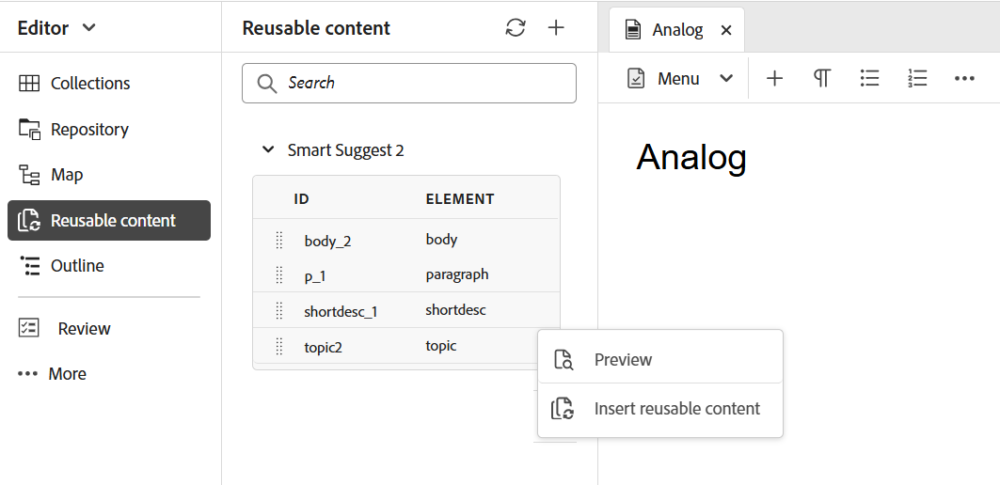

# Linkes Bedienfeld im Editor

Das linke Bedienfeld bietet schnellen Zugriff auf Sammlungen, Repository-Ansichten, Zuordnungsansichten und mehr Funktionen. Sie können das Bedienfeld erweitern, indem Sie **Symbol &quot;**&quot; in der linken unteren Ecke der Benutzeroberfläche auswählen. Verwenden Sie nach dem Erweitern das Symbol zum **Reduzieren** , um das Feld auszublenden. In der erweiterten Ansicht werden die Namen der Symbole angezeigt, die als QuickInfos im eingeklappten Ansicht angezeigt werden.

>[!NOTE]
>
> Die Größe des linken Bedienfelds kann geändert werden. Um die Größe des Bedienfelds zu ändern, bringen Sie den Cursor auf die Bedienfeldbegrenzung, der Cursor ändert sich in einen Pfeil mit Dublette Kopf, wählen Sie es aus und ziehen Sie, um die Größe der Bedienfeldbreite zu ändern.

Das linke Bedienfeld bietet Zugriff auf die folgenden Funktionen:

- [Sammlungen](#collections)
- [Repository](#repository)
- [Map](#map)
- [Wiederverwendbare Inhalte](#reusable-content)
- [Umreißen](#outline)

Einige der Funktionen im linken Bereich sind im **Abschnitt &quot;Mehr** &quot; verfügbar. Wählen Sie das Mehr-Symbol,  um auf die folgenden Funktionen zuzugreifen:

- [Glossar](#glossary)
- [Bedingungen](#conditions)
- [Betreff Schema](#subject-scheme)
- [Snippets](#snippets)
- [Vorlagen](#templates)
- [Zitate](#citations)
- [Sprachvariablen](#language-variables)
- [Variablen](#variables)
- [Suchen und Ersetzen](#find-and-replace)
- [PDF-Vorlagen](#pdf-templates)
- [Überprüfung](#review)


Eine zusätzliche Option mit der Bezeichnung **Workfront** wird auch im linken Bereich angezeigt, wenn Adobe Workfront konfiguriert ist.

Weitere Informationen finden Sie unter [Workfront-Integration](./workfront-integration.md).

>[!NOTE]
>
> Die im linken Bedienfeld verfügbaren Funktionen werden von Ihrem Administrator verwaltet, sodass er die einzelnen im linken Bedienfeld vorhandenen Funktionen aktivieren oder deaktivieren kann. Im linken Bereich werden nur aktivierte Funktionen angezeigt. Weitere Informationen finden Sie im Abschnitt **Bedienfelder** der [Registerkartenleiste](./web-editor-tab-bar.md).

Die Funktionen des linken Bedienfelds werden im Detail wie folgt erläutert:

## Sammlungen

Wenn Sie an einer Reihe von Dateien oder Ordnern arbeiten, können Sie diese zu Ihrem bevorzugten Liste hinzufügen, um schnell darauf zugreifen zu können. **** Kollektionen die Liste von Dokumente, die Sie hinzugefügt haben, sowie andere öffentlich zugängliche Liste von Dokumente der anderen Benutzer anzeigen.

Standardmäßig können Sie die Dateien nach Titeln Ansicht. Wenn Sie den Mauszeiger über eine Datei bewegen, können Sie den Dateititel und die Pfad Datei als QuickInfo Ansicht.

>[!NOTE]
>
> Als Administrator können Sie die Liste von Dateien auch nach Dateinamen im Editor Ansicht. Wählen Sie in den Benutzereinstellungen **die** Option Dateiname **des Abschnitts zur Anzeige der Editor-Dateien** aus **.**

<details>
    <summary> Erstellen einer neuen Sammlung </summary>


Um eine neue Sammlung zu erstellen, klicken Sie auf das Symbol &quot;+&quot; neben dem Bedienfeld „Sammlungen“, um das Dialogfeld **Neue Sammlung** aufzurufen:

{width="300" align="left"}

Geben Sie einen Titel und eine Beschreibung für die Sammlung ein, die Sie erstellen möchten. Wenn Sie &quot;Öffentlich&quot; auswählen **, wird dieser Favorit** auch anderen Benutzern angezeigt.

>[!NOTE]
>
> Sie können eine Sammlung auch über die Seite &quot;Experience Manager Guides-Startseite&quot; erstellen. Öffnen Sie die Startseite, navigieren Sie im Abschnitt &quot;Übersicht&quot; zum **Kollektionen** Widget [und wählen Sie Neu Sammlung **aus**.](./intro-home-page.md#overview)

</details>

<details>
    <summary> Datei in Sammlungen hinzufügen </summary>


Verwenden Sie eine der folgenden Methoden, um eine Datei zu Sammlungen hinzuzufügen:

- Navigieren Sie zur gewünschten Datei oder zum gewünschten Ordner in der Repository-Ansicht, wählen Sie das Symbol *Optionen* aus, um das Kontextmenü zu öffnen, und wählen Sie **Hinzufügen zu** > **Sammlungen**. Im Dialogfeld **Zu Sammlungen hinzufügen** können Sie die Datei/den Ordner zu einem vorhandenen Favoriten hinzufügen oder einen neuen erstellen.

  {width="300" align="left"}

- Klicken Sie im Editor mit der rechten Maustaste auf die Registerkarte einer Datei, um das Kontextmenü zu öffnen. Wählen Sie **Hinzufügen zu** > **Sammlungen**, um die Datei Ihrer Favoritenliste hinzuzufügen.

  {align="left"}


>[!NOTE]
>
> - Um ein Element aus der Favoritenliste zu entfernen, klicken Sie auf das Optionssymbol neben dem Element in einer Favoritensammlung und wählen Sie **Aus Sammlungen entfernen**.
> - Um die Datei in der Vorschau anzuzeigen, ohne sie zu öffnen, wählen Sie eine Datei aus und wählen **dann** Vorschau“ aus dem Menü „Optionen“.

</details>

**Optionen Menü für ein Sammlung**

Sie können viele Aktionen auch mithilfe des Optionen Menüs ausführen, das für eine Sammlung verfügbar ist:

{width="650" align="left"}

- **Umbenennen**: Umbenennen die ausgewählte Sammlung.
- **Löschen**: Löschen die ausgewählte Sammlung.
- **Aktualisieren**: Verschaffen Sie sich eine neue Liste der Dateien und Ordner aus dem Repository.
- **Ansicht in Assets UI**: Anzeigen den Datei- oder Ordnerinhalt im Assets UI.

>[!NOTE]
>
> Sie können die Liste auch mithilfe des Aktualisierungssymbols oben aktualisieren.


## Repository

Wenn Sie das Symbol &quot;Repository&quot; auswählen, erhalten Sie eine Liste der Dateien und Ordner, die in DAM verfügbar sind. Standardmäßig können Sie die Dateien nach Titeln Ansicht. Wenn Sie den Mauszeiger über eine Datei bewegen, können Sie den Dateititel und den Dateinamen als QuickInfo Ansicht.

>[!NOTE]
>
> Als Administrator können Sie die Liste von Dateien auch nach Dateinamen im Editor Ansicht. Wählen Sie in den Benutzereinstellungen **die** Option Dateiname **des Abschnitts zur Anzeige der Editor-Dateien** aus **.**

Es werden 75 Dateien gleichzeitig geladen. Jedes Mal, wenn Sie **Mehr laden**… auswählen, werden 75 Dateien geladen und die Schaltfläche wird nicht mehr angezeigt, wenn alle Dateien aufgelistet wurden. Dieses Laden im Batch ist effizient, und Sie können schneller auf die Dateien zugreifen als alle Dateien, die in einem Ordner vorhanden sind.

Sie können einfach zur gewünschten Datei in DAM navigieren und sie im Editor öffnen. Wenn Sie über die erforderlichen Zugriffsrechte zum Bearbeiten der Datei verfügen, können Sie dies tun.

Sie können auch eine Audio- oder Videodatei im Editor auswählen und wiedergeben. Sie können die Lautstärke oder
Die Ansicht des Videos. Im Kontextmenü haben Sie auch die Optionen zum Herunterladen, Ändern der Wiedergabe
Geschwindigkeit oder Bild im Bild anzeigen.

Wählen Sie eine Karte aus und drücken Sie die Eingabetaste oder klicken Sie Dublette, um sie im Ansicht **&quot;Karte**&quot; zu öffnen. Weitere Informationen Ansicht Sie in der Beschreibung des **Features &quot;Karte Ansicht** &quot; im linken Bereich. Wählen Sie ein Thema aus und drücken Sie die Eingabetaste oder klicken Sie mit Dublette Klick darauf, um es im [Inhaltsbearbeitungsbereich](./web-editor-content-editing-area.md) zu öffnen. Die Möglichkeit, direkt aus dem Editor heraus zu navigieren und eine Datei zu öffnen, spart Zeit und erhöht die Produktivität.

**Filtern der Suche im Repository**

Der Editor bietet erweiterte Filter für die Textsuche. Sie können in den Dateien im ausgewählten Pfad des Adobe Experience Manager-Repositorys nach einem Text suchen und filtern. Dabei werden Titel, Dateiname und Inhalt in den Dateien durchsucht.


{width="300" align="left"}

*Übernehmen Filter, die Dateien mit dem Text enthalten zu suchen.`personal spaceship.`*

Wählen Sie das **Symbol Filtern Search** \(\), um die Filtern Popup zu öffnen.

>[!NOTE]
>
> Wenn Sie Text suchen oder Dateien filtern, erscheint ein blauer Punkt auf dem **Filtern Search**  Symbol \(\), um anzuzeigen, dass wir uns im suchen Bedienfeld befinden und dass einige Filter angewendet wurden.


Sie haben die folgenden Optionen, um die Dateien zu filtern und Ihre suchen im Adobe Experience Manager Repository einzugrenzen:

- **DITA-Dateien**: Sie können nach allen **DITA-Themen** und **DITA-Maps** suchen, die in der ausgewählten Pfad vorhanden sind. Diese sind standardmäßig ausgewählt.
- **Nicht-DITA-Dateien**: Sie können in den ausgewählten Pfad für **Ditaval Dateien**, **Bild Dateien**, **Multimedia,** Dokumente **** und **JSON** suchen.

   {width="300" align="left"}

  *Verwenden Sie die Filter für die schnelle Suche, um nach DITA- und Nicht-DITA-Dateien zu suchen.*

**Erweitert Filtern**

Wählen Sie das Symbol **Erweiterte**, um das Dialogfeld **Erweiterter Filter** anzuzeigen.

Sie können die folgenden Optionen auf den Registerkarten **Allgemein** und **Erweitert** anzeigen.

 {width="650" align="left"}


**Allgemein**

- **Suchergebnisse mit**: Suchen Sie nach Text in den Dateien, die im ausgewählten Pfad des Adobe Experience Manager-Repositorys vorhanden sind. Der Text wird im Titel, im Dateinamen und im Inhalt der Dateien durchsucht.

Dies ist mit dem Suchfeld im Repository-Fenster synchronisiert. Wenn Sie beispielsweise `general purpose` in das Suchfeld im Repository-Bereich eingeben, wird es auch im Dialogfeld **Erweiterter Filter** angezeigt und umgekehrt.

- **Suchen in**: Wählen Sie den Pfad aus, unter dem Sie die Dateien im Adobe Experience Manager-Repository suchen möchten.

**Erweitert**

- **DITA-Elemente**: Sie können auch in den Attributen der angegebenen DITA-Elemente nach bestimmten Werten suchen.
   - Wählen Sie **Element hinzufügen** aus, um die Elemente, Attribute und Werte hinzuzufügen.
   - Übernehmen die Filter, die Sie ausgewählt haben.

- Wählen Sie **Klar Alle** aus, um alle angewendeten Filter zu löschen.


- Wählen Sie das **Symbol zum Schließen des Schließen-Filters**  aus, um den Filter zu schließen und zur Struktur-Ansicht der Repository zurückzukehren.

  >[!NOTE]
  >
  >Ihr Systemadministrator kann darüber hinaus den Text Filter konfigurieren und andere Filter anzeigen oder verstecken. Weitere Informationen finden Sie im Abschnitt Ansicht *Filter* Textkonfiguration im Installieren und Konfigurieren von Adobe Experience Manager Guides als Cloud Service.
  >
  >Die Liste der gefilterten Dateien, die den gesuchten Text enthalten, wird angezeigt. Beispielsweise werden die Dateien, die den Text `personal spaceship` enthalten, in der vorherigen Screenshot aufgelistet. Sie können mehrere Dateien aus der gefilterten Liste auswählen, um sie per Drag-and-Drop auf eine Karte zu ziehen, die zur Bearbeitung geöffnet ist.

**Menü „Optionen**

Neben dem Öffnen von Dateien über den linken Bereich können Sie auch viele Aktionen über das Menü Optionen in der Repository-Ansicht ausführen. Je nachdem, ob Sie einen Ordner, eine Themendatei oder eine Mediendatei auswählen, werden unterschiedliche Optionen angezeigt.

**Optionen für einen Ordner**

Sie können die folgenden Aktionen mithilfe des Menüs Optionen ausführen, das für einen *Ordner* in der Repository-Ansicht verfügbar ist:

{width="550" align="left"}


- **Neu**: Erstellen Sie ein neues DITA-Thema, eine neue DITA-Karte oder einen neuen Ordner.

<details>
    <summary> Schritte zum Erstellen eines neuen Themas </summary>

Schritte zum Erstellen eines neuen Themas:
1. Wählen Sie Neu **>****Thema aus**.
2. Das **Dialogfeld für Neu Thema** wird angezeigt.

   {width="300" align="left"}

3. Geben Sie im Dialogfeld für das **Neu** Thema die folgenden Details an:
   - Eine Titel zum Thema.
   - \(Optional\)* Der Dateiname für das Thema. Der Dateiname wird automatisch vorgeschlagen, basierend auf dem Thema Titel. Falls Ihr Administrator automatische Dateinamen basierend auf der UUID-Einstellung aktiviert hat, werden Sie das Feld Name nicht Ansicht.
   - Eine Vorlage, auf der das Thema basiert. Für ein vorkonfiguriertes Setup können Sie z. B. aus den Vorlagen &quot;Leer&quot;, &quot;Konzept&quot;, &quot;DITAVAL&quot;, &quot;Verweis&quot;, &quot;Aufgabe&quot;, &quot;Thema&quot;, &quot;Markdown&quot;, &quot;Glossar&quot; und &quot;Problembehandlung&quot; wählen. Wenn für Ihren Ordner ein Ordner Profil konfiguriert ist, Ansicht Sie nur die Themenvorlagen, die auf der Ordner Profil konfiguriert sind.

   - Pfad, wo Sie die Themendatei speichern möchten. Standardmäßig wird der Pfad des aktuell ausgewählten Ordners im Repository im Feld Pfad angezeigt.
4. Wählen Sie **Erstellen**. Das Thema wird an der angegebenen Pfad erstellt. Außerdem wird das Thema zur Bearbeitung im Editor geöffnet.

</details>

<details>
<summary> Schritte zum Erstellen einer neuen DITA-Map </summary>


Schritte zum Erstellen einer neuen DITA-Map:

1. Wählen Sie **Neu** > **DITA-Karte**.
2. Das **Neue Zuordnung** wird angezeigt.

   {width="300" align="left"}

3. Geben **im Dialogfeld** Neue Zuordnung“ die folgenden Details an:
   - Ein Titel für die Karte.
   - *\(Optional\)* Der Dateiname für die Zuordnung. Der Dateiname wird basierend auf dem Kartentitel automatisch vorgeschlagen. Wenn Ihr Administrator automatische Dateinamen basierend auf der UUID-Einstellung aktiviert hat, wird das Feld Name nicht angezeigt.
   - Ein Vorlage, auf dem die Karte basiert. Für ein vorkonfiguriertes Setup können Sie beispielsweise aus den Map- oder DITA-Map-Vorlagen wählen.
   - Pfad, wo Sie die Zuordnungsdatei speichern möchten. Standardmäßig wird der Pfad des aktuell ausgewählten Ordners im Repository im Feld Pfad angezeigt.
4. Wählen Sie **Erstellen**. Die Zuordnung wird innerhalb des im Feld Pfad angegebenen Ordners erstellt und hinzugefügt. Außerdem wird die Karte in der Kartenansicht geöffnet. Sie können die Zuordnungsdatei im Zuordnungs-Editor öffnen und ihr ein Thema hinzufügen. Weitere Informationen zum Hinzufügen von Zweigen zu einer Zuordnungsdatei Ansicht [Sie Erstellen einer Zuordnung](map-editor-create-map.md#). Wählen Sie **alternativ &quot;In Map-Konsole** öffnen&quot; aus, um die Map in der Map-Konsole zu öffnen.
</details>

<details>
<summary> Schritte zum Erstellen eines neuen Ordners </summary>

Schritte zum Erstellen eines neuen Ordners:

1. Wählen Sie **Neu** > **Ordner**.
2. Das **Dialogfeld Neu** Ordner wird angezeigt.

   {width="300" align="left"}

3. Geben Sie im **Neu Ordner-Dialogfeld** die folgenden Details an:
   - Eine Titel für den Ordner, die automatisch in den Ordnernamen umgewandelt wird.
   - Pfad, wo der Ordner gespeichert werden soll. Standardmäßig wird der Pfad des aktuell ausgewählten Ordners im Repository im Feld Pfad angezeigt.
4. Wählen Sie **Erstellen**. Der Ordner wird in dem Ordner erstellt und hinzugefügt, von dem aus die Option &quot;Ordner erstellen&quot; ausgeführt wurde.

</details>

- **Assets** hochladen: Laden Sie eine Datei von Ihrem lokalen System in den ausgewählten Ordner in Adobe Experience Manager Repository hoch. Sie können auch Dateien aus Ihrem lokalen System per Drag-and-Drop auf das aktuelle Arbeitsthema ziehen. Dies ist sehr nützlich, wenn Sie Bilder aus Ihrem lokalen System in Ihr Thema einfügen möchten.

  {width="300" align="left"}

  Sie können einen Ordner auswählen, in den Sie die Datei hochladen möchten, und es wird auch eine Vorschau des Bildes angezeigt. Wenn Sie die Datei umbenennen möchten, können Sie dies im Textfeld Dateiname tun. Wählen Sie **Hochladen** aus, um den Datei-Upload abzuschließen. Wenn Sie eine Bilddatei per Drag-and-Drop auf ein Thema gezogen haben, wird die Bilddatei zum Artikel hinzugefügt und auch hochgeladen.

  Wenn Ihr Admin die Option UUIDs in *XMLEditorConfig* aktiviert hat, wird die UUID des hochgeladenen Bildes in der Eigenschaft **Source** angezeigt.

  {align="left"}

- **Dateien in Ordner suchen**: Versetzt den Fokus auf die Repository-Suche, in der Sie den Suchbegriff eingeben können. Die Suche wird unter dem ausgewählten Ordner im Repository durchgeführt. Sie können auch einen Filter anwenden, um DITA-Dateien, Bilddateien oder beides zurückzugeben.

  {width="300" align="left"}

  Sie können auch mit der UUID einer Datei suchen. In diesem Fall wird in den suchen Ergebnissen der Titel der DITA/XML-Datei angezeigt, und wenn es sich bei der Datei um eine Grafikdatei handelt, wird die UUID der Datei angezeigt. Im folgenden suchen Beispiel wird die UUID eines Grafikdatei durchsucht, und die suchen Ergebnisse zeigen die UUID des ursprünglichen Grafikdatei und den Thementitel der Datei an, auf die dieses Bild verwiesen wird.

  {width="300" align="left"}

- **Reduzieren**: Reduziert den ausgewählten Ordner im Repository.

  >[!NOTE]
  >
  > Verwenden Sie das **Symbol \>** neben einem Ordner, um ihn zu erweitern.

- **Zu Sammlungen** hinzufügen: Fügt den ausgewählten Ordner zu den Favoriten hinzu. Sie können sie wahlweise einer vorhandenen oder neuen Sammlung hinzufügen.

- **Aktualisieren**: Verschaffen Sie sich eine neue Liste von Dateien und Ordnern aus dem Repository.
- **Ansicht in Assets UI**: Anzeigen den Ordnerinhalt im Assets UI.

**Optionen für eine Datei**

Erhalten Sie Zugriff auf verschiedene Optionen im Menü Optionen, je nachdem, ob Sie eine Medien Datei oder eine DITA-Datei auswählen. Einige gängige Optionen, die sowohl für Medien- als auch für DITA-Dateien verfügbar sind, sind:

- Bearbeiten
- In FrameMaker öffnen
- Duplizieren
- Sperren/Entsperren
- Vorschau
- Verschieben nach
- Umbenennen
- Löschen
- Generieren
- Als PDF herunterladen
- Hinzufügen zu
- Kopieren
- Ansicht in Assets UI
- Eigenschaften


{width="550" align="left"}

Im Folgenden werden die verschiedenen Optionen im Menü &quot;Optionen&quot; erläutert:

- **Bearbeiten**: Öffnen Sie die Datei zum Bearbeiten. Im Falle einer .ditamap/.bookmap-Datei wird diese im [Map-Editor](map-editor-advanced-map-editor.md#) zur Bearbeitung geöffnet.

- **Duplizieren**: Verwenden Sie diese Option, um eine Duplikat oder eine Kopie der ausgewählten Datei zu erstellen. Sie haben auch die Möglichkeit, die Duplikat Datei in der Eingabeaufforderung für Duplizieren Asset umzubenennen. Standardmäßig wird die Datei mit dem Suffix \(liken Dateiname\_1.extension\) erstellt. Der Titel der Datei bleibt mit dem der Quelldatei identisch und die neue Datei beginnt mit Version 1.0. Alle Verweise, Tags und Metadaten werden kopiert, während die Grundlinien nicht in die Duplikat Datei kopiert werden.
- **Sperren: Sperren Sie die ausgewählte Datei zum Bearbeiten**. Wenn die Datei gesperrt ist, wird beim Bewegen des Mauszeigers über das Sperrsymbol Gesperrt angezeigt **, wenn Sie** sie gesperrt haben, oder **Gesperrt nach [Benutzername]** , wenn sie von einem anderen User gesperrt wurde.

- **Vorschau**: Erhalten Sie eine schnelle Vorschau der Datei (.dita, .xml, Audio, Video oder Bild), ohne sie zu öffnen. Sie können die Größe des Vorschaubereichs ändern. Wenn der Inhalt `<xref>` oder `<conref>` enthält, können Sie diese auswählen, um sie in einer neuen Registerkarte zu öffnen. Der Titel der Datei wird im Fenster angezeigt. Wenn kein Titel vorhanden ist, wird der Dateiname angezeigt. Um das Bedienfeld **Vorschau** zu schließen, können Sie entweder das Symbol zum Schließen auswählen oder eine beliebige Stelle außerhalb des Bereichs auswählen.

  {align="left"}

- **Umbenennen**: Verwenden Sie diese Option, um die ausgewählte Datei umzubenennen. Geben Sie den Namen der neuen Datei im Dialogfeld **Asset umbenennen** ein.
   - Sie können eine Datei beliebigen Typs umbenennen.
   - Die Erweiterung einer Datei kann nicht geändert werden.
   - Zwei Dateien können nicht denselben Namen haben. Sie können also eine Datei nicht in einen Namen umbenennen, der bereits vorhanden ist. Ein Fehler wird angezeigt.

- **Verschieben nach**: Verwenden Sie diese Option, um die ausgewählte Datei in einen anderen Ordner zu verschieben.
   - Sie können entweder den Namen des Zielordners eingeben oder **Pfad auswählen** um den Zielordner auszuwählen.
   - Sie können Dateien beliebigen Typs an ein beliebiges Ziel innerhalb des Ordners &quot;Content&quot; verschieben.
   - Zwei Dateien können nicht denselben Namen haben. Sie können also eine Datei nicht in einen Ordner verschieben, in dem bereits eine Datei mit demselben Namen vorhanden ist.

  Wenn Sie versuchen, eine Datei in einen Ordner zu verschieben, in dem eine Datei mit demselben Namen, aber einem anderen Titel vorhanden ist, wird das Dialogfeld Umbenennen und Verschieben der Datei angezeigt, und Sie müssen die Datei umbenennen, bevor Sie sie verschieben können. Die verschobene Datei im Zielordner hat den neuen Dateinamen.

  {width="550" align="left"}

  >[!NOTE]
  >
  > Sie können eine Datei auch per Drag &amp; Drop in einen anderen Zielordner ziehen.

  **Ausschlussszenarien**

  Experience Manager Guides ist es in den folgenden Szenarien nicht möglich, eine Datei umzubenennen oder zu verschieben:

   - Sie können eine Datei, die Teil eines Reviews oder einer Übersetzung arbeitsablauf ist, nicht verschieben oder umbenennen.

   - Wenn eine andere User die Datei sperrt, können Sie sie nicht umbenennen oder verschieben, Sie werden die Option Umbenennen oder Verschieben für die Datei nicht Ansicht.

  >[!NOTE]
  >
  > Wenn Ihr Administrator Ihnen die Berechtigungen für einen Ordner erteilt hat, werden nur dann die **Optionen Umbenennen oder** Verschieben **angezeigt**.

  <details>
    <summary> Cloud Services </summary>

  Durch das Umbenennen oder Verschieben einer Datei werden keine vorhandenen Verweise von oder zu der Datei entfernt, da jede Datei eine eindeutige UUID hat.
  </details>

- **Löschen**: Verwenden Sie diese Option, um die ausgewählte Datei zu löschen. Vor dem Löschen der Datei wird eine Bestätigungsaufforderung angezeigt.

   - Vor dem Löschen der Datei wird eine Bestätigungsaufforderung angezeigt.
   - Wenn nicht von einer anderen Datei auf die Datei verwiesen wird, wird sie gelöscht und eine Erfolgsmeldung wird angezeigt.
   - Wenn die Datei gesperrt ist, können Sie sie nicht löschen und es wird eine Fehlermeldung angezeigt.

     >[!NOTE]
     >
     > Wenn Ihr Administrator das Löschen gesperrter Dateien verhindert hat, wird die Fehlermeldung angezeigt. Weitere Informationen finden Sie Ansicht *Abschnitt Löschen ausgecheckter Dateien* verhindern in der Installieren und konfigurieren Sie Adobe Experience Manager Guides als Cloud Service.

   - Wenn die Datei einer Sammlung hinzugefügt wird, wird das Dialogfeld &quot;Force Löschen **&quot; angezeigt, in dem** Sie das Löschen erzwingen können.
   - Wenn auf die Datei von einer anderen Datei **verwiesen wird, wird ein Dialogfeld mit der Bestätigungsmeldung Löschen** erzwingen angezeigt, in dem Sie das Löschen der Datei erzwingen können:

     {width="300" align="left"}

     >[!NOTE]
     >
     > Wenn Ihr Administrator die Datei gelöscht Berechtigung hat, **ist &quot;Löschen** erzwingen&quot; aktiviert. Andernfalls wird Force Löschen **deaktiviert, und es wird eine Meldung angezeigt,** dass Sie keine Berechtigung zum Löschen referenzierter Dateien haben. Weitere Informationen finden Sie Ansicht *Abschnitt Löschen referenzierter Dateien* verhindern in der Installieren und konfigurieren Sie Adobe Experience Manager Guides als Cloud Service.

   - Wenn Sie ein referenziertes Thema löschen und die Datei geöffnet haben, die Referenzen zur Bearbeitung enthält, wird der fehlerhafte verknüpfen für die referenzierte Datei angezeigt.

  >[!NOTE]
  >
  > Sie können die ausgewählte Datei auch auf ähnliche Weise mit der Löschen-Taste der Tastatur löschen.

- **Kopie**: Sie können aus den folgenden Optionen wählen:

   - **Kopie UUID**: Kopie die UUID der ausgewählten Datei zu Zwischenablage.

   - **Kopie Pfad**: Kopie den vollständiger Pfad der ausgewählten Datei zu Zwischenablage.

- **hinzufügen zu**: Sie können aus den folgenden Optionen auswählen:
   - **Kollektionen**: Fügt die ausgewählte Datei Kollektionen hinzu. Sie können sie zu einer vorhandenen oder neuen Sammlung hinzufügen.

   - **Wiederverwendbarer Inhalt**: Fügt die ausgewählte Datei der Liste Wiederverwendbarer Inhalt im linken Bereich hinzu.

- **Eigenschaften**: Hiermit können Sie die Eigenschaftsseite der ausgewählten Datei öffnen. Sie können auf diese Eigenschaftenseite auch über die Assets-Benutzeroberfläche zugreifen, indem Sie eine Datei auswählen und dann in der Symbolleiste das Symbol Eigenschaften auswählen.

- **Im Zuordnungs-Dashboard öffnen**: Wenn die ausgewählte Datei eine DITA-Zuordnung ist, wird durch diese Option das Zuordnungs-Dashboard geöffnet.

- **In Map-Konsole öffnen**: Falls die ausgewählte Datei eine DITA-Map ist, wird mit dieser Option die Map-Konsole geöffnet.

- **Bearbeiten in Oxygen**: Wählen Sie diese Option, um die ausgewählte Datei in der Plug-in für den Sauerstoffanschluss zu bearbeiten. Die Datei wird zur Bearbeitung geöffnet.

  >[!NOTE]
  >
  >Wenden Sie sich an Ihren Kundenerfolgs Team, um diese Funktion im Umgebung aktivieren zu lassen. Dies ist nicht Teil des standardmäßigen Supports. Weitere Informationen finden Sie Ansicht im [Abschnitt Option zum Bearbeiten in Oxygen](../cs-install-guide/conf-edit-in-oxygen.md) konfigurieren im Handbuch zur Installation und Konfiguration.


- **Ansicht in Assets UI**: Verwenden Sie diese Option, um einen Vorschau einer .dita/.xml-Datei im Assets UI anzuzeigen. Im Falle einer .ditamap/.bookmap-Datei werden alle Themendateien innerhalb der Map in einem einzigen einheitlichen Seite-für-Seitenansicht angezeigt.

- **Als PDF** herunterladen: Verwenden Sie die Option, um die PDF-Ausgabe zu generieren und zu herunterladen.

- **Generieren**: Verwenden Sie die Option, um eine Map oder Zweige innerhalb einer Map an eine Sites Seite, ein Inhaltsfragment oder eine Experience Fragment zu veröffentlichen.

## Map

Wenn Sie das Symbol &quot;Map Ansicht&quot; auswählen, wird der Map-Ansicht angezeigt, in dem eine Liste von Themen in der Map-Datei angezeigt wird. Wenn Sie keine Zuordnungsdatei geöffnet haben, wird der Zuordnungs Ansicht leer angezeigt. Ein Doppelklick auf eine Kartendatei öffnet die Kartendatei in diesem Ansicht. Sie können auf eine beliebige Datei innerhalb der Karte Dublette klicken, um sie im Editor zu öffnen.

Standardmäßig können Sie die Dateien nach Titeln Ansicht. Wenn Sie den Mauszeiger über eine Datei bewegen, können Sie den Dateititel und die Pfad Datei als QuickInfo Ansicht.

>[!NOTE]
>
>Als Administrator können Sie auch den Dateinamen der übergeordneten Map Ansicht, die derzeit in der Landkartenansicht geöffnet ist. Wählen Sie in den Benutzereinstellungen **die** Option Dateiname **des Abschnitts zur Anzeige der Editor-Dateien** aus **.**


Wenn Sie eine Karte in der Landkartenansicht öffnen, wird der Titel der aktuellen Karte in der Mitte der Tabulatortaste-Leiste angezeigt. Wenn der Titel zu lang ist, wird eine Ellipse angezeigt, und Sie können auch mit dem Mauszeiger über den Titel fahren, um den vollständigen Titel im Tool Tipp zu Ansicht.

Wenn Sie Schlüsselattribute für die Themen- oder Map-Verweise definieren, können Sie den Titel, das entsprechende Symbol und den Schlüssel im linken Bereich Ansicht. Die Taste wird als `keys=<key-name>` angezeigt.

{width="300" align="left"}

Wenn Sie Bearbeitungsrechte für die Zuordnungsdateien haben, können Sie auch die Dateien bearbeiten. Weitere Informationen zum Öffnen und Bearbeiten eines Themas über DITA Map finden Sie unter [Themen über DITA Map bearbeiten](map-editor-advanced-map-editor.md#id17ACJ0F0FHS).

Die folgenden Optionen sind für eine Zuordnungsdatei in der Zuordnungsansicht verfügbar:

- **In Map-Konsole** öffnen: Öffnet die Map-Datei in der Map-Konsole.
- **Bearbeiten**: Öffnet die Zuordnungsdatei zur Bearbeitung.
- **Optionen**: Öffnet das Kontextmenü für die ausgewählte Kartendatei.

Mit dem Menü Optionen der Zuordnungsdatei können Sie die folgenden Aktionen ausführen:

{align="left"}

- **Bearbeiten**: Öffnen Sie die Zuordnungsdatei zur Bearbeitung im Zuordnungs-Editor.

- **Alle auswählen** Wählen Sie alle Dateien in der Zuordnung aus.

- **Auswahl aufheben**: Heben Sie die Auswahl der ausgewählten Dateien in der Zuordnung auf.

- **Sperren**: Sperren Sie die ausgewählten Dateien in der Karte.

- **Entsperren**: Entsperrt die Kartendatei und stellt sie zur Bearbeitung zur Verfügung. Die Änderungen auf eine frühere Version werden nicht zurückgesetzt.

- **Als neue Version Speichern und entsperren**: Erstellen eine neuere Version und heben Sie die Sperre für die ausgewählten Dateien in der Karte auf.

- **Vorschau**: Öffnen Sie eine Vorschau der Map-Datei. In diesem Ansicht werden alle Themendateien innerhalb der Map in einem einzigen, einheitlichen Seite für Seitenansicht angezeigt.

- **Kopie**: Sie können aus den folgenden Optionen wählen:
   - **Kopie UUID**: Kopie die UUID der Map-Datei an Zwischenablage.
   - **Kopie Pfad**: Kopie vollständiger Pfad der Zuordnungsdatei zu Zwischenablage.

- **In Repository** suchen: Zeigt den Speicherort der Zuordnungsdatei im Repository \(oder DAM\) an.

- **hinzufügen zu**: Sie können aus den folgenden Optionen auswählen:
   - **Kollektionen**: Fügt die Zuordnungsdatei zu Sammlungen hinzu. Sie können sie wahlweise einer vorhandenen oder neuen Sammlung hinzufügen.

   - **Wiederverwendbare Inhalte**: Fügt die Zuordnungsdatei der Liste &quot;Wiederverwendbare Inhalte&quot; im linken Bereich hinzu.

- **Eigenschaften**: Verwenden Sie diese Option, um die Eigenschaften Seite der Zuordnungsdatei zu öffnen. Auf diese Eigenschaften kann Seite auch über die Assets UI zugegriffen werden, indem Sie eine Datei auswählen und auf das Symbol &quot;Eigenschaften&quot; in der Symbolleiste klicken.

- **Karte Dashboard** öffnen: Öffnet die Karte Dashboard.

- **Ansicht in Assets UI**: Verwenden Sie diese Option, um einen Vorschau der Zuordnungsdatei im Assets UI anzuzeigen. In diesem Ansicht werden alle Themendateien innerhalb der Map in einem einzigen, einheitlichen Seite für Seitenansicht angezeigt.
- **Karte** herunterladen: Wählen Sie diese Option, um das **Dialogfeld Karte** herunterladen zu öffnen.

  **Im Dialogfeld &quot;Karte** herunterladen&quot; können Sie die folgenden Optionen auswählen:

  **Grundlinie** verwenden: Wählen Sie diese Option aus, um eine Liste der für die DITA-Map erstellten Baselines abzurufen. Wenn Sie die Zuordnungsdatei und ihren Inhalt basierend auf einer bestimmten Grundlinie herunterladen möchten, wählen Sie die Grundlinie aus der Dropdown-Liste aus. Weitere Informationen zum Arbeiten mit Basisplänen finden Sie unter Ansicht [Arbeiten mit Grundlinie](./generate-output-use-baseline-for-publishing.md).

  **Datei Hierarchie** reduzieren: Wählen Sie diese Option aus, um alle referenzierten Themen und Medien Dateien in einem einzigen Ordner zu speichern.

  Sie können die Zuordnungsdatei auch herunterladen, ohne eine Option auszuwählen. In diesem Fall werden die letzten persistenten Versionen der referenzierten Themen und Medien Dateien heruntergeladen.

  Nachdem Sie die **Button herunterladen** ausgewählt haben, wird das Anfrage Map-Exportpaket in die Warteschlange gestellt. Das **Dialogfeld Erfolg** wird angezeigt, wenn das Paket erfolgreich erstellt wurde.  Sie können die **Button herunterladen** im **Dialogfeld Erfolg** auswählen.

  Sie erhalten die Karte herunterladen bereit Benachrichtigung, wenn die Karte bereit zum herunterladen ist. Wenn die herunterladen fehlschlägt, erhalten Sie die Benachrichtigung, dass die Zuordnung fehlgeschlagen herunterladen.

  Sie können über den Adobe Experience Manager Benachrichtigung Posteingang auf die herunterladen verknüpfen zugreifen. Wählen Sie die generierte Karte Benachrichtigung im Posteingang aus, um die Karte in .zip Format zu herunterladen.

  >[!NOTE]
  >
  >  Standardmäßig bleiben die heruntergeladenen Zuordnungen fünf Tage lang im Adobe Experience Manager-Benachrichtigungs-Posteingang.

- **Zuordnungskontext schließen**: Schließt die Zuordnungsdatei.

Der folgende Screenshot zeigt das Optionsmenü für eine Datei in der Kartenansicht:

{align="left"}

Mit dem Menü Optionen können Sie die folgenden Aktionen ausführen:

- **Bearbeiten**: Öffnen Sie die Datei zur Bearbeitung. Im Falle einer .ditamap/.bookmap-Datei wird diese zur Bearbeitung im [Map Editor](map-editor-advanced-map-editor.md#) geöffnet.

- **Sperren**: Sperrt die ausgewählte Datei. Bei gesperrten Dateien ändert sich diese Option in **Entsperren**.


  >[!NOTE]
  >
  > - Wenn eine Datei von einem User gesperrt ist, wird beim Bewegen des Mauszeigers über das Schlosssymbol der User \(Name\) angezeigt, der die Datei gesperrt hat.
  > - Wenn Sie eine Datei einchecken, werden Sie aufgefordert, die Änderungen zu speichern. Wenn Sie Ihre Änderungen nicht speichern, wird nur die Datei eingecheckt.

- **Vorschau**: Verschaffen Sie sich einen schnellen Vorschau der Datei (.dita, .xml, Sound, Video oder Bild), ohne sie zu öffnen. Sie können die Größe des Vorschau Bereichs ändern. Wenn die Inhalte ein oder `<conref>`enthält`<xref>`, können Sie es auswählen, um es in einer neuen Tab zu öffnen.  Der Titel der Datei wird im Fenster angezeigt. Wenn kein Titel vorhanden ist, wird der Dateiname angezeigt. Um den **Bereich &quot;Vorschau** &quot; zu schließen, können Sie entweder auf das Symbol &quot;Schließen&quot; oder auf eine beliebige Stelle außerhalb des Bereichs klicken.
- **Kopie**: Sie können aus den folgenden Optionen wählen:
   - **Kopie UUID**: Kopie die UUID der ausgewählten Datei zu Zwischenablage.
   - **Kopie Pfad**: Kopie vollständiger Pfad der ausgewählten Datei zu Zwischenablage.


- **In Repository** suchen: Zeigt den Speicherort der ausgewählten Datei im Repository \(oder DAM\) an.
- **Erweitern alle**: Erweitern alle Zweige in den Map-Dateien.

- **Alle** reduzieren: Blendet alle Zweige aus, die Teil der aktuellen Zuordnungsdatei sind.

- **hinzufügen zu**: Sie können aus den folgenden Optionen auswählen:
   - **Kollektionen**: Fügt die ausgewählte Datei zu Sammlungen hinzu. Sie können sie wahlweise einer vorhandenen oder neuen Sammlung hinzufügen.

   - **Wiederverwendbare Inhalte**: Fügt die ausgewählte Datei der Liste &quot;Wiederverwendbare Inhalte&quot; im linken Bedienfeld hinzu.

- **Eigenschaften**: Verwenden Sie diese Option, um die Seite der Eigenschaften der ausgewählten Datei zu öffnen. Auf diese Eigenschaften kann Seite auch über die Assets UI zugegriffen werden, indem Sie eine Datei auswählen und auf das Symbol &quot;Eigenschaften&quot; in der Symbolleiste klicken.

- **Ansicht in Assets UI**: Verwenden Sie diese Option, um einen Vorschau einer .dita/.xml-Datei im Assets UI anzuzeigen. Im Falle einer .ditamap/.bookmap-Datei werden alle Themendateien innerhalb der Map in einem einzigen einheitlichen Seite-für-Seitenansicht angezeigt.

- **Generieren**: Generiert die Ausgabe für die ausgewählte Datei bei Sites Seite, Inhaltsfragment oder Experience Fragment.

>[!NOTE]
>
> Sie können die Eigenschaften ausgewählter Themen in einer DITA-Map auch über das **Menü Mehr Optionen** unter Referenzen öffnen und bearbeiten.

## Wiederverwendbare Inhalte

Eines der Hauptmerkmale von DITA ist die Möglichkeit, Inhalte wiederzuverwenden. Das Bedienfeld **Wiederverwendbarer Inhalt** kann Ihre DITA-Dateien speichern, aus denen Sie in der Regel wiederverwendbare Inhalte einfügen. Nach dem Hinzufügen bleiben die DITA-Dateien sitzungsübergreifend im Bedienfeld „Wiederverwendbarer Inhalt“. Das bedeutet, dass Sie Ihre DITA-Dateien nicht erneut hinzufügen müssen, um später darauf zuzugreifen.

Sie können wiederverwendbare Inhalte einfach per Drag-and-Drop aus dem Bedienfeld auf Ihr aktuelles Thema ziehen und es wird einfach und schnell eingefügt. Sie können auch eine Vorschau des Inhalts erhalten, bevor Sie ihn in Ihr Dokument einfügen.

Standardmäßig können Sie die Dateien nach Titeln Ansicht. Wenn Sie den Mauszeiger über eine Datei bewegen, können Sie den Dateititel und die Pfad Datei als QuickInfo Ansicht.

>[!NOTE]
>
> Als Administrator können Sie die Liste von Dateien auch nach Dateinamen im Editor Ansicht. Wählen Sie in den Benutzereinstellungen **die** Option Dateiname **des Abschnitts zur Anzeige der Editor-Dateien** aus **.**

Verwenden Sie eine der folgenden Methoden, um eine DITA-Datei zu Ihrem Bedienfeld für wiederverwendbare Inhalte hinzuzufügen:

- Klicken Sie auf das **+-** Symbol neben Wiederverwendbare Inhalte, um das Dialogfeld zum Durchsuchen der Datei zu öffnen. Wählen Sie die Datei aus, die Sie hinzufügen möchten, und wählen Sie **dann hinzufügen** , um den Vorgang abzuschließen.

- Wählen Sie im Ansicht Repository das **Optionen-Symbol** der gewünschten Datei aus und wählen Sie **im Kontextmenü hinzufügen >** **Wiederverwendbare Inhalte** aus.

- Klicken Sie mit der rechten Maustaste auf die Tab einer Datei in der Bearbeiter, um das Kontextmenü zu öffnen, und wählen Sie **hinzufügen aus, um wiederverwendbare Inhalte** zu **>**.


Nachdem die Datei hinzugefügt wurde, können Sie alle wiederverwendbaren Inhalte-Elemente aus der Datei im Bedienfeld &quot;Wiederverwendbare Inhalte&quot; Ansicht. Wiederverwendbare Inhalte werden mit ihren IDs und Elementnamen angezeigt.

Wenn Sie dem Liste &quot;Wiederverwendbare Inhalte&quot; eine Datei hinzufügen, wird der Titel der Datei anstelle der UUID der Datei angezeigt. Um die UUID der Datei zu überprüfen, fahren Sie mit der Maus über den Titel der Datei und die UUID der Datei wird im Tooltip angezeigt.

{width="400" align="left"}

>[!NOTE]
>
> Sie können dem wiederverwendbaren Inhalte Liste mehrere Dateien hinzufügen. Anschließend können Sie die gewünschten Inhalte aus dem Bedienfeld &quot;Wiederverwendbare Inhalte&quot; in Ihre Dokument einfügen.

**Aktualisieren**: Sucht erneut nach allen wiederverwendbaren Inhalte und zeigt eine neue Liste wiederverwendbarer Inhalte an.

Verwenden Sie eine der folgenden Methoden, um Inhalte aus dem Bedienfeld &quot;Wiederverwendbare Inhalte&quot; einzufügen:

- Bewegen Sie den Mauszeiger über ein Element, das Sie einfügen möchten, wählen Sie das **Symbol Optionen** und wählen Sie Einfügen wiederverwendbare Inhalte **aus der Dropdown-Liste aus**.

  {width="400" align="left"}

  >[!NOTE]
  >
  > Wählen Sie eine Datei und dann **Vorschau** aus dem **Optionen** Menü, um die Datei zu Vorschau, ohne sie zu öffnen. Sie können die in einem Thema vorhandenen Verweise auch Vorschau. Die Referenz-ID wird im Fenster angezeigt.
  >
  > Die **Option Vorschau** ist auch im **Menü Optionen** eines Elements verfügbar, sodass Sie sich vor dem Einfügen einen schnellen Vorschau des Elements verschaffen können.

- Ziehen Sie das wiederverwendbare Inhalte Element per Drag-and-Drop aus dem Bedienfeld an die gewünschte Stelle in Ihrem Dokument.

## Umreißen

Wenn Sie das **Symbol &quot;Kontur** &quot; auswählen, erhalten Sie die hierarchische Ansicht der in der Dokument verwendeten Elemente.

{width="300" align="left"}

Die Kontur Ansicht bietet folgende Funktionen:

- Eine Baumstruktur Ansicht aller in der Dokument verwendeten Elemente.

- Wenn ein Element über eine ID, ein Attribut und Text verfügt, können Sie diese zusammen mit dem Element Ansicht.

- Greifen Sie auf Kontur Ansicht sowohl in der Autor- als auch in der Quelle Ansicht zu.

- Verwenden Sie das Dropdown-Menü Liste, um alle Elemente oder nur die unterbrochenen Verweise anzuzeigen:

- Durch Auswahl eines Elements in der Kontur Ansicht wird die Inhalte des Elements im Autor oder Quelle Ansicht ausgewählt. Die Kontur Ansicht bleibt in Synchronisation mit der Autor und Quelle Ansicht. Wenn Sie Änderungen an einer beliebigen Ansicht vornehmen, können Sie diese im Kontur Ansicht Ansicht. Wenn Sie beispielsweise im Autor Ansicht einen Absatz hinzufügen oder ein Element aktualisieren, wird dies im Kontur Ansicht angezeigt.

  {width="650" align="left"}

- Elemente per Drag-and-Drop verschieben. Sie können ein Element einfach ersetzen, indem Sie ein anderes Element darauf ablegen. Wenn Sie ein Element per Drag-and-Drop auf ein anderes Element ziehen und ein gestricheltes Rechteckfeld um das Element herum anzeigen, bedeutet dies, dass das Element ersetzt wird. Es ersetzt das Element, auf dem das Element abgelegt wird.

  {align="left"}

  Wenn Sie ein Element per Drag-and-Drop ziehen, zeigt ein gestricheltes Rechteck an, dass das Element an der aktuellen Position platziert werden kann. Wenn Drag-and-Drop ungültig ist, wird eine Fehlermeldung angezeigt, die darauf hinweist, dass der Vorgang nicht zulässig ist.

  {align="left"}

- Das Menü **Optionen** in der Ansicht *Gliederung* ermöglicht die Durchführung allgemeiner Vorgänge wie Ausschneiden, Kopieren, Löschen, ID generieren, Element vor oder nach dem aktuellen Element einfügen, ein Element umbenennen oder ersetzen, Element einschließen, Element entpacken und ein Ausschnitt aus dem ausgewählten Element erstellen.

>[!NOTE]
>
>Weitere Informationen zum Generieren von IDs, Einfügen Element vor oder nach dem aktuellen Element und zum Entpacken eines Elements finden Sie Ansicht [Andere Funktionen im Editor](web-editor-other-features.md#).

**Ansicht Konfigurieren**

Mit der **Option &quot;Ansicht Konfigurieren** &quot; können Sie Folgendes Ansicht:

- **ID anzeigen**: Zeigt die ID des Elements an.
- **Attribut anzeigen**: Zeigt das Attribut zusammen mit seinem Wert an.
- **Text anzeigen**: Zeigt den Text an. Wenn der Text länger als 20 Zeichen ist, wird ein Auslassungszeichen angezeigt.

Wenn ein Blockelement über einen eigenen Text verfügt, wird er zusammen mit diesem Blockelement angezeigt. Wenn er keinen eigenen Text hat, wird der Text des ersten untergeordneten Elements zusammen mit diesem Blockelement angezeigt.

{width="550" align="left"}

Wenn Ihr Administrator ein Profil für Attribute erstellt hat, erhalten Sie diese Attribute zusammen mit den konfigurierten Werten. Sie können auch von Ihrem Administrator konfigurierte Anzeigeattribute auf der Registerkarte **Anzeigeattribute** im Abschnitt **Einstellungen** zuweisen. Die für ein Element definierten Attribute werden im Layout- und Gliederungsansicht angezeigt.


Weitere Informationen finden Sie unter *Attribute anzeigen* in der Funktionsbeschreibung *Einstellungen* im linken Bereich.

**Suchfunktion**

Mithilfe der Suchfunktion können Sie nach einem Element anhand seines Namens, seiner ID, seines Textes oder seines Attributwerts suchen.

Bei der suchen wird zwischen Groß- und Kleinschreibung unterschieden. Er stimmt mit der Zeichenfolge genau überein. Die suchen Ergebnisse werden nach der Position des Elements im Dokument sortiert.

Sie können eine Zeichenfolge im Element suchen, wenn sie im **Kontur** Ansicht angezeigt wird. Wenn z. B. die Zeichenfolge &quot;Adobe Systems&quot; im Text des Elements vorhanden ist und im Bedienfeld Kontur Ansicht angezeigt wird (da Sie Anzeigen Text aus **der Dropdown-Liste Ansicht Optionen ausgewählt** haben), wird das enthaltende Element gefiltert. Wenn der Text jedoch nicht im Bedienfeld Kontur Ansicht angezeigt wird (da Sie Anzeigen Text **nicht aus dem Dropdown-Menü Ansicht Optionen ausgewählt** haben), wird das enthaltende Element nicht gefiltert. Entsprechend finden Sie die Zeichenfolge in der ID oder in Attributen, sofern Sie diese ausgewählt haben.

## Glossar

Experience Manager Guides ermöglicht es Ihnen, den Glossartyp Dokumente einfach zu erstellen und zu verwenden. Sie können Glossarthemendateien erstellen und diese dann in eine allgemeine Glossarzuordnung einfügen. Nachdem diese Zuordnung als Stammzuordnung hinzugefügt wurde, werden die Glossareinträge im Bedienfeld &quot;Glossar&quot; angezeigt.

{width="650" align="left"}

Um einen Begriff aus dem Glossar einzufügen, ziehen Sie den Eintrag einfach per Drag &amp; Drop aus dem Panel an die gewünschte Stelle in Ihrem Thema. Das Optionen Menü eines Glossarbegriffs ermöglicht es Ihnen, einen schnellen **Vorschau** des Eintragsbegriffs zu erhalten, **Kopie Pfad** der Eintragsbegriffsdatei zu finden oder die Eintragsbegriffsdatei in der Repository zu finden.

<details>
    <summary> Schritte zum suchen und Ersetzen von Text in Glossarabkürzungen </summary>

Führen Sie die folgenden Schritte aus, um nach Textausdrücken zu suchen und sie durch Glossarabkürzungen zu ersetzen:

1. Öffnen Sie das DITA-Thema oder die DITA-Karte, in dem bzw. der Sie den Text oder die Begriffe suchen und konvertieren möchten.
1. Wählen Sie das Glossar-Bedienfeld aus, um die in der Stammzuordnung vorhandenen Glossarbegriffe anzuzeigen. Sie können diese Begriffe per Drag-and-Drop in das geöffnete Thema einfügen.
1. Wählen Sie das **Hotspot**-Tool \( \) im Glossar-Bedienfeld, um bestimmte Textbegriffe zu suchen und in verknüpfte Glossar-Abkürzungen zu konvertieren. Umgekehrt können Sie damit auch nach Glossarkürzeln suchen und diese in Textbegriffe konvertieren.

</details>


Sie können die folgenden Einstellungen des Hotspot-Tool konfigurieren:

{width="300" align="left"}


- **Glossar Schlüssel**: Wählen Sie die Glossarschlüssel aus der DITA-Map aus, die Sie für die suchen im ausgewählten Thema verwenden möchten. Die ausgewählten Schlüssel werden unten angezeigt. Sie können einen ausgewählten Schlüssel entfernen, indem Sie auf das **Symbol &quot;Entfernen** &quot; klicken.

- **Themen**: Wählen Sie entweder das **aktuelle im Editor geöffnete Thema**, alle **geöffneten Themen** in der aktuellen Map oder die aktuelle Map **aus, die** im Map-Editor bearbeitet wird, um die Begriffe zu suchen.
- **Themen nach Status Filtern**: Sie können die suchen auf Themen mit dem ausgewählten Dokument Status beschränken. Die Themen können sich im Entwurf-, Bearbeiten-, In-prüfen-, Genehmigt-, Überprüft-, Fertig-Status oder in einem der von der Organisation konfigurierten Status befinden.
- **Aktion**: Sie können wählen, ob Sie die Glossarschlüssel **manuell für jedes Thema** oder **automatisch für alle Themen** suchen möchten. Wenn Sie für jedes Thema **Manuell auswählen**, werden Sie aufgefordert, dies zu bestätigen, bevor Sie jeden Begriff in jedem Thema konvertieren. Wenn Sie für alle Zweige **die Option Automatisch wählen**, werden alle Begriffe in allen Zweigen automatisch konvertiert.
- **Konvertieren**: Sie können einen gesuchten **Text entweder in einen Glossarbegriff** oder **Glossar Begriff in Text konvertieren.**
- **Optionen**: Sie können aus den folgenden Optionen auswählen:
   - **Übereinstimmung** mit Unterscheidung zwischen Groß- und Kleinschreibung: Sucht nach einem Begriff, um die Übereinstimmung mit derselben Groß-/Kleinschreibung zu finden. Zum Beispiel stimmt &quot;USB&quot; nicht mit &quot;usb&quot; überein.
   - **Nur die erste Instanz** konvertieren: Wenn mehrere Instanzen des gesuchten Begriffs in einem Thema vorhanden sind, wird nur die erste Instanz konvertiert.
   - **Datei vor Konversion** sperren: Die gesuchte Datei wird gesperrt, bevor die Begriffe konvertiert werden.
   - **Erstellen einer neuen Version nach Konversion**: Eine neue Version des Themas wird erstellt, nachdem die Konversion der Begriffe abgeschlossen ist.
- **** Weiter Button wird angezeigt, wenn Sie für jedes Thema **die Option &quot;Manuell&quot; auswählen**. Wählen Sie **Weiter** aus, um die Begriffe für jedes Thema anhand der ausgewählten Einstellungen zu konvertieren. Es fordert Sie zur Konversion von Begriffen in jedem Thema auf und wechselt zur nächsten Datei. Sie können wählen, ob Sie ein Semester konvertieren oder es überspringen und zum nächsten Begriff wechseln möchten.

  {width="300" align="left"}

- **Button** konvertieren wird angezeigt, wenn Sie die Option &quot;Automatisch für alle Themen&quot;**auswählen**. Wählen Sie **Konvertieren** aus, um alle in der Dokument gefundenen Begriffe in verknüpfte Glossarabkürzungen zu konvertieren.

Eine Liste der Themen, die mit den konvertierten Begriffen aktualisiert wurden, und **der Themen, die** mit Fehler **aktualisiert** wurden, wird angezeigt. Bewegen Sie den Mauszeiger über das Infosymbol neben Themen mit Fehler, um die Details des Fehlers zu Ansicht.

>[!NOTE]
>
> Aktualisieren das Thema, um die konvertierten Begriffe zu Ansicht.

## Bedingungen

Im Bereich &quot;Bedingungen&quot; werden die bedingten Attribute angezeigt, die von Ihrem Administrator in der Profil auf globaler oder Ordnerebene definiert wurden. Fügen Sie Bedingungen zu Ihrem Inhalte hinzu, indem Sie die gewünschte Bedingung einfach per Drag &amp; Drop auf Ihre Inhalte ziehen. Der bedingte Inhalte wird zur leichteren Identifizierung mit der für die Bedingung definierten Farbe hervorgehoben.

Sie können auch mehrere Bedingungen auf ein Element anwenden, indem Sie mehrere Bedingungen per Drag &amp; Drop auf ein Element ziehen. Wenn Sie mehrere Bedingungen auf ein Element anwenden, werden im Eigenschaften Bedienfeld die angewendeten Bedingungen durch ein Komma getrennt angezeigt.

{align="left"}

Im Codeansicht werden die Bedingungen jedoch durch ein Leerzeichen getrennt. Wenn Sie eine Bedingung in Codeansicht hinzufügen oder bearbeiten, stellen Sie sicher, dass mehrere Bedingungen durch ein Leerzeichen getrennt werden.

>[!IMPORTANT]
>
> Der folgende Screenshot zeigt einen Benutzer mit Administratorrechten. Als Benutzer mit Administratorrechten können Sie Bedingungen hinzufügen, bearbeiten und löschen. Andernfalls haben Sie als normaler Autor nur die Möglichkeit, Bedingungen anzuwenden.

{align="left"}

Um eine Bedingung hinzuzufügen oder zu definieren, klicken Sie auf das Symbol + neben dem Bedienfeld Bedingungen , um das Dialogfeld Bedingung definieren anzuzeigen:

{width="400" align="left"}

Wählen Sie aus der Liste Attribut das bedingte Attribut aus, das Sie definieren möchten, geben Sie einen Wert für die Bedingung ein und geben Sie dann die Bezeichnung an, die im Bedienfeld Bedingungen angezeigt wird. Definieren Sie eine Gruppe für die Bedingung. Sie können einer Gruppe mehrere Bedingungen hinzufügen. Sie können auch eine Farbe für die Bedingung definieren. Diese Farbe wird als Hintergrundfarbe für die Inhalte festgelegt, auf die die Bedingung angewendet wird.

Sie können die Bedingungen Gruppe und sie in verschachtelten Ordnern strukturieren. Gruppen helfen Ihnen, Bedingungen auf mehreren Ebenen zu erstellen und sie für die Verwendung im Inhalte besser zu organisieren.

Sie können z. B. Bedingungsgruppen von Produkten liken *Acrobat* und *AEM Leitfäden* anlegen. Sie können die bedingten Attribute für beide Gruppen auswählen. Unter jeder Gruppe können Sie bestimmte Werte wie *Benutzer*, *Admin*, *Prüfer* und *Autor* haben.

>[!NOTE]
>
> Geben Sie entweder ein, um eine neue Gruppe zu erstellen, oder wählen Sie eine vorhandene Gruppe für ein bestimmtes Attribut aus.

Sie können `/` verwenden und Untergruppen wie `AEM Guides/Cloud Service` definieren.


{width="300" align="left"}


Um eine Bedingung zu bearbeiten, wählen Sie **Bearbeiten** aus dem Menü „Optionen“. Das Dialogfeld Bedingung bearbeiten wird angezeigt:

{width="400" align="left"}

Geben Sie die Details auf die gleiche Weise an wie bei der Konfiguration bei der Definition einer neuen Bedingung.

## Subjektschema

Subject Scheme maps sind eine spezielle Form von DITA-Karten, mit denen taxonomische Themen und kontrollierte Werte definiert werden können. Je nach Ihren Anforderungen können Sie eine Zuordnung für das Betreffschema erstellen und in Ihrer Stammzuordnungsdatei darauf verweisen. Mit Experience Manager Guides können Sie die Hierarchie der Betreffdefinitionen in Ihrem Betreffschema auf verschachtelter Ebene definieren.

Sie können das Betreffschema einfach in einer Zuordnung des Betreffschemas erstellen und dann verwenden. Sobald diese Map als Stammmap hinzugefügt wurde, wird das Motivschema im Bedienfeld &quot;Betreff Scheme&quot; angezeigt. Im Bereich &quot;Betreff Schema&quot; wird das verfügbare Themenschema verschachtelt oder hierarchisch angezeigt.

Experience Manager Guides unterstützt auch verschachtelte Subjektschema-Maps, und Sie können mehrere Subjekt-Schemata unter der Stamm-Subjektschema-Map definieren.

<details>
    <summary> Verwenden des Betreffschemas in Experience Manager Handbüchern </summary>
Das folgende Beispiel zeigt, wie Sie das Subjektschema in Experience Manager Handbüchern verwenden.

1. Erstellen eine Betreffschemadatei in einem Tool Ihrer Wahl. Der folgende XML-Code erstellt ein Subjektschema, das die Werte für das `platform` Attribut bindet.

   ```XML
   <?xml version="1.0" encoding="UTF-8"?>
   <!DOCTYPE subjectScheme PUBLIC "-//OASIS//DTD DITA Subject Scheme Map//EN" "subjectScheme.dtd">
   <subjectScheme id="GUID-4f942f63-9a20-4355-999f-eab7c6273270">
       <title>rw</title>
       <!-- Define new OS values that are merged with those in the unixOS scheme -->
       <subjectdef keys="os">
           <subjectdef keys="linux">    </subjectdef>
           <subjectdef keys="mswin">    </subjectdef>
           <subjectdef keys="zos">    </subjectdef>
       </subjectdef>
       <!-- Define application values -->
       <subjectdef keys="app" navtitle="Applications">
           <subjectdef keys="apacheserv">    </subjectdef>
           <subjectdef keys="mysql">    </subjectdef>
       </subjectdef>
       <!-- Define an enumeration of the platform attribute, equal to       each value in the OS subject. This makes the following values       valid for the platform attribute: linux, mswin, zos -->
       <enumerationdef>
           <attributedef name="platform">    </attributedef>
           <subjectdef keyref="os">    </subjectdef>
       </enumerationdef>
       <!-- Define an enumeration of the otherprops attribute, equal to       each value in the application subjects.       This makes the following values valid for the otherprops attribute:       apacheserv, mysql -->
       <enumerationdef>
           <attributedef name="otherprops">    </attributedef>
           <subjectdef keyref="app">    </subjectdef>
       </enumerationdef>
   </subjectScheme>
   ```

   {width="300" align="left"}

1. Speichern die Datei mit der Erweiterung a.ditamap und Upload sie in einen beliebigen Ordner in DAM.

   >[!NOTE]
   >
   > Sie können einen Verweis auf die Subjektschemadatei in der übergeordneten DITA-Zuordnung hinzufügen.

   {width="550" align="left"}

1. Festlegen die übergeordnete Zuordnung in den **Benutzereinstellungen** als Stammzuordnung. Sobald diese Map als Stammkarte hinzugefügt wurde, wird das Motivschema im Bedienfeld Betreff Schema angezeigt.

   {width="650" align="left"}


1. Öffnen Sie im Editor die Datei, in der Sie die Subjektschema-Definitionen verwenden möchten.
1. Wenden Sie das Betreffschema auf Ihre Inhalte an, indem Sie einfach das gewünschte Betreffschema per Drag-and-Drop auf Ihren Inhalt ziehen. Der Inhalt wird dann in der definierten Farbe hervorgehoben.
</details>

<details>
    <summary> Umgang mit hierarchischen Definitionen von Betreffdefinitionen und Auflistungen </summary>

Experience Manager Guides verarbeitet nicht nur die Auflistungen und die Objektdefinitionen in derselben Zuordnung, sondern bietet auch die Funktion zum Definieren von Auflistungen und Objektdefinitionen in zwei separaten Zuordnungen. Sie können eine oder mehrere Betreffdefinitionen in einer Zuordnung und die Auflistungsdefinitionen in einer anderen Zuordnung definieren und dann die Zuordnungsreferenz hinzufügen. Mit dem folgenden XML-Code werden z. B. Subjektdefinitionen und Auflistung Definitionen in zwei separaten Zuordnungen erstellt.

Die Definitionen werden in `subject_scheme_map_1.ditamap`


```XML
  <?xml version="1.0" encoding="UTF-8"?> 
    <!DOCTYPE subjectScheme PUBLIC "-//OASIS//DTD DITA Subject Scheme Map//EN" "../dtd/libs/fmdita/dita_resources/DITA-1.3/dtd/subjectScheme/dtd/subjectScheme.dtd"> 
    <subjectScheme id="subject-scheme.ditamap_f0bfda58-377b-446f-bf49-e31bc87792b3"> 

    <title>subject_scheme_map_1</title> 
    
    <subjectdef keys="os" navtitle="Operating system">
        <subjectdef keys="linux" navtitle="Linux">
        <subjectdef keys="redhat" navtitle="RedHat Linux">
        </subjectdef>
        <subjectdef keys="suse" navtitle="SuSE Linux">
        </subjectdef>
        </subjectdef>
        <subjectdef keys="windows" navtitle="Windows">
        </subjectdef>
        <subjectdef keys="zos" navtitle="z/OS">
        </subjectdef>
        </subjectdef>
        <subjectdef keys="deliveryTargetValues">
        <subjectdef keys="print">
        </subjectdef>
        <subjectdef keys="online">
        </subjectdef>
    </subjectdef>
    <subjectdef keys="mobile" navtitle="Mobile">
        <subjectdef keys="android" navtitle="Android">
        </subjectdef>
        <subjectdef keys="ios" navtitle="iOS">
    </subjectdef>
    </subjectdef>
    <subjectdef keys="cloud" navtitle="Cloud">
        <subjectdef keys="aws" navtitle="Amazon Web Services">
        </subjectdef>
        <subjectdef keys="azure" navtitle="Microsoft Azure">
        </subjectdef>
        <subjectdef keys="gcp" navtitle="Google Cloud Platform">
        </subjectdef>
    </subjectdef>
    </subjectScheme>
```

Die Auflistung Definition ist in subject_scheme_map_2.ditamap enthalten.

```XML
    ?xml version="1.0" encoding="UTF-8"?> 
        <!DOCTYPE subjectScheme PUBLIC "-//OASIS//DTD DITA Subject Scheme Map//EN" "../dtd/libs/fmdita/dita_resources/DITA-1.3/dtd/subjectScheme/dtd/subjectScheme.dtd"> 
        <subjectScheme id="subject-scheme.ditamap_17c433d9-0558-44d4-826e-3a3373a4c5ae"> 
        <title>subject_scheme_map_2</title> 
        <mapref format="ditamap" href="subject_scheme_map_1.ditamap" type="subjectScheme"> 
        </mapref> 
        <enumerationdef>
        <attributedef name="platform">
        </attributedef>
        <subjectdef keyref="mobile">
        </subjectdef>
        <subjectdef keyref="cloud">
        </subjectdef>
        </enumerationdef>
        </subjectScheme>
```

Hier werden Subjektdefinitionen in `subject_scheme_map_1.ditamap`  definiert, während die Auflistung def in `subject_scheme_map_2.ditamap`vorhanden ist. Der Verweis auf `subject_scheme_map_1.ditamap` wird auch in `subject_scheme_map_2.ditamap`hinzugefügt.

>[!NOTE]
>
> Da die `subject_scheme_map_1.ditamap` und `subject_scheme_map_2.ditamap` miteinander referenziert werden, werden die Themenschemata aufgelöst.

Die Subjektverweise Auflistung werden in der folgenden bestellen der Priorität aufgelöst:

1. Gleiche Karte
1. Referenzierte Karte


Die Verweise werden nicht aufgelöst, wenn die Auflistung nicht in derselben Zuordnung und in der referenzierten Zuordnung gefunden wird.

</details>

<details>
    <summary> Werte auf ein bestimmtes Element beschränken </summary>


Sie können die Bedingungen auch auf bestimmte Elemente innerhalb eines Themas beschränken. Verwenden Sie den `<elementdef>` Tag zum Definieren des Elements und den `<attributedef>` Tag zum Definieren der Bedingung, die auf das Element angewendet werden kann.  Wenn Sie die `<elementdef>` Tag nicht hinzufügen, können Sie die Bedingungen auf alle Elemente anwenden.
Verwenden Sie beispielsweise die folgende Auflistung, um das `@platform` Attribut auf das `<shortdesc>` Element zu beschränken.  Die anderen Bedingungen sind für alle Elemente sichtbar.

```XML
<enumerationdef>
    <elementdef name="shortdesc">
    </elementdef>
    <attributedef name="platform">
    </attributedef>
    <subjectdef keyref="deliveryTargetValues">
    </subjectdef>
    <subjectdef keyref="os">
    </subjectdef>
  </enumerationdef>
```

</details>


**** Dropdown-Liste Attribute

Sie können den Wert des Betreffschemas auch mithilfe des **Dropdown-Menüs Attribute** im **Bereich &quot;Inhaltseigenschaften** &quot; im **Autor** Ansicht ändern.

Führen Sie die folgenden Schritte aus, um den Wert zu ändern:

1. Wählen Sie ein Attribut aus der **Dropdown-Liste &quot;Attribut** &quot; aus.
1. Wählen Sie **Bearbeiten** aus.
1. Wählen Sie den gewünschten Wert aus der **Dropdown-Liste Wert** aus.
1. Wählen Sie **Aktualisieren** aus.

Sie können auch Werte für ein Attribut anwenden, indem Sie mehrere Werte aus der Dropdown-Liste auswählen.

**Quelle Ansicht**

Sie können die Werte auch in der Dropdown-Liste des Attributs im Quelle Ansicht ändern. Der Quelle Ansicht verhindert außerdem, dass Sie falsche Werte hinzufügen.

{width="550" align="left"}

**Ansicht und wenden Sie das Betreffschema im Bedienfeld &quot;Bedingungen&quot; an**

Sie können das Betreffschema auch im Bedingungsbedienfeld Ansicht und anwenden.

Um das Subjektschema im Bereich &quot;Bedingungen&quot; zu Ansicht, muss Ihr Systemadministrator das **Anzeigen Subjektschema in der Option &quot;Bedingungsbedienfeld** &quot; unter dem Tab &quot;Allgemein&quot; in Einstellungen auswählen. Weitere Informationen finden Sie im Abschnitt **Einstellungen** in der [Registerkartenleiste](./web-editor-tab-bar.md).

Im Bedienfeld Bedingungen wird die flache vertikale Struktur der Objektdefinitionen innerhalb des Themenschemas angezeigt.

Sie können Bedingungen zu Ihrem Inhalt hinzufügen, indem Sie die gewünschte Bedingung auf Ihren Inhalt ziehen und dort ablegen. Der bedingte Inhalt wird mit der für die Bedingung definierten Farbe hervorgehoben.

## Snippets

Snippets sind kleine Inhalte Fragmente, die für verschiedene Themen in Ihrem Dokumentationsprojekt wiederverwendet werden können. Das Bedienfeld &quot;Snippets&quot; zeigt eine Sammlung der von Ihnen erstellten Inhalte Snippets an. Um ein Snippet einzufügen, ziehen Sie das Snippet per Drag &amp; Drop aus dem Bereich an die gewünschte Stelle in Ihrem Thema. Im Bedienfeld &quot;Snippets&quot; können Sie Snippets hinzufügen, bearbeiten, löschen, Vorschau und einfügen.

>[!IMPORTANT]
>
> Die folgende Screenshot bezieht sich auf eine User mit Administratorrechten. Als User mit Administratorrechten können Sie Snippets hinzufügen, bearbeiten und löschen. Andernfalls erhalten Sie als normaler Autor nur die Möglichkeit, ein Snippet zu Vorschau und einzufügen.

{align="left"}

Verwenden Sie eine der folgenden Methoden, um einen Ausschnitt hinzuzufügen:

- Wählen Sie das Symbol **+** neben Ausschnitte aus, um das Dialogfeld **Neues**&quot; zu öffnen.

  {width="300" align="left"}

  Geben Sie im Dialogfeld Neues Snippet einen Titel, der im Snippets-Bereich angezeigt wird, eine Beschreibung und einen XML-Code für den Snippet-Inhalt an, den Sie erstellen möchten. Wählen Sie **Erstellen** aus, um das Snippet zu speichern und zu erstellen.

- Klicken Sie im Inhaltsbearbeitungsbereich mit der rechten Maustaste auf den Breadcrumb des Elements, das Sie als Snippet verwenden möchten, und wählen Sie **Snippet erstellen** aus dem Kontextmenü. Das Dialogfeld Neues Snippet wird angezeigt, wobei der XML-Code des ausgewählten Elements im Feld **Inhalt** ausgefüllt wird. Geben Sie **Titel** und **Beschreibung** für den Ausschnitt ein und wählen Sie **Erstellen** aus, um den Ausschnitt zu speichern.

- Klicken Sie im Inhaltsbearbeitungsbereich mit der rechten Maustaste an eine beliebige Stelle auf den Inhalt, den Sie als Snippet verwenden möchten, und wählen Sie **Snippet erstellen** aus dem Kontextmenü. Das Dialogfeld Neues Snippet wird angezeigt, wobei der XML-Code des ausgewählten Elements im Feld **Inhalt** ausgefüllt wird. Geben Sie **Titel** und **Beschreibung** für den Ausschnitt ein und wählen Sie **Erstellen** aus, um den Ausschnitt zu speichern.

  Im folgenden Screenshot werden der Breadcrumb und der Inhaltsbereich hervorgehoben, von dem aus Sie das Kontextmenü aufrufen können.

  {width="350" align="left"}


Verwenden Sie eine der folgenden Methoden, um einen Ausschnitt einzufügen:

- Wählen Sie einen Ausschnitt aus dem Snippets -Bedienfeld aus und ziehen Sie ihn per Drag-and-Drop an die gewünschte Position im Thema.

- Platzieren Sie die Einfügemarke an der Stelle, an der Sie das Snippet einfügen möchten, und wählen Sie im Menü Optionen des erforderlichen Snippets die Option Einfügen Snippet.


>[!NOTE]
>
> Über das Kontextmenü eines Snippet-Eintrags können Sie auch auswählen, ob Sie ein Snippet Bearbeiten, Löschen, ein Vorschau abrufen oder ein Snippet Einfügen möchten.

## Vorlagen

Das Vorlagen Bedienfeld steht nur Administratoren zur Verfügung. Über dieses Bedienfeld kann der Administrator auf einfache Weise Vorlagen erstellen und managen, die dann von den Autoren verwendet werden können. Standardmäßig werden die Vorlagen in Vorlagen vom *Typ &quot;Map&quot;* und *&quot;Topic* &quot; kategorisiert.

{width="300" align="left"}

Standardmäßig können Sie die Dateien nach Titeln Ansicht. Wenn Sie den Mauszeiger über eine Vorlage bewegen, können Sie den Dateititel und den Dateinamen als QuickInfo Ansicht.

>[!NOTE]
>
> Als Administrator haben Sie zudem die Möglichkeit, die Liste von Dateien im Editor zu Ansicht. Wählen Sie in den Benutzereinstellungen **die** Option Dateiname **des Abschnitts zur Anzeige der Editor-Dateien** aus **.**

Informationen zum Erstellen benutzerdefinierter Vorlagen Ansicht [Erstellen auf benutzerdefinierten Vorlagen](./create-maps-customized-templates.md) basierende Karten.

## Zitate

In Experience Manager Guides können Sie Zitate hinzufügen, importieren und auf Ihre Inhalte anwenden. Sie können diese Zitate aus jeder Quelle von Büchern, Websites und Zeitschriften hinzufügen.

Weitere Informationen finden Sie unter [Hinzufügen und Verwalten von Zitaten in Ihren Inhalten](./web-editor-apply-citations.md).

## Sprachvariablen

Experience Manager Guides bietet die Funktion zur Verwendung von Sprachvariablen in der nativen PDF-Ausgabe. Sie können Sprachvariablen verwenden, um lokalisierte Zeichenfolgen in der PDF-Ausgabe zu definieren oder statischen Text in den Ausgabevorlagen zu lokalisieren. Sie können CSS-Stile verwenden, um die Zeichenfolgen aus einem CSS zu lokalisieren.

Weitere Informationen finden Sie Ansicht [Unterstützung für Sprachvariablen](../native-pdf/native-pdf-language-variables.md).

## Variablen

Experience Manager Guides können Sie Variablen für die native PDF-Veröffentlichung erstellen und managen. Weitere Details Ansicht [Variablen in der PDF-Ausgabe](../native-pdf/native-pdf-variables.md).


## Suchen und Ersetzen

Das Symbol zum Suchen und Ersetzen befindet sich am unteren Rand des linken Bereichs. Mit dem Bedienfeld Suchen und Ersetzen können Sie Text in Dateien in einer Karte oder einem Ordner innerhalb Ihrer Repository suchen und ersetzen. Sie können in allen Zweigen einer Map sowie in den Unterkarten innerhalb der Map vorhandene Themen suchen und ersetzen.

{align="left"}

Standardmäßig können Sie die Dateien nach Titeln Ansicht. Wenn Sie den Mauszeiger über eine Datei bewegen, können Sie den Dateititel und die Pfad Datei als QuickInfo Ansicht.

>[!NOTE]
>
> Als Administrator können Sie auch die Liste von Dateinamen im Editor Ansicht. Wählen Sie in den Benutzereinstellungen **die** Option Dateiname **des Abschnitts zur Anzeige der Editor-Dateien** aus **.**

<details>
    <summary> Globale suchen durchführen und ersetzen </summary>


Um die globale Suche und Ersetzung durchzuführen, führen Sie die folgenden Schritte aus:

1. Öffnen Sie das globale Bedienfeld **Suchen und Ersetzen**.
1. Wählen Sie das **Suchen in** und wählen Sie eine der folgenden Optionen aus, um die Suche durchzuführen.

   - **Aktuelle Karte**: Zum Suchen in der aktuell geöffneten Karte

     >[!NOTE]
     >
     > Diese Option wird angezeigt, wenn Sie bereits eine Karte zur Bearbeitung geöffnet haben.

   - **Path**: Zum Suchen nach dem ausgewählten Pfad
   - **Karte auswählen**: Zum Suchen in der ausgewählten Karte

1. Sie können das Dropdown-**„Optionen** verwenden und aus den folgenden Optionen auswählen:

   - **Datei vor Ersetzen sperren**: Wählen Sie diese Option, wenn Sie eine Datei vor dem Ersetzen des Suchbegriffs automatisch sperren möchten. Diese Einstellung ist relevanter, falls Ihr Administrator die Konfiguration so aktiviert hat, dass sie eine Datei vor der Bearbeitung sperrt. Wenn die Backend-Einstellung aktiviert ist, sollten Sie diese Option auswählen. Dadurch wird verhindert, dass das Dialogfeld Dateisperre Sie auffordert, jede Datei zu sperren, bevor Sie Änderungen vornehmen. Wenn Sie diese Option nicht auswählen, wird eine Eingabeaufforderung angezeigt, bevor eine Datei zur Bearbeitung geöffnet wird.
   - **Nur** ganze Wörter: Wählen Sie diese Option aus, wenn Sie für die gesamte suchen Zeichenfolge suchen möchten. Wenn Sie z. B. &quot;over&quot; in die suchen Zeichenfolge eingeben, gibt der Suchergebnis alle Dateien zurück, die die Wörter &quot;liken over&quot; und &quot;overview&quot; enthalten. Wenn Sie Ihre suchen auf die Rückgabe des eingegebenen Begriffs beschränken möchten, wählen Sie diese Option aus.
   - **Erstellen neue Version nach dem Ersetzen**: Wählen Sie diese Option aus, wenn Sie eine neue Version des Themas erstellen möchten, in dem Sie den Text ersetzen möchten. Sie können auch Version Kommentare angeben, die mit jeder aktualisierten Datei hinzugefügt wird.

     Wenn Sie diese Option nicht auswählen, werden die Änderungen in der aktuellen Version des Themas gespeichert, und es wird keine neue Version erstellt.

   - **Indirekte Verweise** einschließen: Wählen Sie diese Option aus, wenn Sie die Zeichenfolge in den indirekten Verweisen auch innerhalb der DITA-Zuordnung suchen möchten. Standardmäßig ist diese Option deaktiviert, sodass die suchen nur für die direkten Verweise durchgeführt wird.

1. Geben Sie den Suchbegriff oder Text ein, den Sie suchen möchten.
1. Geben Sie den Text ein, durch den Sie den Suchbegriff ersetzen möchten.
1. Drücken Sie die Eingabetaste oder wählen Sie **Search** Symbol \( \) aus, um den suchen durchzuführen.
1. Wählen Sie eine Datei aus dem Suchergebnis Liste aus. Die Datei wird im Inhalte Bearbeitungsbereich geöffnet, wobei der gesuchte Begriff im Inhalte hervorgehoben ist.

1. Wählen Sie **Ersetzen einzelne Vorkommen** \( \) aus, um den aktuell hervorgehobenen suchen Begriff im Thema zu ersetzen, oder wählen Sie Weiter Übereinstimmung  oder  Zurück Übereinstimmung aus, um zur nächsten oder vorherigen Vorkommen des Textes zu gelangen.
1. Wählen Sie **Alle ersetzen** \( \), um alle Vorkommen des gesuchten Begriffs in einer Datei mit einem einzigen Klick durch den Ersetzungsbegriff zu ersetzen. Nachdem Sie alle Vorkommen in der ausgewählten Datei ersetzt haben, wird eine Benachrichtigung angezeigt.

Um das Symbol **Alle ersetzen** zu aktivieren, muss Ihr Systemadministrator die Option **Alle ersetzen aktivieren** auf der Registerkarte **Allgemein** in **Einstellungen** auswählen.

    >[!NOTE]
    >
    > Bewegen Sie den Mauszeiger über eine Datei in der Suchergebnisliste, um das Symbol „Alles in Datei ersetzen“ rechts neben der Datei anzuzeigen. Sie erhalten auch das Symbol Datei ignorieren , um die Datei aus dem Suchergebnis zu entfernen. Die Dateien, die Sie ignorieren, werden aus der Liste entfernt und der gesuchte Begriff wird in ihnen nicht ersetzt.

Im gesamten System kann jeweils nur ein Vorgang zum Ersetzen aller Vorgänge ausgeführt werden. Bis zum Ausführen des Vorgangs wird der Status „Alle laufenden Vorgänge ersetzen“ angezeigt. Sie können den Vorgang zum Ersetzen aller auch zwischendurch oder Ansicht Protokollbericht abbrechen. Wenn Sie den Vorgang abbrechen, erhalten Sie eine Benachrichtigung darüber in Ihrem Posteingang. Sie erhalten eine Erfolgsmeldung Benachrichtigung nachdem Sie alle Vorkommnisse in der ausgewählten Datei ersetzt haben.

{width="300" align="left"}

Sie können auch die **Option In Karte** suchen im Menü Optionen **einer Karte verwenden, um Text in einer Karte zu suchen** und zu ersetzen. Diese Option wird für eine Karte angezeigt, die im Repository Bedienfeld oder im Landkartenansicht geöffnet ist.

{width="550" align="left"}

</details>

## PDF-Vorlagen

Ermöglicht die Arbeit mit verschiedenen PDF-Vorlagen. Weitere Informationen finden Sie unter [PDF-Vorlagen](../native-pdf/pdf-template.md).

## Überprüfung

Experience Manager Guides bietet die Funktion zum Anzeigen aller Prüfungsaufgaben in Ihren Projekten. Sie können alle Überprüfungsprojekte und die aktiven Überprüfungsaufgaben innerhalb der Überprüfungsprojekte, zu denen Sie gehören, im Bedienfeld **Überprüfen** anzeigen.  Anschließend können Sie die Prüfungsaufgaben öffnen, um die Kommentare der verschiedenen Validierungsverantwortlichen anzuzeigen.

Im Überprüfungsfenster werden die Überprüfungsaufgaben angezeigt. Standardmäßig können Sie die Dateien nach Titeln anzeigen. Wenn Sie mit dem Mauszeiger auf eine Datei zeigen, können Sie den Dateititel und den Dateipfad als QuickInfo anzeigen.

>[!NOTE]
>
> Als Administrator können Sie die Liste der Dateien nach Dateinamen im Editor anzeigen. Wählen Sie die **Dateiname** im Abschnitt **Konfiguration von Editor-Dateien** Benutzereinstellungen **aus**.

Als Autor können Sie die Kommentare in einem Thema mit dem Editor bearbeiten.

<details>
    <summary> Schritte zum Überprüfen von Kommentaren </summary>


Führen Sie die folgenden Schritte aus, um die Prüfungskommentare in den aktiven Prüfungsaufgaben anzuzeigen, die in Ihren Projekten vorhanden sind:

1. Wählen Sie im linken Bedienfeld Überprüfen aus. Das Bedienfeld **Überprüfen** wird geöffnet.  Alle Überprüfungsprojekte und die aktiven Überprüfungsaufgaben innerhalb der Überprüfungsprojekte, an denen Sie beteiligt sind, werden angezeigt.

   {width="300" align="left"}
1. Wählen Sie ein Überprüfungsprojekt und dann ein Überprüfungs-Aufgabe aus der Liste aus, um es zu öffnen.
1. Sie können Ihre Projekte auch wie folgt filtern:

   - Geben Sie den Suchbegriff oder Text ein, den Sie im Titel des Projekts finden möchten. Drücken Sie dann die Eingabetaste, um die Suche durchzuführen. Sie können beispielsweise alle Projekte mit dem Begriff „Leerzeichen“ im Titel durchsuchen.

   - Wählen Sie  aus, um das Dialogfeld **Filter** zu öffnen. Sie können alle oder nur bestimmte Projekte auswählen. Die ausgewählten Projekte werden im **Bedienfeld &quot;prüfen** &quot; aufgeführt.

     {width="300" align="left"}

     Aktivieren Sie die **Option Von mir** initiierte Aufgaben, um nur die von Ihnen initiierten Aufgaben zu Ansicht. Der Umschaltstatus dieser Option bleibt Linear nach Aktualisierung der Seite erhalten. Aktivieren Sie die **Option Anzeigen nur aktive Aufgaben** , um das Projekt zu filtern Liste um die derzeit aktiven Aufgaben anzuzeigen.

1. Standardmäßig Ansicht Sie in Ihrem Überprüfungsprojekt eine flache Liste von Themen, denen Kommentare zugeordnet sind. Übernehmen die erforderlichen Filter auf der linken Leiste, um die Themen basierend auf der darin vorhandenen Überprüfung Kommentare zu filtern:

   - **Alle Themen** Ansicht: Listet alle in den Projekten vorhandenen Themen auf.
   - **Ansicht Themen mit Kommentare**: Liste nur die Themen, die eine Überprüfung Kommentare.
1. Sie können auch den suchen Begriff oder Text eingeben, den Sie im Titel oder in der Datei des Themas finden Pfad. Die Themen, die den Begriff im Titel oder in der Datei Pfad enthalten, werden aufgelistet.
1. Doppelklicken Sie auf ein Thema, um es im Autorenmodus Ansicht zu öffnen. Sie können die Kommentare im **Kommentarfenster** Ansicht.

   {align="left"}

   >[!NOTE]
   > 
   > Das **prüfen** Fenster und das **Kommentarfenster** sind jederzeit in Synchronisation. Im Bereich &quot;Kommentare&quot; werden die Kommentare auf Grundlage der im prüfen Bedienfeld geladenen Aufgabe Überprüfung geladen.
   >Sie können die geschlossenen Prüfungsaufgaben in der linken Leiste des Prüfungsbereichs zusammen mit den aktiven Prüfungsaufgaben anzeigen.
   >Darüber hinaus können Sie für eine geschlossene Überprüfungsaufgabe die Überprüfungskommentare im Kommentarbereich auf der rechten Seite anzeigen, aber die Schaltflächen **Kommentare importieren** und **Version zurücksetzen** sind deaktiviert.
   >Weitere Informationen zum Umgang mit den Kommentaren finden Sie unter [Kommentare zur Adressenüberprüfung](review-address-review-comments.md#).

</details>

**Übergeordnetes Thema:**[ Einführung in den Editor](web-editor.md)
