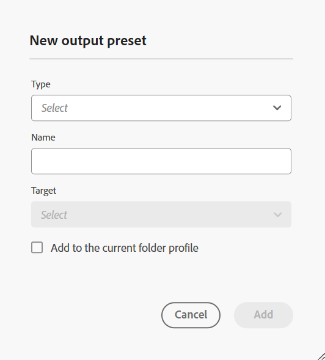

# Ausgabevorgaben für Global- und Ordnerprofile verwalten {#id22BLJ0D0V1U}

Die Vorgaben &quot;Global&quot;und &quot;Ordnerprofil&quot;stehen nur Administratoren auf Ordnerebene zur Verfügung.

Als Administrator können Sie mit AEM Guides Ausgabevorgaben für die globalen und Ordnerprofile erstellen und verwalten. Dann können Sie diese Ausgabevorgaben einfach verwenden, um Ausgaben für alle Maps zu generieren, die mit diesem globalen oder Ordnerprofil verbunden sind.

Führen Sie die folgenden Schritte aus, um eine Ausgabevorgabe für die Profile Global und Ordner zu erstellen:

1. Wählen Sie die DITA-Zuordnung aus, für die Sie eine Ausgabevorgabe erstellen möchten.
1. Wählen Sie die **Themen bearbeiten** Option aus der **Optionen** Menü der Map-Datei. Die Zuordnungsdatei wird zur Bearbeitung im Web-Editor geöffnet.
1. Im **Ausgabe** klicken Sie auf das Symbol + , um eine Ausgabevorgabe für Ihre DITA-Zuordnung zu erstellen.

   {width="350" align="left"}

1. Geben Sie die folgenden Details in die **Vorgabe hinzufügen** dialog:
   - Typ
   - Name
   - Ziel \(für die Knowledgebase-Vorgabe\)
1. Wählen Sie die **Hinzufügen zum Ordnerprofil** aktivieren, um eine Ausgabevorgabe für das zugehörige Ordnerprofil zu erstellen, und klicken Sie dann auf **Hinzufügen**. Die Vorgabe wird erstellt und unter dem **Ausgabe** -Registerkarte aller zugehörigen Karten. \( \) Symbol zeigt eine Vorgabe auf Ordnerprofilebene an.
1. Geben Sie die Konfigurationsdetails ein. Weitere Informationen zu Ausgabevorgaben finden Sie unter [Grundlegendes zu den Ausgabevorgaben](./generate-output-understand-presets.md).

   >[!NOTE]
   >
   > Diese Vorgaben, die zum Ordnerprofil hinzugefügt werden, sind unabhängig von den Karten, sodass die zuordnungsspezifischen Konfigurationen für diese Vorgaben nicht vorhanden sind.

1. Sie können die **Vorgabe generieren** -Symbol oben, um die Ausgabe für die Karten zu generieren, die mit der erstellten Ausgabevorgabe verknüpft sind. Sie sehen den Status des Generierungsprozesses der Ausgabe. Um die Ausgabe anzuzeigen, bewegen Sie den Mauszeiger über das Thema und klicken Sie auf **Ausgabe anzeigen**.

>[!NOTE]
>
> AEM Guides bietet außerdem eine vordefinierte PDF-Ausgabevorgabe, um die Ausgabe für Ihre DITA-Maps zu generieren.

**Weitere Vorgänge über das Menü &quot;Optionen&quot;**

Sie können auch die folgenden Vorgänge für die Vorgabe im Menü Optionen ausführen:

- Wählen Sie die Vorgabe als Standard-PDF-Vorgabe aus. Dann wird die ausgewählte Vorgabe als Standardvorgabe verwendet, um die PDF-Ausgabe mithilfe der **Als PDF herunterladen** für eine Zuordnung.
- **Bearbeiten**, **Umbenennen**, **Duplizieren** oder **Löschen** eine vorhandene Ausgabevorgabe aus der **Optionen** Menü.

>[!NOTE]
>
> Wenn eine Ausgabevorgabe in den Profilen &quot;Global&quot;und &quot;Ordner&quot;gelöscht wird, wird sie in allen zugehörigen Maps angezeigt und nicht unter der **Ausgabe** Registerkarte.

**Übergeordnetes Thema:**[ Arbeiten mit dem Web-Editor](web-editor.md)
