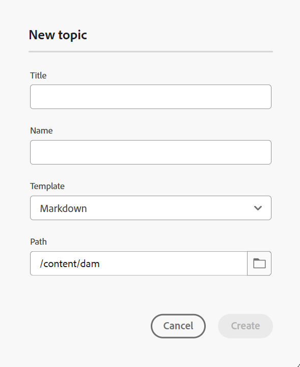

# Erstellen von Markdown-Dokumenten im Editor {#id223MIE0B079}

Markdown ist eine einfache Markup-Sprache, mit der Sie Formatierungselemente zu Textdokumenten hinzufügen können. Adobe Experience Manager Guides bietet die Funktion zum Erstellen, Verfassen und Anzeigen einer Vorschau eines Markdown \(.md\) -Themas im Editor. Sie können auch die vorhandenen Markdown-Dokumente hochladen und im Editor bearbeiten.

## Markdown-Thema erstellen

Führen Sie die folgenden Schritte aus, um im Editor ein Markdown-Thema zu erstellen:

1. Wählen Sie im Repository-Bereich die Option  und dann **Thema** aus der Dropdown-Liste aus.
2. Geben **im Dialogfeld** Neues Thema“ die folgenden Details an:

   {width="300" align="left"}

   * **Titel**: Geben Sie einen Titel für das Thema an.
   * **Name**: Der Dateiname wird basierend auf dem Thementitel automatisch vorgeschlagen. Wenn Ihr Admin automatische Dateinamen basierend auf der UUID-Einstellung aktiviert hat, wird das Feld Name nicht angezeigt.
   * **Vorlage** Wählen Sie **Markdown** aus der Dropdown-Liste aus. Die Vorlage **Thema** ist standardmäßig ausgewählt.
   * **Path**: Durchsuchen Sie den Pfad, in dem Sie die Themendatei speichern möchten. Standardmäßig wird der Pfad des aktuell ausgewählten Ordners im Repository im Feld Pfad angezeigt.

   >[!NOTE]
   >
   > Im Falle eines Upgrades müssen Sie die Markdown-Vorlage zum aktuell verwendeten Profilordner hinzufügen. Sie können [eine neue Markdown-Vorlage aus dem Editor erstellen](./web-editor-features.md#templates) oder eine vorhandene Vorlage für die Bearbeitung von Markdown-Inhalten verwenden. Weitere Informationen zum Hinzufügen von Authoring-Vorlagen in Experience Manager Guides finden Sie unter [Konfigurieren von globalen Profilen oder Profilen auf ](../cs-install-guide/conf-folder-level.md).
3. Wählen Sie **Erstellen** aus.

   Das Markdown-Thema wird unter dem ausgewählten Pfad erstellt und ist zur Bearbeitung geöffnet.

   {width="650" align="left"}

>[!NOTE]
>
> Sie können auch ein Markdown-Thema für einen Ordner im Repository-Bereich erstellen. Wählen Sie den Ordner aus, in dem Sie ein Markdown-Thema erstellen möchten, wählen Sie **Neu** und wählen Sie dann **Thema** aus dem Menü „Optionen“. Sie können jetzt ein Markdown-Thema erstellen, indem Sie im Dialogfeld **Thema erstellen** Themendetails angeben.

## Kennenlernen der Editor-Funktionen für ein Markdown-Thema

Dieser Abschnitt führt Sie durch die verschiedenen Funktionen, die im Editor für die Bearbeitung von Markdown-Themen verfügbar sind. Die Authoring-Oberfläche ist in die folgenden Abschnitte oder Bereiche unterteilt:

* [Symbolleiste](#toolbar)
* [Inhaltsbearbeitungsbereich](#content-editing-area)
* [Source-, Side-by-Side- und Vorschau-Modus](#source-side-by-side-and-preview-modes)
* [Rechtes Bedienfeld](#right-panel)

<!--
### Tab bar 

The tab bar features the file tabs of the topics or maps that are currently opened in the Editor along with other file-level options. 

Features available in the tab bar are explained as follows:

 {width="550" align="left"}

* **Topic tab**: Displays the currently opened topics in a tab. By default, you can view the file titles in the tab. As you hover over a file, you can view the file title and the file path as a tooltip.

    >![NOTE]
    >
    > As an administrator, you can also choose to view the list of files by filenames in the tabs. View [User preferences](./intro-home-page.md#user-preferences) for details.
* **Save all**: Saves the changes you have made in all opened topics. If you have multiple topics opened in the Editor, selecting **Save all** or pressing `Crtl+S` shortcut keys saves all documents in one click. You do not have to individually save each document.
* **AI Assistant**: [AI-powered Smart Help](./ai-based-smart-help.md) feature that helps you find relevant content from the Adobe Experience Manager Guides Documentation.
* **More actions**: Allows you to navigate to the **Assets UI**. As an administrator, you also get an option to navigate to the **Settings** page. Learn how to work with [settings](./web-editor-features.md#main-toolbar) or editor settings. 
* **Expand view**: Allows you to expand the page view using the **Expand** icon. In this view, the header bar is hidden, maximizing the content space. To return to the standard view, use the **Exit the expanded view** icon.

-->

### Symbolleiste

Die Symbolleiste befindet sich direkt unter der Registerkartenleiste. In der Symbolleiste verfügbare Funktionen werden wie folgt erläutert:

{align="left"}

| Funktionen | Beschreibung |
|----------------|----------------|
| Bearbeiten von Aktionen | Bietet Zugriff auf verschiedene Funktionen zur Bearbeitung von Dokumenten, einschließlich **Ausschneiden**  , **Rückgängig**  , **Wiederholen**  , **Kopieren**  , **Löschen**   und **Suchen und Ersetzen**  . Sie können auf die verfügbaren Optionen über das Dropdown-Menü **Menü** zugreifen. |
| Optionen für die Textformatierung | Bietet Zugriff auf verschiedene Textformatierungsoptionen, einschließlich **Überschriften**  , **fett**  , **Kursiv**  , **Durchgestrichen**  , **Code**   und **Blockzitat**  . |
| Optionen zum Einfügen von Inhalten | Bietet Optionen zum Einfügen einer **nummerierten Liste**  , **Sortierte Liste**  , **table**  , **image** , **Querverweis**   und **Symbol**  In ein Dokument .   **Hinweis**: Sie können auch Bilder und andere Dateien per Drag-and-Drop in den Markdown-Editor ziehen. Dateien werden als Querverweis-Links hinzugefügt, während Bilder als Standardelemente des Bilds angezeigt werden. |
| Versionsverlauf | Ermöglicht Ihnen, Versionen von Markdown-Dateien zu erstellen und den Änderungsverlauf anzuzeigen. Sie können verschiedene Versionen vergleichen und bei Bedarf zu vorherigen zurückkehren. Die Option Versionsverlauf ist in der Dropdown-Liste **Menü** vorhanden. |
| Als neue Version speichern | Speichert die im Thema vorgenommenen Änderungen und erstellt außerdem eine neue Version des Themas. Wenn Sie an einem neu erstellten Thema arbeiten, werden die Versionsinformationen als „Ohne“ angezeigt. |
| Sperren/Entsperren | Sperrt oder entsperrt die aktuelle Datei. Durch das Sperren einer Datei erhalten Sie exklusiven Schreibzugriff auf die Datei. Dadurch wird das Bearbeiten der Datei durch andere Benutzer eingeschränkt. Entsperren Sie die Datei , wenn andere Benutzer Bearbeitungszugriff haben sollen. Als Administrator erhalten Sie auch Zugriff auf die Funktion **Entsperren erzwingen** mit der Sie die von einer anderen Person gesperrte Datei entsperren können. |

>[!NOTE]
>
> Die **Versionsverlauf**-Funktion und die unter Bearbeitungsaktionen, Textformatierung und Inhaltseinfügung erwähnten Funktionen können sowohl von der **Source**- als auch **Side-by-Side**-Ansicht des Markdown-Themas aufgerufen werden.

### Inhaltsbearbeitungsbereich

Im Inhaltsbearbeitungsbereich wird die Markdown-Quelle Ihres Themas angezeigt, in der Sie alle Inhaltsbearbeitungen vornehmen. In der Seitenansicht wird dieser Bereich in zwei Abschnitte unterteilt - Markdown-Quellansicht auf der linken Seite und Vorschau auf der rechten Seite. Sie können mehrere Themen gleichzeitig öffnen, die auf den jeweiligen Registerkarten angezeigt werden.

### Source-, Side-by-Side- und Vorschau-Modus

Für das Markdown-Authoring unterstützt der Editor drei verschiedene Anzeigemodi, um die Inhaltserstellung und -formatierung zu unterstützen:

{align="left"}

* Quelle
* Nebeneinander
* Vorschau

**Quelle**

Dies ist die Markdown-Code-Ansicht des Editors. Sie können Markdown-Themen wie in jedem normalen Markdown-Editor bearbeiten. In der Source-Ansicht haben Sie die Möglichkeit, eine Revision des Dokuments zu speichern, Überschriften einzufügen, eine Tabelle einzufügen, ein Bild einzufügen und vieles mehr.

Verwenden Sie diese Ansicht, wenn Sie sich nur auf das Schreiben und Bearbeiten des Roh-Markdown konzentrieren möchten, ohne die gerenderte Ausgabe anzuzeigen.

**Seite an Seite**

In diesem Modus wird der Editor in zwei Bereiche unterteilt:

* Das Source-Bedienfeld, das das bearbeitete Markdown-Thema anzeigt.
* Das Bedienfeld Vorschau , das die gerenderte Ausgabe des Markdown-Themas in Echtzeit anzeigt.

{width="550" align="left"}

Verwenden Sie diese Ansicht, wenn Sie die gerenderte Ausgabe bei der Bearbeitung von Markdown-Themen in Echtzeit anzeigen möchten.

**Vorschau**

Beim Öffnen eines Markdown-Themas im Vorschaumodus wird angezeigt, wie ein Thema angezeigt wird, wenn es von einem Benutzer in seinem Browser angezeigt wird. In dieser Ansicht werden alle Bearbeitungsfunktionen aus der Symbolleiste entfernt. Sie können jedoch weiterhin auf die Funktionen **Als neue Versionen speichern**, **Sperren/Entsperren** in der Symbolleiste und auf die Funktion **Dateieigenschaften** im rechten Bereich zugreifen.

### Rechtes Bedienfeld

Das rechte Bedienfeld bietet Zugriff auf das Bedienfeld **Dateieigenschaften“.

Die Dateieigenschaften umfassen die beiden folgenden Abschnitte:

**Allgemein**

Im Abschnitt Allgemein haben Sie Zugriff auf die folgenden Funktionen:

* **Dateiname**: Zeigt den Dateinamen des ausgewählten Themas an.
* **ID**: Zeigt die ID des ausgewählten Themas an.
* **Language**: Zeigt die Sprache des Themas an. Sie wird im Feld Sprache auf der Seite Eigenschaften festgelegt.
* **Erstellt am**: Zeigt Datum und Uhrzeit an, zu der das Thema erstellt wurde.
* **Geändert am**: Zeigt Datum und Uhrzeit an, zu der das Thema geändert wurde.
* **Gesperrt von**: Zeigt den Benutzer an, der das Thema ausgecheckt hat.
* **Dokumentstatus**: Sie können den Dokumentstatus des aktuell geöffneten Themas auswählen und aktualisieren. Weitere Informationen finden Sie unter [Dokumentstatus](./web-editor-document-states.md).
* **Tags**: Dies sind die Metadaten-Tags des Themas. Sie werden über das Feld Tags auf der Seite Eigenschaften festgelegt. Sie können sie in der Dropdown-Liste eingeben oder auswählen. Die Tags werden unter dem Dropdown-Menü angezeigt. Um ein Tag zu löschen, klicken Sie auf das Kreuzsymbol neben dem Tag.
* **Weitere Eigenschaften bearbeiten**: Sie können auf der Seite mit den Dateieigenschaften weitere Eigenschaften bearbeiten.

**Verweise**

Der Abschnitt Verweise bietet Ihnen Zugriff auf die folgenden Funktionen:

* **Verwendet in**: Die Option Verwendet in Verweisen listet die Dokumente auf, auf die die aktuelle Datei verwiesen oder verwendet wird.
* **Ausgehende Links**: Unter Ausgehende Links werden die Dokumente aufgelistet, auf die im aktuellen Dokument verwiesen wird.

>[!NOTE]
>
> Alle in und Outgoing-Links verwendeten Verweise sind mit den Dokumenten per Hyperlink verbunden. Sie können die verknüpften Dokumente einfach öffnen und bearbeiten.

## Funktionseinschränkungen

Die folgenden Experience Manager Guides-Funktionen können derzeit nicht für das Markdown-Authoring verwendet werden:

1. Überprüfung
2. Zusammenführen
3. KI-Assistent
4. Änderungen verfolgen

**Übergeordnetes Thema:**[ Einführung in den Editor](web-editor.md)
