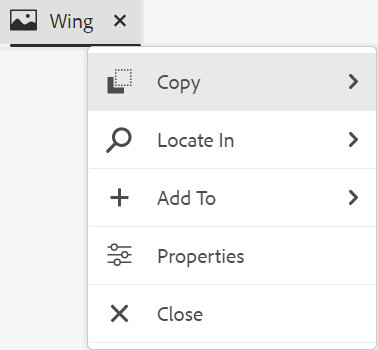
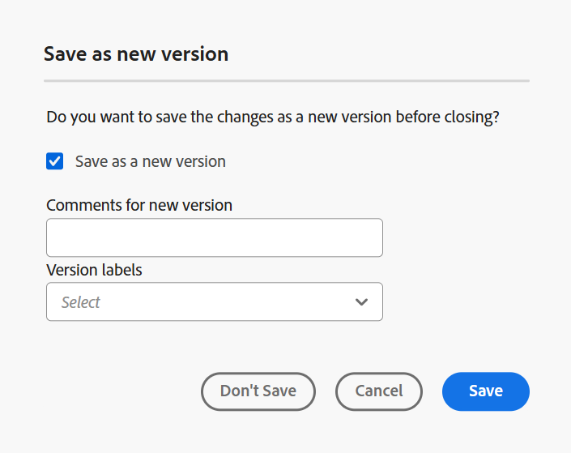

# Zusätzliche Funktionen im Editor {#id2056B0B0YPF}

Es gibt einige weitere nützliche Funktionen im Editor, die Sie nutzen können:

## Kontextmenüfunktionen auf der Registerkarte einer Datei

Wenn Sie eine Datei im Editor öffnen, können Sie verschiedene Aktionen über das Kontextmenü ausführen. Je nachdem, ob Sie eine Mediendatei, eine einzelne DITA-Datei oder mehrere Dateien öffnen, werden Ihnen möglicherweise unterschiedliche Optionen angezeigt.

**Mediendatei**

Die folgenden Funktionen finden Sie im Kontextmenü der Registerkarte einer geöffneten Mediendatei:

{width="300" align="left"}

**Einzelne DITA-Datei**

Die folgenden Funktionen finden Sie im Kontextmenü der Registerkarte einer geöffneten Datei:

{width="400" align="left"}

**Mehrere Dateien**

Wenn mehrere Dateien geöffnet sind, stehen im Kontextmenü weitere Optionen zur Verfügung:

{width="550" align="left"}

Nachfolgend werden die verschiedenen Optionen im Kontextmenü erläutert:

***Speichern***: Sie können aus den folgenden Optionen auswählen:

- **Speichern**: Um eine Datei zu speichern, ohne eine neue Version zu erstellen, wählen Sie **Speichern**. Wenn Sie ein neues Thema erstellen, wird in DAM eine Arbeitskopie des Themas ohne Version erstellt. Durch Speichern des Dokuments wird die Arbeitskopie des Dokuments in DAM aktualisiert. Durch eine einfache Speicherung dieser Version wird keine neue Version eines Themas erstellt. Wenn Ihr Thema überprüft wird, erhalten Ihre Reviewer beim Speichern eines Themas keinen Zugriff auf den Inhalt Ihres geänderten Themas.

- **Alle speichern**: Wenn mehrere Dokumente im Editor geöffnet sind, erhalten Sie auch eine Option zum **Alle speichern** geöffneter Dokumente.

***Als neue Version speichern***

Um eine neue Version der Datei zu erstellen, wählen Sie **Als neue Version speichern**. Weitere Informationen zu **Speichern** und **Als neue Version speichern** finden Sie unter [Symbolleiste im Editor](web-editor-toolbar.md).

***Kopieren***: Sie können aus den folgenden Optionen auswählen:

- **UUID kopieren**: Um die UUID der aktuell aktiven Datei in die Zwischenablage zu kopieren, wählen Sie **Kopieren \> UUID kopieren**.
- **Pfad kopieren**: Um den vollständigen Pfad der derzeit aktiven Datei in die Zwischenablage zu kopieren, wählen Sie **Kopieren \> Pfad kopieren**.

***Suchen in***: Sie können aus den folgenden Optionen auswählen:

- **Map**: Wenn Sie eine große DITA-Map geöffnet haben und den genauen Speicherort einer Datei in der Map finden möchten, wählen Sie **Locate In \> Map**. Wenn Sie die Option „In Zuordnung suchen“ auswählen, befindet sich die Datei \(von der aus die Option aufgerufen wird\) und wird in der Zuordnungshierarchie hervorgehoben. Um diese Funktion verwenden zu können, müssen Sie die Zuordnungsdatei im Editor öffnen. Wenn die Zuordnungsansicht ausgeblendet ist, wird beim Aufrufen dieser Funktion die Zuordnungsansicht angezeigt und die Datei wird in der Zuordnungshierarchie hervorgehoben.

- **Explorer**: Ähnlich wie In Map suchen zeigt **In \> Explorer** den Speicherort der Datei im Explorer \(oder DAM\) an. Die Explorer-Ansicht wird geöffnet und die ausgewählte Datei wird im Explorer hervorgehoben. Wenn sich die Datei in einem Ordner befindet, wird dieser Ordner erweitert, um den Speicherort der ausgewählten Datei im Explorer anzuzeigen.

  >[!NOTE]
  >
  >Ab Version 2025.11.0 wird **Repository** in &quot;**&quot;**. Bei On-Premise-Setups ist es bis Version 5.1 von Experience Manager Guides weiterhin als Repository verfügbar.

***Hinzufügen zu***: Sie können aus den folgenden Optionen auswählen:

- **Sammlungen**: Um die ausgewählte Datei zu Sammlungen hinzuzufügen, wählen Sie **Zu \> Sammlungen hinzufügen** aus. Weitere Informationen finden Sie in der **Sammlungen** Funktionsbeschreibung im Abschnitt [Linkes Bedienfeld](web-editor-left-panel.md).

- **Wiederverwendbarer Inhalt**: Um die ausgewählte Datei in die Liste der wiederverwendbaren Inhalte zu kopieren, wählen Sie **Zu \> Wiederverwendbarer Inhalt hinzufügen** aus. Weitere Informationen finden Sie in der **Wiederverwendbarer Inhalt** Funktionsbeschreibung im Abschnitt [Linkes Bedienfeld](web-editor-left-panel.md).

***Eigenschaften***

Um die AEM-Eigenschaftsseite der ausgewählten Datei anzuzeigen, wählen Sie **Eigenschaften** aus.

***Aufspaltung***: Sie können aus den folgenden Optionen auswählen:

**Nach oben, unten, links oder rechts**

Standardmäßig können Sie mit dem Editor jeweils ein Thema anzeigen. Es kann Fälle geben, in denen Sie zwei oder mehr Themen gleichzeitig anzeigen möchten. Durch die Aufteilung des Bildschirms des Editors können Sie mehrere Themen gleichzeitig anzeigen. Beispiel: Zwei Themen - A und B - sind im Editor geöffnet. Wenn Sie mit der rechten Maustaste auf Thema B klicken und **Aufspaltung \> Nach** wählen, wird das Editor-Fenster in zwei Teile unterteilt. Thema B wird in der oberen Hälfte und Thema A in der unteren Hälfte angezeigt. Ebenso können Sie den Bildschirm auch horizontal aufteilen, indem Sie **Aufspaltung \> Links** oder **Aufspaltung \> Rechts** auswählen. Sie können Ihre Dokumente von einem Bildschirm auf den anderen verschieben, indem Sie die Registerkarte Datei ziehen und auf dem Bildschirm ablegen, auf dem Sie sie platzieren möchten. Ebenso können Sie die Dateiregisterkarten auch neu anordnen, indem Sie sie nach Ihren Wünschen ziehen und verschieben.

<!--------------------------------------------

***Quick Generate***

Generate the output for the selected file. Output can be generated only for files that are a part of an output preset. For more details, view [Article-based publishing from the Web Editor](web-editor-article-publishing.md#id218CK0U019I).

--->

***Schließen***: Sie können aus den folgenden Optionen auswählen:

**Schließen**, **Andere schließen** oder **Alle schließen**

Wenn Sie die Datei schließen möchten, über die Sie das Kontextmenü aufgerufen haben, wählen Sie **Schließen \> Schließen**. Verwenden Sie **Schließen \> Andere schließen**, um alle anderen geöffneten Dateien mit Ausnahme der derzeit aktiven Datei zu schließen. Um alle geöffneten Dateien zu schließen, wählen Sie die Option **Schließen \> Alle schließen** aus dem Kontextmenü aus, oder Sie können auch den Editor schließen. Wenn Ihre Sitzung nicht gespeicherte Dateien enthält, werden Sie aufgefordert, diese Dateien zu speichern.

**Szenarien zum Schließen und Speichern von Dateien**

Wenn Sie versuchen, eine im Editor geöffnete Datei mithilfe der Schaltfläche **Schließen** auf der Registerkarte der Datei oder der Option **Schließen** im Optionsmenü zu schließen, fordert Experience Manager Guides Sie auf, Ihre Änderungen zu speichern und eine gesperrte Datei zu entsperren.

Die Eingabeaufforderungen basieren auf den folgenden Konfigurationen, die von Ihrem Administrator ausgewählt wurden:

- **Beim Schließen um Entsperren bitten:** Sie haben die Möglichkeit, beim Schließen des Editors die Datei \(die Sie gesperrt haben\) zu entsperren.
- **Beim Schließen um neue Version bitten**: Beim Schließen des Editors haben Sie die Möglichkeit, die Datei \(die Sie bearbeitet haben\) als neue Version zu speichern.

Ihr Dateispeichererlebnis hängt von den folgenden drei Szenarien ab, in denen Sie über Folgendes verfügen:

- Keine Änderungen am Inhalt vorgenommen.
- Inhalt bearbeitet und Änderungen gespeichert.
- Inhalt bearbeitet, aber Änderungen nicht gespeichert.

Je nachdem, ob die Datei gesperrt/entsperrt ist und gespeicherte oder nicht gespeicherte Änderungen aufweist, können Sie die folgenden Optionen anzeigen:

- **Entsperren und Schließen**: Die Sperre für die Datei wird aufgehoben, und die Datei wird geschlossen.
- **Als neue Version speichern**: Dadurch werden die Änderungen gespeichert, die Sie am Inhalt vorgenommen haben, und eine neue Version der Datei erstellt. Sie können der neu gespeicherten Version auch Beschriftungen und Kommentare hinzufügen. Weitere Informationen zum Speichern einer neuen Version finden Sie unter [Als neue Version ](web-editor-toolbar.md#version-information-and-save-as-new-version).

- **Datei entsperren**: Wenn Sie eine Datei entsperren, wird die Sperre für die Datei aufgehoben und die Änderungen werden in der aktuellen Version der Datei gespeichert.

  >[!NOTE]
  >
  > Wenn Sie die Option zum Entsperren der Datei deaktivieren, erhalten Sie auch die Option, die Datei zu schließen, ohne die Änderungen zu speichern.

  Eine der Eingabeaufforderungen wird beispielsweise im folgenden Screenshot angezeigt:

  {width="400" align="left"}

**Visuelle Hinweise auf fehlerhafte Verweise**

Wenn das Thema fehlerhafte Querverweise oder Inhaltsreferenzen enthält, werden diese in rotem Text angezeigt.

**Smartes Kopieren und Einfügen**

Sie können mühelos Inhalte kopieren und in und über Themen hinweg einfügen. Die Struktur des Quellelements wird am Ziel beibehalten. Wenn der kopierte Inhalt Inhaltsreferenzen enthält, werden auch diese kopiert.

**Letzten durchsuchten Speicherort speichern**

Der Editor bietet ein Dialogfeld zum Durchsuchen von smarten Dateien. Der Editor speichert den zuletzt verwendeten Speicherort beim Einfügen eines Verweises oder Inhalts. Wenn Sie das Dialogfeld zum ersten Mal aufrufen (über Verweis einfügen oder Inhalt wiederverwenden), werden Sie an den Speicherort des aktuellen Dokuments weitergeleitet. Wenn Sie in derselben Sitzung versuchen, einen anderen Verweis einzufügen, navigiert das Dialogfeld zum Durchsuchen der Datei automatisch zu der Position, von der aus Sie den letzten Verweis eingefügt haben.

>[!NOTE]
>
> Im Falle einer Bild-, Audio- oder Videodatei wird im Dialogfeld zum Durchsuchen der Datei standardmäßig der Speicherort der Datei und nicht der zuletzt verwendete Speicherort angezeigt.

## Durchsuchen von Dateien und Ordnern in Experience Manager Guides

Experience Manager Guides bietet intuitive Dialogfelder - **Datei auswählen** und **Pfad auswählen** -, mit denen Sie Dateien oder Ordner im Content-Repository effizient durchsuchen und auswählen können.

>[!NOTE]
>
> Der Datei- und Ordnerpfadbrowser wurde mit einer überarbeiteten Benutzeroberfläche in der Version 2601 von Experience Manager Guides as a Cloud Service eingeführt. Die neue Benutzeroberfläche ist standardmäßig aktiviert. Wenn Sie es vorziehen, die vorhandene Benutzeroberfläche ohne diese Aktualisierungen weiter zu verwenden, wenden Sie sich an Ihr Customer Success-Team, damit diese neue Verbesserung deaktiviert wird.

### Durchsuchen von Dateien in Experience Manager Guides

Mit dem Dateipfad-Browser können Sie bestimmte Dateien im Content-Repository schnell finden und auswählen. Diese Funktion ist für Aufgaben verfügbar, z. B. zum Hinzufügen eines Themas zu einer Karte, zum Verknüpfen eines Bildes oder Querverweises, zum Erstellen wiederverwendbarer Inhalte und mehr.

{width="350" align="left"}

Beim Starten des Datei-Browsers wird das Dialogfeld **Datei auswählen** geöffnet. Dieses Dialogfeld enthält zwei Registerkarten: **Repository** und **Sammlungen**. Standardmäßig ist die Registerkarte Repository ausgewählt.

{width="650" align="left"}

**Auf der Registerkarte „Repository“ verfügbare Funktionen zum Durchsuchen von Dateien**

**Tabellenansicht von Dateien und Ordnern**

Die Registerkarte Repository bietet eine tabellarische Ansicht der Dateien und Ordner aus dem Inhalts-Repository, wodurch das Auffinden des richtigen Dateipfads erleichtert wird. Sie können auch die Breadcrumbs oben und das Navigationsfenster des Ordners links verwenden, um durch Ordner zu navigieren.

{width="650" align="left"}

**Auswahl einzelner und mehrerer Dateien**

Um eine Datei zu verwenden, wählen Sie einfach die Datei aus und klicken Sie auf **Auswählen**.

{width="650" align="left"}

In einigen Fällen können Sie in diesem Dialogfeld des Pfad-Browsers auch mehrere Dateien auswählen. Wenn Sie beispielsweise nach wiederverwendbaren Inhalten suchen, können Sie mehrere Dateien auswählen und sie zu einem Teil Ihres wiederverwendbaren Inhalts machen.

{width="650" align="left"}

Für wiederverwendbare Inhalte, Themenreferenzen, Schematron, Ausgabevorgaben (mit DITAVAL) und Workfront ist derzeit die Auswahl mehrerer Dateien verfügbar.

>[!NOTE]
>
> Bei der Auswahl von Dateien im Dialogfeld Pfad-Browser erscheinen einige Ordner möglicherweise deaktiviert. Durch dieses Verhalten wird der Zugriff auf bestimmte Dateitypen eingeschränkt, um eine gültige Auswahl sicherzustellen. Wenn Sie beispielsweise wiederverwendbare Inhalte erstellen, dürfen nur Themen- und Zuordnungsdateien verwendet werden. Um die Verwendung eines ungültigen Dateityps zu verhindern, z. B. eines Bildes, werden die entsprechenden Dateien entweder nicht angezeigt oder bleiben zur Auswahl im Pfad-Browser deaktiviert.

**Vorschau ausgewählter Dateien**

Sie können die ausgewählten Dateien mithilfe der Schaltfläche **Vorschau** in der Vorschau anzeigen, wie unten dargestellt:

{width="650" align="left"}

Die Vorschau der ausgewählten Datei wird auf der rechten Seite angezeigt.

{width="650" align="left"}

Bei mehreren Auswahlen wird eine Vorschau aller ausgewählten Dateien im Bedienfeld Vorschau angezeigt, damit Sie sie leicht überprüfen können.

{width="650" align="left"}

Sie können auch das Symbol **Entfernen** verwenden, um die Auswahl einiger Dateien aus der Vorschau aufzuheben.

{width="650" align="left"}

**Erlebnis suchen und filtern**

Beim Durchsuchen von Dateien im Repository können Sie nach Dateien anhand des Namens, des Titels oder des Inhalts im ausgewählten Pfad suchen. Sie können ein beliebiges, zwei oder alle drei Kriterien für Ihre Suche verwenden. Wenn keines der Kriterien ausgewählt ist, umfassen die Ergebnisse alle drei Kriterien.

{width="650" align="left"}

Wählen Sie das Symbol **Filtersuche** \(\) aus, um den Filterbereich auf der rechten Seite zu öffnen.

{align="left"}

Sie haben die folgenden Optionen, um die Dateien zu filtern und Ihre Suche einzugrenzen:

- **Suchen in**: Wählen Sie den Pfad aus, unter dem Sie die Dateien im Repository suchen möchten.

- **Dateityp**: Filtern Sie Ihre Suche nach einem bestimmten Dateityp. Die verfügbaren Optionen sind: **Topic**, **Map**, **DITAVAL**, **Image**, **Multimedia**, **Document** und **andere**.

  >[!NOTE]
  >
  > In einigen Fällen wird der **Dateityp**-Filter basierend auf der Aufgabe auf bestimmte Dateitypen vorab angewendet und kann nicht geändert werden. Wenn Sie beispielsweise nach einem Bild suchen, ist der Filter so eingestellt, dass nur Bilddateien angezeigt werden. Beim Erstellen wiederverwendbarer Inhalte ist er so eingestellt, dass nur Themen- und Zuordnungsdateien angezeigt werden. Sie können weiterhin andere Filter wie den Dokumentstatus, Tags oder das Datum der letzten Änderung anpassen, um Ihre Suchergebnisse zu verfeinern.

- **Dokumentstatus**: Sie können Ihre Suche nach dem aktuellen Dokumentstatus der Dateien filtern. Die verfügbaren Filterwerte werden im Feld `repositoryFilters` des `ui_config.json file` definiert und sind mit dem aktuell verwendeten Ordnerprofil verknüpft.

  Das bedeutet:

   - Wenn Sie das globale Profil verwenden, werden die im globalen Profil konfigurierten Filterwerte angewendet.
   - Wenn Sie ein bestimmtes Ordnerprofil auswählen, werden die in diesem Profil definierten Filterwerte abgerufen.

  Die für den Dokumentstatus verfügbaren Standardfilterwerte sind: „Entwurf“, „Bearbeiten“, „In Überprüfung“, „Genehmigt“, „Überprüfen“ und „Fertig“. Details zum Anpassen von Filterwerten für Dokumentstatus finden Sie unter [Konfigurieren von Dokumentstatusfiltern](../cs-install-guide/config-doc-state-filters.md).

- **Gesperrt von**: Zeigt eine Liste von Benutzern an. Die Liste wird paginiert und asynchron geladen, sodass nur eine begrenzte Anzahl von Benutzern gleichzeitig angezeigt wird und beim Scrollen oder Navigieren mehr abgerufen wird. Dies verbessert die Ladegeschwindigkeit und die Gesamtleistung, insbesondere bei der Arbeit mit einer großen Anzahl von Benutzern.

- **Zuletzt geändert**: Filtern Sie den Inhalt nach dem Änderungsdatum. Wählen Sie einen Datumsbereich aus dem Kalender aus oder wählen Sie eine der folgenden Zeitrahmen-Optionen:
   - In letzter Woche
   - Im letzten Monat
   - Im letzten Jahr

- **Tags**: Filtern von Inhalten basierend auf Tags.

- **DITA-Elemente**: Filtern von Inhalten basierend auf verschiedenen DITA-Elementen.

Nachdem Sie alle erforderlichen Filter angewendet haben, wählen **Anwenden** in der rechten unteren Ecke des Bedienfelds „Filter“ aus.

**Auf der Registerkarte „Sammlungen“ verfügbare Funktionen zum Durchsuchen von Dateien**

Die Registerkarte **Sammlungen** bietet eine kuratierte Ansicht der in Ihren Sammlungen verfügbaren Dateien für den schnellen Zugriff und die Wiederverwendung. Im Gegensatz zur Registerkarte Repository, auf der die vollständige Ordnerhierarchie angezeigt wird, können Sie mit Sammlungen häufig verwendete Themen, Karten und Bilder auswählen, ohne mehrere Ordner durchsuchen zu müssen.

Auf der Registerkarte Sammlungen haben Sie folgende Möglichkeiten:

- Verwenden Sie die Breadcrumbs im oberen Navigationsbereich und im Navigationsbereich des Ordners auf der rechten Seite, um einfach durch Ihre Sammlungen zu navigieren.

  
- Wählen Sie Dateien aus, die sich in einem bestimmten Sammlungspfad befinden, und zeigen Sie eine Vorschau im rechten Bedienfeld an.

  

### Browser-Ordner im Repository

Beim Durchsuchen von Ordnern mit dem **Ordner auswählen**-Dialogfeld wird der richtige Ordnerpfad innerhalb des Repositorys für Aufgaben wie das Erstellen neuer Themen oder das Angeben von Ausgabespeicherorten für veröffentlichte Inhalte ausgewählt. Es bietet eine klare, baumstrukturierte Ansicht von Ordnern, wodurch die Navigation intuitiv wird und sichergestellt wird, dass Inhalte an der richtigen Stelle platziert werden.

{width="300" align="left"}

## Unterstützung für die artikelbasierte Veröffentlichung

Im Editor können Sie die Ausgabe für ein oder mehrere Themen oder die gesamte DITA-Zuordnung generieren. Sie müssen Ausgabevorgaben für Ihre DITA-Zuordnung erstellen und dann können Sie die Ausgabe einfach für ein oder mehrere Themen generieren. Wenn Sie einige Themen in Ihrer Zuordnung aktualisiert haben, können Sie im Editor auch die Ausgabe nur für diese Themen generieren. Weitere Informationen finden Sie unter [Artikelbasierte Veröffentlichung](web-editor-article-publishing.md#id218CK0U019I).

## Unterstützung für Markdown-Dokumente

Mit dem Editor können Sie Markdown-Dokumente \(.md\) zusammen mit Ihren DITA-Dokumenten verwenden. Sie können im Editor einfach ein Markdown-Dokument erstellen und in der Vorschau anzeigen und es über den DITA-Karteneditor auch Ihrer Kartendatei hinzufügen. Weitere Informationen finden Sie unter [Autoren-Markdown-Dokumente im Editor](web-editor-markdown-topic.md#).

## Unterstützung des DITA-Glossarbegriffthemas

Der Editor unterstützt DITA-Glossarbegriffe, die Sie einfügen können, indem Sie `term` oder `abbreviated-form` Elemente hinzufügen.

## Arbeiten mit MathML-Gleichungen

### MathML-Gleichungen einfügen

Experience Manager Guides bietet vorkonfigurierte Unterstützung zum Einfügen von MathML-Gleichungen durch Integration mit dem [MathType Web](https://docs.wiris.com/en/mathtype/mathtype_web/intro)-Programm. Um eine MathML-Gleichung einzufügen, klicken Sie auf das Symbol **Element** und geben Sie „mathml“ ein. Wenn Sie ein mathml-Element aus der Liste auswählen, wird **Dialogfeld &quot;MathML einfügen** angezeigt:

{width="550" align="left"}

Erstellen Sie mithilfe der MathML-Formel Ihre Formel und wählen Sie **Einfügen** aus, um sie Ihrem Dokument hinzuzufügen. Die Gleichung wird mit hellgrauem Hintergrund eingefügt.

Sie können eine Formel jederzeit aktualisieren, indem Sie mit der rechten Maustaste auf eine vorhandene Gleichung klicken und **MathML bearbeiten** aus dem Kontextmenü auswählen.

### Validieren von Gleichungen im MathML-Editor

Experience Manager Guides validiert MathML-Gleichungen, wenn Sie ein Thema speichern, das sie enthält.
Wenn Sie eine Gleichung mit dem MathML-Editor einfügen, markiert Experience Manager Guides die Gleichung rot, wenn Syntaxprobleme auftreten. Sie können sie vor dem Einfügen korrigieren. Wenn Sie keine Änderungen vornehmen, aber **Einfügen** auswählen, wird eine Warnung angezeigt.

{width="400" align="left"}

Wenn Sie die MathML-Gleichung einfügen, die einen Syntaxfehler enthält, tritt beim Speichern des Themas ein Validierungsfehler auf.

## Einfügen von Fußnoten

Fügen Sie eine Fußnote mithilfe des `fn` in Ihren Inhalt ein. Im Bearbeitungsmodus wird der Fußnotenwert inline mit dem Inhalt angezeigt. Wenn Sie jedoch in den Vorschaumodus wechseln oder Ihr Dokument veröffentlichen, wird die Fußnote am Ende des Themas angezeigt.

## Umbenennen oder Ersetzen eines Elements

Der Editor zeigt den Breadcrumb des Elements unten links im Thema an. Wenn Sie ein Element durch ein anderes ersetzen möchten, können Sie dies im Kontextmenü des Breadcrumbs tun. Sie können beispielsweise `p` Element durch `note` oder ein anderes gültiges Element im Kontext austauschen.

{width="400" align="left"}

Klicken Sie im Breadcrumb mit der rechten Maustaste auf den Namen eines Elements, das Sie ersetzen möchten, und wählen Sie dann im Kontextmenü Element umbenennen . Das Dialogfeld Element umbenennen zeigt alle gültigen Elemente an, die am aktuellen Speicherort zulässig sind. Wählen Sie im Dialogfeld Element umbenennen das Element aus, das Sie verwenden möchten. Das ursprüngliche Element wird durch das neue Element ersetzt.

Zusätzlich zum Kontextmenü des Breadcrumbs kann das Dialogfeld Element umbenennen auch von anderen Speicherorten aus aufgerufen werden:

- Wählen Sie den Elementnamen auf dem Breadcrumb aus, um den Inhalt des Elements auszuwählen, und klicken Sie mit der rechten Maustaste auf den ausgewählten Inhalt, um das Kontextmenü aufzurufen.

- Aktivieren Sie die Tag-Ansicht, wählen Sie das öffnende Tag eines beliebigen Elements aus und klicken Sie dann mit der rechten Maustaste auf den ausgewählten Inhalt, um das Kontextmenü aufzurufen.

- Sie können auf das Dialogfeld Element umbenennen zugreifen, indem Sie das Menü Optionen eines Elements im Gliederungsfenster aufrufen.

## Umschließen und Entpacken eines Elements

### Element umschließen

- Wenn Sie ein Element umschließen, können Sie dem ausgewählten Text ein Element-Tag hinzufügen. Sie können den Text in ein beliebiges untergeordnetes Element einschließen, das DITA-Standards entspricht. Wenn Sie beispielsweise Text unter einem `note` Element haben, können Sie den Text in ein `p` Element einschließen.

- Die **Element umbrechen** Option ist im Kontextmenü des Breadcrumbs des Themas verfügbar. Um ein Element einzuschließen, klicken Sie mit der rechten Maustaste auf das Element und öffnen Sie das Kontextmenü. Wählen Sie das Element im Dialogfeld **Element umbrechen** aus. Der Text wird im neuen Element angezeigt.

- Sie können auch den Text oder das Element im Inhalt auswählen und dann die Option **Element umbrechen** aus dem Kontextmenü auswählen.

### Entpacken eines Elements

Wenn Sie die Verpackung eines Elements aufheben, können Sie das Tag des Elements aus dem markierten Text entfernen und es mit dem übergeordneten Element zusammenführen. Wenn Sie beispielsweise ein `p` in einem `note` haben, können Sie den Wrapper für das `p` Element aufheben, um den Text direkt im `note` Element zusammenzuführen. Die **Element entpacken**-Option ist im Kontextmenü des Breadcrumbs des Themas verfügbar. Um den Wrapper für ein Element aufzuheben, klicken Sie mit der rechten Maustaste auf das Element, um das Kontextmenü zu öffnen, und wählen Sie **Element aufheben**, um das Element zu entfernen und den Text des Elements mit seinem übergeordneten Element zusammenzuführen.

## Umgang mit Leerzeichen für DITA-Elemente

In XML umfassen Leerzeichen Leerzeichen Leerzeichen, Tabulatoren, Zeilenumbrüche und Leerzeilen. Experience Manager Guides wandelt mehrere aufeinander folgende Leerzeichen in ein einziges Leerzeichen um. Auf diese Weise können Sie die WYSIWYG-Ansicht des Editors beibehalten.

>[!NOTE]
>
> Bei einigen Elementen, bei denen Leerräume gemäß den DITA-Regeln beibehalten werden müssen, werden die mehreren aufeinander folgenden Leerräume beibehalten. Beispielsweise `<pre>` und `<codeblock>` Elemente.

## Beibehalten von Zeilenumbrüchen und Einzügen

DITA-Elemente, die Zeilenumbrüche und Leerzeichen enthalten, werden gemäß ihrer Definition im Author-, Source- oder Preview-Modus unterstützt und gerendert, sowie in der endgültigen veröffentlichten Ausgabe. Der folgende Screenshot zeigt den Inhalt innerhalb des `msgblock`, bei dem die Zeilenumbrüche und Leerzeichen \(Einzug\) beibehalten wurden:

{align="left"}

## Umgang mit geschützten Leerzeichen im Editor

- Sie können Leerzeichen ohne Unterbrechung in Ihr Dokument einfügen, indem Sie das Symbol **Symbol**  oder die Tastenkombinationen **Alt** + **Leerzeichen** verwenden.  Diese geschützten Leerzeichen werden beim Bearbeiten eines Themas im Editor als Indikator angezeigt. Sie können die Anzeige der geschützten Leerzeichen mit der Option **Anzeige der geschützten Leerzeichen im Autorenmodus anzeigen** auf der Registerkarte **Erscheinungsbild** von [Benutzereinstellungen](./intro-home-page.md#user-preferences) deaktivieren.

- Wenn Sie Inhalte mit einem Leerzeichen ohne Unterbrechung aus externen Quellen kopieren und in die Ansicht **Autor** einfügen, wird der Leerzeichen ohne Unterbrechung in ein Leerzeichen umgewandelt.
Wenn Sie jedoch Inhalte mit einem Leerzeichen kopieren und einfügen, das nicht aus der **Autoren**-Ansicht stammt, bleiben diese erhalten.

## Element-ID automatisch generieren

Sie können automatisch IDs für die Elemente in Ihrem DITA-Thema generieren. Diese IDs sind innerhalb eines DITA-Themas eindeutig. Wenn Sie beispielsweise IDs für ein Absatzelement generieren, sind die IDs p\_1, p2, p\_3 usw. Sie können mehrere Elemente auswählen und für jedes ausgewählte Element IDs generieren.

Gehen Sie folgendermaßen vor, um automatisch eine ID für ein oder mehrere Elemente zu generieren:

1. Öffnen Sie das Thema im Editor.
1. Wählen Sie den Inhalt aus, dem Sie IDs zuweisen möchten.
1. Klicken Sie mit der rechten Maustaste und wählen **Generate IDs** aus dem Kontextmenü.

Alternativ können Sie mit der rechten Maustaste in den Breadcrumb klicken und **IDs generieren** auswählen.

## Ermitteln doppelter IDs für Elemente in einer Zuordnung oder einem Thema in der Autorenansicht

Wenn ein bestimmtes Thema oder eine bestimmte Zuordnung Elemente mit doppelten IDs enthält **wird eine Schaltfläche** Duplizieren“ in der rechten unteren Ecke des Inhaltsbearbeitungsbereichs neben den Editor-Ansichten angezeigt.

{width="350" align="left"}

Wenn Sie **Duplizierte IDs** auswählen, wird ein Pop-up mit allen doppelten IDs geöffnet. Sie können die angezeigte ID im Pop-up auswählen, um zum entsprechenden Element zu navigieren und es mit einer eindeutigen ID zu aktualisieren.

>[!NOTE]
>
> Die Schaltfläche **Duplizieren von** IDs) ist nur in der **Autoren** Ansicht verfügbar und ähnliche Element-IDs sind in verschiedenen verschachtelten Themen zulässig.

## Umgang mit großen Dateien im Editor

Die wichtigsten Funktionen zur Verbesserung der Handhabung großer Dateien werden wie folgt erwähnt:

- Um die Leistung zu verbessern, werden bestimmte Funktionen wie Rückgängig machen, Wiederholen, der Gliederungsbereich und die Markierung „Verschmutzt“ deaktiviert. Es wird empfohlen, Themen in kleinere Themen zu unterteilen, um ein optimales Erlebnis zu erzielen.

- Eine Warnmeldung wird oben für große Dateien angezeigt, wie im folgenden Ausschnitt dargestellt. Dieser Warnhinweis zeigt die Anzahl der Elemente basierend auf dem Wert an, der im Parameter **largeFileTagCount** der Datei uiconfig.json angegeben ist. Standardmäßig ist **largeFileTagCount** auf 2500 festgelegt.

{width="600" align="left"}

- Darüber hinaus wird die Tag-Anzahl in der unteren Leiste der Benutzeroberfläche angezeigt. Wenn Sie den Mauszeiger über diesen Tag-Zählwert bewegen, wird eine QuickInfo angezeigt. Die Auswahl der Registerkarte **Weitere Informationen** enthält Details zum Umgang mit großen Dateien.

{width="600" align="left"}

- Die Warnmeldung ist nur für DITA-Dateien verfügbar und in allen Ansichten sichtbar: Author, Source und Layout.

**Übergeordnetes Thema:**[ Einführung in den Editor](web-editor.md)
